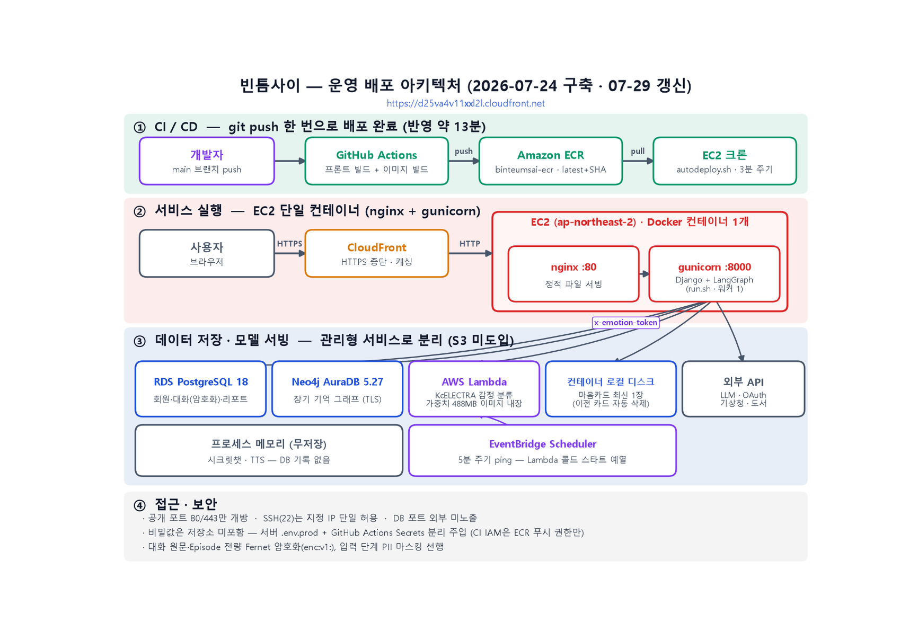
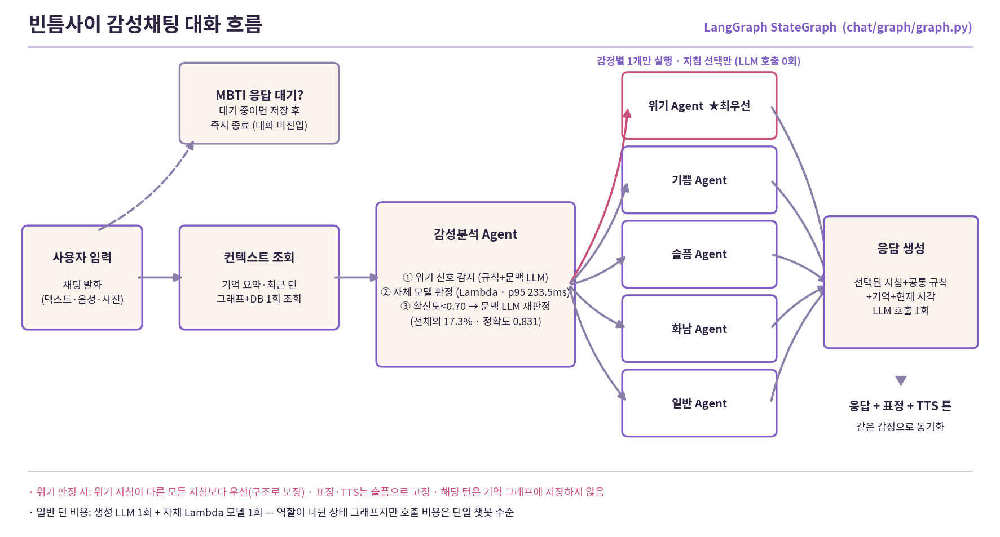
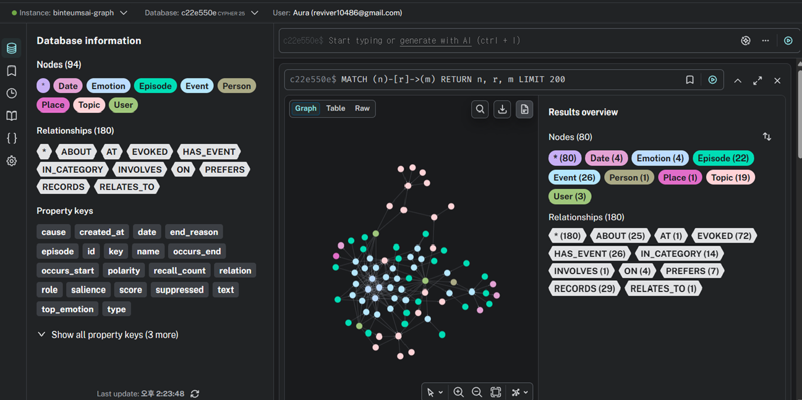

# 🌗 빈틈사이 (Binteumsai)

> **바쁜 하루의 빈틈 사이, 마음을 쉬어가요.**
> 다중 에이전트 기반 감정 분석 활용 AI 소통형 웰니스 챗봇 및 마음 리포트 서비스

<p align="center">
  <b>SK네트웍스 Family AI 캠프 27기 · 4팀 · FINAL 프로젝트</b><br/>
  <b>개발 기간 : 2026.06.11 ~ 2026.08.04</b> &nbsp;|&nbsp; 중간 발표 : 2026.07.10 &nbsp;·&nbsp; 최종 발표 : 2026.08.04<br/>
  <b>주제 5</b> · 다중 에이전트 기반 개인 맞춤형 웰니스 케어 플랫폼
</p>

---

## 📑 목차
1. [팀 소개](#1-팀-소개)
2. [프로젝트 개요](#2-프로젝트-개요)
3. [프로젝트 기획](#3-프로젝트-기획)
4. [기술 스택](#4-기술-스택)
5. [주요 기능](#5-주요-기능)
6. [시스템 아키텍처](#6-시스템-아키텍처)
7. [데이터](#7-데이터)
8. [감정 분류 모델링 & 성능](#8-감정-분류-모델링--성능)
9. [프로젝트 개선 노력](#9-프로젝트-개선-노력)
10. [수행 결과 · 데모 시연](#10-수행-결과--데모-시연)
11. [프로젝트 구조](#11-프로젝트-구조)
12. [트러블슈팅](#12-트러블슈팅)
13. [향후 계획](#13-향후-계획)
14. [실행 방법](#14-실행-방법)
15. [한 줄 회고](#15-한-줄-회고)

---

## 1. 팀 소개

| 이름 | 역할 | 주요 담당 |
|---|---|---|
| **김한솔** 👑 | PM | 프로젝트 총괄(기획·관리), 감정 분류 모델(데이터 수집·전처리, KcELECTRA 파인튜닝 실험 3종, Lambda 서빙), LangGraph 감성채팅 대화 흐름(감정별 응답 분기·위기 대응·확신도 게이트), Neo4j 그래프 장기기억, TTS·STT, 채팅 보안(암호화·PII 마스킹·시크릿챗), AWS 인프라·CI/CD 배포·운영, 서비스 테스트·검증 총괄 |
| **한재웅** | APM | 프로젝트 기획·관리, DB·시스템 설계(ERD·DDL·시퀀스 다이어그램), 마이페이지 전체(인터랙티브 방 대시보드·프로필·캐릭터 관리·기억 보관함 화면), 대화 기반 월간 MBTI 성향 분석, 개인화 추천(기상청 연동 날씨 해설·오늘의 도서), 마음 리포트 공동 개발(박송원 공동 — 화면·연동·파이프라인), 문서화·산출물 관리 |
| **이성진** | Frontend / Backend | 온보딩 화면 흐름(로그인·메인화면·캐릭터 선택·회원정보·관심 키워드) UI/UX 주도, 타로 카드 운세 백엔드·화면(생년월일 운세 계산·카테고리별 3장 리딩), 감정 캘린더, 담당 화면의 백엔드 연동 |
| **박송원** | AI / Backend | 프로젝트 기획·관리, 마음 리포트 멀티에이전트 파이프라인 공동 개발(한재웅 공동 — Supervisor 기반 수집→감정 점수→원인 분류→해석 생성→검증, 고위험 감지 시 Safety 응답 전환·Fallback), 멀티에이전트 아키텍처·테스트 보고서 |

---

## 2. 프로젝트 개요

### 2.1 프로젝트명 — 🌗 빈틈사이

감정을 검사지·절차 없이 **가벼운 대화**로 풀어내고, 그 흐름을 **감정 캘린더·마음 리포트**로 조용히 정리해 주는 웰니스 챗봇 서비스.

### 2.2 프로젝트 소개

사용자가 친구 같은 캐릭터와 **반말 수다**를 떨면, 매 턴 감정을 자동 분석(KcELECTRA 파인튜닝)하여 캐릭터의 **표정·응답 톤·음성(TTS)** 에 반영하고, 대화·감정을 시계열로 쌓아 **일별 감정 캘린더**와 **주/월간 마음 리포트**로 시각화합니다. 앞단은 편안한 대화·타로로 진입 문턱을 낮추고, 뒷단에서 감정 분석이 조용히 구조화하는 **'보이지 않는 구조화'** 가 핵심 가치입니다.

> ⚠️ 본 서비스는 **비의료 웰니스 서비스**로, 전문가의 진단·개입을 대체하지 않습니다.

### 2.3 주제 선정 배경

- **외로움은 개인이 아닌 사회 현상** — 핵가족화·코로나·개인화로 고립·은둔 청년 약 54만 명(2023), 독거노인 우울증상 16.1%.
- **도움은 있는데 못 쓴다** — 우울장애 환자조차 **71.8%가 도움을 받지 않음**(보건복지부 2021 정신건강실태조사). 비용·낙인·복잡한 문턱·'분석당하는 느낌'이 장벽.
- **대화만으로도 효과** — AI 대화 기반 개입이 우울·불안을 유의하게 낮춘다는 임상 근거(Woebot RCT). 단, 대면 치료의 **보조수단**.
- **커지는 시장** — 정신건강 앱 79.8억\$(2025)→184.5억\$(2030), 정신건강 AI 15억\$→51억\$.

> 출처: [경향신문(보사연 고립 실태)](https://www.khan.co.kr/article/202602181620001) · 보건복지부 2021 정신건강실태조사 · [Woebot RCT(JMIR)](https://mental.jmir.org/2017/2/e19/) · 통계청 2024 인구주택총조사 · Mordor Intelligence / GII

### 2.4 사용자 요구사항 분석

기존 정신건강 서비스의 문턱을 분석한 결과, 사용자의 핵심 요구는 다음과 같았습니다.

- 검사지·설문 없이 **부담 없이 시작**하고 싶어요.
- 내 감정 흐름을 **알아서 정리·기억**해 줬으면 좋겠어요.
- 상담처럼 무겁지 않고, **친구처럼 편하게** 이야기하고 싶어요.
- '분석당하는 느낌' 없이 **자연스럽게** 나를 돌아보고 싶어요.

### 2.5 서비스 차별점

| 항목 | 🌗 빈틈사이 | 구조화형 (Woebot·Wysa) | 동반자형 (Replika·Character.AI) |
|---|---|---|---|
| 진입 문턱 | **낮음** (검사지 없음) | 높음 (설문·척도) | 낮음 |
| 감정 분석·기록 | **높음** (4감정·캘린더·리포트) | 높음 | 낮음 |
| 정서적 몰입 | **높음** (캐릭터·TTS·그래프 장기기억) | 중간 | 높음 |
| 포지션 | **낮은 문턱 × 높은 분석 (빈 영역)** | 신뢰↑·문턱↑ | 몰입↑·구조화↓ |

빈틈사이는 "구조화형"과 "동반자형" 사이의 **비어있는 영역** — **낮은 진입 문턱 + 높은 분석·기록** — 을 차지합니다.

### 2.6 기대 효과

- **진입 문턱 완화** — 검사지·비용 없이 감정 케어를 시작
- **자기 이해** — 감정 캘린더·마음 리포트·MBTI 성향 분석으로 나를 돌아봄
- **정서적 지지** — 먼저 말 거는, 나를 기억하는 친구
- **조기 신호 인지 지원** — 감정 흐름 시각화로 변화를 스스로 인지 (비의료)

---

## 3. 프로젝트 기획

| 산출물 | 위치 |
|---|---|
| 프로젝트 기획서 | `docs/` |
| 요구사항 정의서 | `docs/` |
| 화면설계서 | `docs/화면설계서/` |
| WBS | `docs/` |
| 데이터 수집·전처리 보고서 | `docs/` |
| 감정분류 모델 개선 실험 보고서 | `docs/` |
| **중간 발표 자료** | `docs/빈틈사이_중간발표자료_한솔작성.pptx` |
| **최종 산출물 일체 (16종)** | `docs/산출물/` |
| **최종 발표 자료** | 팀 공유 드라이브 제출 (대용량으로 repo 제외) |

### 개발 일정 (WBS)

| 주차 | 기간 | 단계 | 주요 산출물 |
|---|---|---|---|
| 1W | 06/11~06/19 | 기획 | 요구사항 정의서 · WBS |
| 2W | 06/22~06/26 | 데이터 수집·저장 | 프로젝트 기획서 · 수집 데이터 보고서 · 화면설계서 |
| 3W | 06/29~07/03 | 데이터 전처리 | DB·저장소 설계 문서 · 데이터 전처리 결과서 |
| 4W | 07/06~07/10 | 모델링·평가 | ML/DL 학습결과서·학습 모델 · 벡터DB/GraphDB 구축 결과서 · **중간 발표(07/10)** |
| 5W | 07/13~07/17 | 모델링·평가 | AI 시스템 아키텍처 · LLM 연동 소프트웨어 |
| 6W | 07/20~07/24 | 평가 | 멀티 에이전트 테스트 결과 보고서(sLLM 파인튜닝 평가 포함) · 시스템 구성도 |
| 7W | 07/27~07/31 | 모델 배포 | LLM 연동 웹 애플리케이션 · 서비스 테스트 결과 · 최종 발표 자료 |
| 8W | 08/03~08/04 | 마무리 | 프로젝트 소스코드 · 시연 영상 · **최종 발표(08/04)** |

---

## 4. 기술 스택

| 카테고리 | 기술 |
|---|---|
| **Backend** |    |
| **Frontend** |    |
| **AI Core** |         |
| **Database** | -4169E1?style=flat&logo=postgresql&logoColor=white) -008CC1?style=flat&logo=neo4j&logoColor=white) |
| **학습·배포·협업** |      |

---

## 5. 주요 기능

| 기능 | 설명 | 상태 |
|---|---|---|
| **친구 챗봇 (감정 분석)** | 친구 같은 캐릭터와 반말 대화. 매 턴 4감정 자동 분류 → 표정·톤·음성에 반영 | ✅ 구현 |
| **그래프 장기 기억** | Neo4j 그래프에 사건·인물·감정을 관계로 축적 — 회상 93%·환각 0%·"잊어줘" 만료 처리 | ✅ 구현 |
| **선제 첫인사** | 진입 시 캐릭터가 먼저 말 걸기 (기억·날씨·시간대 기반) | ✅ 구현 |
| **시크릿챗** | 대화·감정·기억을 저장하지 않는 완전 무저장 세션 | ✅ 구현 |
| **TTS 음성 응답** | OpenAI gpt-audio 감정 연기 음성 — 1회 재생 후 즉시 파기·10분 자동 소멸·서버 저장 0건 | ✅ 구현 |
| **온보딩 · 캐릭터** | 소셜 로그인, 성격 기반 캐릭터 4종, 회원정보·관심 키워드 | ✅ 구현 |
| **카드 운세 (타로)** | 오늘의 메이저 카드 + 상황별 3장 리딩 — 카드 해석 지식 390청크 RAG 기반 | ✅ 구현 |
| **감정 캘린더** | 날짜별 대화 감정을 캐릭터 아이콘으로 시각화 | ✅ 구현 |
| **마이페이지 · MBTI** | 방 일러스트 프로필, 대화 기반 MBTI 성향 분석 | ✅ 구현 |
| **마음 리포트** | 주/월간 감정 리포트, 스트레스 원인·이완 키워드, 행동 대안 (Supervisor 멀티에이전트) | ✅ 구현 |
| **위기 신호 대응** | 규칙+문맥 LLM 2단 감지 → 위로 전담 응답 전환, 신고·통보·기록 없음, 위기 턴은 기억 제외 | ✅ 구현 |
| **마음 카드** | 감정 기반 그림 카드 생성(gpt-image-2), 비동기 폴링 | ✅ 구현 |

---

## 6. 시스템 아키텍처

**운영 구성 (AWS 배포 완료)** — CloudFront + WAF → EC2 t3.micro(nginx·gunicorn, Docker) → **PostgreSQL(RDS)** + **Neo4j AuraDB(그래프 장기기억)**. 감정 분류 모델(KcELECTRA 488MB)은 **AWS Lambda 컨테이너**로 분리 서빙하며, main push 시 GitHub Actions가 ECR을 거쳐 약 13분 만에 자동 배포합니다. 고정비는 ECR 보관료뿐(월 1,000원 미만, 전 구성 프리티어).





**대화 흐름 (LangGraph):** MBTI 판별 → 컨텍스트 조회 → 감정 분석 → 감정별 응답(톤 지침) → 최종 정제 · 저장/기억은 백그라운드 비동기 처리.

**분석 파이프라인 (다중 에이전트):** 마음 리포트·MBTI 성향 분석·취향 분석은 수집/채점/집계/리포트 생성을 담당하는 **다중 에이전트(멀티 에이전트) 구조**로 처리합니다. (주제 5 — 다중 에이전트 기반 웰니스 케어에 대응)

---

## 7. 데이터

### 7.1 데이터 수집

| 데이터 | 규모(원천→사용) | 역할 |
|---|---|---|
| AI Hub 감성대화 말뭉치 | → 58,234 | 기준 학습 (6감정 → 4감정 매핑) |
| AI Hub 음성 감성대화(전사) | 43,991 → 36,677 | 구어체 보강 (5인 중 3표 합의분) |
| KOTE (온라인 댓글 44라벨) | 50,000 → 13,216 | 온라인 구어체 보강 (4감정 단일 수렴분) |
| 채팅체 평가셋 (자체 제작) | 150 | **평가 전용**(학습 금지), 감정별 균형·팀 검수 |
| AI Hub 웰니스 상담(전사) | 1,002 | 증강 실험 후 **기각**(문체·불균형) |

### 7.2 데이터 전처리

- 결측(0건)·완전중복(17건)·라벨 상충(17건) 정리 → **정제 58,234건**
- 6감정 → 4감정 매핑 (분노·불안→분노 / 슬픔·상처→슬픔 / 당황→일반 / 기쁨→기쁨)
- 증강 병합 후 **평가 문장 전량 학습 제외(누수 필터)** → **최종 학습셋 90,456건**
- AI Hub 재배포 금지 대응 — 원본 대신 재생성 스크립트 배포(원 정제본과 100% 일치 검증)

### 7.3 데이터베이스 설계 (PostgreSQL)

도메인을 분리한 **19개 테이블 · 3NF 기준**(JSONB는 화면 스냅샷·근거 묶음에 한정). Django 모델 역공학 + ETL·화면 요구사항 교차 검증으로 설계.

| 도메인 | 주요 테이블 |
|---|---|
| 계정·프로필 | `users` · `oauth_accounts` · `user_profiles` · `user_preference_keywords` |
| 대화 | `chat_sessions` · `chat_messages` · `user_memory`(레거시 — 현행 장기 기억은 §7.4 Neo4j) |
| MBTI 분석 | `mbti_answers` · `mbti_question_responses` · `mbti_response_scores` · `mbti_monthly_axis_results` · `mbti_monthly_results` · `mbti_monthly_reports` |
| 마음 리포트·취향 | `mind_reports` · `preference_evidence` · `preference_keyword_summaries` |
| 타로 | `tarot_cards` · `tarot_card_chunks` · `tarot_readings` · `tarot_reading_cards` · `daily_tarot_fortunes` |
| 척도 | `clinical_scales`(PHQ-9·GAD-7 등, 향후 척도 추정용) |

> 상세 ERD·테이블 정의서·제약조건은 `docs/한재웅/[데이터 수집 및 저장] 데이터베이스_저장소 설계 문서_27기_4팀_최종본.docx` 참고. 시크릿챗 세션은 애플리케이션 레벨에서 영구 저장 대상에서 제외.

### 7.4 그래프 저장소 (Neo4j AuraDB) — 장기 기억

발화에서 사건·인물·감정을 추출해 **라벨 8종**(User·Episode·Event·Emotion·Person·Place·Topic·Date)·**관계 11종**(HAS_EVENT·RECORDS·EVOKED·PREFERS·AT/ON/INVOLVES/ABOUT·BECAUSE_OF 등)의 그래프로 축적합니다. Episode 원문은 **암호문으로 저장**되고, 사실이 바뀌면 삭제 대신 **만료 처리**(occurs_start/end·end_reason)합니다. 전용 평가 27개 시나리오에서 **회상 93%(25/27)·환각 0%·"잊어줘" 준수 3/3**을 실측했습니다.



---

## 8. 감정 분류 모델링 & 성능

> **문제:** 학습 데이터(정제된 **문어체**) vs 실사용(**채팅체**) 도메인 격차 — 초기 동결 임베딩+XGBoost는 작성체 F1 0.67에서 **채팅체 0.48로 붕괴**.

### 실험 ① — 모델 × 방식 (10조합)
KcELECTRA vs KoBERT × 동결 임베딩 vs 파인튜닝 + 임베딩 레시피 4종을 **작성체·채팅체 이중 평가**.
→ **KcELECTRA 파인튜닝**이 양쪽에서 승자.

### 실험 ② — 데이터 추가 ablation

| 조합 | 채팅체 F1 | 판정 |
|---|---|---|
| base (감성대화만) | 0.48 | 기준선 |
| + 음성 전사 | 0.74 (+0.26) | 채택 |
| + 웰니스 | 0.44 (−0.04) | 기각 |
| + KOTE | 0.50 (+0.02) | 채택 |
| **+ 음성 + KOTE** | **0.78** ˢ | **결승** |

<sub>ˢ 표는 탐색 단계의 반올림 수치. 공식 성적은 아래 '최종 배포 모델'의 **0.7764**(150문장·무누수·배포 가중치 재현) 기준.</sub>

### 최종 배포 모델 (무누수 조건)

- **KcELECTRA 파인튜닝 (+음성·KOTE, lr 5e-5 · 3 epoch)** · 학습 90,456건 · Colab T4 35분 03초(8,481 steps)
- 채팅체 Macro-F1 **0.7764** (목표 0.75 충족) · 작성체 **0.7059** — **배포 가중치를 다시 불러 소수 셋째 자리까지 재현 확인**
- 클래스별 F1(채팅체): 기쁨 0.925 · 분노 0.747 · 일반 0.730 · 슬픔 0.704 (슬픔 Recall 0.676이 최저 — 개선 계획 명시)
- 재현성: 시드 3회 표준편차 ±0.0031 · 학습률 탐색(2e-5→5e-5, 개선폭이 시드 편차의 5.6배로 유의) · 4 epoch 과적합 확인 → **3 epoch 확정**
- 운영 서빙: **AWS Lambda 컨테이너(488MB)** — 운영 로그 3,566건 기준 p50 68.1ms · **p95 233.5ms** · p99 649.9ms

### 확신도 게이트 (서빙)
- 초단문(10자 미만) → 직전 감정 유지
- 모델 확신도 0.70 미만 → 최근 대화 문맥을 포함한 **LLM 재분류** ("애매하면 찍지 않는다")
- 임계값 0.70에서 모델 채택률 82.7% · 채택분 정확도 **0.831** (배포 가중치 재현 실행에서 산출)

---

## 9. 프로젝트 개선 노력

- **이중 평가 체계** — 작성체 테스트 + 채팅체 평가셋을 항상 함께 채점해 도메인 격차를 가시화
- **무누수 원칙** — 평가 문장을 학습에서 전량 제외(누수 3건 검출·제거)하여 부풀림 없는 성적 측정
- **오분류 정성 분석** — 고확신 오답(≥0.9)을 3패턴으로 규명 (① 자기비하·외로움을 오인 ② 감정어 없는 부당대우 서술 ③ 중립 문장의 키워드 유발 감정화) → "임계값이 아니라 데이터로 풀 문제"로 2차 과제화
- **재현성 확보** — seed 고정, 시드 3회 반복·학습률·epoch 탐색으로 결과가 우연이 아님을 검증

### 성능 · 품질 목표 (비기능 요구사항)

| 항목 | 목표 | 설계 |
|---|---|---|
| 응답 속도 | p95 < 3.0초 | 텍스트 즉시 반환 + TTS 비동기 폴링. 배포 실측 중앙값 3,143ms로 목표 초과(IS-005) — 응답 스트리밍 도입 예정 |
| 감정 추론 | **운영 실측 p95 233.5ms** (목표 < 300ms 충족) | AWS Lambda 컨테이너(488MB) 서빙 · 5분 예열로 콜드 2% · 운영 로그 3,566건 |
| 저장 무결성 | 저장 장애 시 **응답 무중단** | 기억·저장은 응답과 분리된 백그라운드 비동기 |
| 반응성 | 감정 → 캐릭터 표정 실시간 전환 | 감정 매핑 즉시 반영 |
| 보안·프라이버시 | 온보딩 동의·암호화·시크릿챗 즉시 소거·탈퇴 시 영구 파기 | 개인정보보호법 준수(민감정보) |
| 법적 | 임상 병명 노출 금지·비의료 면책 표기 | 위험 신호 시 전문가 도움 권유(프롬프트 규칙) |

---

## 10. 수행 결과 · 데모 시연

| 마음 대화 (감정→표정) | 홈 |
|---|---|
|  |  |

| 마음 리포트 | 감정 캘린더 |
|---|---|
|  |  |

> "지치고 마음이 무거워"라고 입력하면 캐릭터가 **우는 표정**으로 바뀌고, 감정에 맞춘 공감 응답 + TTS 음성이 재생됩니다.

📊 **최종 발표 자료** : 팀 공유 드라이브 제출(대용량으로 repo 제외) · 🎬 시연 영상 : 최종 발표(08/04) 제출 · 🚀 **AWS 배포 완료** — CloudFront+WAF, EC2, RDS, AuraDB, Lambda. 요구사항 64건 중 62건 배포 환경 실측 달성

---

## 11. 프로젝트 구조

```text
SKN27-FINAL-4Team/
├── ai/                            # 🧠 LangGraph 에이전트 및 AI 모델 작업 공간
│   ├── agents/                    #   멀티에이전트 핵심 모듈
│   │   ├── nodes.py               #     LangGraph 노드 (감정분류→라우팅→응답 생성 흐름)
│   │   ├── personas.py            #     캐릭터별 페르소나 정의 (포리·까미·토토·여울)
│   │   ├── state.py               #     대화 상태 스키마 (TypedDict)
│   │   ├── llm.py                 #     LLM 공급자 설정 (OpenAI / Groq 선택)
│   │   ├── mbti.py                #     MBTI 축별 질문 풀 및 채점 규칙
│   │   └── web_agent.py           #     Plan Agent — Tavily 웹 검색 (기능 폐기 2026-07-05, 이력 보존)
│   ├── emotion/                   #   감정분류 파이프라인
│   │   ├── emotion_model.py       #     추론 진입점 (모델 로드 → LLM 폴백)
│   │   ├── train_emotion_4mode.py #     KcELECTRA 파인튜닝 학습 스크립트
│   │   ├── build_emotion_dataset.py #   AI Hub + KOTE 병합 데이터셋 생성
│   │   ├── rebuild_clean_dataset.py #   AI Hub 정제본 재생성 (재배포 대응)
│   │   └── artifacts_ft/          #     파인튜닝 산출물 (model.safetensors 등, git 제외)
│   ├── experiments/               #   실험 노트북 및 결과 기록
│   └── scale/                     #   6종 임상 척도 간접 추정 모듈
│
├── app/                           # 💻 Django 백엔드 + Vue 프론트엔드
│   ├── Dockerfile                 #   백엔드 컨테이너 빌드 설정
│   ├── backend/                   #   Django REST API 서버
│   │   ├── config/                #     프로젝트 설정·URL 라우터
│   │   ├── chat/                  #     챗봇 세션·메시지·TTS·MBTI 답변 API
│   │   ├── user/                  #     회원가입·로그인·소셜 OAuth
│   │   ├── calendar_api/          #     감정 캘린더
│   │   ├── character/             #     캐릭터 선택·정보
│   │   ├── mbti/                  #     MBTI 성향 분석·월간 리포트
│   │   ├── mindreport/            #     마음 리포트 (주간·월간)
│   │   ├── myprofile/             #     마이페이지·프로필
│   │   ├── taste/                 #     취향 분석·키워드 요약
│   │   ├── wellness/              #     웰니스 지표
│   │   └── game/tarot_api/        #     타로 카드 운세
│   └── frontend/                  #   Vue 3 + Vite 프론트엔드
│       └── src/views/             #     화면별 컴포넌트
│           ├── chat/              #       챗봇 대화 (ChatView, InnerCouncil)
│           ├── onboarding/        #       온보딩 흐름 (로그인·캐릭터·정보입력 등)
│           ├── report/            #       마음 리포트
│           ├── mypage/            #       마이페이지
│           └── community/         #       커뮤니티 (예정)
│
├── docs/                          # 📑 기획·설계·발표 산출물
│   ├── 화면설계서/                #   SVG·HTML 화면설계서
│   ├── 김한솔팀장/                #   팀장 개별 문서
│   ├── 한재웅/                    #   ERD·DDL·시퀀스다이어그램
│   └── 박송원/                    #   팀원 개별 문서
│
├── etl/                           # 🔄 데이터 파이프라인 및 ETL 스크립트
│   ├── data/                      #   AI 학습 데이터셋 (AI Hub 파생물은 git 제외)
│   ├── datasets/                  #   MBTI 등 원천 데이터셋
│   ├── seed_postgres_static_data.py #  PostgreSQL 정적 기초 데이터 시딩
│   └── load_scales_to_postgres.py #   심리 척도 6종 DB 적재
│
├── storage/                       # 📦 인프라 설정 파일
│   ├── docker-compose.yml         #   PostgreSQL 컨테이너 구성 (루트에 복사해서 사용)
│   └── DDL_MY_설정_관리자_insert_target_v0.9.1.sql
│
└── test/                          # 🧪 팀원별 테스트 및 실험 공간
    ├── hansol/                    #   김한솔 (TTS 실험, 감성대화 토크나이저)
    ├── jaewung/                   #   한재웅 (MBTI 스코어링 실험)
    ├── seongjin/                  #   이성진
    └── songwon/                   #   박송원
```

> AI Hub 파생 학습 데이터는 재배포 금지 정책에 따라 repo에 포함하지 않으며, `ai/emotion/rebuild_clean_dataset.py`로 재생성합니다.

**협업 · 브랜치 전략** — `main`(배포) / `dev`(통합)을 베이스로, 작업 단위마다 `feature/*` 브랜치를 생성해 PR·리뷰를 거쳐 `dev`에 병합합니다.

---

## 12. 트러블슈팅

| 이슈 | 원인 | 해결 |
|---|---|---|
| 채팅체에서 감정 분류 붕괴 (0.4793) | 문어체 학습 데이터 vs 실사용 채팅체 도메인 격차 | 구어체 5만 건(음성 전사+KOTE) 증강 재학습 → **0.7764** + 확신도 게이트(저확신 17.3%는 문맥 LLM 재판정) |
| 배포 후 채팅 사진 첨부가 403 | CloudFront **WAF SizeRestrictions_BODY**(8KB 초과 body 차단)가 이미지 업로드를 엣지에서 차단 | 해당 룰만 Count 오버라이드 — nginx 20MB·Django 검증은 유지, 실서비스 업로드 검증 완료 |
| TTS가 감정 무관하게 똑같이 들림 | 전용 TTS의 낭독체 한계 | **gpt-audio 전환** + 감정별 영어 연기 지시문 + 출력 전사·대본 글자 단위 대조(이탈 시 폐기·재시도) |
| 마음카드 테스트 2건 실패 (IS-002) | 백그라운드 전환 후 테스트가 동기 완료를 기대 | 인라인 스레드 패치로 테스트 동기화 — 전체 테스트 그린 확인 후 커밋 |
| 소셜 로그인 후 원래 화면 복귀 실패 (IS-007) | 요구사항 033 vs 033-1이 서로 모순 — 콜백이 홈 고정 | 원인 규명 완료, 정의서 정리 후 콜백이 저장된 복귀 경로를 쓰도록 수정 예정 |
| MBTI 프롬프트 결과 불안정 | 점수 산정 기준 모호 → 반복 실행 시 결과 변동 | 프롬프트에 산정 규칙을 구체·명확화 → 일관성 확보 |
| MBTI 데이터셋 부족 | 신뢰 가능한 라벨 데이터 부족 → ML 학습 실패 | ML 대신 **LLM 프롬프트 기반 점수 산정**으로 전환 |

---

## 13. 향후 계획

- **성능** : 응답 스트리밍 도입으로 체감 지연 단축(IS-005) · 기억 주입량 조정
- **운영·보안** : 배포 게이트(CI 성공 조건) 연결(IS-004) · 비밀값 SSM 이관·로테이션 · 전역 요청 제한 · LLM 토큰/비용 관측
- **모델** : 서술형 분노·중립 문장 데이터 보강, 실사용 저확신 로그 재학습 루프(동의·비식별화 전제)
- **검증** : 부하 테스트 · 정식 사용자 평가(만족도) — 웰니스 효과 검증의 선행 조건
- **서비스** : 도메인 연결, 친밀도 말투·캐릭터 메모리 고도화, 선물·구독(BM) 탐색

---

## 14. 실행 방법

```bash
# 1) 인프라 (PostgreSQL)
cp storage/docker-compose.yml .
docker compose up -d --build

# 2) 백엔드 (Django)
cd app/backend
python -m venv .venv && source .venv/bin/activate   # Windows: .venv\Scripts\activate
pip install -r requirements.txt
cp .env.example .env            # DB·OpenAI(LLM/TTS)·Neo4j 접속 정보 입력
python manage.py migrate
python manage.py runserver      # http://localhost:8000

# 3) 프론트엔드 (Vue 3)
cd app/frontend
npm install
npm run dev                     # http://localhost:5173
```

> 감정 분류 모델: `ai/emotion/artifacts_ft`에 파인튜닝 모델(`model.safetensors`)을 두면 자동 로드되며, 없으면 LLM 폴백으로 동작합니다.

---

## 15. 한 줄 회고

> _(최종 발표 시 작성 예정)_

- 💚 **김한솔** :
- 💛 **한재웅** :
- 🧡 **이성진** :
- 💜 **박송원** :

---

<p align="center"><i>빈틈사이 — 잠시 생긴 하루의 틈에서, 마음을 쉬어가세요. 🌗</i></p>
