# 마이페이지/설정/관리자 INSERT 대상 ERD

## 설계 원칙

이 ERD는 요구사항 정의서의 마이페이지, 설정, 관리자 기능에서 직접 `INSERT` 또는 `UPDATE`해야 하는 테이블만 정의한다.

다른 팀원이 이미 정의한 사용자, 온보딩, 대화, 감정 분석, 결과 카드, 운세, 안전 이벤트 원천 테이블은 새로 만들지 않는다. 해당 데이터는 `user_id`, `conversation_id`, `analysis_id`, `report_id`, `card_id`, `safety_event_id` 같은 외부 식별자로 조회하거나, 필요 시 해당 모듈 API를 통해 갱신한다.

## 생성 제외 외부 참조 테이블

| 영역 | 외부 참조 테이블 예시 | 본 ERD에서의 사용 방식 |
|---|---|---|
| 회원/인증 | `USERS`, `OAUTH_ACCOUNTS`, `USER_SESSIONS` | 사용자 식별, 계정 상태 조회 |
| 온보딩/캐릭터 | `USER_ONBOARDING_PROFILES`, `PERSONAS`, `CHARACTERS` | 닉네임, 선택 캐릭터, 페르소나 조회 |
| 대화 원천 | `CONVERSATIONS`, `CHAT_SESSION`, `CHAT_MESSAGE`, `MESSAGE` | 일반 대화 기록 조회, 시크릿챗 제외 |
| 감정/척도 분석 원천 | `EMOTION_ANALYSIS_RESULTS`, `ANALYSIS`, `HIDDEN_SCALE_LOG` | 마이페이지 분석 산출물 생성 시 내부 계산용 조회 |
| 리포트/결과카드 | `MIND_REPORT`, `RESULT_CARD`, `FORTUNE_CARDS`, `DAILY_FORTUNE_ASSIGNMENTS` | 보관함/공유/관리 화면에서 원천 콘텐츠 조회 |
| 메모리/안전 | `MEMORY`, `MEMORIES`, `SAFETY_EVENT`, `SAFETY_CHECK_RESULTS`, `CRISIS_PROTOCOL_LOGS` | 삭제 작업, 안전 검토, 관리자 조회 |

## ERD

```mermaid
erDiagram
    USER_PROFILE_EXTENSIONS ||--o{ USER_PROFILE_KEYWORDS : has
    USER_SETTINGS ||--o{ NOTIFICATION_PREFERENCES : configures
    USER_SETTINGS ||--o{ RESULT_CARD_SHARE_SETTINGS : owns
    ACCOUNT_DELETION_REQUESTS ||--o{ DATA_DELETION_TASKS : contains
    MY_ANALYSIS_RUNS ||--o{ MY_MBTI_AXIS_RESULTS : produces
    MY_ANALYSIS_RUNS ||--o{ MY_PREFERENCE_INSIGHTS : produces
    ADMIN_USERS ||--o{ ADMIN_AUDIT_LOGS : writes
    ADMIN_USERS ||--o{ USER_STATUS_CHANGE_LOGS : changes
    ADMIN_USERS ||--o{ RESULT_CARD_TEMPLATES : manages
    ADMIN_USERS ||--o{ CHARACTER_PROMPT_VERSIONS : manages
    ADMIN_USERS ||--o{ FORTUNE_PUBLICATION_PLANS : manages
    ADMIN_USERS ||--o{ SERVICE_ANNOUNCEMENTS : creates
    ADMIN_USERS ||--o{ MODEL_MONITORING_ALERTS : handles
    MODEL_MONITORING_SNAPSHOTS ||--o{ MODEL_MONITORING_ALERTS : triggers

    USER_PROFILE_EXTENSIONS {
        bigint user_id PK "FK: USERS.user_id"
        varchar gender
        smallint birth_year
        varchar mbti_self_type
        varchar current_status
        jsonb interests
        jsonb hobbies
        timestamptz updated_at
    }

    USER_PROFILE_KEYWORDS {
        bigint keyword_id PK
        bigint user_id FK "FK: USER_PROFILE_EXTENSIONS.user_id"
        varchar keyword_text
        int sort_order
        timestamptz created_at
    }

    USER_SETTINGS {
        bigint user_id PK "FK: USERS.user_id"
        boolean secret_chat_default
        varchar language "ko/en"
        varchar theme "light/dark/system"
        timestamptz updated_at
    }

    NOTIFICATION_PREFERENCES {
        bigint notification_preference_id PK
        bigint user_id FK "FK: USER_SETTINGS.user_id"
        varchar notification_type "mind_alarm/fortune/weekly_card/service_notice"
        boolean enabled
        time preferred_time
        varchar repeat_rule "daily/weekly/monthly/custom"
        boolean quiet_hours_enabled
        time quiet_start_time
        time quiet_end_time
        timestamptz updated_at
    }

    RESULT_CARD_SHARE_SETTINGS {
        bigint share_setting_id PK
        bigint user_id FK "FK: USER_SETTINGS.user_id"
        boolean show_nickname
        boolean show_created_date
        boolean show_character_name
        boolean show_summary
        boolean show_detail_text
        boolean is_default
        timestamptz updated_at
    }

    ACCOUNT_DELETION_REQUESTS {
        bigint deletion_request_id PK
        bigint user_id FK "FK: USERS.user_id"
        varchar request_status "requested/processing/completed/canceled/failed"
        text requested_reason
        boolean recovery_impossible_confirmed
        timestamptz requested_at
        timestamptz completed_at
    }

    DATA_DELETION_TASKS {
        bigint deletion_task_id PK
        bigint deletion_request_id FK
        varchar target_domain "conversation/report/memory/profile/settings/notification"
        varchar task_status "pending/processing/completed/failed"
        text failure_reason
        timestamptz processed_at
    }

    MY_ANALYSIS_RUNS {
        bigint analysis_run_id PK
        bigint user_id FK "FK: USERS.user_id"
        varchar analysis_type "mbti_trend/preference_trend"
        varchar period_type "weekly/monthly/custom"
        date period_start
        date period_end
        int source_conversation_count
        text evidence_summary "non-medical wording only"
        jsonb display_tags
        varchar generation_status
        timestamptz generated_at
    }

    MY_MBTI_AXIS_RESULTS {
        bigint axis_result_id PK
        bigint analysis_run_id FK
        varchar axis_code "EI/SN/TF/JP"
        decimal left_score
        decimal right_score
        varchar display_label
        text evidence_text
    }

    MY_PREFERENCE_INSIGHTS {
        bigint preference_insight_id PK
        bigint analysis_run_id FK
        varchar insight_type "recent_interest/preference_pattern/change_trend"
        varchar title
        text summary
        jsonb source_keywords
        int sort_order
    }

    ADMIN_USERS {
        bigint admin_id PK
        varchar email UK
        varchar name
        varchar role "super_admin/ops_admin/content_admin"
        varchar status
        timestamptz created_at
        timestamptz last_login_at
    }

    ADMIN_AUDIT_LOGS {
        bigint audit_log_id PK
        bigint admin_id FK "FK: ADMIN_USERS.admin_id"
        varchar action_type
        varchar target_type
        bigint target_id
        text reason
        varchar request_ip
        timestamptz created_at
    }

    USER_STATUS_CHANGE_LOGS {
        bigint status_change_log_id PK
        bigint user_id FK "FK: USERS.user_id"
        bigint admin_id FK "FK: ADMIN_USERS.admin_id"
        varchar before_status
        varchar after_status "active/suspended/banned/deletion_requested"
        text reason
        boolean user_notified
        timestamptz changed_at
    }

    RESULT_CARD_TEMPLATES {
        bigint template_id PK
        varchar category
        bigint character_id "FK: CHARACTERS.character_id"
        jsonb exposure_condition
        text template_body
        varchar status "draft/review/active/inactive"
        int version
        bigint updated_by FK "FK: ADMIN_USERS.admin_id"
        timestamptz updated_at
    }

    CHARACTER_PROMPT_VERSIONS {
        bigint prompt_version_id PK
        bigint character_id "FK: CHARACTERS.character_id"
        varchar version_name
        text system_prompt
        text tone_guide
        jsonb forbidden_words
        jsonb rag_source_refs
        varchar status "draft/active/archived/rolled_back"
        text change_reason
        bigint updated_by FK "FK: ADMIN_USERS.admin_id"
        timestamptz applied_at
        timestamptz created_at
    }

    FORTUNE_PUBLICATION_PLANS {
        bigint fortune_plan_id PK
        date target_date
        varchar language "ko/en"
        varchar content_status "draft/review/scheduled/published/canceled"
        text content_body
        bigint external_fortune_card_id "nullable FK: FORTUNE_CARDS.fortune_card_id"
        timestamptz scheduled_at
        bigint updated_by FK "FK: ADMIN_USERS.admin_id"
        timestamptz updated_at
    }

    MODEL_MONITORING_SNAPSHOTS {
        bigint snapshot_id PK
        date metric_week_start
        jsonb score_distribution
        decimal outlier_rate
        jsonb input_bias_metrics
        decimal drift_score
        varchar review_status "normal/warning/retraining_review"
        timestamptz calculated_at
    }

    MODEL_MONITORING_ALERTS {
        bigint alert_id PK
        bigint snapshot_id FK
        varchar alert_type "distribution/outlier/bias/drift"
        decimal threshold_value
        decimal observed_value
        varchar alert_status "open/acknowledged/resolved"
        bigint handled_by FK "FK: ADMIN_USERS.admin_id"
        text handling_note
        timestamptz created_at
        timestamptz resolved_at
    }

    SERVICE_ANNOUNCEMENTS {
        bigint announcement_id PK
        varchar announcement_type "notice/banner/maintenance"
        varchar title
        text body
        varchar target_group
        varchar exposure_location
        varchar link_url
        int priority
        timestamptz display_start_at
        timestamptz display_end_at
        varchar status "draft/scheduled/active/closed/canceled"
        bigint created_by FK "FK: ADMIN_USERS.admin_id"
        timestamptz created_at
    }

    SERVICE_METRIC_SNAPSHOTS {
        bigint metric_snapshot_id PK
        date metric_date
        int dau
        int mau
        decimal avg_conversation_length
        int result_card_count
        decimal share_rate
        decimal revisit_rate
        jsonb extra_metrics
        timestamptz calculated_at
    }
```

## 요구사항별 반영 테이블

| 요구사항 | 생성/갱신 테이블 | 외부 조회 테이블 |
|---|---|---|
| `F-MY-001` 메인화면 겸 메뉴 | 없음 | `USERS`, 리포트/결과카드 원천 테이블 |
| `F-MY-002` 프로필 조회/수정 | `USER_PROFILE_EXTENSIONS`, `USER_PROFILE_KEYWORDS` | `USERS`, `USER_ONBOARDING_PROFILES`, `PERSONAS`, `CHARACTERS` |
| `F-MY-003` 리포트 보관함 연결 | 없음 | `MIND_REPORT`, `RESULT_CARD` |
| `F-MY-004` MBTI 성향 추정 | `MY_ANALYSIS_RUNS`, `MY_MBTI_AXIS_RESULTS` | `CONVERSATIONS`, `CHAT_MESSAGE`, `ANALYSIS`, `HIDDEN_SCALE_LOG` |
| `F-MY-005` 취향/선호 경향 분석 | `MY_ANALYSIS_RUNS`, `MY_PREFERENCE_INSIGHTS` | `CONVERSATIONS`, `CHAT_MESSAGE`, `ANALYSIS` |
| `NF-MY-001` 시크릿챗 비저장 안내 | `USER_SETTINGS.secret_chat_default` | `SESSION`, `CHAT_SESSION` |
| `NF-MY-002` 점수/진단명 비노출 | `MY_ANALYSIS_RUNS.evidence_summary`, `display_tags` | `HIDDEN_SCALE_LOG`, `EMOTION_ANALYSIS_RESULTS` |
| `F-SET-001` 알림 수신 설정 | `NOTIFICATION_PREFERENCES` | 알림 발송 모듈 테이블 |
| `F-SET-002` 시크릿챗 기본 설정 | `USER_SETTINGS` | 대화 세션 테이블 |
| `F-SET-003` 결과카드 공개 범위 | `RESULT_CARD_SHARE_SETTINGS` | `RESULT_CARD` |
| `F-SET-004` 계정 탈퇴/데이터 삭제 | `ACCOUNT_DELETION_REQUESTS`, `DATA_DELETION_TASKS`, `ADMIN_AUDIT_LOGS` | 삭제 대상 도메인별 원천 테이블 |
| `F-SET-005` 언어/테마 설정 | `USER_SETTINGS` | 없음 |
| `F-ADM-001` 회원 목록 조회/검색 | 없음 | `USERS`, 로그인/세션 원천 테이블 |
| `F-ADM-002` 회원 상태 관리 | `USER_STATUS_CHANGE_LOGS`, `ADMIN_AUDIT_LOGS` | `USERS` |
| `F-ADM-003` 결과카드 콘텐츠 관리 | `RESULT_CARD_TEMPLATES`, `ADMIN_AUDIT_LOGS` | `CHARACTERS`, `RESULT_CARD` |
| `F-ADM-004` 캐릭터 프롬프트 관리 | `CHARACTER_PROMPT_VERSIONS`, `ADMIN_AUDIT_LOGS` | `CHARACTERS` |
| `F-ADM-005` 운세 콘텐츠 등록/관리 | `FORTUNE_PUBLICATION_PLANS`, `ADMIN_AUDIT_LOGS` | `FORTUNE_CARDS`, `DAILY_FORTUNE_ASSIGNMENTS` |
| `F-ADM-006` 척도 추정 모델 모니터링 | `MODEL_MONITORING_SNAPSHOTS`, `MODEL_MONITORING_ALERTS` | 분석 원천 테이블 |
| `F-ADM-007` 공지사항/배너 관리 | `SERVICE_ANNOUNCEMENTS`, `ADMIN_AUDIT_LOGS` | 없음 |
| `F-ADM-008` 서비스 지표 대시보드 | `SERVICE_METRIC_SNAPSHOTS` | 서비스 로그/대화/결과카드 원천 테이블 |
| `F-ADM-009` 시스템 공지/점검 등록 | `SERVICE_ANNOUNCEMENTS`, `ADMIN_AUDIT_LOGS` | 푸시 알림 모듈 |
| `NF-ADM-001` 관리자 접근 제어 | `ADMIN_USERS`, `ADMIN_AUDIT_LOGS` | 없음 |

## 중복 방지 메모

- `USERS`, `USER`, `CONVERSATIONS`, `CHAT_SESSION`, `MESSAGE`, `ANALYSIS`, `MIND_REPORT`, `RESULT_CARD`, `MEMORY`, `SAFETY_EVENT`는 생성하지 않는다.
- `F-MY-003`의 리포트 보관함은 원천 리포트 테이블을 조회하는 기능이므로 별도 보관함 테이블을 만들지 않는다.
- `F-ADM-001`의 회원 목록 조회/검색은 `USERS` 조회 기능이므로 별도 회원 테이블을 만들지 않는다.
- `F-ADM-005`는 기존 운세/카드 테이블과 중복되지 않도록 관리자 검수/발행 워크플로우만 `FORTUNE_PUBLICATION_PLANS`에 저장한다.
- 의료적 오해를 줄이기 위해 `MY_ANALYSIS_RUNS`에는 임상 진단명, 위험 등급, 원천 척도 점수를 저장하지 않는다. 화면 표시용 자기이해 문장, 근거 요약, 태그만 저장한다.
- 시크릿챗 데이터는 `MY_ANALYSIS_RUNS`, `MY_MBTI_AXIS_RESULTS`, `MY_PREFERENCE_INSIGHTS` 생성 대상에서 제외한다.
