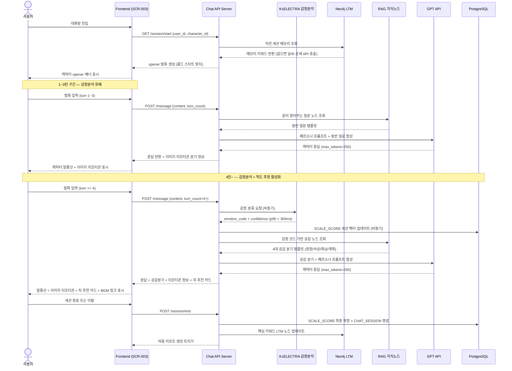
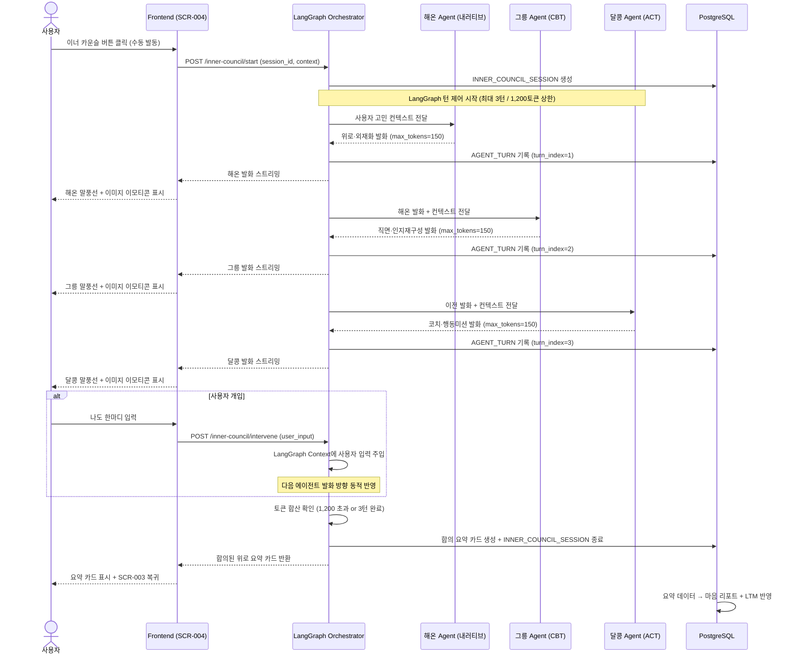
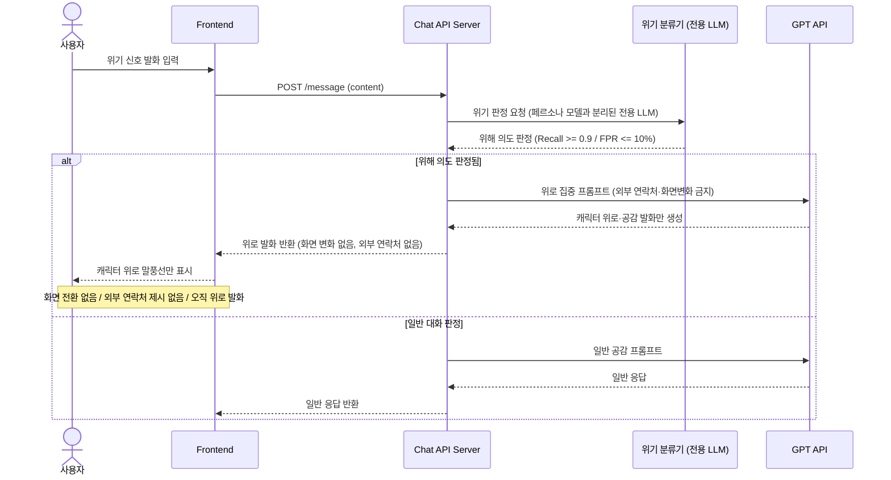
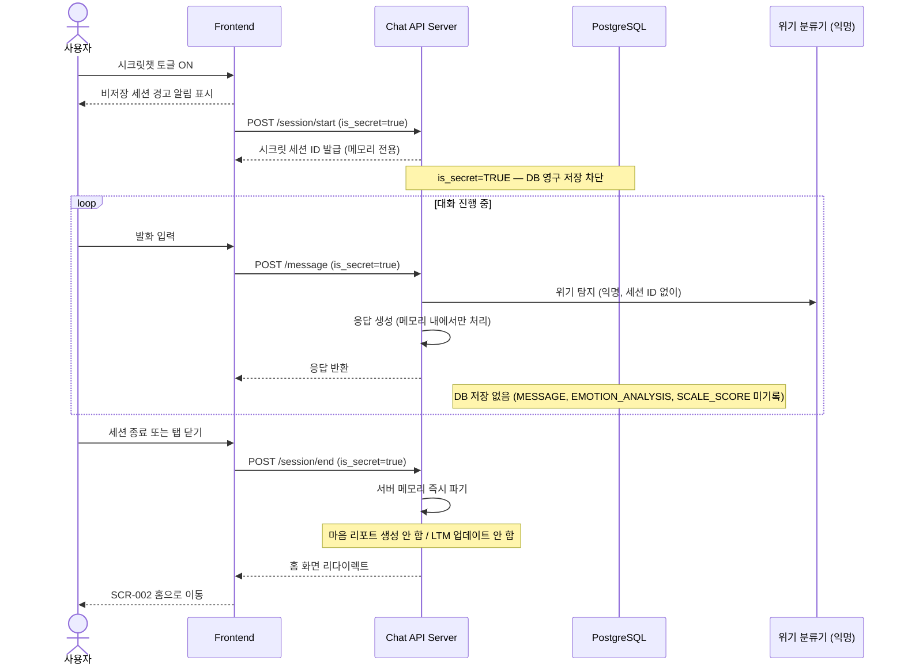

# 🔄 [개별] 시퀀스 다이어그램 — 김한솔 (챗봇·이너카운슬)

> [!info] 문서 개요
> - **담당자**: 김한솔 (PM)
> - **포함 시나리오**: 3가지 핵심 플로우
>   1. 일반 대화 플로우 (SCR-003 전체)
>   2. 이너 카운슬 플로우 (SCR-004)
>   3. 시크릿챗 분기

---

## 시나리오 1. 일반 대화 플로우 (SCR-003)

---

## 시나리오 2. 이너 카운슬 플로우 (SCR-004)

---

## 시나리오 3. 위기 감지 분기

---

## 시나리오 4. 시크릿챗 분기

