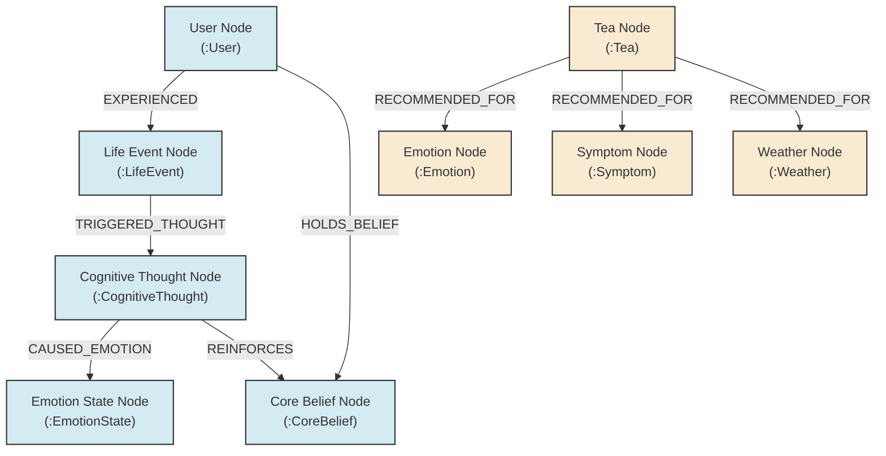
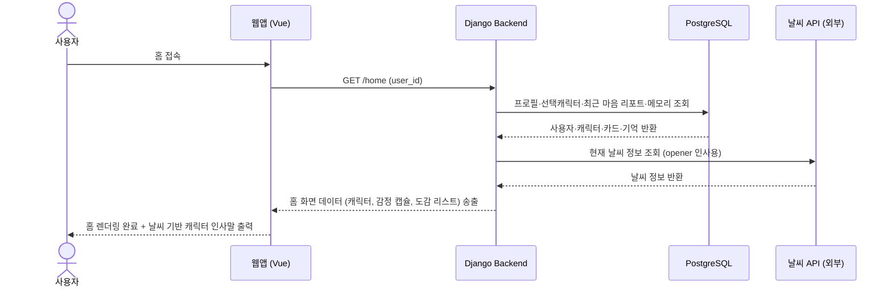
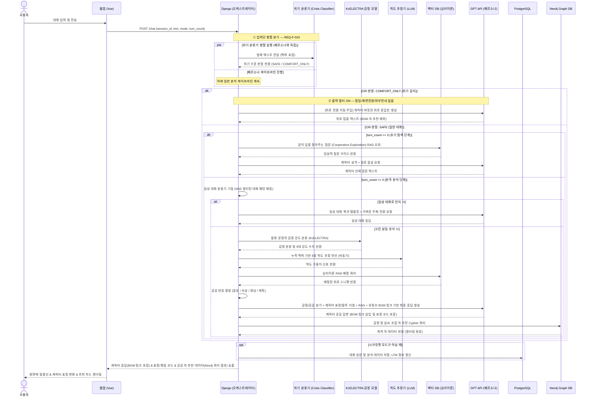
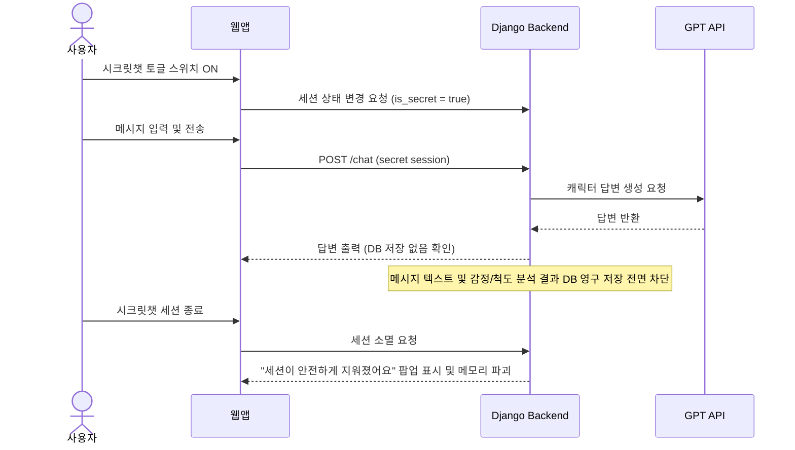
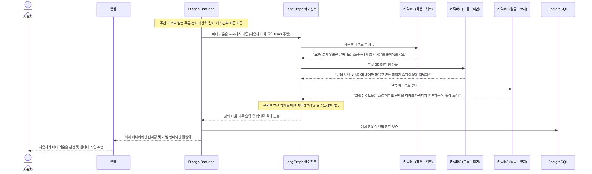
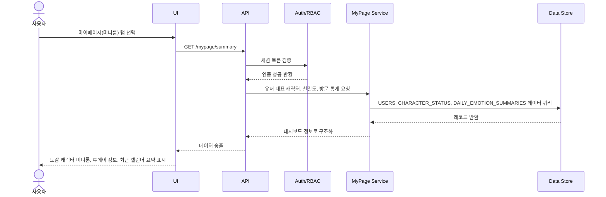
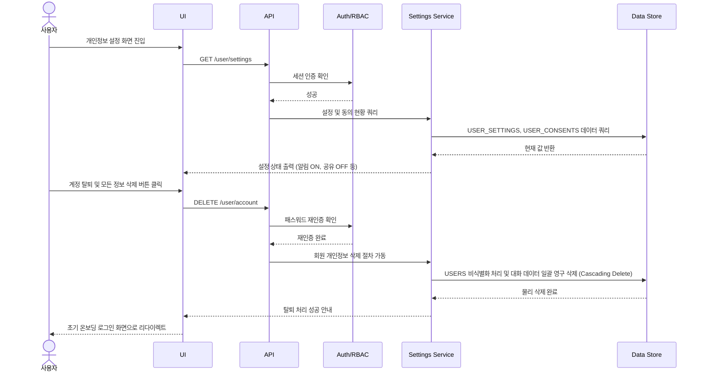
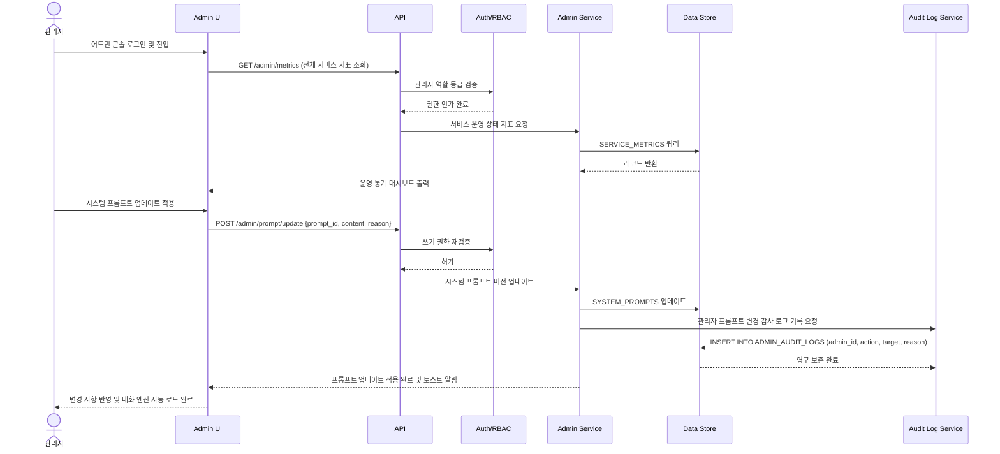

#  [통합] 시스템 설계서 (Master ERD & Sequence Diagrams)

> [!note] 문서 개요
> 본 문서는 프로젝트 내 개별적으로 분산되어 존재하던 데이터베이스 ERD 설계서, 온보딩 ERD, 마이페이지/설정/관리자 시퀀스 다이어그램 및 화면별 모듈 시퀀스 흐름도를 단일한 **마스터 시스템 설계 문서**로 병합 정리한 것입니다.
> 기획 의도에 맞춰 중복되어 정의되어 있던 사용자 정보 테이블(USER/USERS) 및 요약 이력 테이블(DAILY_EMOTION_SUMMARIES/MY_DAILY_SUMMARY)을 표준 스키마로 일원화하고, 시크릿챗의 프라이버시 격리 정책을 시퀀스로 명시하였습니다.

---

## 1. 데이터베이스 설계 정책 (DB Policies)

1.  **중복 테이블 제거 및 스키마 일원화**:
    *   기본 회원 테이블은 `USERS`로 통일하고, 온보딩 프로필 및 성향(선호 캐릭터 등) 매핑은 `USER_ONBOARDING_PROFILES` 및 `PERSONAS`로 정규화합니다.
    *   일별 요약 및 감정 이력은 `DAILY_EMOTION_SUMMARIES` 테이블로 통합하여 방문 이력, 누적 연속 접속 수, 일일 대화량 통계를 단일 행에서 관리합니다.
2.  **시크릿챗(비저장 모드) 데이터 분리**:
    *   시크릿챗을 통한 메시지 텍스트 및 실시간 감정/척도 분석 데이터는 `MESSAGE` 및 `EMOTION_ANALYSIS_RESULTS`에 삽입되지 않으며, `USER_ACTIVITIES`나 `REPORTS` 생성 대상에서 영구 제외됩니다.
    *   시크릿챗 모드에서는 개인정보 보호를 위해 모든 세션 로그가 서버 RAM에서 즉시 소거됩니다.
3.  **민감정보 보호 및 감사 로그**:
    *   관리자가 수행하는 회원 강제 탈퇴, 권한 변경, 민감 대화 임시 조치 등의 작업 내역은 `ADMIN_AUDIT_LOGS` 테이블에 시간, 조치 유형, 상세 사유를 명확히 기록하여 오남용을 방지합니다.

---

## 2. 통합 데이터 모델 (Master ERD)

```mermaid
erDiagram
    USERS {
        bigint user_id PK
        string email UK
        string display_name
        string profile_image_url
        string account_status
        boolean onboarding_completed
        datetime created_at
        datetime updated_at
        datetime last_login_at
    }

    OAUTH_ACCOUNTS {
        bigint oauth_account_id PK
        bigint user_id FK
        string provider
        string provider_user_id
        string provider_email
        datetime linked_at
    }

    USER_SETTINGS {
        bigint user_id PK, FK
        boolean scale_analysis_agreed
        boolean ml_rag_agreed
        boolean secret_chat_default
        text notification_settings
        text share_settings
        string language
        string theme
        datetime updated_at
    }

    TERMS {
        bigint term_id PK
        string term_type
        string title
        string version
        boolean required
        datetime effective_at
    }

    USER_CONSENTS {
        bigint consent_id PK
        bigint user_id FK
        bigint term_id FK
        boolean agreed
        datetime agreed_at
        string consent_source
    }

    PERSONAS {
        bigint persona_id PK
        string persona_code UK
        string persona_name
        string description
        boolean active
    }

    USER_ONBOARDING_PROFILES {
        bigint onboarding_profile_id PK
        bigint user_id FK
        bigint persona_id FK
        string nickname
        string onboarding_status
        string mbti
        datetime completed_at
        datetime updated_at
    }

    USER_SESSIONS {
        bigint session_id PK
        bigint user_id FK
        string refresh_token_hash
        string device_type
        string browser_name
        string ip_address
        datetime issued_at
        datetime expires_at
        datetime revoked_at
    }

    CONVERSATIONS {
        bigint conversation_id PK
        bigint user_id FK
        date conversation_date
        string conversation_status
        datetime started_at
        datetime ended_at
    }

    MESSAGES {
        bigint message_id PK
        bigint conversation_id FK
        string sender_type
        text message_text
        datetime sent_at
    }

    EMOTION_ANALYSIS_RESULTS {
        bigint analysis_id PK
        bigint conversation_id FK
        bigint user_id FK
        date target_date
        decimal mind_score
        string primary_emotion_code
        decimal depression_index
        decimal anxiety_index
        decimal dopamine_index
        datetime analyzed_at
    }

    DAILY_EMOTION_SUMMARIES {
        bigint daily_summary_id PK
        bigint user_id FK
        date summary_date
        decimal mind_score
        string primary_emotion_code
        string mood_color
        bigint expression_asset_id FK
        boolean has_conversation
        int visit_count
        int consecutive_days
        int conversation_count
        int report_count
        datetime calculated_at
    }

    EXPRESSION_ASSETS {
        bigint expression_asset_id PK
        string emotion_code
        string expression_name
        string asset_url
        int score_min
        int score_max
        boolean default_asset
    }

    CHARACTER_STATUS {
        bigint character_status_id PK
        bigint user_id FK
        string character_name
        int affinity_level
        int conversation_count
        string next_condition
        boolean is_representative
        datetime updated_at
    }

    USER_ACTIVITIES {
        bigint activity_id PK
        bigint user_id FK
        date activity_date
        string activity_type
        string character_name
        string chat_mode
        string save_type
        bigint ref_id
        text display_summary
        datetime created_at
    }

    REPORTS {
        bigint report_id PK
        bigint user_id FK
        date report_date
        string report_type
        string title
        text summary
        boolean is_saved
        datetime created_at
    }

    MEMORIES {
        bigint memory_id PK
        bigint user_id FK
        string title
        text summary
        string status
        boolean usable_in_chat
        datetime created_at
        datetime deleted_at
    }

    ANALYSIS_SUMMARIES {
        bigint analysis_id PK
        bigint user_id FK
        string period_type
        date period_start
        date period_end
        text baseline_change_stats
        text emotion_situation_matrix
        text recovery_effect_stats
        text self_understanding
        text display_tags
        datetime generated_at
    }

    MINIROOMS {
        bigint miniroom_id PK
        bigint user_id FK
        string representative_collection
        text collection_history
        text applied_items
        datetime updated_at
    }

    FORTUNES {
        bigint fortune_id PK
        date fortune_date
        string category
        text content
        text character_greeting
        string weather_context
        boolean is_published
        datetime publish_at
    }

    USER_FORTUNES {
        bigint user_fortune_id PK
        bigint user_id FK
        bigint fortune_id FK
        date viewed_date
        boolean share_card_created
        datetime viewed_at
    }

    ADMINS {
        bigint admin_id PK
        string name
        string email
        string role
        string status
    }

    SYSTEM_PROMPTS {
        bigint prompt_id PK
        bigint persona_id FK
        text content
        int version
        boolean is_active
        bigint updated_by FK
        datetime updated_at
    }

    SAFETY_CASES {
        bigint safety_case_id PK
        bigint user_id FK
        string risk_level
        string status
        text anonymized_summary
        boolean llm_bypass_applied
        boolean payment_off_applied
        boolean institution_guidance_done
        bigint reviewed_by FK
        datetime detected_at
        datetime reviewed_at
    }

    ADMIN_CONTENTS {
        bigint content_id PK
        string content_type
        string title
        text body
        int version
        string status
        datetime scheduled_at
        bigint updated_by FK
        datetime updated_at
    }

    ADMIN_NOTICES {
        bigint notice_id PK
        string notice_type
        string title
        text body
        string target_group
        datetime display_start_at
        datetime display_end_at
        string status
        bigint created_by FK
    }

    SERVICE_METRICS {
        bigint metric_id PK
        date metric_date
        int dau
        int mau
        decimal retention_5turn_rate
        int report_count
        decimal save_rate
        decimal share_rate
        decimal model_drift_score
        decimal safety_recall
    }

    ADMIN_AUDIT_LOGS {
        bigint audit_log_id PK
        bigint admin_id FK
        string action_type
        string target_type
        bigint target_id
        text reason
        datetime created_at
    }

    PSYCHOLOGY_THEORY_CHUNKS {
        int id PK
        string file_name
        string title
        string section_heading
        text content
        vector embedding
        string[] tags
    }

    CLINICAL_SCALES {
        string scale_id PK
        string scale_name_ko
        string domain
        string time_frame
        int estimated_minutes
    }

    SCALE_QUESTIONS {
        string question_id PK
        string scale_id FK
        int question_number
        text text
        boolean is_reverse
    }

    SCALE_OPTIONS {
        int id PK
        string scale_id FK
        int option_value
        string option_label
    }

    USER_SCALE_ESTIMATES {
        bigint estimate_id PK
        bigint user_id FK
        string scale_id FK
        decimal estimated_score
        date target_date
        datetime calculated_at
    }



    USERS ||--o{ OAUTH_ACCOUNTS : links
    USERS ||--o{ USER_CONSENTS : agrees
    TERMS ||--o{ USER_CONSENTS : versioned_by
    USERS ||--o| USER_SETTINGS : has
    USERS ||--o| USER_ONBOARDING_PROFILES : configures
    PERSONAS ||--o{ USER_ONBOARDING_PROFILES : selected_as
    USERS ||--o{ USER_SESSIONS : owns
    USERS ||--o{ CONVERSATIONS : has
    CONVERSATIONS ||--o{ EMOTION_ANALYSIS_RESULTS : analyzed_as
    CONVERSATIONS ||--o{ MESSAGES : contains
    USERS ||--o{ EMOTION_ANALYSIS_RESULTS : owns
    USERS ||--o{ DAILY_EMOTION_SUMMARIES : summarizes
    EXPRESSION_ASSETS ||--o{ DAILY_EMOTION_SUMMARIES : displayed_as
    USERS ||--o{ CHARACTER_STATUS : owns
    USERS ||--o{ USER_ACTIVITIES : records
    USERS ||--o{ REPORTS : owns
    USERS ||--o{ MEMORIES : owns
    USERS ||--o{ ANALYSIS_SUMMARIES : has
    USERS ||--|| MINIROOMS : has
    USERS ||--o{ USER_FORTUNES : views
    FORTUNES ||--o{ USER_FORTUNES : selected
    USERS ||--o{ SAFETY_CASES : related
    ADMINS ||--o{ SAFETY_CASES : reviews
    ADMINS ||--o{ ADMIN_CONTENTS : updates
    ADMINS ||--o{ ADMIN_NOTICES : creates
    ADMINS ||--o{ ADMIN_AUDIT_LOGS : writes
    PERSONAS ||--o{ SYSTEM_PROMPTS : configures
    ADMINS ||--o{ SYSTEM_PROMPTS : updates
    CLINICAL_SCALES ||--o{ SCALE_QUESTIONS : contains
    CLINICAL_SCALES ||--o{ SCALE_OPTIONS : offers
    USERS ||--o{ USER_SCALE_ESTIMATES : gets
    CLINICAL_SCALES ||--o{ USER_SCALE_ESTIMATES : tracks
```



---

### 2.2 그래프 데이터베이스 모델 (Neo4j Graph Database Model)

본 플랫폼은 관계형 DB(PostgreSQL)의 텍스트/이력 관리 한계를 보완하기 위해, **마시는 차 추천 매핑 규칙** 및 **인과관계형 장기 기억(Causal LTM)** 네트워크를 Neo4j 그래프 데이터베이스로 이중화 관리합니다.

#### 2.2.1 힐링 차 추천 규칙 스키마 (Tea Recommendation Rules)
* **`(:Tea)`**: 64종의 차 정보
  * 속성: `id` (int), `name` (string), `scientific_name` (string), `efficacy` (text), `scientific_reason` (text), `tip` (text), `has_caffeine` (boolean), `allergy_triggers` (string[])
* **`(:Emotion)`**: 6대 감정 및 세부 정서 상태 노드. 속성: `code` (string), `name` (string)
* **`(:Symptom)`**: 신체화 및 임상 증상 노드. 속성: `name` (string)
* **`(:Weather)`**: 외부 날씨 노드. 속성: `condition` (string)
* **관계**:
  - `(:Tea)-[:RECOMMENDED_FOR]->(:Emotion)`
  - `(:Tea)-[:RECOMMENDED_FOR]->(:Symptom)`
  - `(:Tea)-[:RECOMMENDED_FOR]->(:Weather)`

#### 2.2.2 인과관계형 장기 기억 스키마 (Causal LTM)
유저가 겪은 사건(Situation), 그로 인한 자동적 사고(Thought), 이로 인해 발생한 정서적 반응(Emotion)의 인과 사슬을 누적하여 유저의 고유한 인지적 편향 및 감정 트리거 패턴을 탐색합니다.
* **`(:User)`**: 서비스 가입 사용자. 속성: `user_id` (bigint)
* **`(:LifeEvent)`**: 정서 유발 상황/사건. 속성: `event_id` (UUID), `category` (직장/인간관계/가족 등), `description` (text), `created_at` (datetime)
* **`(:CognitiveThought)`**: 해당 상황에서의 자동적 생각. 속성: `thought_id` (UUID), `thought_text` (text), `cognitive_distortion` (과잉일반화/흑백논리/개인화 등)
* **`(:EmotionState)`**: 최종 정서 결과. 속성: `emotion_name` (우울/불안 등), `intensity` (int, 1-10)
* **`(:CoreBelief)`**: 심리분석 에이전트가 장기 대화에서 추출한 유저의 내면 핵심 신념. 속성: `belief_id` (UUID), `belief_text` (text), `category` (무기력/사랑받지못함 등)
* **관계**:
  - `(:User)-[:EXPERIENCED {date: Date}]->(:LifeEvent)` (유저가 상황을 경험함)
  - `(:LifeEvent)-[:TRIGGERED_THOUGHT]->(:CognitiveThought)` (사건이 자동적 사고를 유발함)
  - `(:CognitiveThought)-[:CAUSED_EMOTION]->(:EmotionState)` (생각이 정서 반응을 일으킴)
  - `(:User)-[:HOLDS_BELIEF {confidence: float}]->(:CoreBelief)` (유저가 핵심 신념을 가짐)
  - `(:CognitiveThought)-[:REINFORCES]->(:CoreBelief)` (자동적 사고가 핵심 신념을 강화함)

#### 2.2.3 Neo4j 그래프 모델 시각화 (Mermaid Visualization)


---

## 3. 핵심 화면 모듈 시퀀스 다이어그램 (Module Sequences)

### 3.1 홈 화면 진입 (SCR-002)


### 3.2 캐릭터 대화 및 실시간 분석 (SCR-003)

#### 3.2.1  챗봇 대화방 통합 흐름도 (Mermaid)

아래 다이어그램은 챗봇과의 세션 개시부터 실시간 분석, 안전 제어 및 최종 마음 카드 발행까지의 전체적인 구조를 시각화한 것입니다.

```mermaid
flowchart TD
    Start([사용자 대화방 진입]) --> CheckPrev{이전 대화 기억이 있는가?}
    CheckPrev -- Yes --> QueryLTM[Neo4j LTM 그래프 쿼리\n- 인물 및 과거 감정 맥락 인출] --> OpenerRecall[캐릭터의 안부 인사\n"지난번 팀장님 일은 좀 해결됐어?"]
    CheckPrev -- No --> OpenerGeneral[운세/날씨 기반 가벼운 인사]
    
    OpenerRecall & OpenerGeneral --> UserInput[/사용자 메시지 입력/]
    UserInput --> TurnCheck{대화 턴 수 확인}
    
    TurnCheck -- 1~3턴 --> CooperativeRAG[RAG 연동\n- 같이 답을 찾아주는 질문 제공] --> FE_Render[화면에 캐릭터 응답 출력\n*타이핑 지연 연출 포함*]
    
    TurnCheck -- 4턴 이상 --> EverydayCheck{4번째 턴:\n일상 대화 인지 여부?}
    EverydayCheck -- Yes --> EverydayFlow[일상 대화 복귀 흐름\n- 가벼운 주제 전환] --> FE_Render
    
    EverydayCheck -- No --> ParallelAnalysis[백엔드 병렬 분석]
    
    subgraph 백엔드 분석
        ParallelAnalysis --> EMO[KcELECTRA 감정 분류]
        ParallelAnalysis --> Neo4jQueries[Neo4j 그래프 DB 조회\n- LTM 과거 맥락\n- 심리 RAG 치료 개입법]
        ParallelAnalysis --> SCL[LLM 6종 척도 간접 채점]
    end
    
    EMO & Neo4jQueries & SCL --> ModeCheck{현재 대화 모드/감정 매핑}
    ModeCheck -- 응원 --> ReplyCheer[응원 공감 답변\n*캐릭터 표정: 응원/행동 넛지*\n*공감 차 & 음악 추천*]
    ModeCheck -- 속상 --> ReplyUpset[속상 공감 답변\n*캐릭터 표정: 속상/경청*\n*공감 차 & 음악 추천*]
    ModeCheck -- 화남 --> ReplyAngry[화냄 공감 답변\n*캐릭터 표정: 화남/대리 분노*\n*공감 차 & 음악 추천*]
    ModeCheck -- 계획 --> ReplyPlan[계획 공감 답변\n*캐릭터 표정: 계획/CBT 구조화*\n*공감 차 & 음악 추천*]
    
    ReplyCheer & ReplyUpset & ReplyAngry & ReplyPlan --> FE_Render
    
    FE_Render --> UserDecision{대화 종료 의사?}
    UserDecision -- No --> UserInput
    UserDecision -- Yes --> SecretCheck{시크릿챗 모드인가?}
    
    SecretCheck -- Yes --> DestroySession[분석 큐 파기 및 로그 미기록] --> ReturnHome[홈 리다이렉트]
    SecretCheck -- No --> UpdateGraph[Neo4j LTM 노드/엣지 갱신\n& 마음 카드 자동 생성] --> ReturnHome
    
    ReturnHome --> End([대화 종료])
```

##### 세부 단계별 로직 설명
1. **진입 및 세션 개시**: 사용자가 대화방에 진입하면 고유 세션 ID가 발급되며, **Neo4j 장기 기억(LTM) 그래프**에서 사용자의 직전 주요 관계자 및 유발된 사건/감정 노드를 쿼리하여 캐릭터가 인지적 친밀함을 형성하며 대화를 시작합니다. 이전 기억이 없을 시 운세/날씨 정보를 기반으로 캐릭터 안부 오프너 인사를 건넵니다.
2. **대화 진행 및 턴 수 제어**: 
    - 1~3턴 초기 단계에는 분석 연산 없이 고민의 원인을 다정하게 찾아주는 RAG 심리 개입 질문으로 응답합니다.
    - 4턴 이상부터 KcELECTRA 감정 모델과 6종 척도 간접 채점기가 백엔드에서 병렬 동작합니다. 4턴 째에 일상 잡담 여부를 판별하여 잡담일 경우 가벼운 주제 전환(Chit-chat Transition)으로 환기시키며, 고민 상담 유지 시 4대 공감 답변(응원, 속상, 화남, 계획) 분기에 따라 캐릭터 도트 모션, 표정, 말투가 실시간으로 변하고 공감 차와 BGM 음악 추천이 함께 제공됩니다.
3. **대화 종료 및 데이터 처리**: [시크릿]시크릿챗(비저장) 활성화 시 대화 텍스트와 분석 데이터는 메모리(RAM)에서 즉시 파기되고 DB에 기록되지 않습니다. 일반 대화의 경우 세션 종료 시 감정-사건-관계자 간 인과관계를 Neo4j 그래프 DB에 업데이트(`CREATE`)하고, 요약된 일일 마음 카드를 발급합니다.

#### 3.2.2 캐릭터 대화 및 실시간 분석 시퀀스 다이어그램 (Sequence)

> [!note] REQ-F-010 설계 연결 — 전용 위기 분류기 (Crisis Classifier)
> 사용자 입력이 들어오는 즉시, **페르소나 GPT와 독립된 전용 위기 분류기(CRI)** 가 입력단에서 **병렬로** 실행됩니다.
> - CRI는 캐릭터 역할을 수행하지 않는 별도 분류 전용 모델입니다 (jailbreak 방지).
> - 위기 감지 시: 팝업·화면전환·외부기관(109 등) 안내 **없음**. 출력 필터만 작동하여 GPT 응답이 따뜻한 위로 텍스트로만 구성되도록 제어합니다 (REQ-F-010, REQ-F-013).
> - 미감지 시: 일반 분석 파이프라인 정상 진행.



### 3.3 시크릿챗 (비저장) 대화 (SCR-003-Secret)


### 3.4 이너 카운슬 회의 (SCR-004)


---

## 4. 마이페이지 및 설정/관리자 시퀀스 다이어그램 (Services Flow)

### 4.1 마이페이지 요약 대시보드 조회


### 4.2 개인설정 변경 및 계정 탈퇴


### 4.3 관리자 모니터링 및 감사 로그 기록 (Admin & Governance)


