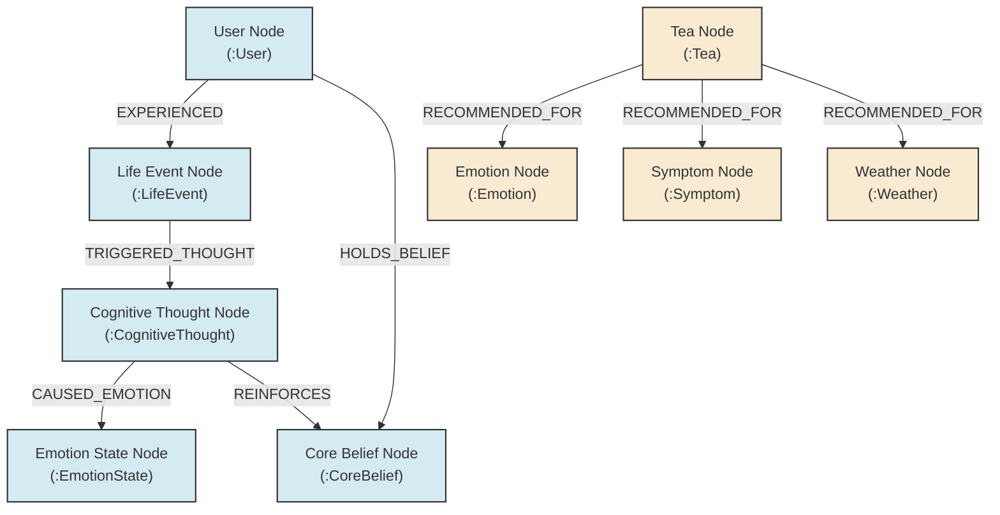
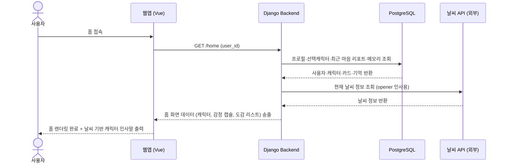
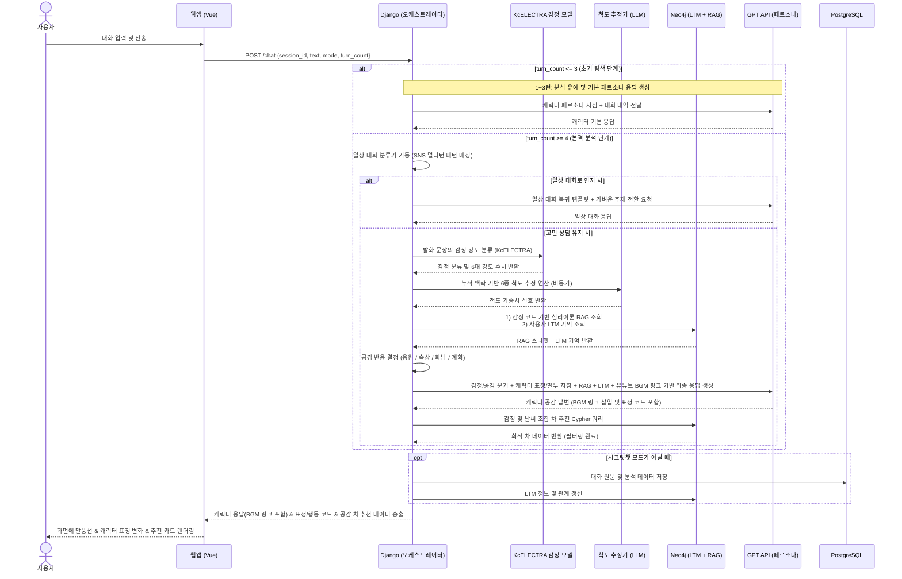
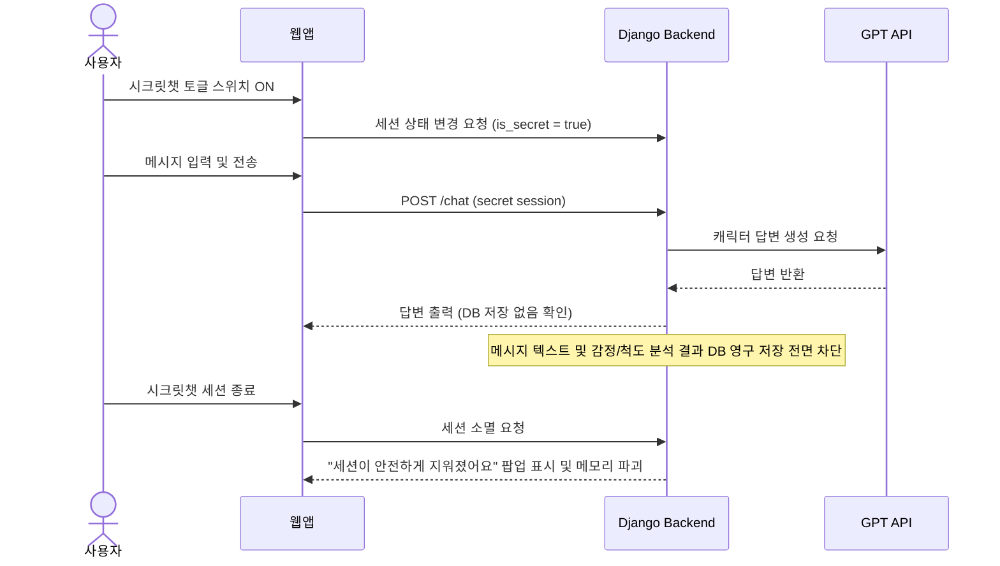
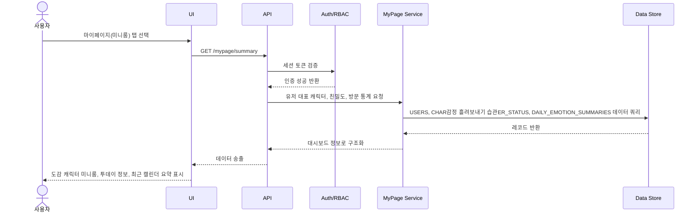
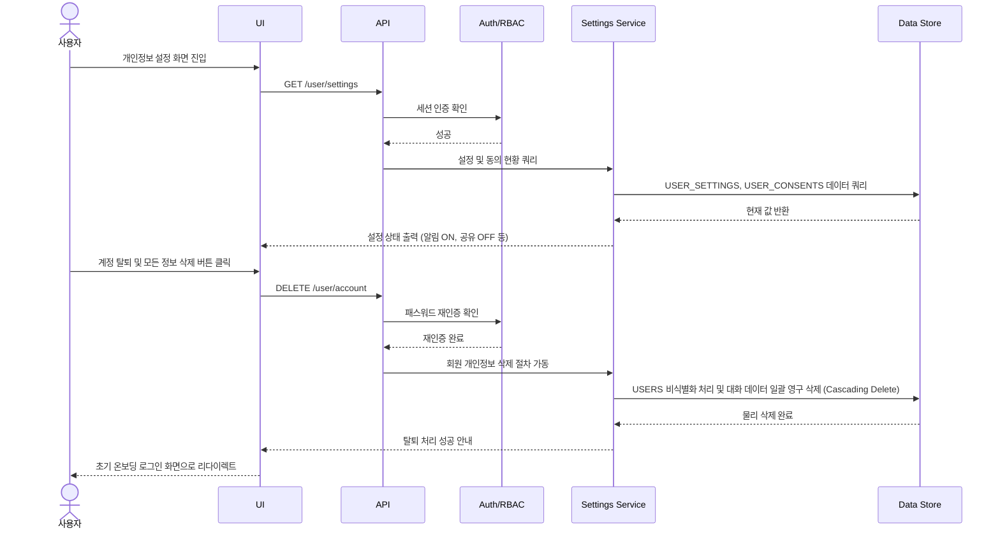
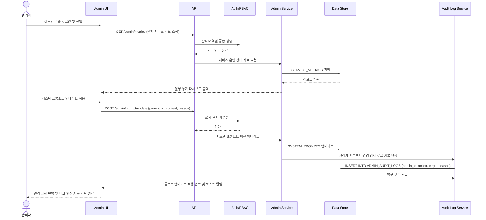

---

tags: [SKN27기, 최종프로젝트, 4팀, 설계, ERD, 시퀀스, 통합본]

team: 4팀 / 주제5 - 다중 에이전트 기반 개인 맞춤형 웰니스 케어

작성일: 2026-06-18

status: 최신 통합 시스템 설계서

---


#  [통합] 시스템 설계서 (Master ERD & Sequence Diagrams)


> [!note] 문서 개요

> 본 문서는 프로젝트 내 개별적으로 분산되어 존재하던 데이터베이스 ERD 설계서, 온보딩 ERD, 마이페이지/설정/관리자 시퀀스 다이어그램 및 화면별 모듈 시퀀스 흐름도를 단일한 **마스터 시스템 설계 문서**로 병합 정리한 것입니다.

> 기획 의도에 맞춰 중복되어 정의되어 있던 사용자 정보 테이블(USER/USERS) 및 요약 이력 테이블(DAILY_EMOTION_SUMMARIES/MY_DAILY_SUMMARY)을 표준 스키마로 일원화하고, 시크릿챗의 프라이버시 격리 정책을 시퀀스로 명시하였습니다.


---


## 1. 데이터베이스 설계 정책 (DB Policies)


1.  **중복 테이블 제거 및 스키마 일원화**:

    *   기본 회원 테이블은 `USERS`로 통일하고, 온보딩 프로필 및 성향(선호 캐릭터 등) 매핑은 `USER_ONBOARDING_PROFILES` 및 `PERSONAS`로 정규화합니다.

    *   일별 요약 및 감정 이력은 `DAILY_EMOTION_SUMMARIES` 테이블로 통합하여 방문 이력, 누적 연속 접속 수, 일일 대화량 통계를 단일 행에서 관리합니다.

2.  **시크릿챗(비저장 모드) 데이터 분리**:

    *   시크릿챗을 통한 메시지 텍스트 및 실시간 감정/척도 분석 데이터는 `MESSAGE` 및 `EMOTION_ANALYSIS_RESULTS`에 삽입되지 않으며, `USER_감정 흘려보내기 습관IVITIES`나 `REPORTS` 생성 대상에서 영구 제외됩니다.

    *   시크릿챗 모드에서는 개인정보 보호를 위해 모든 세션 로그가 서버 RAM에서 즉시 소거됩니다.

3.  **민감정보 보호 및 감사 로그**:

    *   관리자가 수행하는 회원 강제 탈퇴, 권한 변경, 민감 대화 임시 조치 등의 작업 내역은 `ADMIN_AUDIT_LOGS` 테이블에 시간, 조치 유형, 상세 사유를 명확히 기록하여 오남용을 방지합니다.


---


## 2. 통합 데이터 모델 (Master ERD)


```mermaid

erDiagram

    USERS {

        bigint user_id PK

        string email UK

        string display_name

        string profile_image_url

        string account_status

        boolean onboarding_completed

        datetime created_at

        datetime updated_at

        datetime last_login_at

    }


    OAUTH_ACCOUNTS {

        bigint oauth_account_id PK

        bigint user_id FK

        string provider

        string provider_user_id

        string provider_email

        datetime linked_at

    }


    USER_SETTINGS {

        bigint user_id PK, FK

        boolean scale_analysis_agreed

        boolean ml_rag_agreed

        boolean secret_chat_default

        text notification_settings

        text share_settings

        string language

        string theme

        datetime updated_at

    }


    TERMS {

        bigint term_id PK

        string term_type

        string title

        string version

        boolean required

        datetime effective_at

    }


    USER_CONSENTS {

        bigint consent_id PK

        bigint user_id FK

        bigint term_id FK

        boolean agreed

        datetime agreed_at

        string consent_source

    }


    PERSONAS {

        bigint persona_id PK

        string persona_code UK

        string persona_name

        string description

        boolean active

    }


    USER_ONBOARDING_PROFILES {

        bigint onboarding_profile_id PK

        bigint user_id FK

        bigint persona_id FK

        string nickname

        string onboarding_status

        string mbti

        datetime completed_at

        datetime updated_at

    }


    USER_SESSIONS {

        bigint session_id PK

        bigint user_id FK

        string refresh_token_hash

        string device_type

        string browser_name

        string ip_address

        datetime issued_at

        datetime expires_at

        datetime revoked_at

    }


    CONVERSATIONS {

        bigint conversation_id PK

        bigint user_id FK

        date conversation_date

        string conversation_status

        datetime started_at

        datetime ended_at

    }


    MESSAGES {

        bigint message_id PK

        bigint conversation_id FK

        string sender_type

        text message_text

        datetime sent_at

    }


    EMOTION_ANALYSIS_RESULTS {

        bigint analysis_id PK

        bigint conversation_id FK

        bigint user_id FK

        date target_date

        decimal mind_score

        string primary_emotion_code

        decimal depression_index

        decimal anxiety_index

        decimal dopamine_index

        datetime analyzed_at

    }


    DAILY_EMOTION_SUMMARIES {

        bigint daily_summary_id PK

        bigint user_id FK

        date summary_date

        decimal mind_score

        string primary_emotion_code

        string mood_color

        bigint expression_asset_id FK

        boolean has_conversation

        int visit_count

        int consecutive_days

        int conversation_count

        int report_count

        datetime calculated_at

    }


    EXPRESSION_ASSETS {

        bigint expression_asset_id PK

        string emotion_code

        string expression_name

        string asset_url

        int score_min

        int score_max

        boolean default_asset

    }


    CHAR감정 흘려보내기 습관ER_STATUS {

        bigint character_status_id PK

        bigint user_id FK

        string character_name

        int affinity_level

        int conversation_count

        string next_condition

        boolean is_representative

        datetime updated_at

    }


    USER_감정 흘려보내기 습관IVITIES {

        bigint activity_id PK

        bigint user_id FK

        date activity_date

        string activity_type

        string character_name

        string chat_mode

        string save_type

        bigint ref_id

        text display_summary

        datetime created_at

    }


    REPORTS {

        bigint report_id PK

        bigint user_id FK

        date report_date

        string report_type

        string title

        text summary

        boolean is_saved

        datetime created_at

    }


    MEMORIES {

        bigint memory_id PK

        bigint user_id FK

        string title

        text summary

        string status

        boolean usable_in_chat

        datetime created_at

        datetime deleted_at

    }


    ANALYSIS_SUMMARIES {

        bigint analysis_id PK

        bigint user_id FK

        string period_type

        date period_start

        date period_end

        text baseline_change_stats

        text emotion_situation_matrix

        text recovery_effect_stats

        text self_understanding

        text display_tags

        datetime generated_at

    }


    MINIROOMS {

        bigint miniroom_id PK

        bigint user_id FK

        string representative_collection

        text collection_history

        text applied_items

        datetime updated_at

    }


    FORTUNES {

        bigint fortune_id PK

        date fortune_date

        string category

        text content

        text character_greeting

        string weather_context

        boolean is_published

        datetime publish_at

    }


    USER_FORTUNES {

        bigint user_fortune_id PK

        bigint user_id FK

        bigint fortune_id FK

        date viewed_date

        boolean share_card_created

        datetime viewed_at

    }


    ADMINS {

        bigint admin_id PK

        string name

        string email

        string role

        string status

    }


    SYSTEM_PROMPTS {

        bigint prompt_id PK

        bigint persona_id FK

        text content

        int version

        boolean is_active

        bigint updated_by FK

        datetime updated_at

    }


    SAFETY_CASES {

        bigint safety_case_id PK

        bigint user_id FK

        string risk_level

        string status

        text anonymized_summary

        boolean llm_bypass_applied

        boolean payment_off_applied

        boolean institution_guidance_done

        bigint reviewed_by FK

        datetime detected_at

        datetime reviewed_at

    }


    ADMIN_CONTENTS {

        bigint content_id PK

        string content_type

        string title

        text body

        int version

        string status

        datetime scheduled_at

        bigint updated_by FK

        datetime updated_at

    }


    ADMIN_NOTICES {

        bigint notice_id PK

        string notice_type

        string title

        text body

        string target_group

        datetime display_start_at

        datetime display_end_at

        string status

        bigint created_by FK

    }


    SERVICE_METRICS {

        bigint metric_id PK

        date metric_date

        int dau

        int mau

        decimal retention_5turn_rate

        int report_count

        decimal save_rate

        decimal share_rate

        decimal model_drift_score

        decimal safety_recall

    }


    ADMIN_AUDIT_LOGS {

        bigint audit_log_id PK

        bigint admin_id FK

        string action_type

        string target_type

        bigint target_id

        text reason

        datetime created_at

    }


    PSYCHOLOGY_THEORY_CHUNKS {

        int id PK

        string file_name

        string title

        string section_heading

        text content

        vector embedding

        string[] tags

    }


    CLINICAL_SCALES {

        string scale_id PK

        string scale_name_ko

        string domain

        string time_frame

        int estimated_minutes

    }


    SCALE_QUESTIONS {

        string question_id PK

        string scale_id FK

        int question_number

        text text

        boolean is_reverse

    }


    SCALE_OPTIONS {

        int id PK

        string scale_id FK

        int option_value

        string option_label

    }


    USER_SCALE_ESTIMATES {

        bigint estimate_id PK

        bigint user_id FK

        string scale_id FK

        decimal estimated_score

        date target_date

        datetime calculated_at

    }


    USERS ||--o{ OAUTH_ACCOUNTS : links

    USERS ||--o{ USER_CONSENTS : agrees

    TERMS ||--o{ USER_CONSENTS : versioned_by

    USERS ||--o| USER_SETTINGS : has

    USERS ||--o| USER_ONBOARDING_PROFILES : configures

    PERSONAS ||--o{ USER_ONBOARDING_PROFILES : selected_as

    USERS ||--o{ USER_SESSIONS : owns

    USERS ||--o{ CONVERSATIONS : has

    CONVERSATIONS ||--o{ EMOTION_ANALYSIS_RESULTS : analyzed_as

    CONVERSATIONS ||--o{ MESSAGES : contains

    USERS ||--o{ EMOTION_ANALYSIS_RESULTS : owns

    USERS ||--o{ DAILY_EMOTION_SUMMARIES : summarizes

    EXPRESSION_ASSETS ||--o{ DAILY_EMOTION_SUMMARIES : displayed_as

    USERS ||--o{ CHAR감정 흘려보내기 습관ER_STATUS : owns

    USERS ||--o{ USER_감정 흘려보내기 습관IVITIES : records

    USERS ||--o{ REPORTS : owns

    USERS ||--o{ MEMORIES : owns

    USERS ||--o{ ANALYSIS_SUMMARIES : has

    USERS ||--|| MINIROOMS : has

    USERS ||--o{ USER_FORTUNES : views

    FORTUNES ||--o{ USER_FORTUNES : selected

    USERS ||--o{ SAFETY_CASES : related

    ADMINS ||--o{ SAFETY_CASES : reviews

    ADMINS ||--o{ ADMIN_CONTENTS : updates

    ADMINS ||--o{ ADMIN_NOTICES : creates

    ADMINS ||--o{ ADMIN_AUDIT_LOGS : writes

    PERSONAS ||--o{ SYSTEM_PROMPTS : configures

    ADMINS ||--o{ SYSTEM_PROMPTS : updates

    CLINICAL_SCALES ||--o{ SCALE_QUESTIONS : contains

    CLINICAL_SCALES ||--o{ SCALE_OPTIONS : offers

    USERS ||--o{ USER_SCALE_ESTIMATES : gets

    CLINICAL_SCALES ||--o{ USER_SCALE_ESTIMATES : tracks

```


---


### 2.2 그래프 데이터베이스 모델 (Neo4j Graph Database Model)


본 플랫폼은 관계형 DB(PostgreSQL)의 텍스트/이력 관리 한계를 보완하기 위해, **마시는 차 추천 매핑 규칙** 및 **인과관계형 장기 기억(Causal LTM)** 네트워크를 Neo4j 그래프 데이터베이스로 이중화 관리합니다.


#### 2.2.1 힐링 차 추천 규칙 스키마 (Tea Recommendation Rules)

* **`(:Tea)`**: 64종의 차 정보

  * 속성: `id` (int), `name` (string), `scientific_name` (string), `efficacy` (text), `scientific_reason` (text), `tip` (text), `has_caffeine` (boolean), `allergy_triggers` (string[])

* **`(:Emotion)`**: 6대 감정 및 세부 정서 상태 노드. 속성: `code` (string), `name` (string)

* **`(:Symptom)`**: 신체화 및 임상 증상 노드. 속성: `name` (string)

* **`(:Weather)`**: 외부 날씨 노드. 속성: `condition` (string)

* **관계**:

  - `(:Tea)-[:RECOMMENDED_FOR]->(:Emotion)`

  - `(:Tea)-[:RECOMMENDED_FOR]->(:Symptom)`

  - `(:Tea)-[:RECOMMENDED_FOR]->(:Weather)`


#### 2.2.2 인과관계형 장기 기억 스키마 (Causal LTM)

유저가 겪은 사건(Situation), 그로 인한 자동적 사고(Thought), 이로 인해 발생한 정서적 반응(Emotion)의 인과 사슬을 누적하여 유저의 고유한 인지적 편향 및 감정 트리거 패턴을 탐색합니다.

* **`(:User)`**: 서비스 가입 사용자. 속성: `user_id` (bigint)

* **`(:LifeEvent)`**: 정서 유발 상황/사건. 속성: `event_id` (UUID), `category` (직장/인간관계/가족 등), `description` (text), `created_at` (datetime)

* **`(:CognitiveThought)`**: 해당 상황에서의 자동적 생각. 속성: `thought_id` (UUID), `thought_text` (text), `cognitive_distortion` (과잉일반화/흑백논리/개인화 등)

* **`(:EmotionState)`**: 최종 정서 결과. 속성: `emotion_name` (우울/불안 등), `intensity` (int, 1-10)

* **`(:CoreBelief)`**: 심리분석 에이전트가 장기 대화에서 추출한 유저의 내면 핵심 신념. 속성: `belief_id` (UUID), `belief_text` (text), `category` (무기력/사랑받지못함 등)

* **관계**:

  - `(:User)-[:EXPERIENCED {date: Date}]->(:LifeEvent)` (유저가 상황을 경험함)

  - `(:LifeEvent)-[:TRIGGERED_THOUGHT]->(:CognitiveThought)` (사건이 자동적 사고를 유발함)

  - `(:CognitiveThought)-[:CAUSED_EMOTION]->(:EmotionState)` (생각이 정서 반응을 일으킴)

  - `(:User)-[:HOLDS_BELIEF {confidence: float}]->(:CoreBelief)` (유저가 핵심 신념을 가짐)

  - `(:CognitiveThought)-[:REINFORCES]->(:CoreBelief)` (자동적 사고가 핵심 신념을 강화함)


#### 2.2.3 Neo4j 그래프 모델 시각화 (Mermaid Visualization)




---


## 3. 핵심 화면 모듈 시퀀스 다이어그램 (Module Sequences)


### 3.1 홈 화면 진입 (SCR-002)




### 3.2 캐릭터 대화 및 실시간 분석 (SCR-003)


#### 3.2.1  챗봇 대화방 통합 흐름도 (Mermaid)

아래 다이어그램은 1:1 대화방의 오케스트레이션 및 데이터 제어 흐름입니다.

```mermaid
flowchart TD
    classDef user fill:#e1f5fe,stroke:#0288d1,stroke-width:2px;
    classDef engine fill:#f3e5f5,stroke:#7b1fa2,stroke-width:2px;
    classDef agent fill:#efebe9,stroke:#5d4037,stroke-width:2px;
    classDef db fill:#e8f5e9,stroke:#2e7d32,stroke-width:2px;
    classDef output fill:#fffde7,stroke:#fbc02d,stroke-width:2px;

    User([사용자 발화 입력]):::user
    TurnCheck{대화 턴 수 검사}:::engine
    
    BasicFlow[1~3턴: 탐색 구간]:::engine
    GPT_Basic["일상대화 에이전트 (1~3턴)
- 다정한 기본 안부 및 탐색 질문"]:::agent
    
    ActiveFlow["4턴 이상: 분석 및 의도 판단"]:::engine
    
    Agent_Analysis["① 분석 노드
(KcELECTRA 임베딩 + XGBoost 감정 분류)"]:::agent
    Supervisor{Supervisor 에이전트}:::engine

    subgraph Workers [5대 전문 워커 에이전트]
        Agent_Chitchat["② 일상대화 에이전트
(LTM/MBTI질문 내장)"]:::agent
        Agent_Listening["③ 공감경청 에이전트
(슬픔/상처/당황 수용)"]:::agent
        Agent_Mindfulness["④ 정서이완 에이전트
(분노/불안 마음 이완)"]:::agent
        Agent_Positive["⑤ 긍정리액션 에이전트
(기쁨 격려/축하)"]:::agent
        Agent_Planning["⑥ 계획도움 에이전트
(계획 수립/힐링 코스)"]:::agent
    end
    
    Emo_Class[사용자 감정 강도 분류
(6대 정서 클래스)]:::engine
    Scale_Est[6종 임상 척도 점수 추정
(PHQ-9, GAD-7 등)]:::engine
    
    Mapper[공감 매핑 모듈
- 4대 공감 반응 결정]:::engine
    
    RAG_Query[Neo4j Vector Index
- 심리이론 RAG 청크 쿼리]:::db
    LTM_Query[Neo4j LTM Graph
- 과거 사건/인맥 맥락 쿼리]:::db
    
    GPT_Persona["최종 응답 생성 노드
(GPT-4o-mini)
- 어투/공감모드/RAG/LTM 합성"]:::agent
    Tea_BGM[추천 엔진
- 정서 맞춤 차 & BGM 맵 1:1]:::engine
    
    Render([최종 화면 출력
- 말풍선, 표정 애니메이션
- 차 추천 카드 & BGM 링크]):::output
    
    EndCheck{대화 계속? (화면 머무름 vs 이탈)}:::engine
    SecretCheck{최종 시크릿 세션 종료 판정?}:::engine
    Destroy[메모리 세션 즉시 파기
- DB/LTM 미기록]:::db
    UpdateDB[정형 데이터 PostgreSQL 저장
- Neo4j LTM 인과 그래프 업데이트
- 오늘의 마음 카드 발행]:::db

    User --> TurnCheck
    TurnCheck -- "1 ~ 3턴" --> BasicFlow
    BasicFlow --> GPT_Basic
    GPT_Basic --> Render
    
    TurnCheck -- "4턴 이상" --> ActiveFlow
    ActiveFlow --> Agent_Analysis
    
    Agent_Analysis --> Emo_Class
    Agent_Analysis --> Scale_Est
    Emo_Class & Scale_Est --> Supervisor
    
    Supervisor -- "일상 스몰토크 / 5턴째" --> Agent_Chitchat
    Supervisor -- "슬픔 / 상처 / 당황 감지" --> Agent_Listening
    Supervisor -- "분노 / 불안 감지" --> Agent_Mindfulness
    Supervisor -- "기쁨 감정 감지" --> Agent_Positive
    Supervisor -- "계획 수립 의도 감지 (or 계획모드 ON)" --> Agent_Planning
    
    Agent_Chitchat & Agent_Listening & Agent_Mindfulness & Agent_Positive & Agent_Planning --> Mapper
    
    Mapper --> GPT_Persona
    
    Agent_Chitchat <--> LTM_Query
    GPT_Persona <--> LTM_Query
    GPT_Persona <--> RAG_Query
    
    GPT_Persona --> Tea_BGM
    Tea_BGM --> Render
    
    Render --> EndCheck
    EndCheck --> SecretCheck
    SecretCheck -- "Yes (비저장)" --> Destroy
    SecretCheck -- "No (일반)" --> Summarize["⑦ LLM 기반 LTM 인과 요약 & 추출 노드"]:::agent
    Summarize --> UpdateDB
    Destroy & UpdateDB --> Finish([세션 완전 종료]):::user
```

##### 세부 단계별 로직 설명

1. **진입 및 세션 개시**: 사용자가 대화방에 진입하면 고유 세션 ID가 발급되며, **Neo4j 장기 기억(LTM) 그래프**에서 사용자의 직전 주요 관계자 및 유발된 사건/감정 노드를 쿼리하여 캐릭터가 인지적 친밀함을 형성하며 대화를 시작합니다. 이전 기억이 없을 시 운세/날씨 정보를 기반으로 캐릭터 안부 오프너 인사를 건닙니다.

2. **대화 진행 및 턴 수 제어**: 

    - 대화 진입 및 가벼운 스몰토크 단계에는 복잡한 연산 없이 일상 대화 에이전트에 기반한 기본 안부 및 편안한 대화를 수행합니다.

    - 대화 중 사용자의 대화가 일상 대화인지 감정 고민 대화인지 실시간 분류하고, 고민 상담으로 이어질 경우 KcELECTRA 임베딩 특징 추출 + XGBoost 감정 분류를 수행합니다. 그 결과(기쁨/슬픔/분노/불안/상처/당황 등) 및 사용자의 계획 수립 의도 유무(or 계획모드 토글 ON)에 따라 Supervisor가 최적의 단일 전문 에이전트(공감경청, 정서이완, 긍정리액션, 계획도움)를 선택적으로 기동시킵니다. 분석된 정서 분류 히스토리와 대화 히스토리를 바탕으로 LLM 기반의 척도 추정 모듈이 사용자의 세션별 마음 안정 점수를 문맥적으로 채점하며, 동시에 Neo4j RAG(심리이론)/LTM(장기기억)을 조회하여 캐릭터의 감정 표정(행동) 변화 및 차/BGM 음악 추천 카드를 동적 결합하여 응답합니다.

3. **대화 종료 및 데이터 처리**: 시크릿챗(비저장) 활성화 시 대화 텍스트와 분석 데이터는 세션이 완전히 끊기거나 사용자가 대화 종료를 선언하는 최종 시점에 메모리(RAM)에서 즉시 영구 파기되고 DB에 기록되지 않습니다. 일반 대화의 경우 세션 종료 시 **LLM 기반 LTM 인과 요약 및 추출 노드**를 기동하여 향후 기억할 사용자 정보(사건, 인물, 정서 관계 등)를 요약 추출하고, 그 결과를 바탕으로 감정-사건-관계자 간 인과관계를 Neo4j 그래프 DB에 업데이트(`CREATE`)하며, 최종적으로 PostgreSQL 저장 및 요약된 일일 마음 카드를 발급합니다.


#### 3.2.2 캐릭터 대화 및 실시간 분석 시퀀스 다이어그램 (Sequence)





### 3.3 시크릿챗 (비저장) 대화 (SCR-003-Secret)




### 3.4 [삭제]

1 마이페이지 요약 대시보드 조회




### 4.2 개인설정 변경 및 계정 탈퇴




### 4.3 관리자 모니터링 및 감사 로그 기록 (Admin & Governance)




