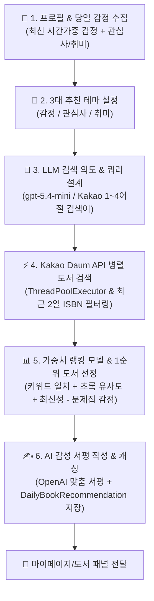

# 📊 [발표 참고자료] 책추천 시스템 흐름 및 도서 큐레이션 알고리즘

본 문서는 **"빈틈사이"** 서비스의 **책추천(Book Recommendation)** 시스템 흐름과 도서 큐레이션 알고리즘 프로세스를 발표자료(PPT, 발표 대본 등) 작성 시 바로 활용할 수 있도록 정리한 보고서입니다.

---

## 🏗️ 1. 한눈에 보는 전체 시스템 구조 (Overview)

책추천 시스템은 단순히 AI가 무작위로 책을 추천해주는 것이 아닙니다.  
**당일 최신 시간가중 감정 지표**, **사용자의 3대 테마(감정, 관심사, 취미)**, **LLM 기반 검색 쿼리 설계**, **Kakao Daum 도서 REST API 실시간 연동**, **중복 ISBN 필터링**, **유사도 가중치 랭킹 모델**, 그리고 **맞춤형 AI 서평 창작**이 결합된 정밀 개인화 큐레이션 시스템입니다.



---

## 🔄 2. 각 단계별 상세 인아웃풋(In/Out) 및 처리 과정

---

### 📍 [1단계] 당일 감정 지표 및 사용자 프로필 수집 (`profile_service.py`)

* **역할**: 대화 기록에서 사용자의 당일 기분을 시간 가중치 방식으로 도출하고 개인 프로필을 로드합니다.

| 구분 | 내용 |
| :--- | :--- |
| **Input (입력)** | • 사용자 ID 및 인적 기본 프로필 (나이, 성별) <br>• 가입 시 선택한 관심사 키워드 및 취미 목록 <br>• 당일 어시스턴트 챗봇과의 대화 로그 (`ChatMessage`) |
| **Process (과정)** | 1. **기본 프로필 로드**: 가입 시 수집한 유저의 관심 키워드 및 취미 목록을 로드합니다.<br>2. **당일 감정 최신도 가중 산출 (`get_today_dominant_emotion`)**: 당일 나누었던 대화 중 가장 최근의 대화 분위기에 더 높은 가중치를 부여하는 시간 가중 알고리즘을 통해 당일의 지배적 감정(기쁨, 슬픔, 분노, 일반)을 도출합니다. |
| **Output (출력)** | • 당일 유저 프로필 및 감정 스냅샷 (`UserProfile`) |

---

### 📍 [2단계] 3대 추천 테마 설정 및 LLM 검색 쿼리 도출 (`agent.py`)

* **역할**: 3가지 테마 카테고리를 설정하고, LLM을 활용해 실시간 도서 API용 구체적 검색어를 설계합니다.

| 구분 | 내용 |
| :--- | :--- |
| **Input (입력)** | • 유저 프로필 및 당일 감정 스냅샷 |
| **Process (과정)** | **① 3대 테마(Theme) 카테고리 지정**<br>• `emotion` (감정 테마): 당일 기분 환기/유지 목적 (긍정 감정: 몰입/성장, 부정 감정: 마음 환기/휴식)<br>• `interests` (관심사 테마): 인문, 과학, 예술 등 지적 성장을 유도하는 프로필 기반 도서<br>• `hobbies` (취미 테마): 요리, 운동, 여행 등 활동적인 취미 관련 실용서<br><br>**② LLM 검색 의도 설계 (`_build_search_intent`)**<br>• LLM에 프로필 정보를 주입하여 가상의 책 제목이 아닌, Kakao 서점에서 검색 가능한 **1~4어절 구체적 한국어 검색어(`search_terms`)** 및 **본문 핵심 단어(`content_terms`)**를 JSON으로 생성합니다.<br>• **주제 앵커링(Anchoring)**: 예를 들어 취미가 "패션"일 때 검색어가 "힐링" 같은 상위 개념으로 붕괴되지 않도록 검색어 첫 부분에 원래 주제 단어를 강제로 결합합니다. |
| **Output (출력)** | • 3개 테마별 검색어 및 큐레이션 의도 데이터 (`search_terms`, `content_terms`, `selected_basis`) |

---

### 📍 [3단계] 최근 중복 배제 & Kakao API 병렬 도서 검색 (`catalog_service.py`)

* **역할**: 최근에 추천했던 책을 필터링하고 Kakao Daum 도서 검색 API를 통해 실시간 서지 정보를 수집합니다.

```text
[검색어 쿼리 목록] ──(최근 2일 ISBN 제외)──> [Kakao REST API 병렬 요청] ──> [실제 판매 도서 후보군 획득]
```

| 구분 | 내용 |
| :--- | :--- |
| **Input (입력)** | • 테마별 도서 검색어 쿼리 목록<br>• 최근 2일간 사용자에게 제공되었던 도서 ISBN 이력 |
| **Process (과정)** | 1. **중복 추천 배제 (ISBN Filtering)**: 최근 2일 이내에 이미 추천되었던 도서의 ISBN 목록을 수집하여 검색 대상에서 원천 차단합니다.<br>2. **병렬 API 호출 (`ThreadPoolExecutor`)**: `ThreadPoolExecutor`를 사용해 Kakao Daum 도서 API로 비동기 병렬 요청을 발송하여 API 응답 레이턴시를 최소화합니다.<br>3. **서지 데이터 정제**: 제목, 저자, 출판사, 초록 설명, 표지 URL, 상세 링크, ISBN 등 서지 정보를 정제하고 수험서/문제집 등 부적절한 타이틀 마커를 1차 제거합니다. |
| **Output (출력)** | • 테마별 도서 후보군 목록 (최대 24권 이상의 실제 판매 도서 메타데이터) |

---

### 📍 [4단계] 개인화 가중치 랭킹 모델 적용 & 도서 확정 (`ranking_service.py`)

* **역할**: 수집된 도서 후보군 중 개인화 가중치 점수를 산정하여 최적의 1순위 도서를 선정합니다.

| 구분 | 내용 |
| :--- | :--- |
| **Input (입력)** | • Kakao API 도서 후보군 메타데이터<br>• 사용자 관심사/취미 키워드 및 테마 검색어 |
| **Process (과정)** | • 도서 후보군을 대상으로 아래의 개인화 가중치 수식을 적용해 점수를 계산합니다:<br>$$\text{Score} = (W_1 \times \text{제목/검색어 일치}) + (W_2 \times \text{초록 설명 개념 유사도}) + (W_3 \times \text{출간일 최신성}) - (W_4 \times \text{문제집/수험서 마커 감점})$$<br>• 수험서, 문제집, 아동용 교재 등 웰니스 목적에 맞지 않는 도서는 점수 감점 및 제외 처리합니다.<br>• 각 테마별로 가중치 점수가 가장 높은 **최종 1순위 도서 1권**을 확정합니다. |
| **Output (출력)** | • 테마별 최종 선정 도서 1권 (총 3권) |

---

### 📍 [5단계] AI 감성 서평 작성 & 당일 스냅샷 캐싱 (`agent.py`, `models.py`)

* **역할**: 선정된 도서에 맞춰 사용자 상황을 위로하는 맞춤형 AI 서평을 작성하고 결과를 DB에 저장합니다.

| 구분 | 내용 |
| :--- | :--- |
| **Input (입력)** | • 최종 선정 도서 메타데이터 (제목, 저자, 상세 초록)<br>• 사용자 당일 감정 및 프로필 데이터 |
| **Process (과정)** | 1. **맞춤형 AI 서평 창작**: 선정된 도서 정보와 사용자의 상황을 OpenAI GPT에 주입하여, 사용자의 기분을 다정하게 다독이고 책의 가치를 전달하는 **150~200자의 맞춤 감성 서평(`review`)**을 작성합니다.<br>2. **당일 스냅샷 영속화 (`DailyBookRecommendation`)**: API 호출 비용과 레이턴시를 제어하기 위해 유저별 하루 1회 추천 스냅샷을 DB에 저장합니다. (당일 재요청 시 DB 캐시 즉시 반환) |
| **Output (출력)** | • 프론트엔드 도서 추천 페이로드 (도서 메타데이터 + 표지 이미지 + 상세 URL + AI 서평) |

---

## 🎯 3. 발표자료(PPT) 작성을 위한 핵심 요약 (Key Takeaways)

발표 슬라이드 제작 시 아래 **3가지 차별화 포인트**를 강조하면 설득력을 극대화할 수 있습니다!

1. **💯 100% 실제 출간 도서 추천 (LLM 가짜 책 환각 완벽 방지)**
   - LLM이 존재하지 않는 가짜 책 제목을 만들지 않도록, **Kakao Daum 도서 REST API**와 직접 연동하여 서점에서 실제 판매 중인 100% 검증된 도서 데이터만 제공.

2. **🎯 3대 테마(감정, 관심사, 취미) 다각화 & 병렬 검색**
   - 단발성 기분뿐만 아니라 사용자의 지적 관심사와 실용적인 취미 생활까지 고려한 **3대 카테고리 병렬 쿼리 큐레이션** 제공.

3. **📊 개인화 랭킹 모델 + 중복 ISBN 필터링 + AI 맞춤 서평**
   - 최근 2일 이내 추천된 책(ISBN) 중복 차단, 키워드/초록/최신성 가중치 랭킹 알고리즘으로 최적 도서 1권 선정 후, 사용자의 상황을 위로하는 **따뜻한 맞춤형 AI 서평** 창작.
