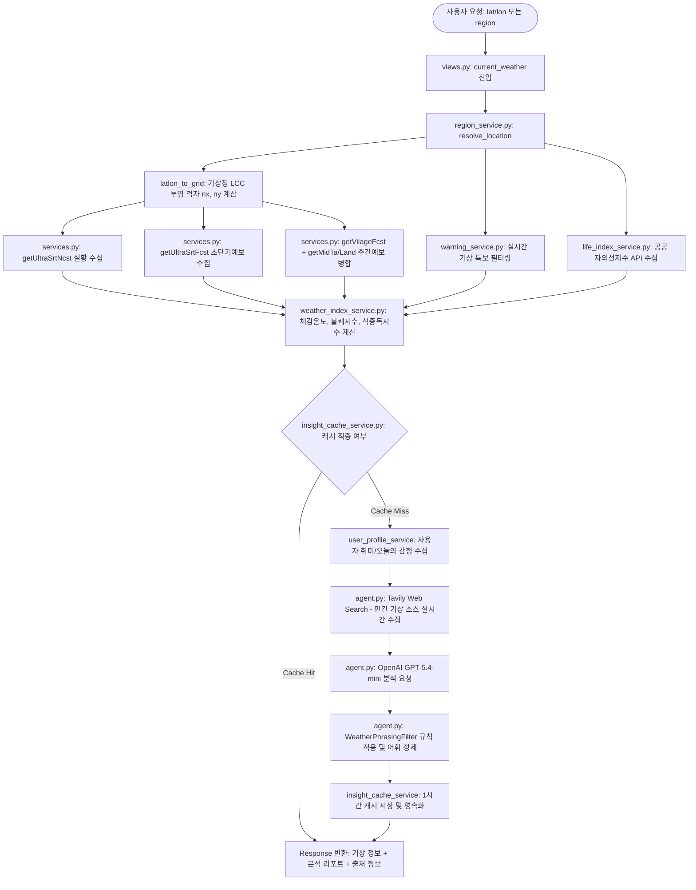

# 🌗 날씨분석 기능 구조 및 작동원리 보고서

본 보고서는 "빈틈사이" 서비스의 **날씨분석(Weather Analysis)** 기능에 대한 코드 구조 및 작동원리를 분석하여 기술합니다. 날씨분석 기능은 사용자의 위치 좌표나 지역명을 기반으로 기상청 공식 데이터 및 웹 검색 결과를 수집하고, 이를 사용자의 개인화 프로필(취미, 오늘 감정)과 융합하여 따뜻하고 친근한 일상 언어로 날씨 해설과 행동 추천을 생성하는 시스템입니다.

---

## 1. 코드 모듈 구조 (Structure)

날씨분석 기능은 Django 백엔드 내 `app/backend/myweather` 앱으로 독립적으로 캡슐화되어 있으며, 외부 기상청 API 연동부, 데이터 처리 서비스부, AI 에이전트 및 캐싱부가 논리적 기준에 따라 분리되어 구성되어 있습니다.

```text
app/backend/myweather/
├── views.py                  # API 엔드포인트 수신 및 응답 처리
├── models.py                 # DB 모델 (WeatherRegion, WeatherPhrasingFilter)
├── agent.py                  # AI 분석 에이전트 (Tavily 웹 검색 및 OpenAI GPT 연동)
├── services.py               # 기상청 API 호출 및 기상 데이터 파싱 핵심 오케스트레이터
├── constants.py              # 날씨 관련 상수 설정, 기상 구분 매핑 및 폴백 텍스트
├── service/                  # 하위 도메인별 세부 서비스 레이어
│   ├── region_service.py       # 사용자 위치 기반 행정 구역 매핑 및 격자 변환
│   ├── weather_index_service.py# 체감온도, 불쾌지수, 식중독지수 공식 기반 결정론적 계산
│   ├── life_index_service.py   # 기상청 생활기상지수(자외선지수) API 호출
│   ├── warning_service.py      # 기상청 전국 기상 특보 실시간 조회 및 필터링
│   ├── user_profile_service.py # 사용자 프로필 데이터(취미, 오늘의 감정) 수집
│   ├── insight_cache_service.py# 생성된 LLM 날씨 리포트의 기간 단위 캐싱 제어
│   └── exceptions.py           # 날씨 도메인 예외 정의
└── admin.py                  # 관리자 페이지 연동
```

### 1.1 모듈별 설계 기준 및 역할

1. **엔드포인트 레이어 (`views.py`)**:
   - `current_weather`: 사용자로부터 위경도(`lat`/`lon`) 또는 지역명(`region`)을 입력받아 날씨 정보를 수집하고, LLM 분석(insight)과 함께 결합하여 전달하는 메인 진입점입니다.
   - `get_weather_regions`: 기상 정보 조회가 가능한 대표 지역 목록 정보를 제공합니다.
2. **비즈니스 로직 레이어 (`services.py`, `service/`)**:
   - 단일 책임 원칙(SRP)에 따라 좌표-행정구역 조회(`region_service.py`), 물리 공식 기반 지수 산출(`weather_index_service.py`), 기상 특보 조회(`warning_service.py`), 공공 자외선지수 연동(`life_index_service.py`)으로 비즈니스 연산 단위를 모듈화했습니다.
   - `services.py`는 이러한 하위 서비스들을 통합 제어하여 현재 관측, 초단기 예보, 단기 및 중기 주간 예보 데이터를 종합적으로 가공하고 병합(Merge)합니다.
3. **AI 및 통합 에이전트 레이어 (`agent.py`)**:
   - `WeatherWebAgent` 클래스를 정의하여 LangChain 라이브러리를 통해 OpenAI GPT 모델을 연동하고, 실시간성 보완을 위해 Tavily Web Search API를 통한 뉴스 및 민간 날씨 트렌드를 수집하여 프롬프트의 맥락(Context)을 확장합니다.
4. **영속성 및 필터 레이어 (`models.py`)**:
   - `WeatherRegion`: 좌표 분석을 돕기 위해 미리 선언된 전국 기상 지역 정보를 보관합니다.
   - `WeatherPhrasingFilter`: AI가 생성한 어색하거나 딱딱한 기계적 문체 또는 의료적 지시 단어를 친근하고 자연스러운 한국어 표현으로 변환하기 위한 치환 필터 데이터베이스 테이블입니다.
5. **캐시 관리 레이어 (`service/insight_cache_service.py`)**:
   - 외부 LLM API 및 기상청 API의 호출 횟수를 조율하고 중복 지출을 억제하기 위해 사용자, 위치 정보, 캐시 만료 시점(최대 1시간)을 기준으로 메모리 캐싱 및 조회를 제어합니다.

---

## 2. 작동 원리 및 프로세스 흐름 (Working Principle)

날씨분석 기능의 작동 원리는 **[입력 수신] ➡️ [기상 정보 통합 수집] ➡️ [결정론적 지수 계산] ➡️ [컨텍스트 확장 및 개인화] ➡️ [AI 분석 및 리포팅] ➡️ [후처리 및 캐싱]** 단계로 구분됩니다.

### 2.1 프로세스 흐름도 (Process Flow)



### 2.2 가공 데이터 기준 및 세부 프로세스

#### 1단계: 사용자 위치 인식 및 예보 격자 변환
- **위치 확인**: 사용자가 GPS 위경도 좌표(`lat`, `lon`)를 전달하면 `resolve_location`을 통해 가장 근접한 대한민국의 행정구역명(시/도/구)을 도출합니다.
- **격자 변환 (`latlon_to_grid`)**: 기상청 동네예보에 사용되는 고유 투영법인 **람베르트 등각원추도법(Lambert Conformal Conic)** 공식에 대입하여 위경도를 2차원 평면 격자점 `(nx, ny)`으로 수학적 변환합니다.

#### 2단계: 다원화된 기상 데이터 수집 (기상청 API 허브)
기상청 API 허브(API Hub)와 공공데이터포털로부터 실시간 데이터를 획득하며, 안정성을 위해 공동 캐시 및 장애 시 폴백(Stale Cache) 체계를 가집니다.
- **초단기 실황**: 매시 10분마다 갱신되며 기온(T1H), 습도(REH), 강수량(RN1), 풍속(WSD)을 획득합니다.
- **초단기 예보**: 1시간 단위 예보로 현재 시간 기준 6시간 범위의 하늘 상태(SKY: 맑음, 구름많음, 흐림) 및 강수 형태(PTY)를 종합하여 현재 및 직후 6시간 날씨를 판단합니다.
- **주간 예보 병합 (`merge_weekly_forecasts`)**: 단기예보(3일 내 상세 최저/최고 기온, 강수 확률)와 중기기온/육상예보(4일~10일 내 광역 정보)를 날짜 기준으로 매핑하여 연속성 있는 7일 기상 정보를 병합 형성합니다.
- **특보 조회**: 기상청 특보 조회용 비정형 데이터(`wrn_now_data.php`)를 파싱 및 파라미터 필터링하여 사용자 소속 구역에 발효 중인 강풍, 호우, 대설 등의 주의보/경보를 식별합니다.

#### 3단계: 공식 물리 기반 기상 생활 지수 산출
기온과 습도, 풍속 등 정형 계측치를 바탕으로 서버 내에서 자체 결정론적 알고리즘으로 지수를 계산합니다. LLM의 할루시네이션(환각)을 원천 방지하기 위함입니다.
- **체감온도 (Wind Chill)**: 기상청 공식 계절별 산식을 따릅니다. 겨울철에는 기온과 풍속을 이용한 수식($13.12 + 0.6215 \times T - 11.37 \times V^{0.16} + 0.3965 \times T \times V^{0.16}$)을 사용하고, 여름철에는 온도와 습도를 활용한 열지수(Heat Index) 방식을 계산합니다.
- **불쾌지수 (Discomfort Index)**: 기상청 공인 과거 산식인 $DI = 1.8 \times T - 0.55 \times (1 - RH) \times (1.8 \times T - 26) + 32$를 구현하여 단계별(낮음, 보통, 높음, 매우높음) 상태를 지정합니다.
- **식중독지수 (Food Poisoning Index)**: 기상청·식약처 공동 식중독 예측 모델식을 바탕으로 미생물 증식률 온도 관계를 재현합니다.

#### 4단계: 실시간 뉴스 검색(Tavily) 및 개인화 결합
- **웹 검색 확장**: 기상청의 수치적인 정보만으로는 옷차림이나 일상 팁을 얻기 부족하므로, Tavily 웹 에이전트를 통해 네이버 날씨, 웨더아이, 케이웨더 등의 민간 기상 관점 뉴스 정보(`[현재 날짜] [지역명] 이번 주 주간예보 날씨 변화 외출 옷차림...`)를 실시간으로 검색하여 근거 스니펫(Snippet)으로 확보합니다.
- **개인 정보 추출**: 데이터베이스에서 사용자의 취미 목록과 오늘 대화 기반으로 분석된 지배적 감정 데이터를 가져옵니다.

#### 5단계: LLM 맞춤형 분석 생성 및 한국어 톤앤매너 후처리
- **OpenAI GPT 융합**: 물리 계측 기상 지수, 예보 정보, 웹 검색 스니펫, 개인 정보(취미/감정)를 시스템 지침 프롬프트와 함께 LLM에 주입하여 JSON 포맷의 결과를 요청합니다.
  - *제한조건*: 일반 기상 행동 요령 2개와 취미에 특화된 실천 추천 1개를 엄격히 준수하도록 제안합니다.
- **자연어 필터링 후처리 (`_soften_phrasing`)**: LLM이 작성한 결과물에서 기계적이고 차가운 느낌을 주는 문구(예: "진단", "환자", "주의 요망" 등)를 데이터베이스(`WeatherPhrasingFilter`) 및 정적 치환 규칙에 정의된 부드러운 일상 생활 단어로 대거 치환합니다.
- **최종 반환**: 사용자에게는 최종 가공된 날씨 JSON 명세와 공공 출처 표기 정보를 함께 제공하고 백엔드 캐시에 1시간 동안 저장합니다.
