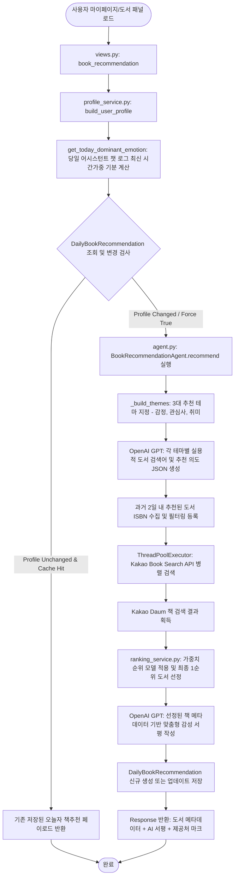

# 🌗 책추천 기능 구조 및 작동원리 보고서

본 보고서는 "빈틈사이" 서비스의 **책추천(Book Recommendation)** 기능에 대한 코드 구조 및 작동원리를 분석하여 기술합니다. 책추천 기능은 사용자가 당일 기록한 대화에서 실시간 감지된 감정 상태와 사전에 설정된 개인 관심사 및 취미를 융합하고, AI 기반 에이전트를 통해 도서 검색 질의(Query) 및 타겟 키워드를 설계하여 Kakao Daum 도서 API를 통해 검증된 실제 판매 도서를 찾아내고, 이에 적합한 맞춤형 AI 추천 서평을 제공하는 정밀 추천 시스템입니다.

---

## 1. 코드 모듈 구조 (Structure)

책추천 기능은 Django 백엔드 내 `app/backend/mybook` 앱으로 독립적이고 유연하게 격리되어 개발되어 있습니다. 개인화 프로필 빌더, 도서 API 커넥터, 개인화 가중치 랭킹 알고리즘, LLM 에이전트 레이어가 명확히 구분되어 유기적으로 동작합니다.

```text
app/backend/mybook/
├── views.py                  # API 진입점 및 HTTP 요출/응답 매개자 (GET)
├── models.py                 # DB 모델 (DailyBookRecommendation) - 당일 추천 데이터 영속화
├── agent.py                  # AI 큐레이터 에이전트 (검색 의도 설계, 서평 생성 및 종합 관리)
├── constants.py              # 테마 명칭, 프롬프트 템플릿, Fallback 키워드 및 API 제공사 정보
├── exceptions.py             # 책추천 예외 (BookRecommendationUnavailable 등)
├── utils.py                  # 도서 정보 정제, 작가/ISBN 규격화 및 URL 보호를 위한 유틸리티
├── services/                 # 하위 도메인별 세부 서비스 레이어
│   ├── recommendation_service.py # 당일 캐싱 정책 검사, 스테일(Stale) 예외 대안 복구 흐름 제어
│   ├── profile_service.py        # 대화 흐름 기반 당일 기분 감정 집계 및 기본 프로필 가공
│   ├── catalog_service.py        # 외부 Kakao Daum 책 검색 API 요청 처리
│   └── ranking_service.py        # 메타데이터 유사도 기반 개인화 도서 점수 부여 및 순위 정렬
└── tests.py                  # 백엔드 통합 및 유닛 테스트 코드
```

### 1.1 모듈별 설계 기준 및 역할

1. **엔드포인트 레이어 (`views.py`)**:
   - `book_recommendation`: 사용자 세션을 받아 오늘자 책 추천 결과물을 가공하도록 서비스 레이어에 이벤트를 위임합니다. 특정 테마의 재추천(`theme`) 또는 강제 갱신(`force`) 옵션을 지원합니다.
2. **영속성 레이어 (`models.py`)**:
   - `DailyBookRecommendation`: API 호출 비용 및 재생성 레이턴시를 제어하기 위해 유저별로 하루에 한 번만 결과물 스냅샷을 고유하게 보관합니다. 유저(`user`)와 날짜(`recommendation_date`) 컬럼을 결합한 복합 고유 제약 조건(UniqueConstraint)이 적용되어 있습니다.
3. **프로필 가공 레이어 (`services/profile_service.py`)**:
   - `build_user_profile`: 사용자 프로필 모델의 기본 인적 정보(나이, 성별) 및 가입 시 입력한 관심 키워드, 취미 목록을 로드합니다.
   - `get_today_dominant_emotion`: 당일 유저가 어시스턴트 캐릭터와 나눈 대화 기록(`ChatMessage`) 중 캐릭터 응답 톤에 지정되었던 기상 감정 레이블을 시간 가중치(최신일수록 높은 점수) 방식으로 계산하여 당일의 지배적인 감정으로 도출합니다.
4. **외부 연동 레이어 (`services/catalog_service.py`)**:
   - `request_kakao_book_search`: Kakao REST API 규격을 준수하여 실시간 도서 정보를 조회합니다.
5. **개인화 정렬 레이어 (`services/ranking_service.py`)**:
   - `rank_kakao_books`: Kakao API로 얻은 최대 24개 이상의 서적 데이터를 대상으로 사용자의 관심 단어, 취미 명칭, 테마 키워드가 도서 제목, 저자명, 출판사, 초록 설명(Contents)에 얼마나 밀접하게 매핑되는지 점수화하여 순위를 확정합니다.
6. **추천 에이전트 레이어 (`agent.py`)**:
   - `BookRecommendationAgent`: 핵심 프로세스인 '테마 생성 ➡️ 다중 스레드 API 조회 ➡️ 최종 도서 선정 ➡️ 맞춤형 AI 서평 창작' 과정을 총괄 제어하는 헤드 에이전트입니다.

---

## 2. 작동 원리 및 프로세스 흐름 (Working Principle)

책추천 기능은 단순 무작위 추천을 배제하고, **[기분 및 관심사 프로필 구성] ➡️ [AI 검색 의도 및 쿼리 도출] ➡️ [병렬 외부 도서 조회] ➡️ [기추천 도서 필터링] ➡️ [서지 정보 가치 평가 및 정렬] ➡️ [AI 개인 맞춤형 서평 작성]** 순으로 정밀 제어됩니다.

### 2.1 프로세스 흐름도 (Process Flow)



### 2.2 가공 데이터 기준 및 세부 프로세스

#### 1단계: 실시간 사용자 감정 지표 수집
- 당일 백엔드에서 사용자 메시지에 응답하기 위해 추론했던 감정 기록들 중, 가장 최근에 나누었던 대화 분위기의 영향력을 높게 반영하도록 가중 합산하는 최신도 가중 알고리즘을 사용합니다. 이를 통해 현재 사용자가 느끼는 기분과 가장 닮아있는 상태(기쁨, 슬픔, 분노, 일반)를 당일 감정으로 확정합니다.

#### 2단계: 3대 테마 기반 추천 목적 설정 (`_build_themes`)
추천은 다음의 3가지 카테고리로 나누어 동시 실행됩니다.
- **감정 테마 (`emotion`)**: 당일 지배적 감정 극복 또는 유지를 위한 정서 지원 서적.
- **관심사 테마 (`interests`)**: 사용자의 내적 성장을 이끌기 위해 가입 시 선택한 인문, 과학, 예술 등 지적 관심 키워드 기반 서적.
- **취미 테마 (`hobbies`)**: 요리, 운동, 캠핑 등 사용자가 활동적으로 참여하는 실용 활동 기반 서적.

#### 3단계: LLM을 활용한 정밀 검색어 도출 (`_build_search_intent`)
- LLM에 사용자 프로필 정보와 테마 규칙을 주입하여 가상의 책 제목이나 추상적인 개념이 아닌, 실제 온라인 서점에서 검색 가능성이 매우 높은 1~4어절 단위의 구체적 **책 검색어(search_terms)**와 본문에 있어야 할 **핵심 단어(content_terms)** 목록을 생성하도록 유도합니다.
- *정합성 필터*: 예를 들어 사용자의 취미가 "패션"일 때, LLM이 임의로 "힐링", "라이프스타일" 같은 상위 개념으로 쿼리를 붕괴시키지 못하도록 입력된 프로필 키워드를 쿼리 첫 글자에 강제 결합(Anchoring)하는 규칙을 적용합니다.

#### 4단계: 제외 도서 필터링 및 병렬 검색 처리 (`ThreadPoolExecutor`)
- **중복 배제**: 이전에 동일한 책이 추천되어 신선함이 떨어지는 현상을 차단하고자, 최근 2일 이내에 동일인에게 제공되었던 도서들의 고유 **ISBN** 목록을 수집하여 검색 과정에서 원천 차단합니다.
- **병렬 질의 수행**: 추출된 다수의 쿼리(테마별 1~3개 검색어)를 사용하여 `ThreadPoolExecutor`를 통해 Kakao Daum 도서 검색 API에 병렬로 비동기 요청을 발송합니다. 응답 시간 최소화를 위함입니다.

#### 5단계: 유사도 가중치 랭킹 모델 적용 (`rank_kakao_books`)
검색된 다량의 도서 후보군 중 아래의 수식을 기반으로 개인화 적합도 점수를 산정하여 최적의 책을 정렬합니다.
$$\text{Score} = (W_1 \times \text{키워드 일치 여부}) + (W_2 \times \text{본문 개념 유사성}) + (W_3 \times \text{출간일 최신성}) - (W_4 \times \text{마케팅 문구 및 수험서 마커 감점})$$
- 아동용 도서, 학습 교재, 문제집 등 웰니스 목적에 맞지 않는 키워드가 제목에 포함되면 즉각 제거 필터가 발동합니다.
- 점수가 가장 높은 단 1권의 책이 최종 추천 대상 도서로 확정됩니다.

#### 6단계: 맞춤형 AI 서평 창작 및 하루 스냅샷 영속화
- **서평 생성**: 최종 선정된 도서의 메타데이터(제목, 저자, 상세 초록)와 사용자의 현 감정/프로필을 다시 OpenAI GPT에 제공하여, 사용자의 상황을 위로하고 해당 도서가 어떤 점에서 도움이 될 수 있는지 공감하는 150~200자 가량의 따뜻한 맞춤형 서평(`review`)을 개인 맞춤 톤으로 작성합니다.
- **영속화**: 최종 리포트를 JSON으로 조립하여 `DailyBookRecommendation` 테이블에 삽입하며, 하루 동안은 동일 요청 시 이 결과값을 즉시 반환하여 API 비용 및 속도를 극대화합니다.
