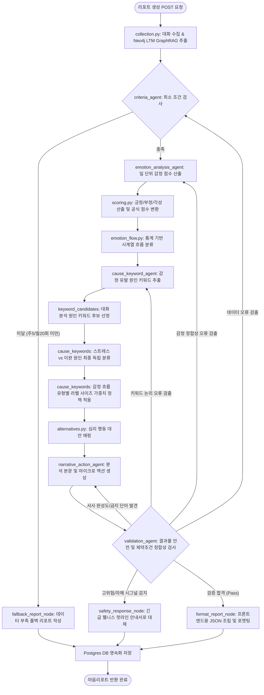

# 🌗 마음리포트 기능 구조 및 작동원리 보고서

본 보고서는 "빈틈사이" 서비스의 **마음리포트(Mind Report)** 기능에 대한 코드 구조 및 작동원리를 분석하여 기술합니다. 마음리포트 기능은 사용자가 일주일 또는 한 달 동안 챗봇 캐릭터와 나눈 자연스러운 일상 대화 텍스트와 Neo4j 그래프 데이터베이스에 축적된 장기 기억(LTM: Long-Term Memory) 데이터를 다중 에이전트(Multi-Agent) 파이프라인으로 분석하여, 감정의 시계열 흐름 변화와 그 근간에 있는 스트레스/이완의 원인 키워드를 도출하고 다정한 자기 이해 가이드를 생성하는 핵심 분석 시스템입니다.

---

## 1. 코드 모듈 구조 (Structure)

마음리포트 기능은 Django 백엔드 내 `app/backend/mindreport` 모듈에 모여 있으며, 복잡한 상태 관리와 다중 에이전트 간의 자율적 흐름을 제어하기 위해 **LangGraph** 프레임워크를 기반으로 멀티 에이전트 아키텍처(Multi-Agent Architecture)가 엄밀하게 구현되어 있습니다.

```text
app/backend/mindreport/
├── constants.py              # 기간/점수/시계열/모델 설정의 단일 기준점
├── checks.py                 # 모델 파일 및 배포 설정 Django system check
├── views.py                  # 인증과 HTTP 응답만 담당하는 얇은 API 계층
├── models.py                 # DB 모델 (MindReport) - 주간/월간 생성된 리포트 최종 저장
├── urls.py                   # 엔드포인트 URL 라우팅 설정
├── services/                 # 하위 도메인 및 다중 에이전트 핵심 코드
│   ├── graph_flow.py         # LangGraph 기반의 다중 에이전트 상태 전이 정의 (Supervisor)
│   ├── graph_state.py        # 에이전트 전역 공유 상태 스키마 정의 (TypedDict)
│   ├── graph_nodes.py        # LangGraph 각 상태 노드들의 실행 래퍼 함수군
│   ├── report_service.py     # 생성 파이프라인과 저장을 조정하는 애플리케이션 서비스
│   ├── persistence.py        # 현재 기간 upsert 및 조회 전용 저장 계층
│   ├── payloads.py           # 그래프 결과 → 프론트엔드 JSON 계약 변환/검증
│   ├── periods.py            # 주간/월간 기간 범위와 표시 문구의 단일 구현
│   ├── collection.py         # 대화 히스토리 및 Neo4j 그래프DB 기반 장기 기억(LTM) 통합 수집 레이어
│   ├── criteria_service.py   # 리포트 생성 기준(주간 5개, 월간 20개 대화) 물리적 검사
│   ├── criteria_agent.py     # 생성 대상 판별 및 초기 분기 에이전트
│   ├── emotion_analysis_agent.py # 대화별 정서 분류 및 시계열 변화 흐름 판별 총괄 에이전트
│   ├── scoring.py            # KcELECTRA 4감정 확률의 일별 집계 및 서버 결정론적 점수 변환
│   ├── emotion_flow.py       # 감정 점수 시계열 통계 분류기 (상향, 하향, 변동성, 유지형 분류)
│   ├── cause_keyword_agent.py# 원인 분석 총괄 에이전트
│   ├── keyword_candidates.py # 대화 텍스트 기반 감정 원인 후보 키워드 추출 에이전트
│   ├── cause_keywords.py     # 원인 후보 독립 검증 및 스트레스/이완 분류 에이전트
│   ├── alternatives.py       # 감정 흐름 상태별 기획 행동 대안 매핑 모듈
│   ├── narrative_action_agent.py # 최종 서사 생성 총괄 에이전트
│   ├── narrative.py          # Neo4j LTM 및 대화를 조합한 제목/요약/서사 및 마이크로 액션 플랜 작성 에이전트
│   ├── validation_agent.py   # 안전, 환각, 직접인용, 기밀노출 방지를 위한 엄격한 결과물 검증 에이전트
│   └── fallback_service.py   # 데이터 부족 또는 에이전트 오류 시 폴백 리포트 작성 서비스
└── tests.py                  # 에이전트 통합 검증 유닛 테스트
```

### 1.1 모듈 설계 및 역할 기준

1. **상태 관리 및 수퍼바이저 레이어 (`services/graph_flow.py`, `graph_state.py`)**:
   - `MindReportSupervisorAgent`: LangGraph를 컴파일하여 단방향 분석 파이프라인과 순환 피드백(검증 실패 시 수정 요청 루프) 경로를 정의하는 감독 모듈입니다.
   - `MindReportGraphState`: 에이전트들이 공통으로 읽고 쓰는 결합된 메모리 구조로, 이전 노드들의 중간 연산 결과와 검증 오류 추적 이력(Trace Log)을 관리합니다.
2. **수집 및 기획 제약 조건 레이어 (`services/collection.py`, `criteria_service.py`)**:
   - `MindReportDataCollector`: 기간 대화와 함께 **Neo4j 그래프 데이터베이스**에서 사용자가 최근 일주일간 겪었던 주요 '사건(Event)', '연관 인물(Person)', '관심사/감정(Emotion)' 관계 노드를 탐색(Neo4j Cypher 쿼리 활용)하여 GraphRAG용 맥락 자료(LTM Context)를 확보합니다.
   - `ReportCriteriaService`: 무의미한 결과물 남발을 억제하기 위해 주간 대화 5건 이상, 월간 대화 20건 이상의 최소 조건 검사를 수행합니다.
   - 기준 미달 폴백은 원인·감정 값을 생성하지 않습니다. Tavily 검색 근거와 유효한 생성 결과가 모두 있을 때만 별도의 웹 활동 제안을 표시하며, 검색 실패 시에는 대화 수집·분석 대기 상태만 반환합니다. 정적 활동 목록이나 무작위 더미 추천은 사용하지 않습니다.
3. **세부 기능적 다중 에이전트 레이어 (Functional Multi-Agents)**:
   - 각 에이전트(Criteria, Emotion, Cause, Narrative, Validation)는 단일 역할만 전문적으로 처리(Separation of Concerns)하도록 정의되었으며, 내부적으로 프롬프트 설정과 파싱 로직을 격리하여 독립성을 보장합니다.
4. **결정론적 점수/분류 레이어 (`services/scoring.py`, `emotion_flow.py`)**:
   - KcELECTRA는 사용자 발화를 기쁨/슬픔/분노/일반 확률로만 분류하고, 0~100 점수 계산과 시계열 패턴 분류는 서버의 고정 수학 코드가 담당하도록 구조화했습니다.
5. **검증 및 안전 통제 레이어 (`services/validation_agent.py`)**:
   - `MindReportValidationAgent`: 최종 배포 전 생성물을 자동 검사하여 극단적 선택/자해 등 고위험군 표현 포착 시 안전 페이지 전환(`safety_response`), 오진 유발 방지, 점수 노출 차단, 대화 직접 인용 차단 등을 감시하고 미충족 시 이전 상태로 회귀(Revision Loop)하도록 통제합니다.

---

## 2. 작동 원리 및 프로세스 흐름 (Working Principle)

마음리포트는 복잡한 다중 에이전트의 작업 성과물들이 LangGraph 상태 위에서 점진적으로 가공되고 피드백을 주고받는 순환 구조를 이룹니다.

### 2.1 프로세스 흐름도 (Process Flow)



### 2.2 가공 데이터 기준 및 세부 프로세스

#### 1단계: 대화 내용 및 Neo4j LTM(장기기억) 수집
- 사용자 대화 로그를 로드하는 동시에, **Neo4j 그래프 데이터베이스**와 연동하여 분석 대상 기간 내에 생성된 유저-사건-인물 간의 의미망을 수집합니다.
- Cypher 질의 예: `(User)-[:HAS_EVENT]->(Event)-[:INVOLVES]->(Person)` 관계를 탐색하여 사용자의 중요한 대소사와 감정 흐름의 객관적 맥락을 확보하고 이를 LLM에 GraphRAG 지식 기반으로 함께 주입합니다.

#### 2단계: 다차원 감정 수치화 및 시계열 추세 분류
- **감정 지표 수치화 (`scoring.py`)**:
  - 파인튜닝된 KcELECTRA가 각 사용자 발화를 `기쁨/슬픔/분노/일반` 확률로 분류하고, 같은 날짜의 확률을 평균합니다.
  - 서버는 일별 평균 확률에 다음 가중식을 적용해 비진단적 내부 점수(0~100)를 산출합니다.
    $$\text{Emotion Score} = 100P(기쁨) + 50P(일반) + 25P(슬픔) + 0P(분노)$$
  - 대표 감정은 최고 확률 라벨로 보존하되, 시계열용 상태는 점수에서 일관되게 파생합니다(55 초과 positive, 45 미만 negative, 그 외 neutral).
- **통계적 시계열 흐름 분류 (`emotion_flow.py`)**:
  - 룰 기반 통계 연산으로 기간 내 점수의 기하적 방향을 판별합니다.
  - **점수 상향 (`score_upward`)**: 기간 내 후반 평균 상승폭이 기준 이상일 때. (Tone Color: `green`)
  - **점수 하향 (`score_downward`)**: 기간 내 후반 평균 하락폭이 기준 이하일 때. (Tone Color: `red`)
  - **감정 변동성 (`score_volatile`)**: 점수 표준편차가 16 이상이고, 유의한 상승/하락 반전이 있거나 18점 이상 상승과 하락이 모두 발생할 때. 같은 방향의 큰 변화만 반복되면 상승 또는 하락으로 분류합니다. (Tone Color: `gray`)
  - **유지형 (`score_maintenance`)**: 뚜렷한 변화 추세 없이 긍정이 지배적이면 `초록 유지`, 부정이 지배적이면 `빨강 유지`, 중립이 지배적이면 `회색 유지`로 지정합니다.

#### 3단계: 원인 분석 및 시각적 강조 정책
- **원인 키워드 추출 및 검증**:
  - `keyword_candidates.py`에서 인과관계가 확실한 메시지 쌍을 분석하여 명사구 형태의 키워드 후보를 식별합니다.
  - `cause_keywords.py`는 해당 키워드가 사용자에게 미친 영향의 유의성을 독립 재검토하여 부담 유발은 `stress`, 긍정/이완 유발은 `relief`로 2차 분류하고 명확한 인과성이 부족하면 `unresolved`로 처리해 표기에서 차단합니다.
- **감정 흐름 기반 강조 가중치 반영**:
  - 감정 흐름이 회복세를 보이는 '점수 상향' 흐름일 때에는, 사용자의 시선이 스트레스보다 이완 원인에 먼저 닿을 수 있도록 스트레스 키워드의 시각적 비중을 축소(`LABEL_SIZE_COMPACT`, Weight 0.7)하고 이완 키워드를 강조(`LABEL_SIZE_DEFAULT`, Weight 1.0)하는 라벨 강조 디스플레이 정책을 자동 조율하여 프론트엔드로 전달합니다.

#### 4단계: 장기기억 융합 서사 및 행동 추천 생성 (`narrative.py`)
- LTM 장기기억 데이터셋과 대화 내용을 결합하여 맞춤 가이드를 구성합니다.
  - *특화 규칙*: 실시간 기분 점수와 LTM의 축적 감정 상태에 차이가 있을 경우, 이를 다면적인 복합 감정(예: 겉으로는 의연해 보이나 한구석에 은근한 책임감이 공존하는 상태)으로 다정하게 분석합니다.
  - *과거/미래 사건 구분*: LTM 사건이 이미 지나간 일인 경우 '자기 위로(Self-Compassion)' 및 '회고(Reflection)' 활동을 추천하고, 다가올 예정된 미래 사건인 경우 '부담 완화 환기(Soft Distraction)'를 대안으로 제안합니다.

#### 5단계: LangGraph 수퍼바이저와 Validation 루프
- **검증 에이전트 감시 (`validation_agent.py`)**:
  - 결과물을 즉시 배포하지 않고 의학적 오진 가능 단어 유무, 직접인용 따옴표 유무, 내부 시스템 명칭 노출 유무, PII(개인정보) 유출 등을 사후 검사합니다.
  - **자가 복구 회귀(Revision Loop)**: 만약 검증 중 오류 항목이 포착되면, LangGraph는 상태 전이 흐름에 따라 해당하는 에이전트 노드로 에러 지침서(`revision_instructions`)를 동봉해 되돌려 보냅니다. 해당 에이전트들은 지침서를 참고해 결과물을 재수정하며, 이 루프는 설정된 최대 횟수(`max_retries`)까지 반복됩니다.
  - **위험 신호 감지**: 사용자 대화 원문에서 극단적 선택 등 고위험 키워드가 포착되면 전체 파이프라인을 중단하고 즉시 공식 전문 지원 전화번호(109, 1393 등) 안내와 응급 자가안전 요령으로 구성된 안전 리포트(`safety_response`)로 대체 발행합니다.
- **최종 출력 저장**: 모든 검증을 이상 없이 최종 통과한 리포트 객체만 프론트엔드용 JSON 규격으로 변환되어 PostgreSQL `mind_reports` 테이블에 안전하게 적재됩니다.
