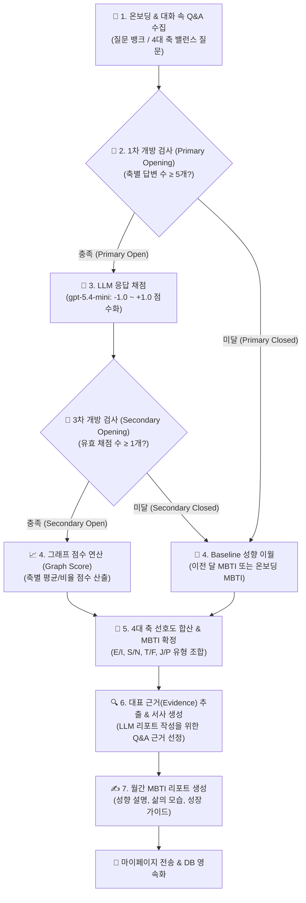

# 📊 [발표 참고자료] MBTI 분석 시스템 흐름 및 성향 추론 프로세스

본 문서는 **"빈틈사이"** 서비스의 **월간 MBTI 분석 시스템** 흐름과 성향 추론 프로세스를 발표자료(PPT, 발표 대본 등) 작성 시 바로 활용할 수 있도록 정리한 보고서입니다.

---

## 🏗️ 1. 한눈에 보는 전체 시스템 구조 (Overview)

MBTI 분석 시스템은 일회성 퀴즈 검사가 아닙니다.  
사용자가 일상 대화 속에서 답변한 **축별 Q&A 데이터**를 지속 수집하고, **2단계 가림막 조건(Primary/Secondary Opening)**, **이전 달/온보딩 성향 이월(Baseline Carry-over)**, 그리고 **LLM 응답 채점 및 근거 기반 서사 생성**을 결합하여 매월 정밀한 성향 변화와 웰니스 리포트를 도출합니다.



---

## 🔄 2. 각 단계별 상세 인아웃풋(In/Out) 및 처리 과정

---

### 📍 [1단계] 데이터 수집 및 스냅샷 로드 (Q&A Collection & Baseline Snapshot)

* **역할**: 사용자의 온보딩 MBTI 기록과 한 달간 축적된 Q&A 답변 데이터를 수집합니다.

| 구분 | 내용 |
| :--- | :--- |
| **Input (입력)** | • 사용자 ID 및 분석 요청 월 (`period_key`) <br>• 초기 가입 시 설정한 온보딩 MBTI 타입 (`onboarding_mbti_type`) <br>• 4개 축(E/I, S/N, T/F, J/P)에 대치된 일상 대화 질의응답 로그 |
| **Process (과정)** | 1. **온보딩 성향 보존**: 초기 사용자의 가입 진단 MBTI 데이터를 기본 베이스라인으로 확보합니다.<br>2. **Q&A 대화 수집**: 챗봇과의 대화 중 4개 축 밸런스 질문(질문 뱅크 40종 또는 LLM 동적 질문)에 대한 사용자의 자유 답변을 한 달간 축적합니다.<br>3. **월간 스냅샷 생성**: 한 달이 지나면 축별 답변 개수(`axis_counts`)와 이전 달 MBTI 분석 결과를 로드합니다. |
| **Output (출력)** | • 월간 질문-답변 배치 데이터 (`MbtiMonthlyQuestionBatch`) <br>• 이전 달/온보딩 베이스라인 스냅샷 (`UserBaselineSnapshot`) |

---

### 📍 [2단계] 1차 개방 조건 검사 (Primary Opening Rules - `opening_rules.py`)

* **역할**: 수집된 Q&A 분량이 충분한지 판단하여 LLM 채점 대상으로 보낼지, 베이스라인으로 이월할지 결정합니다.

| 구분 | 내용 |
| :--- | :--- |
| **Input (입력)** | • 축별 수집된 Q&A 답변 개수 (`axis_counts`) |
| **Process (과정)** | 4개 축(IE, SN, TF, JP) 각각에 대해 개별 검사를 수행합니다:<br>$$\text{Primary Open} \iff \text{축별 Q\&A 답변 수} \ge 5\text{개 (기본값)}$$<br>• **5개 이상 충족 (Primary Open)** ➔ 이번 달 분석 데이터가 충분하므로 **LLM 응답 채점 대상 (`scoring_axes`)**으로 전달합니다.<br>• **5개 미만 미달 (Primary Closed)** ➔ 신뢰성 유지를 위해 신규 채점을 생략하고 **Baseline 이월 대상 (`baseline_axes`)**으로 보냅니다. |
| **Output (출력)** | • 1차 개방된 축 목록 (`scoring_axes`) <br>• 미개방 축 목록 (`baseline_axes`) |

---

### 📍 [3단계] LLM 응답 채점 및 2차 개방 (Response Scoring & Secondary Opening)

* **역할**: 1차 개방된 답변을 수치화하고, 유효하게 채점된 답변이 존재하는지 2차 검증합니다.

```text
[Q&A 답변 텍스트] ──(LLM: gpt-5.4-mini)──> [-1.0 ~ +1.0 수치 점수] ──(유효 채점 ≥ 1개?)──> [2차 개방 (Secondary Open)]
```

| 구분 | 내용 |
| :--- | :--- |
| **Input (입력)** | • 1차 개방된 축의 Q&A 질문-답변 텍스트 목록 |
| **Process (과정)** | **① LLM 응답 채점 (`LangChainMbtiScoringClient`)**<br>• `gpt-5.4-mini` (temperature=0.0) 모델을 활용해 답변의 성향을 **-1.0 ~ +1.0 점수**로 수치화합니다.<br>  - `+1.0`: 강한 양의 성향 (E, S, T, J)<br>  - `-1.0`: 강한 음의 성향 (I, N, F, P)<br>  - `0.0`: 중립 또는 혼합<br>  - `coding_status`: `coded` (정상 수치화 완료), `insufficient_context` (맥락 부족)<br><br>**② 2차 개방 조건 검사 (Secondary Opening)**<br>$$\text{Secondary Open} \iff \text{정상 채점된(`coded`) 답변 수} \ge 1\text{개}$$<br>• 정상 수치화된 답변이 1개 이상이면 **Secondary Open** ➔ 그래프 점수 연산 진입.<br>• 수치화 실패/맥락 부족 시 **Secondary Closed** ➔ Baseline 이월. |
| **Output (출력)** | • 답변별 성향 수치 점수 (`MbtiResponseScore`) <br>• 2차 개방 결과 (`SecondaryOpeningResult`) |

---

### 📍 [4단계] 그래프 점수 연산 및 최종 축 선호도 합산 (Graph Scores & Axis Preferences)

* **역할**: 이번 달 채점 점수와 이전 Baseline 점수를 조합하여 4대 축의 최종 알파벳(E/I, S/N, T/F, J/P)을 확정합니다.

| 구분 | 내용 |
| :--- | :--- |
| **Input (입력)** | • 2차 개방된 축의 채점 점수들<br>• 미개방 축의 이전 달/온보딩 Baseline 데이터 |
| **Process (과정)** | 1. **그래프 점수 연산 (`graph_scores.py`)**: Secondary Open된 축에 대해 채점된 점수의 평균(Average)과 양/음 비율(Ratio 0~100%)을 계산합니다.<br>2. **최종 축 선호도 결정 (`finalize_monthly_axis_preferences`)**:<br>   - **이번 달 개방 축 (`secondary_open`)**: 이번 달 Graph Score 비율에 따라 축 알파벳 확정 (예: E 65% ➔ `E`).<br>   - **이번 달 미개방 축 (`closed`)**: 데이터 부족으로 인해 **이전 달 MBTI 결과 (`carried_from_previous`)** ➔ **온보딩 MBTI 결과 (`carried_from_onboarding`)** 순서로 성향과 비율을 안정적으로 이월합니다.<br>   - 점수가 50:50 동률(Tie)인 경우 이전 달의 비율 지표를 유지하도록 동률 안전장치를 적용합니다. |
| **Output (출력)** | • 4개 축별 최종 성향 알파벳 및 비율 지표 (`FinalAxisPreference`) <br>• 최종 월간 MBTI 유형 (예: `ENFP`, `ISTJ` 등) |

---

### 📍 [5단계] 대표 근거 추출 및 월간 MBTI 서사 리포트 생성 (`reports.py`)

* **역할**: 성향 판단에 결정적인 영향을 미친 실제 Q&A 근거를 뽑고, 다정한 분석 서사 리포트를 생성합니다.

| 구분 | 내용 |
| :--- | :--- |
| **Input (입력)** | • 최종 결정된 MBTI 유형 (예: `ENFP`)<br>• 축별 비율 지표 데이터<br>• 한 달간 사용자가 작성한 Q&A 답변 목록 |
| **Process (과정)** | 1. **대표 근거(Evidence) 선정**: 이번 달 MBTI 판단에 가장 결정적이었던 주요 Q&A 문답을 2~3개 자동 선정합니다.<br>2. **LLM 서사 리포트 생성 (`MonthlyReportNarrativeClient`)**:<br>   - **유형 핵심 특징**: 최종 MBTI 유형의 주요 성향 요약<br>   - **이번 달의 삶의 모습**: 대화 근거를 바탕으로 한 이번 달 사용자의 행동 및 감정 흐름 해석<br>   - **성장 & 피로 회복 가이드**: 성향에 맞춘 다정한 웰니스 조언 제안<br>3. **마이페이지 Payload 조립**: 프론트엔드 대시보드 시각화용 JSON 데이터(지표 그래프, 근거 카드, 서사 리포트)를 통합 빌드합니다. |
| **Output (출력)** | • 월간 MBTI 리포트 객체 (`MonthlyReport`) <br>• 프론트엔드 마이페이지 대시보드 Payload |

---

### 📍 [6단계] 월간 자동화 배치 워커 (Scheduler & Worker Pipeline)

* **역할**: 매월 주기적으로 전체 사용자의 한 달 대화/Q&A를 수집하여 MBTI 월간 분석을 자동 수행합니다.

| 구분 | 내용 |
| :--- | :--- |
| **Input (입력)** | • 시스템 타이머 / 관리자 수동 실행 요청 |
| **Process (과정)** | 1. `schedule_mbti_monthly`: 매월 말일/초 자정에 전체 활성 사용자에 대해 MBTI 분석 작업(`MbtiMonthlyAnalysisJob`)을 생성합니다.<br>2. `run_mbti_monthly_worker`: 대기 중인 작업을 순차적으로 꺼내 `run_monthly_mbti_pipeline_for_user_month()`를 비동기로 실행하고 PostgreSQL DB에 최종 영속화합니다. |
| **Output (출력)** | • DB `mbti_monthly_results` 및 `mbti_monthly_reports` 테이블 적재 완료 |

---

## 🎯 3. 발표자료(PPT) 작성을 위한 핵심 요약 (Key Takeaways)

발표 슬라이드 제작 시 아래 **3가지 차별화 포인트**를 강조하면 설득력을 극대화할 수 있습니다!

1. **🔒 2단계 가림막(Primary/Secondary Opening) 기반의 높은 분석 신뢰성**
   - 대화 수가 부족한 상태에서 성향을 성급히 단정하지 않도록 **"축별 Q&A 5개 이상(1차)"** 및 **"유효 채점 1개 이상(2차)"** 조건 가림막을 통해 신뢰할 수 있는 데이터만 신규 점수로 반영.

2. **⏳ 연속성을 보장하는 Baseline 성향 이월 정책 (Carry-over)**
   - 대화가 적은 달에도 오류나 엉뚱한 결과가 나오지 않고, **이전 달 분석 기록 ➔ 온보딩 진단 기록**을 자연스럽게 이월하여 사용자의 지속적인 성향 변화를 안정적으로 관찰.

3. **💡 정밀 수치화(LLM Scoring) + 실제 답변 근거(Evidence-based) 서사**
   - 질문 답변을 `-1.0 ~ +1.0` 점수로 수치화하여 그래프 지표로 보여줄 뿐만 아니라, **실제 사용자가 답변한 Q&A 문답을 직접적 근거 카드**로 제시하여 "왜 이런 MBTI 결과가 나왔는지" 납득할 수 있는 다정한 서사를 전달.
