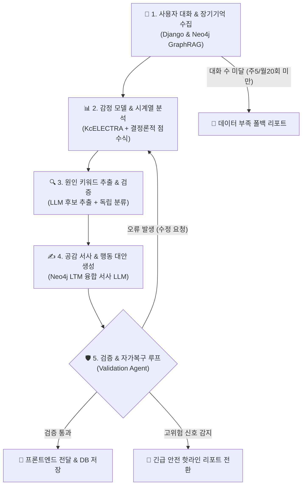

# 🌗 [발표 참고자료] 마음리포트 시스템 흐름 및 감정 분석 프로세스

본 문서는 **"빈틈사이"** 서비스의 **마음리포트(Mind Report)** 기능에 대한 발표자료(PPT, 슬라이드 deck 등) 제작 시 참고할 수 있도록 **시스템 흐름과 감정 모델의 입출력 과정**을 쉽게 정리한 보고서입니다.

---

## 🏗️ 1. 한눈에 보는 전체 시스템 구조 (Overview)

마음리포트는 단순히 LLM에게 "일주일 대화 요약해줘"라고 요청하는 방식이 아닙니다.  
**파인튜닝된 딥러닝 감정 모델(KcELECTRA)**, **그래프 DB(Neo4j) 기반 장기기억**, 그리고 **LangGraph Multi-Agent**가 오케스트레이션(합주)되어, 정확한 수치화와 깊은 공감 서사, 엄격한 안전성 검증을 거쳐 생성됩니다.



---

## 🔄 2. 각 단계별 상세 인아웃풋(In/Out) 및 처리 과정

---

### 📍 [1단계] 데이터 수집 및 조건 검증 (Data Collection & Criteria Agent)

* **역할**: 대화 데이터를 모으고, 리포트를 생성할 최소한의 대화 분량이 되는지 검사합니다.

| 구분 | 내용 |
| :--- | :--- |
| **Input (입력)** | • 사용자 ID 및 분석 요청 기간 (주간 / 월간)<br>• RDB 대화 로그 텍스트<br>• Neo4j Graph DB 장기기억(LTM) 데이터 (유저-사건-인물-관심사 관계망) |
| **Process (과정)** | 1. **대화 수 검사**: 해당 기간 내 사용자 발화가 **주간 최소 5개**, **월간 최소 20개** 이상인지 검사합니다. (미달 시 '폴백 리포트'로 즉시 분기)<br>2. **GraphRAG 추출**: Neo4j 그래프 DB에서 `(User)-[:HAS_EVENT]->(Event)-[:INVOLVES]->(Person)` 쿼리를 실행하여 최근 사용자의 주요 사건과 인간관계 맥락을 확보합니다. |
| **Output (출력)** | • 기간 내 대화 텍스트 뭉치 (AI 대화 제외, 순수 유저 발화)<br>• Neo4j 장기기억 Context |

---

### 📍 [2단계] 감정 모델 점수화 및 시계열 분석 (Emotion Analysis & Scoring)

* **역할**: 딥러닝 모델로 날짜별 감정을 분류하고, 이를 점수화하여 주간/월간 감정 추세를 판정합니다.

```text
[사용자 발화 텍스트] ──(KcELECTRA 딥러닝)──> [4개 감정 확률(%)] ──(서버 공식)──> [0~100점 감정 점수] ──(통계 룰)──> [감정 흐름 추세]
```

| 구분 | 내용 |
| :--- | :--- |
| **Input (입력)** | • 일별 사용자 발화 텍스트 뭉치 |
| **Process (과정)** | **① KcELECTRA 딥러닝 모델 분류**<br>• 한국어 구어체에 최적화된 파인튜닝 KcELECTRA 모델이 각 발화를 **4가지 감정 (기쁨, 슬픔, 분노, 일반)** 확률(%)로 분류합니다.<br><br>**② 일별 감정 점수 계산 (서버 결정론적 연산)**<br>• 하루 동안의 발화별 확률을 평균 낸 후, 지정된 점수 환산식을 적용하여 0~100점의 내부 감정 점수를 산출합니다.<br>$$\text{Emotion Score} = 100 \times P(\text{기쁨}) + 50 \times P(\text{일반}) + 25 \times P(\text{슬픔}) + 0 \times P(\text{분노})$$<br>• 점수에 따라 감정 상태를 3단계로 표준화합니다: **Positive (55점 초과)**, **Neutral (45~55점)**, **Negative (45점 미만)**.<br><br>**③ 통계 기반 시계열 감정 흐름 판정 (`emotion_flow.py`)**<br>• 3일 이상의 점수 데이터가 있을 때 감정의 기하학적 변화 추세를 자동 분류합니다:<br>  - **상승 (`score_upward`)**: 후반부 점수가 전반부 대비 유의미하게 상승 (Tone: 초록)<br>  - **하락 (`score_downward`)**: 후반부 점수가 전반부 대비 유의미하게 하락 (Tone: 빨강)<br>  - **변동 (`score_volatile`)**: 점수 표준편차가 16 이상이며 잦은 반전 발생 (Tone: 회색)<br>  - **유지 (`score_maintenance`)**: 뚜렷한 추세 없이 긍정/중립/부정 상태 유지 |
| **Output (출력)** | • 일별 대표 감정 라벨 및 0~100 감정 점수<br>• 감정 흐름 패턴 분류 결과 (`상승` / `하락` / `변동` / `유지`) |

---

### 📍 [3단계] 원인 분석 및 스트레스/이완 키워드 추출 (Cause Keyword Agent)

* **역할**: 대화 속에서 사용자의 감정을 변화시킨 실제 원인을 찾아 스트레스 원인과 이완(해소) 원인으로 분류합니다.

| 구분 | 내용 |
| :--- | :--- |
| **Input (입력)** | • 원본 대화 텍스트<br>• 2단계에서 도출된 감정 흐름 추세 |
| **Process (과정)** | 1. **후보 추출 LLM**: 대화 맥락 및 명시적 인과관계 표현을 분석하여 감정 유발 원인이 되는 **명사구 키워드** 후보를 추출합니다.<br>2. **독립 검증 LLM**: 추출된 키워드가 대화 원본에 비추어 타당한지 2차 독립 검증을 수행하고, 감정 미친 영향에 따라 분류합니다:<br>   - `stress`: 스트레스/부담을 유발한 원인<br>   - `relief`: 스트레스를 해소하거나 마음을 편안하게 해준 이완 원인<br>   - `unresolved`: 인과관계가 불명확한 키워드 (화면 미노출 처리)<br>3. **시각적 UI 정책 적용**: 감정 흐름이 상승세일 경우 이완 키워드를 먼저 강조 배치하는 등 UI 시각화 가중치를 조율합니다. |
| **Output (출력)** | • 검증된 스트레스 원인 키워드 리스트<br>• 검증된 이완(긍정) 원인 키워드 리스트 |

---

### 📍 [4단계] 장기기억 융합 서사 및 행동 추천 생성 (Narrative & Action Agent)

* **역할**: Neo4j의 장기기억과 이번 주/달의 감정 분석 결과를 종합하여, 한 폭의 다정한 이야기(서사)와 실천 가능한 웰니스 대안(Micro Action)을 생성합니다.

| 구분 | 내용 |
| :--- | :--- |
| **Input (입력)** | • 감정 점수 및 추세<br>• 스트레스/이완 키워드<br>• Neo4j 장기기억(LTM) 맥락 (과거 주요 사건, 연관 인물 등) |
| **Process (과정)** | 1. **제목 & 요약 작성**: 리포트의 핵심을 담은 짧은 헤드라인과 한 문장 요약 작성<br>2. **공감 분석 본문 생성 (3개 문단)**:<br>   - 실시간 감정과 장기 감정 상태의 갭이 있을 경우 다면적 복합 감정(예: *겉으로는 의연하지만 은근한 부담감을 느끼는 상태*)으로 다정하게 분석합니다.<br>3. **맞춤형 행동 대안(Micro Action) 제안**:<br>   - 지나간 사건인 경우 ➔ **'자기 위로(Self-Compassion)' 및 '회고'** 활동 제안<br>   - 다가올 사건인 경우 ➔ **'부담 완화 환기(Soft Distraction)'** 활동 제안 |
| **Output (출력)** | • 리포트 제목 및 한 문장 요약<br>• 3개 문단의 공감 분석 서사 문단<br>• 구체적인 이유와 실행 방법이 포함된 실천 대안 리스트 |

---

### 📍 [5단계] 다중 에이전트 검증 및 안전망 (Validation & Safety Agent)

* **역할**: 최종 결과물이 안전 가이드라인을 준수하는지, 오진/환각/직접인용이 없는지 사후 검사하고 피드백을 줍니다.

| 구분 | 내용 |
| :--- | :--- |
| **Input (입력)** | • 1~4단계에서 완성된 전체 마음리포트 JSON 객체<br>• 원본 대화 및 데이터 |
| **Process (과정)** | 1. **안전성 검사 (Safety Trigger)**: 대화 원문 또는 생성문에서 자해/극단적 선택 등 고위험 시그널이 발견되면, 전체 리포트를 즉시 **긴급 전문 상담 전화(109) 안내 리포트(`Safety Response`)**로 대체 발행합니다.<br>2. **정합성 및 품질 검사**:<br>   - 의학적 용어 사용 금지 (예: 우울증 진단 등 오진 유발 방지)<br>   - 대화 내용의 직접 인용 따옴표(`" "`) 사용 차단 (개인정보 보호 및 자연스러운 각색)<br>   - 내부 점수(0~100점)나 에이전트 용어 노출 여부 검사<br>3. **자가 복구 회귀 루프 (Revision Loop)**: 품질 미달 시 해당 에이전트로 수정 지침서(`revision_instructions`)를 동봉하여 재작성을 명령합니다. (설정된 최대 횟수까지 반복) |
| **Output (출력)** | • 최종 승인된 안전한 프론트엔드 Payload ➔ PostgreSQL DB 저장 및 사용자 화면 표시 |

---

## 🎯 3. 발표자료(PPT) 작성을 위한 핵심 요약 (Key Takeaways)

발표 슬라이드 제작 시 아래 **3가지 차별화 포인트**를 강조하면 설득력을 극대화할 수 있습니다!

1. **🤖 AI 역할의 철저한 분담 (딥러닝 + LLM 하이브리드)**
   - **감정 수치화**: 딥러닝 모델(KcELECTRA)과 서버의 수학 공식으로 환각(Hallucination) 없이 일관되고 객관적인 0~100점 산출
   - **맥락 분석 & 서사**: LLM을 활용하여 다정한 어조와 공감 문장, 구체적 실천 대안 생성

2. **🧠 Neo4j GraphRAG (장기 기억 LTM) 연동**
   - 단발성 최근 대화만 보는 것이 아니라, 그래프 DB에 저장된 사용자의 **장기 사건·인간관계 네트워크**를 함께 분석하여 "진짜 나를 알아주는" 깊은 맥락의 리포트 완성

3. **🛡️ LangGraph 멀티 에이전트의 안정성 제어 (Validation Loop)**
   - 생성된 리포트를 그대로 노출하지 않고 **검증 에이전트**가 실시간 감시
   - 의학적 오진 방지, 개인정보/직접인용 차단, 자해 위험 감지 시 긴급 핫라인 자동 전환 등 강력한 안전장치 구축
