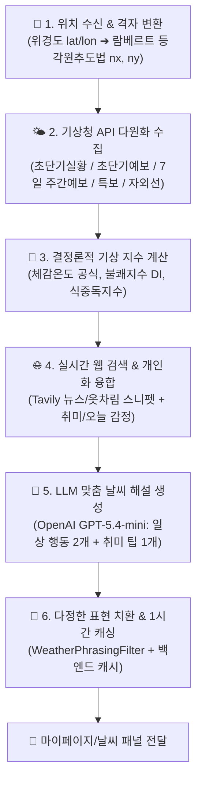

# 📊 [발표 참고자료] 날씨 분석 시스템 흐름 및 기상 지수 산출 프로세스

본 문서는 **"빈틈사이"** 서비스의 **날씨 분석(Weather Analysis)** 시스템 흐름과 기상 지수 산출 프로세스를 발표자료(PPT, 발표 대본 등) 작성 시 바로 활용할 수 있도록 정리한 보고서입니다.

---

## 🏗️ 1. 한눈에 보는 전체 시스템 구조 (Overview)

날씨 분석 시스템은 단순히 날씨 앱의 기온/습도 숫자만 보여주는 것이 아닙니다.  
**기상청 공공 API 허브 다원화 수집**, **위경도-격자 투영 좌표 변환**, **서버 자체 물리 공식 기반 결정론적 기상 지수(체감온도, 불쾌지수, 식중독지수) 산출**, **Tavily 실시간 웹 검색(외출 옷차림/뉴스)**, 그리고 **개인화 프로필(취미, 오늘 감정)**을 결합하여 친근하고 다정한 맞춤형 날씨 해설과 행동 팁을 제공합니다.



---

## 🔄 2. 각 단계별 상세 인아웃풋(In/Out) 및 처리 과정

---

### 📍 [1단계] 사용자 위치 인식 및 예보 격자 변환 (`region_service.py`)

* **역할**: GPS 위경도 좌표를 행정구역명으로 변환하고 기상청 전용 2차원 격자 좌표로 바꿉니다.

| 구분 | 내용 |
| :--- | :--- |
| **Input (입력)** | • GPS 위경도 좌표 (`lat`, `lon`) 또는 대표 지역명 (`region`) |
| **Process (과정)** | 1. **행정구역 매핑 (`resolve_location`)**: 위경도를 기반으로 대한민국 행정구역(시/도/구)을 식별합니다.<br>2. **기상청 격자 변환 (`latlon_to_grid`)**: 기상청 동네예보 표준인 **람베르트 등각원추도법(Lambert Conformal Conic)** 수학 공식을 적용하여 위경도를 2차원 예보 격자점 `(nx, ny)`으로 정밀 변환합니다. |
| **Output (출력)** | • 행정구역 위치 정보 및 기상청 격자 좌표 `(nx, ny)` |

---

### 📍 [2단계] 다원화된 기상 데이터 통합 수집 (`services.py`, `warning_service.py`)

* **역할**: 기상청 API 허브 및 공공데이터포털로부터 현재 관측치, 예보, 특보, 자외선지수를 실시간 수집합니다.

| 구분 | 내용 |
| :--- | :--- |
| **Input (입력)** | • 격자 좌표 `(nx, ny)` 및 행정구역 코드 |
| **Process (과정)** | 1. **초단기 실황 (`getUltraSrtNcst`)**: 매시 10분마다 갱신되는 기온(T1H), 습도(REH), 1시간 강수량(RN1), 풍속(WSD) 수집.<br>2. **초단기 예보 (`getUltraSrtFcst`)**: 직후 6시간 동안의 하늘 상태(SKY: 맑음, 구름많음, 흐림) 및 강수 형태(PTY) 수집.<br>3. **주간 예보 병합 (`merge_weekly_forecasts`)**: 단기예보(3일 내 상세 최고/최저 기온, 강수확률)와 중기예보(4~10일 광역 기온/육상 예보)를 날짜별로 정밀 병합하여 연속 7일 예보 형성.<br>4. **실시간 기상 특보 (`warning_service.py`)**: 사용자 지역의 강풍, 호우, 대설, 건조 등 발효 중인 기상 경보/주의보 필터링.<br>5. **공공 자외선지수 (`life_index_service.py`)**: 공공데이터포털 생활기상지수 API 연동. |
| **Output (출력)** | • 현재 관측 데이터, 7일 주간 예보, 발효 특보 목록, 자외선지수 |

---

### 📍 [3단계] 서버 결정론적 기상 지수 산출 (`weather_index_service.py`)

* **역할**: LLM의 수치 할루시네이션(환각)을 원천 방지하기 위해 기상 수치를 서버 내 공식으로 직접 연산합니다.

```text
[기온 / 습도 / 풍속] ──(기상청 공인 물리 산식 연산)──> [체감온도 / 불쾌지수 / 식중독지수 산출]
```

| 구분 | 내용 |
| :--- | :--- |
| **Input (입력)** | • 기온, 습도, 풍속 등 계측 수치 |
| **Process (과정)** | 1. **체감온도 (Wind Chill / Heat Index)**:<br>   - 겨울철: 기온($T$)과 풍속($V$) 기반 산식 적용 ➔ $13.12 + 0.6215T - 11.37V^{0.16} + 0.3965TV^{0.16}$<br>   - 여름철: 기온과 상대습도를 고려한 열지수(Heat Index) 방식을 적용하여 환산.<br>2. **불쾌지수 (Discomfort Index, DI)**:<br>   - 기상청 공인 산식 적용 ➔ $DI = 1.8T - 0.55(1 - RH)(1.8T - 26) + 32$<br>   - 4단계(낮음, 보통, 높음, 매우높음) 상태로 자동 지정.<br>3. **식중독 지수 (Food Poisoning Index)**:<br>   - 기상청·식약처 미생물 증식 온도 예측 모델식을 서버 내에서 자체 계산. |
| **Output (출력)** | • 체감온도(℃), 불쾌지수 단계, 식중독지수 등 확정적 기상 지수 |

---

### 📍 [4단계] 실시간 뉴스 검색(Tavily) 및 개인화 결합 (`agent.py`)

* **역할**: 외부 웹 검색으로 최신 기상 소스를 보완하고, 사용자의 취미와 당일 기분을 융합합니다.

| 구분 | 내용 |
| :--- | :--- |
| **Input (입력)** | • 사용자 행정구역 위치<br>• DB 내 유저 취미 목록 및 당일 대화 기반 지배적 감정 데이터 |
| **Process (과정)** | 1. **웹 검색 스니펫 획득 (Tavily Web Search)**: `"[현재 날짜] [지역명] 이번 주 날씨 변화 외출 옷차림"` 키워드로 실시간 뉴스 및 기상 민간 트렌드 검색 스니펫 수집.<br>2. **개인화 데이터 결합**: 사용자의 활동 취미(예: 자전거, 조깅, 출사)와 당일의 기쁨/슬픔 감정 상태를 날씨 데이터와 함께 LLM의 맥락(Context)으로 주입. |
| **Output (출력)** | • 기상 뉴스 근거 스니펫 + 개인화 프로필 맥락 |

---

### 📍 [5단계] LLM 분석 생성 및 톤앤매너 후처리 (`agent.py`, `models.py`)

* **역할**: OpenAI GPT로 다정한 분석글을 작성하고, 기계적인 문구를 부드러운 일상 언어로 정제합니다.

| 구분 | 내용 |
| :--- | :--- |
| **Input (입력)** | • 기상 데이터 + 결정론적 지수 + 웹 검색 스니펫 + 개인 프로필 |
| **Process (과정)** | 1. **OpenAI GPT-5.4-mini 맞춤 분석 작성**: 맑음/흐림 등 기상 조건과 체감 지수를 설명하고, **일상 행동 요령 2개 + 개인 취미 특화 추천 팁 1개**를 제안하는 JSON 반환.<br>2. **어휘 및 문체 후처리 (`_soften_phrasing`)**: `WeatherPhrasingFilter` 테이블 및 정적 필터링을 통해 기계적인 차가운 문구(예: "진단", "주의 요망", "환자")를 부드럽고 다정한 한국어 어휘로 자동 치환.<br>3. **1시간 메모리 캐싱 (`insight_cache_service.py`)**: 동일 위치/유저의 과도한 API 호출 및 비용 지출을 막기 위해 1시간 동안 분석 결과를 캐싱. |
| **Output (출력)** | • 최종 날씨 해설 및 맞춤 행동 팁 JSON payload |

---

## 🎯 3. 발표자료(PPT) 작성을 위한 핵심 요약 (Key Takeaways)

발표 슬라이드 제작 시 아래 **3가지 차별화 포인트**를 강조하면 설득력을 극대화할 수 있습니다!

1. **🧮 수치 할루시네이션(환각) 없는 서버 자체 결정론적 지수 연산**
   - 체감온도, 불쾌지수, 식중독지수 등 예민한 생활 지수는 LLM에 맡기지 않고 **기상청 공인 물리 산식을 서버에서 직접 계산**하여 100% 정밀한 수치 확보.

2. **🌐 기상청 공공 API + Tavily 실시간 웹 검색(옷차림/뉴스)의 하이브리드**
   - 숫자 중심의 기상청 예보 데이터에 **Tavily 웹 에이전트의 실시간 옷차림/기상 트렌드 스니펫**을 결합하여 생생한 실생활 정보 제공.

3. **🎨 개인화 프로필(취미, 오늘 감정) + 다정한 어휘 정제 필터**
   - 날씨에 따른 단순 조언이 아닌 **"사용자의 취미" 맞춤 팁** 제안 및 기계적 경고문 표현을 따뜻하게 바꿔주는 **문체 정제 필터(`WeatherPhrasingFilter`)** 구현.
