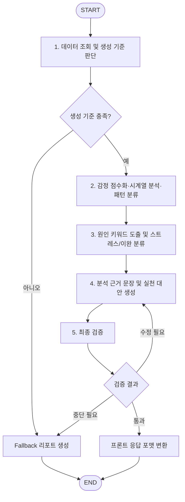

# 마음리포트 LangGraph 멀티에이전트 설계 초안

## 1. 목적

마음리포트의 기존 서비스 파일을 기반으로 LangGraph 멀티에이전트 흐름을 정의한다.

현재 구현은 `MindReportFlowService`가 데이터 수집, 기준 판단, 감정 점수화, 감정 흐름 분석, 키워드 분류, 문장 생성까지 순차 실행하는 구조다. 이를 LangGraph로 전환할 때 기존 서비스 파일을 버리지 않고, 각 서비스를 에이전트 노드의 내부 도구로 감싸는 방식으로 확장한다.

## 2. 설계 기준

- 현재 존재하는 마음리포트 서비스 파일을 우선 사용한다.
- 아직 없는 검증 에이전트, LangGraph 상태/노드 파일은 추후 추가 대상으로 둔다.
- 마음리포트는 감정 기반 결과물이므로 최종 검증 단계를 체인 관리 에이전트에 포함한다.
- 데이터가 부족한 경우 정식 분석 체인으로 진입하지 않고 fallback 리포트 흐름으로 분기한다.
- Vector DB, 검색 API, 심리이론 RAG는 현재 필수 흐름이 아니라 추후 확장 흐름으로 둔다.

## 3. 에이전트 구성

| 번호 | 에이전트 | 핵심 책임 | 현재 대응 파일 |
| --- | --- | --- | --- |
| 1 | 데이터 조회 및 생성 기준 판단 에이전트 | 기간별 사용자 대화 조회, 주간/월간 리포트 생성 기준 충족 여부 판단, 기준 미달 fallback 분기 준비 | `collection.py`, `criteria_service.py`, `fallback_service.py` |
| 2 | 감정 점수화·시계열 분석·감정 패턴 분류 에이전트 | 일자별 감정 점수화, 감정 상태 산출, 점수 흐름 분석, 상승/유지/변동/하락 패턴 분류 | `scoring.py`, `emotion_flow.py` |
| 3 | 원인 키워드 도출 및 원인 키워드 분류 에이전트 | 메시지와 감정 점수 근거에서 후보 키워드 추출, 스트레스 원인과 이완 원인 분류, 라벨 표시 정책 결정 | `keyword_candidates.py`, `cause_keywords.py` |
| 4 | 분석 근거 문장 생성 및 실천 대안 생성 에이전트 | 감정 흐름별 실천 대안 후보 구성, 사용자가 읽을 분석 문장과 행동 추천 문장 생성 | `alternatives.py`, `narrative.py` |
| 5 | 체인 관리·검증 에이전트 | 전체 LangGraph 실행 순서 관리, 조건 분기, 재시도/중단 판단, 최종 리포트 검증, 프론트 응답 포맷 변환 | `flow.py`, 추후 `validator.py`, 추후 `graph_flow.py` |

## 4. 현재 서비스 파일 매핑

```text
MindReportGenerateAPIView
→ ReportCriteriaService
→ FallbackReportService 또는 MindReportFlowService
→ MindReportDataCollector
→ MindReportScoringService
→ analyze_emotion_flow
→ build_alternative_plan
→ MindReportKeywordExtractor
→ MindReportCauseClassifier
→ apply_label_display_policy
→ MindReportNarrativeGenerator
→ format_for_frontend
→ MindReport 저장
```

LangGraph 전환 후에는 `MindReportFlowService.run()`의 순차 호출을 그래프 노드로 옮기고, `flow.py`는 기존 API 호환 wrapper 또는 supervisor 역할로 남긴다.

## 5. LangGraph 상태 초안

추후 `graph_state.py`에 정의할 상태값 초안이다.

| 상태 키 | 설명 |
| --- | --- |
| `user` | 리포트 대상 사용자 |
| `period_type` | `week` 또는 `month` |
| `target_date` | 주간 리포트 기준 날짜 |
| `year`, `month` | 월간 리포트 기준 연월 |
| `collection_result` | 수집된 메시지와 생성 기준 판단 결과 |
| `scoring_result` | 일자별 감정 점수화 결과 |
| `emotion_flow` | 시계열 감정 흐름 분석 결과 |
| `alternative_plan` | 감정 흐름별 실천 대안 후보 |
| `keyword_result` | 원인 키워드 후보 추출 결과 |
| `cause_result` | 스트레스/이완 원인 분류 결과 |
| `label_result` | 라벨 표시 정책 결과 |
| `narrative_result` | 분석 문장 및 실천 대안 문장 생성 결과 |
| `validation_result` | 최종 검증 결과 |
| `report_payload` | 프론트 응답용 리포트 데이터 |
| `error` | 중단 또는 fallback 사유 |
| `retry_count` | 문장 생성/검증 재시도 횟수 |

## 6. LangGraph 노드 초안

| 노드 | 담당 에이전트 | 처리 내용 |
| --- | --- | --- |
| `collect_and_check_criteria` | 1번 | 사용자 대화 조회 및 리포트 생성 기준 판단 |
| `fallback_report` | 1번, 5번 | 데이터 부족 시 fallback 리포트 생성 |
| `score_and_analyze_emotion` | 2번 | 감정 점수화 및 감정 흐름/패턴 분석 |
| `extract_and_classify_causes` | 3번 | 키워드 후보 추출, 스트레스/이완 원인 분류, 라벨 정책 적용 |
| `generate_narrative_and_actions` | 4번 | 실천 대안 후보와 분석 문장 생성 |
| `validate_report` | 5번 | 근거 일관성, 안전성, 출력 형식 검증 |
| `format_report` | 5번 | `ReportView.vue`가 사용하는 응답 구조로 변환 |

## 7. 그래프 흐름



## 8. 조건 분기 정책

### 데이터 기준 판단

| 조건 | 이동 노드 |
| --- | --- |
| 주간 사용자 메시지 5개 이상 | `score_and_analyze_emotion` |
| 월간 사용자 메시지 20개 이상 | `score_and_analyze_emotion` |
| 기준 미달 | `fallback_report` |

### 검증 결과 판단

| 결과 | 의미 | 이동 노드 |
| --- | --- | --- |
| `passed` | 근거, 안전성, 출력 형식이 모두 통과 | `format_report` |
| `needs_revision` | 문장 표현 또는 추천 내용 수정 필요 | `generate_narrative_and_actions` |
| `blocked` | 리포트 생성 지속이 부적절하거나 근거가 부족함 | `fallback_report` |

## 9. 검증 에이전트 역할

추후 `validator.py`에서 구현한다.

검증 항목은 다음과 같다.

| 검증 항목 | 확인 내용 |
| --- | --- |
| 근거 메시지 검증 | 분석 문장과 키워드가 실제 `source_messages` 및 `evidence_message_ids`에 기반하는지 확인 |
| 감정 흐름 일관성 검증 | 감정 점수, 흐름 유형, 추천 방향이 서로 충돌하지 않는지 확인 |
| 원인 키워드 검증 | 스트레스/이완 분류가 감정 점수 구간과 지나치게 어긋나지 않는지 확인 |
| 안전성 검증 | 의료 진단, 위험도 단정, 성격 낙인, 과도한 심리 판단 표현 차단 |
| 출력 형식 검증 | 프론트가 요구하는 `title`, `summary`, `stressCauses`, `reliefCauses`, `emotions`, `analysis`, `recommendations` 필드 확인 |

## 10. 구현 단계

1. `graph_state.py` 생성
   - LangGraph에서 공유할 상태 타입 정의

2. `graph_nodes.py` 생성
   - 기존 서비스 클래스를 호출하는 노드 함수 작성

3. `validator.py` 생성
   - 최종 검증 규칙과 검증 결과 타입 정의

4. `graph_flow.py` 생성
   - LangGraph `StateGraph` 구성
   - 기준 미달, 검증 실패, fallback 조건 분기 연결

5. `flow.py` 점진 전환
   - 기존 `MindReportFlowService.run()` 인터페이스는 유지
   - 내부 실행만 `graph_flow` 호출 방식으로 전환

6. 테스트 추가
   - 기준 미달 fallback
   - 기준 충족 정식 리포트
   - 검증 통과
   - 검증 실패 후 재생성
   - 검증 차단 후 fallback

## 11. 추후 확장

| 확장 요소 | 위치 | 설명 |
| --- | --- | --- |
| 심리이론 Vector DB | 4번 또는 5번 에이전트 | 리포트 문장 생성 시 일반 심리 이론 근거를 보강하되, 사용자 상태를 진단하지 않도록 제한 |
| 검색 API / 활동 정보 | fallback 흐름 우선 | 데이터 부족 시 취미/관심사 기반 가벼운 활동 추천 보강 |
| 추천 수정 루프 | 5번 에이전트 | 검증 실패 시 어떤 노드로 되돌릴지 세분화 |
| 관측 로그 | 5번 에이전트 | 각 노드 입력/출력, 분기 사유, 검증 사유를 운영 로그로 저장 |

## 12. 요약

현재 마음리포트 서비스 구조는 이미 LangGraph 멀티에이전트로 전환하기 좋은 형태다.

핵심은 기존 서비스를 새로 만들기보다, 다음처럼 감싸는 것이다.

```text
기존 서비스 파일
→ LangGraph 노드
→ 5개 에이전트 책임 단위
→ 체인 관리·검증 에이전트
→ 안전한 마음리포트 출력
```

따라서 1차 구현에서는 `flow.py`를 완전히 갈아엎지 않고, `graph_state.py`, `graph_nodes.py`, `graph_flow.py`, `validator.py`를 추가한 뒤 `MindReportFlowService.run()`이 새 그래프를 호출하도록 점진 전환하는 방식을 권장한다.
