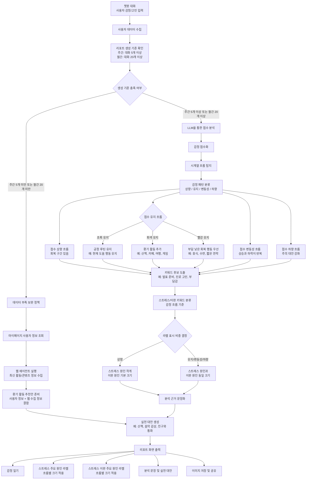
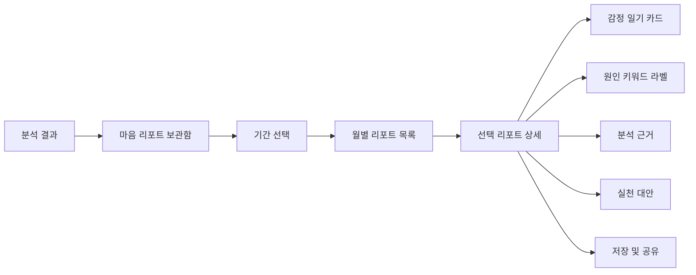

# 마음 리포트 프로세스 흐름도 초안

## 1. 목적
마음 리포트는 사용자 대화와 마이페이지 정보를 바탕으로 감정 흐름을 분석하고, 스트레스 원인과 이완 요인을 찾아 실천 대안을 제시하는 기능입니다.

핵심 흐름은 다음과 같습니다.

```text
데이터 수집 → 리포트 생성 기준 확인(주간 5개 이상, 월간 20개 이상) → ML/DL 분석 또는 데이터 부족 보완 → LLM 해석/생성 → 리포트 화면 출력
```

## 2. 전체 프로세스



## 3. 단계별 흐름

**[공통 진입]**
| 단계 | 처리 내용 | 사용 기술/모델 | 출력 |
| :--- | :--- | :--- | :--- |
| 1. 챗봇 대화 | 사용자가 챗봇과 감정, 고민, 일상 내용을 대화 | Chat UI | 원천 대화 데이터 |
| 2. 데이터 수집 | 채팅 기록, 일기성 대화, 마이페이지 사용자 정보 수집 | PostgreSQL | 분석 대상 데이터 |
| 3. 생성 기준 확인 | 주간 5개 이상, 월간 20개 이상 여부 확인 | Rule 기반 | 정식 리포트 가능/부족 판단 |

**[정식 리포트 생성 흐름]**
| 단계 | 처리 내용 | 사용 기술/모델 | 출력 |
| :--- | :--- | :--- | :--- |
| 4. 감정 점수화 | 문장을 감정 점수와 감정 상태로 변환 | `KcELECTRA`, `KoELECTRA`, `KLUE-RoBERTa` | 날짜별 감정 점수 |
| 5. 시계열 분석 | 감정 점수의 상향, 유지, 변동성, 하향 흐름을 탐지 | `Rolling Z-score/IQR`, `Isolation Forest`, `EWMA/CUSUM` | 감정 흐름 유형 |
| 6. 감정 패턴 분류 | 상향/유지/변동성/하향으로 나누고, 유지 흐름은 초록/회색/빨강으로 세분화 | ML/DL + Rule | 패턴 분류 결과 |
| 7. 흐름별 대안 후보 구성 | 감정 흐름 유형에 맞는 대안 후보를 구성 | Rule 기반 | 대안 후보 |
| 8. 키워드 후보 도출 | 주요 날짜 주변 대화에서 원인 후보 추출 | `KR-SBERT`, `KoSimCSE-roberta`, `multilingual-MiniLM` | 원인 후보 키워드 |
| 9. 원인 키워드 분류 | 감정 흐름과 날짜 맥락을 기준으로 스트레스/이완 원인을 구분 | ML/DL + Rule | 원인 키워드 라벨 |
| 10. 라벨 표시 비중 결정 | 감정 흐름에 따라 스트레스/이완 원인 라벨 크기와 노출 비중 결정 | Rule 기반 | 라벨 크기 정책 |
| 11. 분석 근거 문장화 | 분석 결과를 사용자가 읽기 쉬운 문장으로 정리 | LLM | 분석 문장 |
| 12. 실천 대안 생성 | 원인, 근거, 사용자 정보, 감정 흐름을 바탕으로 행동 제안 | LLM | 개인화 추천 문장 |

**[데이터 부족 보완 흐름]**
| 단계 | 처리 내용 | 사용 기술/모델 | 출력 |
| :--- | :--- | :--- | :--- |
| B-1. 사용자 정보 조회 | 채팅이 부족하면 마이페이지 정보를 확인 | PostgreSQL | 사용자 보조 맥락 |
| B-2. 웹 활동 정보 수집 | 여행, 카페, 운동, 게임 등 최신 활동/콘텐츠 정보 수집 | Web Agent | 웹 수집 활동 정보 |
| B-3. 환기 활동 추천안 준비 | 마이페이지 정보와 웹 수집 정보를 결합하고 부담이 낮은 활동만 정리 | Rule 기반 | 환기 활동 추천안 |
| B-4. 실천 대안 생성 | 기록이 적다는 근거 수준을 표시하고 환기 활동 추천 제시 | LLM | 보완 추천 문장 |

**[화면 출력]**
| 단계 | 처리 내용 | 사용 기술/모델 | 출력 |
| :--- | :--- | :--- | :--- |
| 13. 리포트 출력 | 감정 일기, 원인 키워드 라벨, 분석 문장, 실천 대안 표시 | Vue 화면 | 마음 리포트 |
| 14. 저장/공유 | 리포트를 이미지로 저장하거나 공유 | Frontend 기능 | 이미지 저장/공유 |

## 4. 리포트 생성 기준

리포트는 대화 개수를 기준으로 생성합니다.

```text
주간 리포트: 대화 5개 이상
월간 리포트: 대화 20개 이상
```

| 리포트 종류 | 생성 기준 | 부족 시 처리 |
| :--- | :--- | :--- |
| 주간 리포트 | 대화 5개 이상 | 마이페이지 정보와 웹 에이전트 수집 정보 기반 환기 활동 추천 제공 |
| 월간 리포트 | 대화 20개 이상 | 데이터 부족 안내 및 웹 에이전트 수집 정보 기반 환기 활동 추천 제공 |

데이터가 부족한 경우 리포트에는 다음과 같은 근거 수준 문구를 표시합니다.

```text
기록이 아직 적어 가볍게 시도할 수 있는 활동을 함께 추천합니다.
```

## 5. ML/DL 파트

ML/DL은 분석과 후보 추출을 담당합니다. 사용자의 감정 상태를 수치화하고, 시계열 흐름에서 특이 패턴을 찾은 뒤, 원인 후보 키워드를 추출합니다.

| 기능 | 후보 3개 | 역할 | 권장안 |
| :--- | :--- | :--- | :--- |
| 감정 점수화 | `KcELECTRA`, `KoELECTRA`, `KLUE-RoBERTa` | 문장을 감정 점수로 변환 | `KcELECTRA` 우선 검토 |
| 시계열 흐름 탐지 | `Rolling Z-score/IQR`, `Isolation Forest`, `EWMA/CUSUM` | 상향, 유지, 변동성, 하향 흐름 탐지 | `Rolling Z-score/IQR` 우선 적용 |
| 키워드 후보 도출 | `KR-SBERT`, `KoSimCSE-roberta`, `multilingual-MiniLM` | 원인 후보 추출 | 세 모델 성능 비교 |
| 원인 키워드 분류 | `감정 점수 Rule`, `감정 흐름 Rule`, `키워드-날짜 매핑` | 스트레스 원인과 이완 원인 구분 | 흐름별 라벨 크기와 노출 비중 적용 |

## 6. LLM 파트

LLM은 해석과 사용자에게 보여줄 문장 생성을 담당합니다. 키워드를 직접 새로 뽑거나 스트레스/이완 원인을 분류하지 않고, ML/DL+Rule 분석 결과를 바탕으로 자연어 문장과 실천 대안을 생성합니다.

| 기능 | 후보 3개 | 역할 | 권장안 |
| :--- | :--- | :--- | :--- |
| 리포트 문장 생성 | `gpt-5.4-mini`, `gpt-5.4`, `gpt-5.5` | 분석 결과를 사용자 문장으로 변환 | `gpt-5.4-mini` 기본 |
| 실천 대안 생성 | `gpt-5.4-mini`, `gpt-5.4`, `gpt-5.5` | 원인과 사용자 정보 기반 행동 제안 | 품질 비교 후 선택 |

LLM은 키워드를 단독 추출하거나 원인을 단독 판단하지 않고, ML/DL 분석 결과와 근거 데이터를 입력으로 받아 문장화를 수행합니다.

## 6-1. Web Agent 파트

Web Agent는 데이터가 부족한 경우 환기 활동 추천안을 보강하는 역할을 담당합니다. 최신 여행지, 카페, 운동, 게임, 문화 활동 정보를 수집하되, 감정 원인 분석이나 심리 상태 판단은 하지 않습니다.

| 기능 | 후보 3개 | 역할 | 권장안 |
| :--- | :--- | :--- | :--- |
| 환기 활동 정보 수집 | `검색 API 기반 Agent`, `브라우저 탐색 Agent`, `RAG Agent` | 최신 활동/콘텐츠 정보 수집 | 2주 개발 기준으로 검색 API 기반 Agent 우선 적용 |
| 추천안 필터링 | `카테고리 Rule`, `관심사 매핑 Rule`, `안전 필터 Rule` | 사용자 정보와 부담 수준에 맞게 활동 정리 | Rule 기반으로 빠르게 구현 |

## 7. 감정 패턴 분류

| 패턴 | 기준 | 해석 | 대응 |
| :--- | :--- | :--- | :--- |
| 점수 상향 흐름 | 부정/중립에서 중립/긍정으로 완화됨 | 감정 회복 구간이 있는 상태 | 이완 원인 라벨 표시, 도움이 된 행동 유지 제안 |
| 점수 유지 - 초록 | 긍정 감정이 여러 날 유지됨 | 현재 회복 루틴이 잘 작동하는 상태 | 현재 루틴 유지, 무리한 변화보다 지속 제안 |
| 점수 유지 - 회색 | 중립 감정이 여러 날 유지됨 | 감정 변화가 적거나 표현이 줄어든 상태 가능성 | 산책, 카페, 여행, 게임 등 환기 활동 제안 |
| 점수 유지 - 빨강 | 부정 감정이 여러 날 유지됨 | 스트레스가 지속되는 상태 가능성 | 휴식, 수면 정리, 짧은 연락 등 부담 낮은 회복 행동 제안 |
| 감정 변동성 흐름 | 긍정/중립/부정이 짧은 기간 안에 반복됨 | 감정 기복이 크고 특정 요인에 민감하게 반응하는 상태 가능성 | 변동이 큰 날짜 주변 원인 분석, 루틴 안정화 대안 제안 |
| 점수 하향 흐름 | 긍정/중립에서 부정으로 낮아짐 | 최근 부담 요인이 커진 상태 가능성 | 하향 구간 주변 원인 분석, 원인 라벨은 같은 크기로 표시 |

## 8. 감정 흐름별 대안

감정 흐름에 따라 실천 대안의 방향을 다르게 제시합니다.

| 흐름 | 대안 방향 | 추천 예시 |
| :--- | :--- | :--- |
| 점수 상향 | 회복에 도움 된 행동을 유지 | 음악 감상, 친구와 통화, 웹툰 보기처럼 실제 회복 구간과 연결된 행동 유지 |
| 초록 유지 | 좋은 흐름을 무리 없이 지속 | 현재 루틴 유지, 가벼운 운동, 충분한 수면 |
| 회색 유지 | 감정 환기를 위한 작은 변화 추가 | 짧은 산책, 카페 방문, 가까운 곳 여행, 관심 있는 게임 |
| 빨강 유지 | 부담이 낮은 회복 행동부터 제안 | 수면 정리, 짧은 휴식, 편한 사람에게 연락, 일정 쪼개기 |
| 감정 변동성 | 감정 기복을 줄이고 하루 리듬을 안정화 | 수면/식사 시간 고정, 감정 기록, 짧은 산책, 자극이 큰 일정 줄이기 |
| 점수 하향 | 최근 부담 요인을 줄이는 방향 제안 | 일정 조정, 해야 할 일 나누기, 대화로 감정 꺼내기, 휴식 시간 확보 |

## 8-1. 원인 키워드 라벨 표시 정책

감정 흐름에 따라 스트레스 원인과 스트레스 이완 원인 라벨의 크기와 노출 비중을 다르게 적용합니다.

| 감정 흐름 | 스트레스 주요 원인 라벨 | 스트레스 이완 주요 원인 라벨 |
| :--- | :--- | :--- |
| 점수 상향 | 작게 표시 | 기본 크기로 표시 |
| 점수 유지 | 기본 크기로 표시 | 기본 크기로 표시 |
| 감정 변동성 | 기본 크기로 표시 | 기본 크기로 표시 |
| 점수 하향 | 기본 크기로 표시 | 기본 크기로 표시 |

마이페이지 관심사가 있는 경우 사용자 취향과 Web Agent 수집 정보를 함께 비교해 추천을 우선 노출합니다.

## 9. 화면 출력 흐름



## 10. 최종 산출물

| 산출물 | 설명 |
| :--- | :--- |
| 감정 일기 카드 | 날짜별 감정을 이모지와 테두리 색상으로 표시 |
| 스트레스 주요 원인 라벨 | 부정 감정과 연결된 원인 키워드 |
| 스트레스 이완 주요 원인 라벨 | 감정 회복과 연결된 원인 키워드 |
| 분석 근거 문장 | 원인 판단에 사용된 대화 흐름 요약 |
| 실천 대안 | 사용자가 바로 해볼 수 있는 행동 추천 |
| 저장/공유 기능 | 리포트를 이미지로 저장하거나 공유 |
