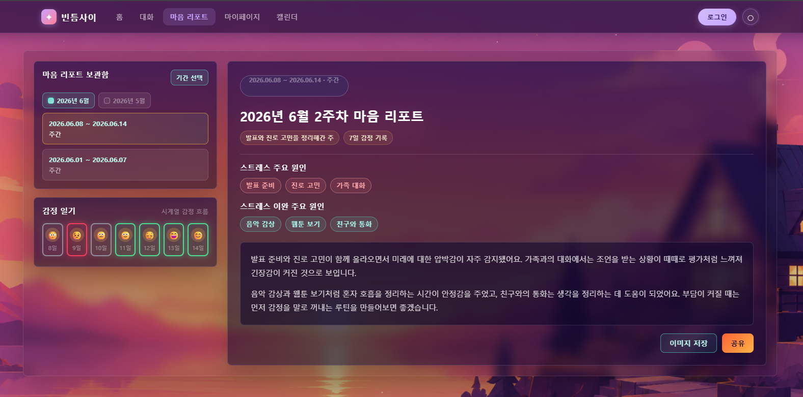

# 틈 마음 리포트 (Mind Report) 화면설계서

## 1. 콘셉트 및 디자인 원칙
* **디자인 콘셉트:** 바쁜 일상 속 작은 휴식과 자기 이해의 공간을 표현합니다.
* **핵심 원칙:** 숫자 평가보다 감정 흐름, 원인, 실천 대안에 집중합니다.
* **톤앤매너:** 차분하고 객관적인 문장으로 사용자의 다음 행동을 돕습니다.

## 2. 메뉴 트리 (Menu Tree)
* **메인 홈 (빈틈사이)**
    * 대화하기 (캐릭터 챗)
* **마이페이지 (개인 공간)**
    * **마음 리포트 보관함 (캘린더 형태)**
        * 월별 리포트 필터링
        * 일별 평균 감정 기록 (이모지 캘린더)
        * 주간/월간 리포트 상세 (이상치 중심 분석)
        * 내 마음 설명서 상세

## 3. 요구사항 매핑 및 스크린 리스트
| 대메뉴 | 중메뉴 | Screen ID | Page Title | 매핑된 요구사항 | 비고 |
| :--- | :--- | :--- | :--- | :--- | :--- |
| 마이페이지 | 리포트 보관함 | UI-MR-01 | 마음 리포트 캘린더 | REQ-MR-001 (일별 감정 기록 캘린더 조회), REQ-MR-009 (기간 필터링) | 기간 선택 버튼 및 월별 선택 라벨 제공 |
| 마음 리포트 | 리포트 분석 | UI-MR-02 | 주간/월간 마음 리포트 | REQ-MR-003, REQ-MR-004 | 감정 이상치 하이라이트 및 원인 키워드 라벨 제공 |
| 마음 리포트 | 리포트 상세 | UI-MR-03 | 분석 및 솔루션 | REQ-MR-005, REQ-MR-006 | 분석 근거 및 맞춤형 행동 대안 제시 |

## 4. 와이어프레임 & 디스크립션

**[요구사항 기반 UI 기능 설명]**
* **1. 감정 기록 조회 (REQ-MR-001):** 날짜별 대표 감정을 이모지로 보여줍니다.
* **2. 기간 필터링 (REQ-MR-009):** `기간 선택`으로 월별 리포트만 골라봅니다.
* **3. 감정 색상 표시 (REQ-MR-001, REQ-MR-003):** 감정 일기 카드 테두리로 부정/중립/긍정 상태를 구분합니다.
* **4. 감정 흐름 분석 (REQ-MR-003):** 감정 점수가 상향, 유지, 변동성, 하향 중 어떤 흐름인지 분석합니다.
* **5. 원인 키워드 제공 (REQ-MR-004):** 스트레스 원인과 이완 원인을 라벨 형태로 보여줍니다.
* **6. 분석 근거 제공 (REQ-MR-005):** 대화 기록에서 원인 판단의 근거가 되는 표현을 요약합니다.
* **7. 실천 대안 제시 (REQ-MR-006):** 원인 분석과 사용자 정보를 바탕으로 바로 해볼 수 있는 행동을 제안합니다.
* **8. 저장 및 공유 (REQ-MR-007):** 리포트를 이미지로 저장하거나 공유합니다.

**[상세 UI 변경 사항]**
* **기간 선택:** 버튼 클릭 시 월별 선택 라벨을 펼칩니다.
* **월별 선택 라벨:** 선택한 월의 리포트만 표시하고, 선택 월은 민트색으로 강조합니다.
* **리포트 기간 카드:** 현재 선택된 리포트는 주황색 테두리로 표시합니다.
* **감정 일기 카드:** 부정은 붉은색, 중립은 회색, 긍정은 초록색 테두리를 적용합니다. 같은 색이 이어지는 경우 유지 흐름으로 봅니다.

## 5. 분석 및 모델 후보
**[분석 흐름]**
* **1. 시계열 분석:** 날짜별 감정 점수를 정리하고 상향, 유지, 변동성, 하향 흐름을 찾습니다.
* **2. 원인 후보 추출:** 이상치 날짜 주변의 대화/일기에서 반복 표현과 의미가 가까운 문장을 묶습니다.
* **3. 키워드 분류:** 감정 점수와 날짜 맥락을 기준으로 스트레스 원인과 이완 원인을 나눕니다.
* **4. 실천 대안 생성:** 원인, 근거, 사용자 정보를 바탕으로 짧고 실행 가능한 대안을 제시합니다.
* **5. 데이터 부족 보완:** 채팅 정보가 적으면 마이페이지 정보와 웹 에이전트가 수집한 환기 활동 추천안을 함께 참고합니다.

**[ML/DL 파트: 분석 및 후보 추출]**
| 기능 | 후보 3개 | 역할 | 권장안 |
| :--- | :--- | :--- | :--- |
| 감정 점수화 | `KcELECTRA`, `KoELECTRA`, `KLUE-RoBERTa` | 대화/일기 문장을 감정 점수로 변환 | 기존 감정분류 학습 결과가 있으면 `KcELECTRA` 우선 사용 |
| 시계열 흐름 탐지 | `Rolling Z-score/IQR`, `Isolation Forest`, `EWMA/CUSUM` | 상향, 유지, 변동성, 하향 흐름 탐지 | 2주 개발 기준으로 `Rolling Z-score/IQR` 기본 적용 |
| 키워드 후보 도출 | `KR-SBERT`, `KoSimCSE-roberta`, `multilingual-MiniLM` | 이상치 날짜 주변 문장에서 원인 후보 추출 | 세 모델을 같은 데이터로 비교 후 점수화 |
| 원인 키워드 분류 | `감정 점수 Rule`, `감정 흐름 Rule`, `키워드-날짜 매핑` | 스트레스 원인과 이완 원인 구분 | 흐름별 라벨 크기와 노출 비중 적용 |

**[LLM 파트: 해석 및 문장 생성]**
| 기능 | 후보 3개 | 역할 | 권장안 |
| :--- | :--- | :--- | :--- |
| 리포트 문장 생성 | `gpt-5.4-mini`, `gpt-5.4`, `gpt-5.5` | 분석 근거를 사용자에게 읽기 쉬운 문장으로 변환 | `gpt-5.4-mini` 기본 사용 |
| 실천 대안 생성 | `gpt-5.4-mini`, `gpt-5.4`, `gpt-5.5` | 원인, 사용자 정보, 감정 흐름을 바탕으로 행동 제안 | 품질 점수에 따라 최종 모델 선택 |

**[Web Agent 파트: 환기 활동 추천안 수집]**
| 기능 | 후보 3개 | 역할 | 권장안 |
| :--- | :--- | :--- | :--- |
| 환기 활동 추천안 수집 | `검색 API 기반 Agent`, `브라우저 탐색 Agent`, `RAG Agent` | 여행, 카페, 운동, 게임 등 최신 활동 정보 수집 | 2주 개발 기준으로 검색 API 기반 Agent 우선 적용 |
| 추천안 정리 | `카테고리 Rule`, `관심사 매핑 Rule`, `안전 필터 Rule` | 수집 정보를 사용자 관심사와 부담 수준에 맞게 정리 | Rule 기반으로 과도한 추천과 의료적 표현 제외 |

**[파트 구분 기준]**
* **ML/DL:** 감정 점수화, 시계열 흐름 탐지, 키워드 후보 추출, 스트레스/이완 원인 분류에 사용합니다.
* **LLM:** 리포트 문장화와 개인화 실천 대안 생성에 사용합니다.
* **Web Agent:** 채팅 데이터가 부족할 때 최신 활동/콘텐츠 정보를 수집하는 데 사용합니다.
* LLM이 키워드를 단독 추출하거나 원인을 단독 판단하지 않도록 ML/DL 분석 결과와 근거 데이터를 함께 전달합니다.
* Web Agent는 환기 활동 추천안에 필요한 정보만 수집하며, 감정 원인 분석이나 심리 상태 판단은 수행하지 않습니다.

**[감정 패턴 분류]**
| 패턴 | 기준 | 해석 | 대응 |
| :--- | :--- | :--- | :--- |
| 점수 상향 흐름 | 부정/중립에서 중립/긍정으로 완화됨 | 감정 회복 구간이 있는 상태 | 이완 원인 라벨 표시, 도움이 된 행동 유지 제안 |
| 점수 유지 - 초록 | 긍정 감정이 여러 날 유지됨 | 현재 회복 루틴이 잘 작동하는 상태 | 현재 루틴 유지, 무리한 변화보다 지속 제안 |
| 점수 유지 - 회색 | 중립 감정이 여러 날 유지됨 | 감정 변화가 적거나 표현이 줄어든 상태 가능성 | 산책, 카페, 여행, 게임 등 환기 활동 제안 |
| 점수 유지 - 빨강 | 부정 감정이 여러 날 유지됨 | 스트레스가 지속되는 상태 가능성 | 휴식, 수면 정리, 짧은 연락 등 부담 낮은 회복 행동 제안 |
| 감정 변동성 흐름 | 긍정/중립/부정이 짧은 기간 안에 반복됨 | 감정 기복이 크고 특정 요인에 민감하게 반응하는 상태 가능성 | 변동이 큰 날짜 주변 원인 분석, 루틴 안정화 대안 제안 |
| 점수 하향 흐름 | 긍정/중립에서 부정으로 낮아짐 | 최근 부담 요인이 커진 상태 가능성 | 하향 구간 주변 원인 분석, 원인 라벨은 같은 크기로 표시 |

**[스트레스 이완 원인 표시 조건]**
* 점수 상향 흐름이면 스트레스 원인 라벨은 작게, 스트레스 이완 원인 라벨은 기본 크기로 표시합니다.
* 점수 유지 흐름, 감정 변동성 흐름, 점수 하향 흐름이면 스트레스 원인과 스트레스 이완 원인 라벨을 같은 크기로 표시합니다.

**[키워드 도출 모델 후보 3개]**
| 후보 | 용도 | 장점 | 비교 기준 |
| :--- | :--- | :--- | :--- |
| `snunlp/KR-SBERT-V40K-klueNLI-augSTS` | 한국어 문장 임베딩 | 한국어 의미 유사도 비교에 적합 | 키워드 정확도, 군집 품질 |
| `BM-K/KoSimCSE-roberta` | 한국어 문장 임베딩 | 한국어 STS 성능 비교에 유리 | 키워드 정확도, 처리 속도 |
| `sentence-transformers/paraphrase-multilingual-MiniLM-L12-v2` | 다국어 문장 임베딩 | 가볍고 적용이 쉬움 | 처리 속도, 비용, 기본 성능 |

**[실천 대안 생성 LLM 후보 3개]**
| 후보 | 용도 | 장점 | 비교 기준 |
| :--- | :--- | :--- | :--- |
| `gpt-5.4-mini` | 기본 생성 모델 | 비용과 품질의 균형이 좋음 | 대안 적절성, 응답 속도 |
| `gpt-5.4` | 품질 비교 모델 | 더 안정적인 문장 생성 기대 | 대안 적절성, 근거 반영률 |
| `gpt-5.5` | 상한선 비교 모델 | 가장 높은 품질 기준점 | 최고 품질 대비 비용 |

**[2주 개발 기준 권장안]**
* 키워드 도출은 임베딩 모델 3개를 같은 데이터로 비교합니다.
* 실천 대안은 `gpt-5.4-mini`를 기본으로 두고, `gpt-5.4`, `gpt-5.5`를 품질 비교군으로 사용합니다.
* 최종 선택은 `정확도`, `응답 속도`, `비용`, `설명 가능성` 점수로 결정합니다.

**[데이터 부족 시 추천 정책]**
* 채팅 데이터가 충분하면 대화 기반 원인 분석으로 개인화 대안을 생성합니다.
* 채팅 데이터가 부족하면 마이페이지의 사용자 정보(나이대, 관심사, 생활 패턴, 고민 분야 등)를 보조 맥락으로 사용합니다.
* 환기 활동 추천안은 웹 에이전트가 최신 활동/콘텐츠 정보를 수집하고, Rule 기반 필터로 부담이 낮은 항목만 남깁니다.
* 사용자 정보도 부족하면 과도한 단정 없이 산책, 카페, 가까운 여행, 운동, 가벼운 게임처럼 부담이 낮은 환기 활동을 추천합니다.
* 데이터가 부족한 경우 리포트 문장에 "기록이 아직 적어 가볍게 시도할 수 있는 활동을 함께 추천합니다."처럼 근거 수준을 표시합니다.

**[감정 흐름별 추가 대안]**
* 점수 상향 흐름이면 회복에 도움이 된 행동을 유지하도록 제안합니다.
* 초록 유지 흐름이면 현재 루틴을 무리 없이 지속하도록 제안합니다.
* 회색 유지 흐름이면 산책, 카페 방문, 가까운 곳 여행, 관심 있는 게임처럼 감정을 환기할 수 있는 활동을 제안합니다.
* 빨강 유지 흐름이면 수면 정리, 짧은 휴식, 편한 사람에게 연락하기처럼 부담이 낮은 회복 행동부터 제안합니다.
* 감정 변동성 흐름이면 수면/식사 시간 고정, 감정 기록, 짧은 산책처럼 하루 리듬을 안정화하는 대안을 제안합니다.
* 점수 하향 흐름이면 최근 부담 요인을 줄이기 위해 일정 조정, 해야 할 일 나누기, 휴식 시간 확보를 제안합니다.
* 사용자의 마이페이지 관심사와 웹 에이전트 수집 정보를 함께 비교해 추천 유형을 우선 정렬합니다.
* 특정 활동을 강요하지 않고 여러 선택지를 제공해 사용자가 직접 고를 수 있게 합니다.

## 6. 정책 (Policy)
* **정식 리포트 생성 기준 (REQ-MR-002):** 주간 리포트는 대화 5개 이상, 월간 리포트는 20개 이상일 때 생성합니다.
* **기간 필터 기본값 (REQ-MR-009):** 보관함 진입 시 최신 월을 먼저 보여줍니다.
* **감정 유지 흐름 대응:** 같은 감정 색상이 이어지면 색상별로 다른 실천 대안을 제공합니다.
* **데이터 부족 보완:** 채팅이 적으면 마이페이지 정보와 웹 에이전트 수집 정보를 활용해 환기 활동을 추천합니다.
* **고위험군 안내 (REQ-MR-008):** 심각한 이상 징후는 단정하지 않고 전문 상담 연결을 안내합니다.
* **데이터 저장:** 사용자 대화와 분석 결과는 PostgreSQL에 저장합니다.
* **무료 제공:** 리포트 조회, 저장, 공유 기능은 무료로 제공합니다.
