# 시퀀스 다이어그램 설계안 v2

최신 요구사항 정의서 v8과 기존 HWPX 원문을 함께 반영한 개편안이다. 기존 HWPX의 핵심 맥락인 `마이페이지 메인 -> 프로필/리포트/개인 분석/설정 이동`과 `대화기록 기반 MBTI/취향 분석 파이프라인`은 유지하고, v8 요구사항에 맞지 않는 이전 항목은 제외했다.

## 개편 기준

- 유지: 마이페이지 메인 메뉴, 프로필 조회/수정, 리포트 보관함 연결, MBTI/취향 분석의 대화기록 기반 처리 흐름.
- 보강: 정적 방 일러스트 배경 위 클릭 가능 아티팩트, 키보드 포커스, 작은 화면 대체 메뉴, 로딩 실패 재시도, 빈 상태 안내, 커뮤니티, 웹 설정, 최소 관리자 운영.
- 제외: 시크릿챗 기본 설정, 결과카드 공개범위/외부 공유 설정, 상세 캐릭터 프롬프트 버전 관리, 서비스 지표 대시보드, 상세 모델 드리프트 모니터링.
- 원칙: 사용자가 별도 분석 요청을 누르는 구조가 아니라, 분석 화면 진입 시 최신 결과를 보여주고 필요할 때 시스템이 자동 갱신한다.

## 1. 정적 방 일러스트 기반 메인 메뉴 및 기능 진입

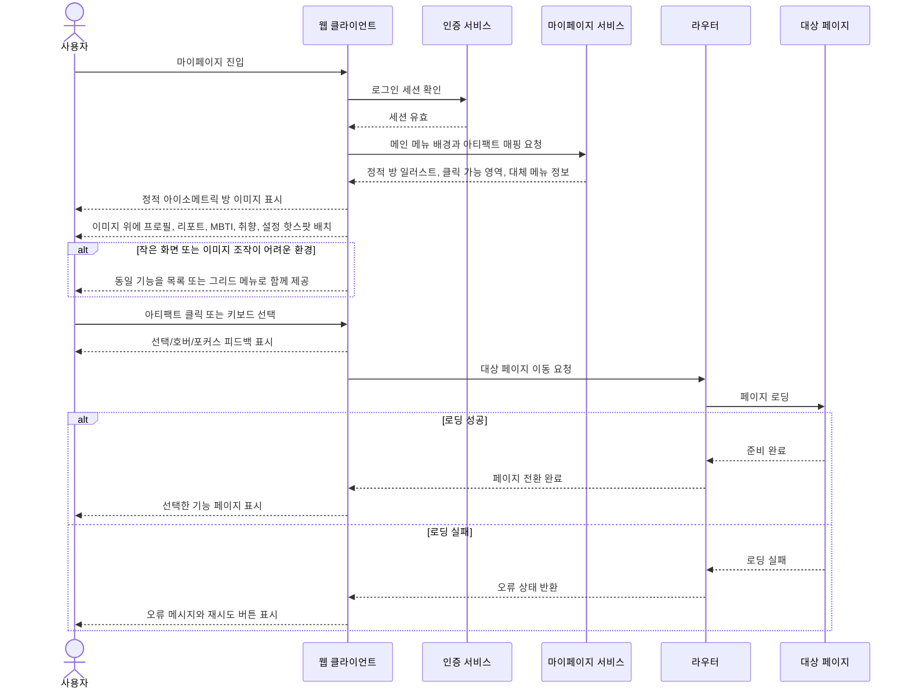

## 2. 프로필 조회 및 수정

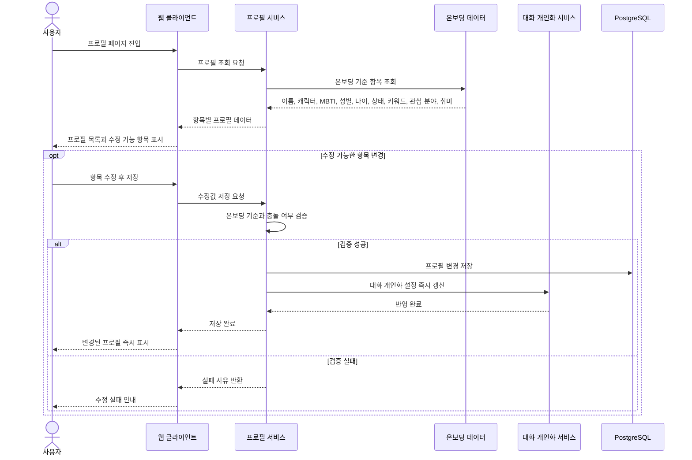

## 3. 리포트 보관함 연결

마음리포트의 주간·월간 캘린더, 일별 대표 감정 이모지, 리포트 상세 조회, 발급 기준, 공유 기능은 마음리포트 모듈 정책을 따른다. 마이페이지는 진입 동선과 초기 연결 상태만 담당한다.

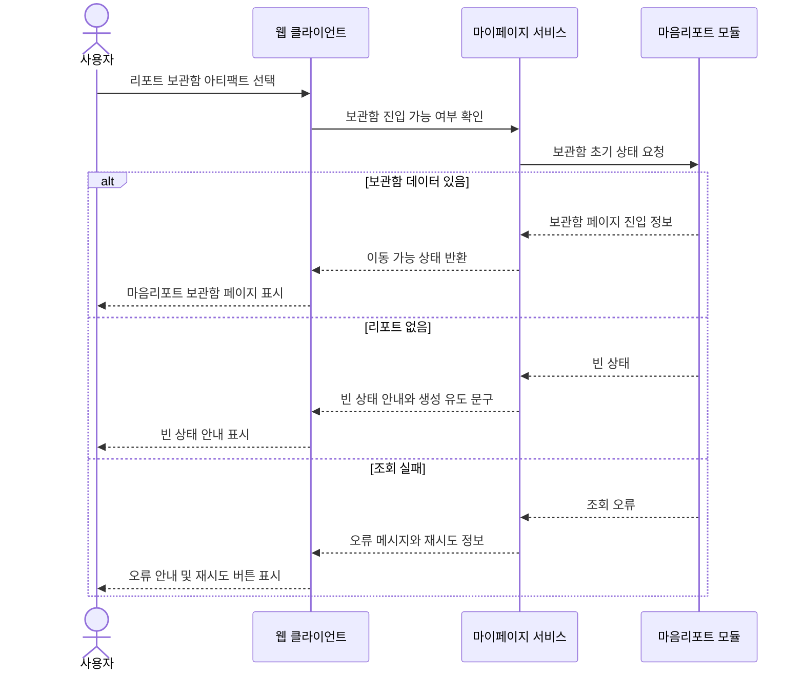

## 4. 개인 분석 결과 표시 및 자동 갱신

MBTI 분석과 취향 분석은 사용자가 별도 분석 버튼을 누르지 않는다. 각 분석 페이지에 들어가면 최신 저장 결과를 먼저 보여주고, 결과가 없거나 갱신 조건을 충족하면 백그라운드 분석을 실행한다.

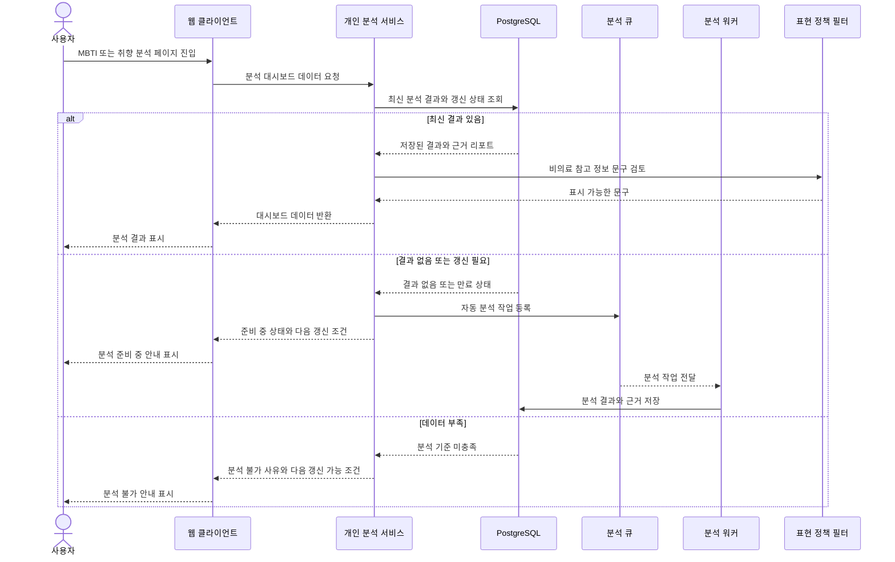

## 5. MBTI 분석 워커 파이프라인

HWPX의 상세 파이프라인을 유지하되, 화면용 시퀀스에서는 처리 단계를 한눈에 볼 수 있는 수준으로 묶었다.

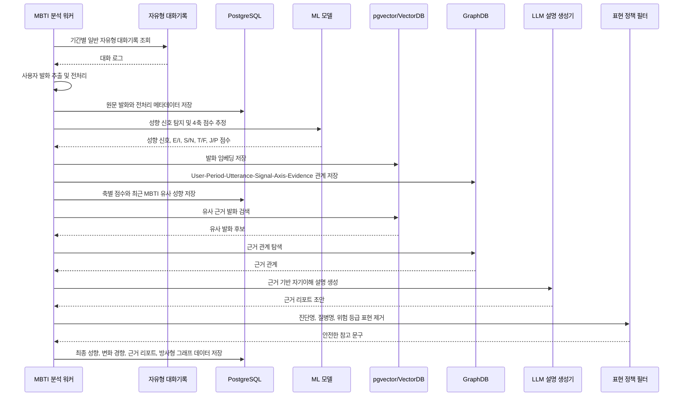

## 6. 취향 및 선호 분석 워커 파이프라인

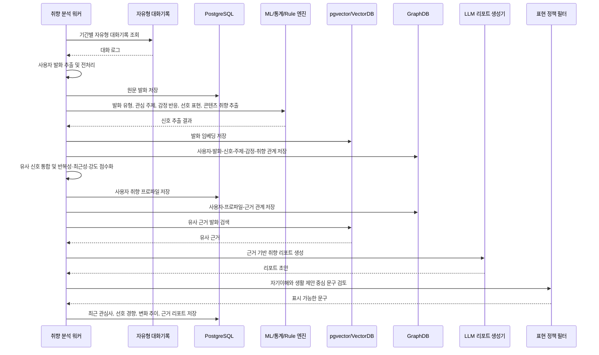

## 7. 커뮤니티 자유게시판 및 신고

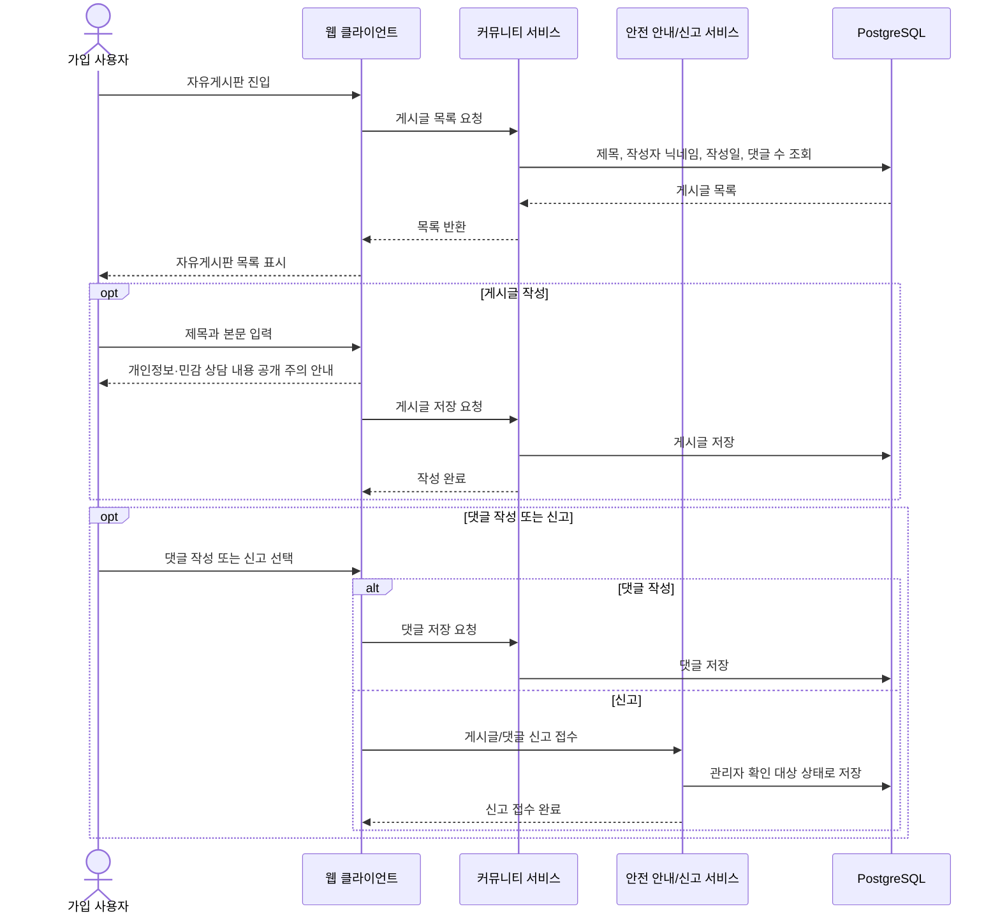

## 8. 사용자간 1:1 웹 채팅

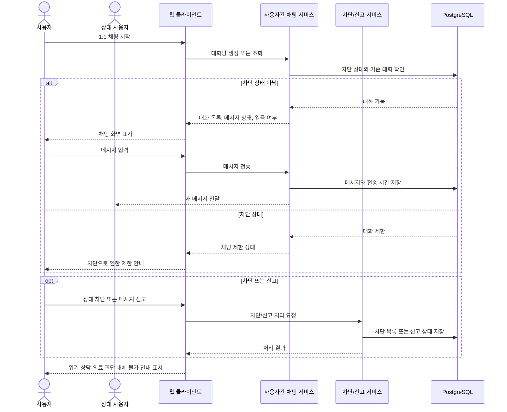

## 9. 설정 페이지

최신 요구사항은 설정을 웹 계정·전역 UI 설정 중심으로 재정리한다. 다른 기능의 입력값을 설정에서 직접 수정하지 않고, 필요 시 해당 기능 화면으로 이동 안내만 제공한다.

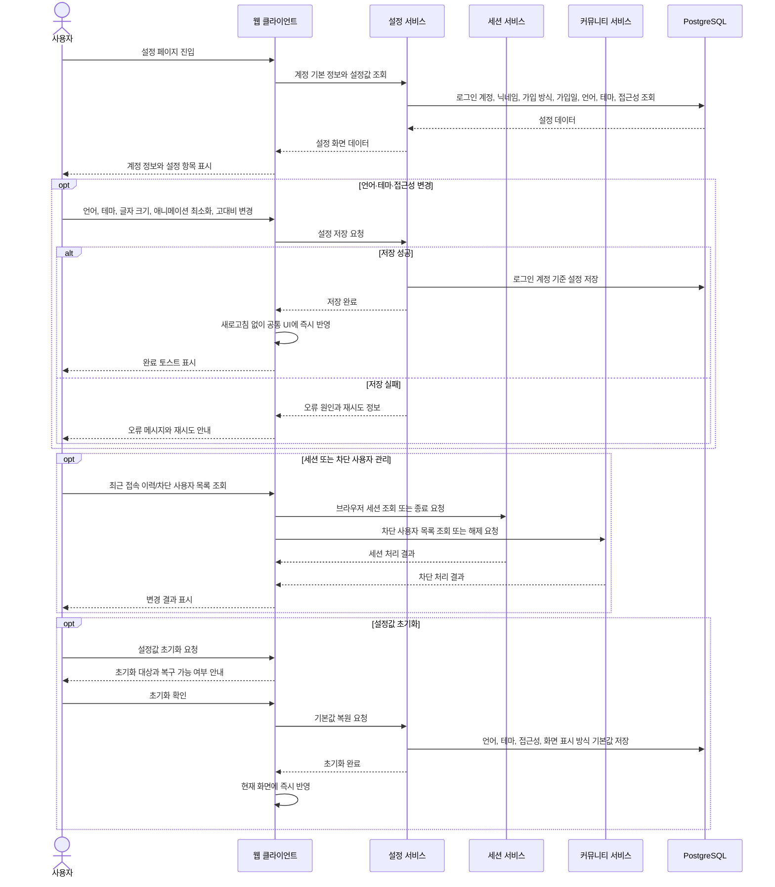

## 10. 계정 탈퇴 및 데이터 삭제

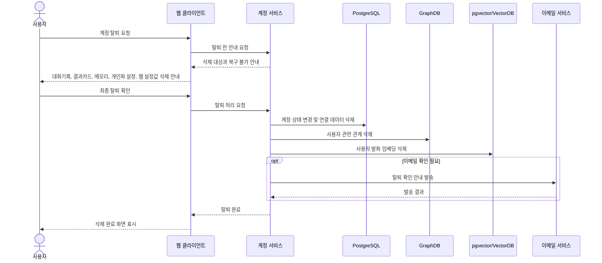

## 11. 관리자 접근 및 회원 처리

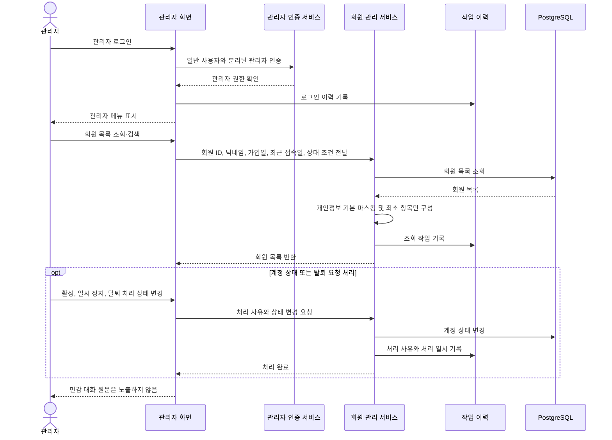

## 12. 관리자 안전·오류·커뮤니티 확인

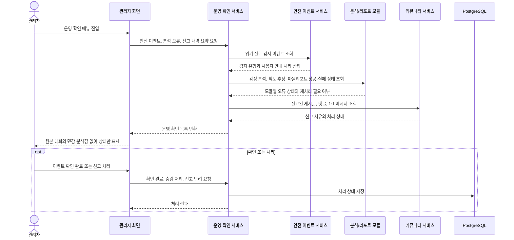

## 13. 관리자 콘텐츠·공지 관리

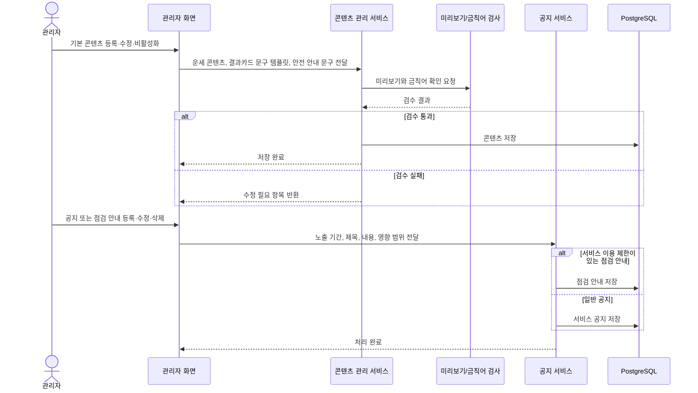

## 요구사항 부합 메모

- `F-MY-001 정적 방 일러스트 기반 메인 메뉴`: 정적 아이소메트릭 방 이미지, 이미지 위 클릭 가능 아티팩트, 클릭/키보드 선택, 포커스 피드백, 작은 화면 목록·그리드 대체 메뉴, 로딩 실패 재시도를 포함한다.
- `F-MY-002 프로필 조회`: 온보딩 정보 기준 조회와 수정 후 마이페이지·대화 개인화 즉시 반영을 포함한다.
- `F-MY-003 리포트 보관함 연결`: 마음리포트 모듈 내부 정책을 침범하지 않고, 마이페이지 담당인 진입 동선·빈 상태·오류 재시도만 포함한다.
- `F-MY-004 대화기록 기반 MBTI 성향 추정 및 경향 분석`: HWPX의 MBTI 분석 파이프라인을 유지하되 화면 표시 흐름과 워커 흐름을 분리했다.
- `F-MY-005 대화기록 기반 취향 및 선호 경향 분석`: HWPX의 취향 분석 파이프라인을 유지하고 데이터 부족 안내를 추가했다.
- `F-COM-001 자유게시판 글 목록·작성`, `F-COM-002 게시글 상세·댓글·신고`, `F-COM-003 사용자간 1:1 웹 채팅`: 게시판, 댓글, 신고, 채팅, 차단을 반영했다.
- `F-SET-001 계정 기본 정보 조회`, `F-SET-002 언어·테마 설정`, `F-SET-003 화면 접근성 설정`, `F-SET-004 로그인 세션 관리`, `F-SET-005 설정값 초기화`, `F-SET-006 커뮤니티 차단 사용자 관리`, `F-SET-007 계정 탈퇴·데이터 삭제`, `NF-SET-001 설정 즉시 반영`: 웹 설정 중심으로 반영했고, v8에 없는 시크릿챗 기본 설정은 제외했다.
- `F-ADM-001 회원 목록 조회·검색`, `F-ADM-002 계정 상태·탈퇴 요청 처리`, `F-ADM-003 안전 이벤트 확인`, `F-ADM-004 분석·리포트 오류 확인`, `F-ADM-005 커뮤니티 신고 내역 확인`, `F-ADM-006 기본 콘텐츠 관리`, `F-ADM-007 공지·점검 안내 등록`, `F-ADM-008 관리자 접근 및 작업 이력 확인`: 최소 관리자 운영 범위로 재구성했고, 민감 대화 원문과 개인별 민감 분석값은 관리자 화면에 노출하지 않도록 했다.
