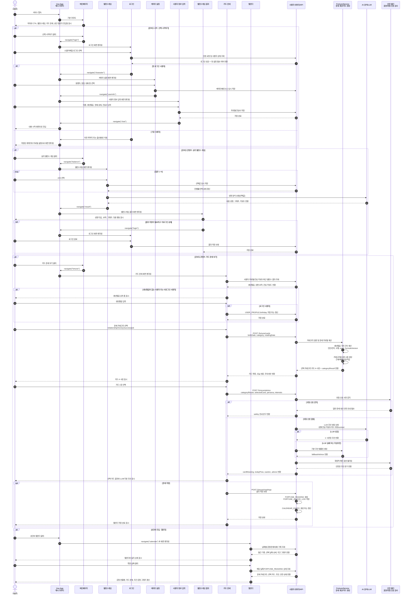

# 빈틈사이 온보딩 시퀀스 다이어그램

기준 화면: 메인페이지, 밸런스게임, 로그인, 캐릭터 설정, 사용자 정보 입력, 밸런스게임 결과, 카드 운세, 캘린더

이번 수정본은 카드 운세 기능에서 **생년월일 기반 운세 프로필 계산**, **관계/재물/성공/직업운 4개 카테고리 결과 생성**, **카드 4~5장 선택**, **LLM 조언 실패 시 기본 템플릿 반환**, **위험 신호/확정적 예언 표현 필터링** 흐름을 반영한다.

## 메모

- 현재 Vue 구현은 `#home`, `#balance`, `#login`, `#fortune`, `#calendar`, `#character`, `#userinfo` 라우트를 포함한다.
- `#result`는 화면설계서의 성향결과 화면을 반영한 예정 라우트로 표시했다.
- 캐릭터 설정과 사용자 정보 입력은 첫 로그인 때만 수행하고, 기존 사용자는 저장된 설정으로 건너뛴다.
- 카드 운세는 생년월일을 기반으로 `FORTUNE_PROFILE`을 만들고, 같은 계산 결과에서 `relationship`, `money`, `success`, `job` 4개 카테고리 결과를 생성한다.
- LLM은 운세 계산 자체를 담당하지 않고, 계산 결과/카드 의미/성향/관심 키워드를 받아 1~3문장 조언만 생성한다.
- LLM 실패 시 `FortuneService`의 기본 조언 템플릿을 사용한다.
- 위험 신호가 감지되면 일반 운세 조언 대신 안전 안내를 반환한다.
- 확정적 예언 표현은 저장 및 표시 전에 필터링한다.
