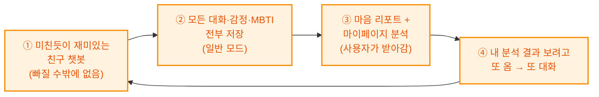
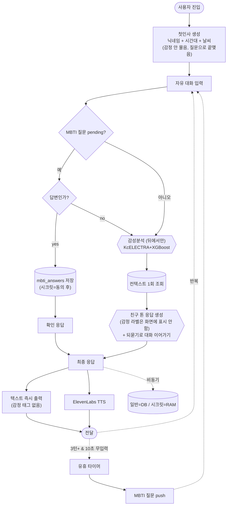

# 챗봇 컨셉 개편 기획서 — "진짜 친한 친구 모드"

## 한 줄 컨셉
> 감정을 캐묻는 상담사가 아니라, **먼저 말 걸어주는 진짜 친한 친구.**
> 날씨·시간·이름으로 자연스럽게 인사하고, 대화를 많이 나누는 게 목표.

---

## 핵심 전략 — 감정 데이터 선순환 (Flywheel)

> **재미가 입구, 분석이 가치.** 게이미피케이션(도토리·뱃지 등)은 어느 챗봇이나 하는 거라 차별점이 아니다.
> 우리의 진짜 무기는 아래 순환이다.



| 단계 | 무엇 | 왜 우리만 가능한가 |
|---|---|---|
| ① Hook (입구) | 너무 재밌어서 계속 오는 친구 챗봇 | 캐릭터 4종 + 음성(ElevenLabs) + 친구 반말톤 = 몰입 |
| ② Capture (축적) | 대화·감정 라벨·MBTI 답변을 전부 DB에 저장 | 매 턴 KcELECTRA 감정분류가 조용히 태깅됨 |
| ③ Payoff (보상) | 마음 리포트·MBTI 분석·"날 기억하는" 요약 | 축적된 감정 데이터가 있어야만 나오는 결과물 |
| ④ Loop (재방문) | 내 리포트가 궁금해서 또 대화하러 옴 | 리포트가 대화량에 비례해 풍부해짐 |

**결론**: 재미있는 대화 자체가 목적이 아니라, **재미로 계속 오게 만들어 감정 데이터를 쌓고, 그걸 분석해 사용자에게 "나를 알게 되는 경험"을 돌려주는 것**이 서비스의 본질. 그래서 일반 모드에서는 **모든 걸 저장**한다 (시크릿 모드만 예외).

> ⚠️ 저장이 핵심 가치이므로, 사용자가 재미로 오래 대화할수록 데이터가 쌓이고 리포트가 좋아진다.
> 게이미피케이션(도토리·친밀도·streak·뱃지)은 이 순환을 **가속하는 보조 장치**일 뿐, 메인이 아니다.

---

## 강사님 피드백 → 구현 항목 (9)

| # | 피드백 | 개편 내용 | 바꾸는 곳 |
|---|---|---|---|
| 1 | 처음에 기분 묻지 말기 | **감정 선택지(콜드스타트) 제거** → 날씨·시간대 기반 자연스러운 첫마디 | 프론트 첫 진입, 백엔드 opener API |
| 2 | 닉네임 부르며 인사 | 첫 인사에 `{닉네임}` 삽입 ("한솔아, 안녕!") | opener 생성 |
| 3 | 진짜 친한 친구 컨셉 | 모든 페르소나/프롬프트를 반말·친구톤으로 | personas.py |
| 4 | 슬픔 모드 등 화면 표시 제거 | **감정 라벨 태그를 화면에서 숨김** (분석은 뒤에서만) | ChatView.vue |
| 5 | 무조건 대화 많이 (3턴+) + 게이미피케이션 | 대화 지속 유도, 연속 대화 보상 요소 | 프롬프트 + UI |
| 6 | 시간대 맞춤 질문 | 점심시간="점심 뭐 먹었어?" 등 시간대별 화제 | opener/프롬프트 |
| 7 | 날씨 흐릴 때 톤 | 오전=챙기는 느낌("우산 챙겼어?") / 오후=걱정하는 느낌("비 안 맞았어?") | opener 생성 |
| 8 | MBTI 10초 뒤 | 현행 유지 (이미 10초) | 변경 없음 |
| 9 | 게이미피케이션 | 대화 턴/연속 방문 등 재미 요소 (친밀도 등) | UI (2차) |

---

## 1. 첫 진입 개편 (핵심 변경)

### 기존 (제거)
```
챗봇: "지금 기분이 어때요?"  [기쁨][슬픔][분노][그냥그래]  ← 감정 선택지
```

### 개편 (신규)
```
챗봇: "한솔아! 오늘 날씨 흐리던데 우산은 챙겼어? ☂️"   ← 이름 + 날씨 + 챙김
```

**opener 생성 규칙** (백엔드가 시간·날씨·닉네임으로 조합):

| 조건 | 첫마디 예시 |
|---|---|
| 아침(~11시) | "{닉네임}아 좋은 아침! 오늘 하루 어떻게 시작했어?" |
| 점심(11~14시) | "{닉네임}아! 점심 뭐 먹었어? 나는 궁금해서 물어봤지 ㅎㅎ" |
| 오후(14~18시) | "{닉네임}아 오후엔 좀 나른하지 않아? 뭐 하고 있었어?" |
| 저녁(18~22시) | "{닉네임}아 오늘 하루도 고생했어! 저녁은 먹었어?" |
| 밤(22시~) | "{닉네임}아 아직 안 잤네? 무슨 생각 하고 있었어?" |
| **흐림+오전** | "{닉네임}아, 오늘 날씨 흐리더라. 우산 챙겼어? 감기 조심해!" (챙기는 느낌) |
| **흐림+오후** | "{닉네임}아, 아까 비 안 맞았어? 흐린 날엔 괜히 마음도 처지더라…" (걱정하는 느낌) |
| 비 | "{닉네임}아 밖에 비 오던데! 우산 있어?" |
| 맑음 | "{닉네임}아 오늘 날씨 좋더라! 기분도 좀 나아지지 않아?" |

> 첫마디는 **질문으로 끝나** 대화를 자연스럽게 이어가게 함. 감정을 묻지 않고 일상을 물음.

---

## 2. 감정 태그 화면에서 숨기기

- **화면**: "✦ 슬픔 모드" 같은 태그 **표시 안 함** (사용자는 그냥 친구랑 대화하는 느낌)
- **뒤에서**: 감정 분류는 그대로 동작 → 응답 톤 결정 + user_memory/통계에만 사용
- **표정**: 캐릭터 얼굴 표정은 감정 따라 바뀌어도 OK (자연스러운 반응), 단 "슬픔 모드" 같은 **글자 라벨**은 제거

---

## 3. 대화 많이 하기 (3턴+ 유도)

- 응답 끝에 **가벼운 되묻기**를 붙여 대화가 끊기지 않게 ("근데 너는 어때?", "그래서 어떻게 됐어?")
- 3턴 미만이면 MBTI·추천 등 곁가지 기능을 아예 띄우지 않고 **순수 수다에 집중**
- 게이미피케이션(2차): 연속 대화 턴 수 / 며칠 연속 방문 → 친밀도·도토리 등 보상 (마이페이지 담당과 연계)

---

## 4. 친구 톤 프롬프트

- 존댓말 → **반말** (친한 친구니까)
- "상담해드릴게요" 같은 상담사 표현 금지
- 이모지·감탄사 자연스럽게, 사용자 말에 리액션 크게 ("헐 진짜?", "대박 ㅋㅋ", "아 그건 좀 속상했겠다")
- 캐릭터별 결은 유지 (포리=밝게, 까미=츤데레, 토토=장난, 여울=포근) 하되 전부 친구 말투

---

## 5. MBTI (타이밍 확정)
- **10초 무입력이면 무조건 MBTI 질문** (강사님 확정 · 턴 수 조건 제거 · 코드 반영 완료)
- 친구가 문득 궁금해서 묻듯 자연스럽게 ("아 맞다, 갑자기 궁금한데…")
- 수집된 답변은 마이페이지 MBTI 분석의 재료 (③ Payoff)

## 6. 게이미피케이션 (보조 장치 · 2차)
> 메인이 아니라 ④ Loop를 가속하는 장치. 마이페이지/마음리포트 담당과 연계.
- 도토리 적립 (마이페이지 acorn 화면 활용), 친밀도 게이지, 연속 출석 streak, 뱃지/칭호
- **주는 것보다 받는 것이 메인**: 도토리보다 "마음 리포트/MBTI 결과"가 진짜 보상

---

## 흐름도 (개편본)



---

## 스코프 정리

| 지금 개편 | 2차/유지 |
|---|---|
| 첫인사(날씨·시간·닉네임), 감정태그 숨김, 친구톤, 3턴 유도, 시간대 질문 | 게이미피케이션(친밀도/도토리) 본격 구현, Plan Agent, RAG |

---

## ⚠️ 확정 필요 (구현 전 결정)

1. **콜드스타트 완전 제거** vs "친구 인사 후에도 감정은 뒤에서 분류만" — 후자 권장 (분류는 유지, 화면·첫질문만 제거)
2. **닉네임 출처** — 로그인 사용자의 `nickname` 필드 사용 (비로그인은 "친구"/"너" 등 대체)
3. **날씨 오전/오후 경계** — 12시 기준? (현재 표 기준: 오전=~12시, 오후=12~18시)
4. 게이미피케이션 범위 — 이번엔 "되묻기로 대화 유도"까지만, 보상 시스템은 2차?
