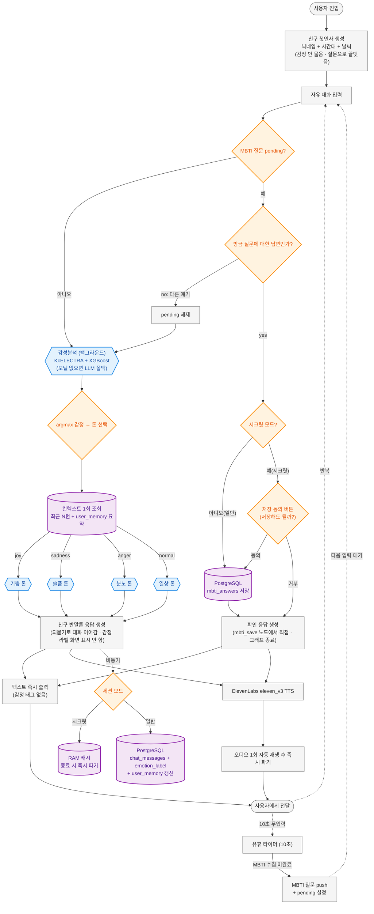

# 웰니스 챗봇 최종 흐름도 (친구 컨셉 · 구현 검증본)

---

## 단계별 설명 (검증 결과)

### 1. 친구 첫인사 (콜드스타트 폐지)  ✅ 검증완료
감정을 묻지 않는다. 진입 즉시 **닉네임 + 시간대 + 날씨**로 친구가 먼저 말 건다.
브라우저 실측: *"별빛소년아! 점심 뭐 먹었어? 갑자기 궁금해서 물어봤어 ㅎㅎ"* (점심시간 오프너).
날씨 흐림 시 오전="우산 챙겼어?"(챙김) / 오후="비 안 맞았어?"(걱정). → `chat/opener_service.py`

### 2. MBTI pending 체크 (입력 직후 최우선)  ✅ 검증완료
직전에 MBTI 질문을 던진 상태면, 현재 입력이 그 답인지 먼저 판별. 답이면 저장(일반: 즉시 / 시크릿: 동의 후) 후 확인 응답, 다른 얘기면 pending 해제하고 대화로 합류.

### 3. 감성분석 (뒤에서만) + 톤 결정  ✅ 검증완료
**KcELECTRA + XGBoost** argmax 4감정 분류. **화면엔 "슬픔 모드" 같은 라벨을 절대 표시하지 않고**, 응답 톤 결정과 저장에만 사용. 브라우저 실측: "되는 일이 하나도 없어" → anger 분류 → 화면 라벨 없음.
폴백 3단계: 학습 모델 → LLM 분류 → normal (`analysis_node`).

### 4. 친구 반말톤 응답 + TTS  ✅ 검증완료
상담사 X, 반말 친구 O. 되묻기로 대화를 이어간다.
브라우저 실측 응답: *"헐 그건 진짜 너무했다… 너 잘못한 거 하나도 없는데 계속 꼬이면 진짜 사람 미치지. …뭐부터 그렇게 엉킨 건지 하나만 말해봐."*
텍스트 즉시 출력 + ElevenLabs eleven_v3 음성 1회 재생 후 파기.
(예외: MBTI 질문·동의 확인 같은 **고정 문구는 서버 캐시 유지** — `cacheable=True`, 대화 응답만 1회 파기.)

### 5. 저장 (선순환의 핵심)  ✅ 검증완료
- **일반 모드**: `chat_messages`(emotion_label 포함) + `user_memory` 장기요약 → 마음리포트·MBTI 분석의 재료
- **시크릿 모드**: RAM 캐시만, 종료 시 즉시 파기

### 6. MBTI 서브플로우 (10초 무조건)  ✅ 검증완료
**10초 무입력이면 무조건** MBTI 질문 push (강사님 확정 · 턴 수 조건 제거). 답변 시 `mbti_answers` 저장 → 저장된 질문은 다시 안 물음. 브라우저 실측: 첫인사 10초 후 MBTI 질문 등장 확인.

### 7. 이번 스코프 제외
| 항목 | 사유 |
|---|---|
| **Plan Agent (Tavily 장소 추천)** | 트리거 조건 미확정 — 2차 확장 |
| RAG / GraphDB / 동적 임계값 / 비속어 필터 | 2차 확장 |

---

## 컨셉 — 진짜 친한 친구 (강사님 피드백)
- 감정 캐묻는 상담사 X → **먼저 말 걸어주는 친구** O (날씨/시간/닉네임 첫인사)
- "슬픔 모드" 같은 라벨 화면에서 제거 (분석은 조용히 뒤에서)
- 반말 친구톤 + 되묻기로 대화 많이 유도
- **선순환**: 재밌어서 계속 옴 → 다 저장 → 마음리포트/MBTI로 돌려받음 → 또 옴

## 사용 기술 스택
- **감정분류**: KcELECTRA + XGBoost (4감정)
- **대화 생성**: OpenAI (LangGraph 멀티에이전트)
- **음성**: ElevenLabs eleven_v3 (감정 연기 태그)
- **저장**: PostgreSQL (일반) / 서버 인메모리 (시크릿)
- **캐릭터**: 포리(레서판다)·까미(고양이)·토토(수달)·여울(뱁새)
