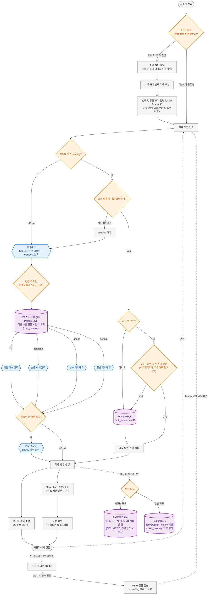

> ## ⚠ 이 문서는 구본(설계 시점)입니다
> **현행 확정본은 [최종_통합_흐름도_구현검증본.md](./최종_통합_흐름도_구현검증본.md) (v3.3)** 입니다.
> 콜드스타트 감정 선택지·차/BGM 추천·시크릿 MBTI 동의 등 본 문서의 일부 요소는 폐지되었고,
> 기억 시스템(즉시 캡처)·확신도 게이트·친구 첫인사가 추가되었습니다. 본 문서는 설계 이력 보존용으로만 유지합니다.

# 최종 통합 흐름도 (구본 · 아카이브)

## 전체 아키텍처

---

## 단계별 설명

### 1. 콜드스타트
최초 진입 시 자유 입력 대신 **감정 선택지 질문**을 먼저 던져 장난/이상 입력으로부터 시스템을 보호합니다. 콜드스타트 여부는 turn_count가 아니라 **"선택형 질문에 이미 답했는가"** 로 판단합니다.

사용자가 감정을 선택하면 그 값을 **초기 감정 컨텍스트로 저장**하고, 곧바로 후속 질문("오늘 무슨 일이 있었어요?")을 던져 자연스럽게 자유 대화로 유도합니다. 선택된 감정은 첫 턴 감성분석의 참고 컨텍스트로 함께 전달됩니다.

### 2. 메인 플로우
자유 대화 입력이 들어오면 먼저 **MBTI pending 플래그**를 확인합니다 (직전에 MBTI 질문을 던진 상태인지). pending이 아니면 바로 감성분석으로 진행합니다.

감성분석은 **KcELECTRA 임베딩 + XGBoost**로 4개 감정(기쁨/슬픔/분노/일반)을 분류합니다.
> ⚠️ 임베딩 모델은 KcELECTRA로 잠정 확정. KoBERT와의 성능 비교는 아직 미수행 — 추후 비교 후 필요 시 교체.

**컨텍스트 조회는 감정 라우팅 직후 1회만 수행**하며 (4개 에이전트가 각각 DB를 조회하지 않음), 조회된 컨텍스트는 **분류된 감정 라벨에 해당하는 에이전트 1개에만** 전달되어 그 에이전트만 실행됩니다.

컨텍스트는 두 종류를 함께 넘깁니다:
- **최근 N턴 원문** (conversation_history, 생생한 최근 맥락)
- **장기 요약** (user_memory.summary_text, 오래된 대화의 압축본 — "챗봇이 날 기억한다"는 느낌 유지 + 토큰 비용 절감)

### 3. 현실연결(Plan Agent / Tavily)
멘토님 계층도의 **현실 연결 에이전트 = Plan Agent(Tavily)** 로 확정. 감정 에이전트가 응답을 생성하는 과정에서 행동/장소 추천이 필요하다고 판단되면 Tavily 외부 검색을 거쳐 결과를 응답에 반영합니다.
> ⚠️ 트리거 조건(사용자 명시 요청 vs 에이전트 자동 판단)은 아직 최종 확정 전 — 추가 논의 필요.

### 4. 출력 및 저장 (병렬 처리)
- **텍스트**: 응답 생성 즉시 말풍선 타이핑으로 출력
- **음성**: **ElevenLabs TTS**를 병렬로 생성 시작 — 음성 생성에 수 초의 지연이 있으므로 텍스트를 먼저 보여주고, 오디오는 준비되는 대로 재생 (텍스트/음성 동시 체감)
- **저장**: 출력과 무관하게 **비동기 백그라운드**로 처리 (저장이 응답 출력을 막지 않음)
  - **시크릿 모드**: RAM/세션 캐시만 사용, 종료 시 즉시 파기, DB 저장 없음 (예외: MBTI 답변은 아래 §5 동의 시 저장)
  - **일반 모드**: PostgreSQL에 대화 이력 + 요약 저장

### 5. MBTI 서브플로우 (독립 트리거)
대화 한 턴이 끝난 뒤 **10초간 무입력**이고 MBTI 수집이 아직 완료되지 않았다면 MBTI 질문을 던지고 **pending 플래그를 설정**합니다.

다음 사용자 입력은 메인 플로우 입구에서 pending 체크에 걸려 판별됩니다:
- **질문에 대한 답변이면**: 저장 후 LLM이 짧은 확인 응답 생성
  - 일반 모드 → 바로 `mbti_answers` 저장
  - **시크릿 모드 → "저장해도 될까요?" 동의를 먼저 물어보고, 동의 시에만 저장** (거부 시 확인 응답만)
- **다른 얘기면**: pending 해제 후 일반 감성분석 플로우로 합류

저장된 답변은 마이페이지 분석용이며 조회는 이 흐름 밖에서 처리합니다.

### 6. 이번 스코프에서 제외한 것 (2차 확장 과제 포함)
| 항목 | 사유 |
|---|---|
| RAG/지식베이스 | 시간 부족으로 2차 확장 과제 |
| GraphDB | 현재는 PostgreSQL만 사용, 관계망 분석 필요해지면 추후 도입 |
| 동적 임계값 + Uncertainty Agent | 채택 안 함 — 4클래스 중 확정 분류 방식 유지 |
| MBTI 트리거 조건 세분화(감정 상태 기반 게이팅) | 채택 안 함 — 10초 무입력 + 수집 미완료면 트리거 |
| 비속어 필터 | 2차 확장 과제 (v5.6에는 있었으나 이번 스코프 제외) |
| MLOps / Feedback Agent (재학습 큐) | 2