# 마이페이지/설정 INSERT 대상 ERD

## 설계 원칙

이 ERD는 요구사항 정의서의 마이페이지, 설정 기능에서 직접 `INSERT` 또는 `UPDATE`해야 하는 테이블만 정의한다.

다른 팀원이 이미 정의한 사용자, 온보딩, 대화, 감정 분석, 결과 카드, 운세, 안전 이벤트 원천 테이블은 새로 만들지 않는다. 해당 데이터는 `user_id`, `conversation_id`, `analysis_id`, `report_id`, `card_id`, `safety_event_id` 같은 외부 식별자로 조회하거나, 필요 시 해당 모듈 API를 통해 갱신한다.

## 생성 제외 외부 참조 테이블

| 영역 | 외부 참조 테이블 예시 | 본 ERD에서의 사용 방식 |
|---|---|---|
| 회원/인증 | `USERS`, `OAUTH_ACCOUNTS`, `USER_SESSIONS` | 사용자 식별, 계정 상태 조회 |
| 온보딩/캐릭터 | `USER_ONBOARDING_PROFILES`, `PERSONAS`, `CHARACTERS` | 닉네임, 선택 캐릭터, 페르소나 조회 |
| 대화 원천 | `CONVERSATIONS`, `CHAT_SESSION`, `CHAT_MESSAGE`, `MESSAGE` | 일반 대화 기록 조회, 시크릿챗 제외 |
| 감정/척도 분석 원천 | `EMOTION_ANALYSIS_RESULTS`, `ANALYSIS`, `HIDDEN_SCALE_LOG` | 마이페이지 분석 산출물 생성 시 내부 계산용 조회 |
| 리포트/결과카드 | `MIND_REPORT`, `RESULT_CARD`, `FORTUNE_CARDS`, `DAILY_FORTUNE_ASSIGNMENTS` | 보관함/공유 화면에서 원천 콘텐츠 조회 |
| 메모리/안전 | `MEMORY`, `MEMORIES`, `SAFETY_EVENT`, `SAFETY_CHECK_RESULTS`, `CRISIS_PROTOCOL_LOGS` | 삭제 작업 시 원천 데이터 조회 |

## ERD

```mermaid
erDiagram
    USER_PROFILE_EXTENSIONS ||--o{ USER_PROFILE_KEYWORDS : has
    USER_SETTINGS ||--o{ USER_SETTING_CHANGE_LOGS : records
    ACCOUNT_DELETION_REQUESTS ||--o{ DATA_DELETION_TASKS : contains
    MY_ANALYSIS_RUNS ||--o{ MY_MBTI_AXIS_RESULTS : produces
    MY_ANALYSIS_RUNS ||--o| MY_MBTI_REPORTS : explains
    MY_ANALYSIS_RUNS ||--o| MY_TASTE_ANALYSIS_SUMMARIES : summarizes
    MY_ANALYSIS_RUNS ||--o{ MY_PREFERENCE_INSIGHTS : produces
    MY_TASTE_ANALYSIS_SUMMARIES ||--o{ MY_PREFERENCE_INSIGHTS : groups

    USER_PROFILE_EXTENSIONS {
        bigint user_id PK "FK: USERS.user_id"
        varchar gender
        smallint birth_year
        varchar mbti_self_type
        varchar current_status
        jsonb interests
        jsonb hobbies
        timestamptz updated_at
    }

    USER_PROFILE_KEYWORDS {
        bigint keyword_id PK
        bigint user_id FK "FK: USER_PROFILE_EXTENSIONS.user_id"
        varchar keyword_text
        int sort_order
        timestamptz created_at
    }

    USER_SETTINGS {
        bigint user_id PK "FK: USERS.user_id"
        varchar language "ko/en"
        varchar theme "light/dark/system"
        varchar font_size "small/normal/large"
        boolean reduce_motion
        boolean high_contrast
        timestamptz reset_at
        timestamptz updated_at
    }

    USER_SETTING_CHANGE_LOGS {
        bigint setting_change_log_id PK
        bigint user_id FK "FK: USER_SETTINGS.user_id"
        varchar setting_key
        text before_value
        text after_value
        varchar result_status "success/failed/permission_error"
        text failure_reason
        timestamptz changed_at
    }

    ACCOUNT_DELETION_REQUESTS {
        bigint deletion_request_id PK
        bigint user_id FK "FK: USERS.user_id"
        varchar request_status "requested/processing/completed/canceled/failed"
        text requested_reason
        boolean recovery_impossible_confirmed
        timestamptz requested_at
        timestamptz completed_at
    }

    DATA_DELETION_TASKS {
        bigint deletion_task_id PK
        bigint deletion_request_id FK
        varchar target_domain "conversation/report/memory/profile/settings/personalization"
        varchar task_status "pending/processing/completed/failed"
        text failure_reason
        timestamptz processed_at
    }

    MY_ANALYSIS_RUNS {
        bigint analysis_run_id PK
        bigint user_id FK "FK: USERS.user_id"
        varchar analysis_type "mbti_trend/preference_trend"
        varchar period_type "weekly/monthly/custom"
        date period_start
        date period_end
        varchar period_label "최근 30일 기준"
        int source_message_count
        int source_conversation_count
        varchar generation_status "completed/unavailable/failed"
        text unavailable_reason
        jsonb evidence_message_ids
        jsonb display_payload "screen-ready json"
        timestamptz generated_at
    }

    MY_MBTI_AXIS_RESULTS {
        bigint axis_result_id PK
        bigint analysis_run_id FK
        varchar axis_code "EI/SN/TF/JP"
        varchar left_label
        decimal left_score
        varchar right_label
        decimal right_score
        varchar selected_label
        decimal selected_score
        varchar strength_label "strong/medium/weak/borderline"
        text evidence_text
        int sort_order
    }

    MY_MBTI_REPORTS {
        bigint mbti_report_id PK
        bigint analysis_run_id FK
        varchar estimated_type "ENFP/INFP/etc"
        decimal confidence_score
        varchar confidence_label "high/medium/low"
        jsonb display_axes_json "radar chart labels and scores"
        jsonb axis_scores_json "full two-sided probabilities"
        text report_text
        text caution_text "non-medical notice"
        varchar llm_model
        timestamptz created_at
    }

    MY_TASTE_ANALYSIS_SUMMARIES {
        bigint taste_summary_id PK
        bigint analysis_run_id FK
        jsonb interest_keywords_json "recent interests chips"
        jsonb preference_keywords_json "preference chips"
        jsonb trend_items_json "up/down percent items"
        text unavailable_reason
        timestamptz created_at
    }

    MY_PREFERENCE_INSIGHTS {
        bigint preference_insight_id PK
        bigint analysis_run_id FK
        bigint taste_summary_id FK
        varchar insight_type "recent_interest/preference_pattern/change_trend"
        varchar keyword
        varchar polarity "positive/negative/neutral"
        decimal confidence
        int mention_count
        decimal trend_delta
        varchar period_label
        text summary
        jsonb evidence_message_ids
        int sort_order
    }

```

## 요구사항별 반영 테이블

| 요구사항 | 생성/갱신 테이블 | 외부 조회 테이블 |
|---|---|---|
| `F-MY-001` 메인화면 겸 메뉴 | 없음 | `USERS`, 리포트/결과카드 원천 테이블 |
| `F-MY-002` 프로필 조회/수정 | `USER_PROFILE_EXTENSIONS`, `USER_PROFILE_KEYWORDS` | `USERS`, `USER_ONBOARDING_PROFILES`, `PERSONAS`, `CHARACTERS` |
| `F-MY-003` 리포트 보관함 연결 | 없음 | `MIND_REPORT`, `RESULT_CARD` |
| `F-MY-004` MBTI 성향 추정 | `MY_ANALYSIS_RUNS`, `MY_MBTI_AXIS_RESULTS`, `MY_MBTI_REPORTS` | `CONVERSATIONS`, `CHAT_MESSAGE`, `ANALYSIS`, `HIDDEN_SCALE_LOG`, Vector DB |
| `F-MY-005` 취향/선호 경향 분석 | `MY_ANALYSIS_RUNS`, `MY_TASTE_ANALYSIS_SUMMARIES`, `MY_PREFERENCE_INSIGHTS` | `CONVERSATIONS`, `CHAT_MESSAGE`, `ANALYSIS`, Vector DB |
| `F-SET-001` 계정 기본 정보 조회 | 없음 | `USERS`, `OAUTH_ACCOUNTS`, `USER_ONBOARDING_PROFILES` |
| `F-SET-002` 언어·테마 설정 | `USER_SETTINGS`, `USER_SETTING_CHANGE_LOGS` | 없음 |
| `F-SET-003` 화면 접근성 설정 | `USER_SETTINGS`, `USER_SETTING_CHANGE_LOGS` | 없음 |
| `F-SET-004` 로그인 세션 관리 | `USER_SETTING_CHANGE_LOGS` | `USER_SESSIONS` |
| `F-SET-005` 설정값 초기화 | `USER_SETTINGS`, `USER_SETTING_CHANGE_LOGS` | 없음 |
| `F-SET-006` 계정 탈퇴·데이터 삭제 | `ACCOUNT_DELETION_REQUESTS`, `DATA_DELETION_TASKS` | 삭제 대상 도메인별 원천 테이블 |
| `NF-SET-001` 설정 즉시 반영 | `USER_SETTING_CHANGE_LOGS` | 없음 |

## 중복 방지 메모

- `USERS`, `USER`, `CONVERSATIONS`, `CHAT_SESSION`, `MESSAGE`, `ANALYSIS`, `MIND_REPORT`, `RESULT_CARD`, `MEMORY`, `SAFETY_EVENT`는 생성하지 않는다.
- `F-MY-003`의 리포트 보관함은 원천 리포트 테이블을 조회하는 기능이므로 별도 보관함 테이블을 만들지 않는다.
- 의료적 오해를 줄이기 위해 `MY_ANALYSIS_RUNS`, `MY_MBTI_REPORTS`에는 임상 진단명, 위험 등급, 원천 척도 점수를 저장하지 않는다. 화면 표시용 성향 요약, 근거 리포트, 분석 불가 사유만 저장한다.
- 개인 분석 산출물은 일반 자유형 대화기록 기준으로 생성하며, 저장 정책상 분석 대상에서 제외되는 대화는 `MY_ANALYSIS_RUNS`, `MY_MBTI_AXIS_RESULTS`, `MY_PREFERENCE_INSIGHTS` 생성 대상에서 제외한다.
