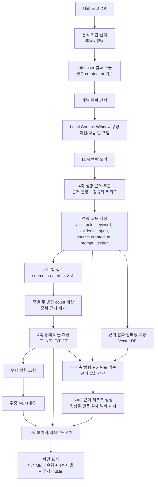
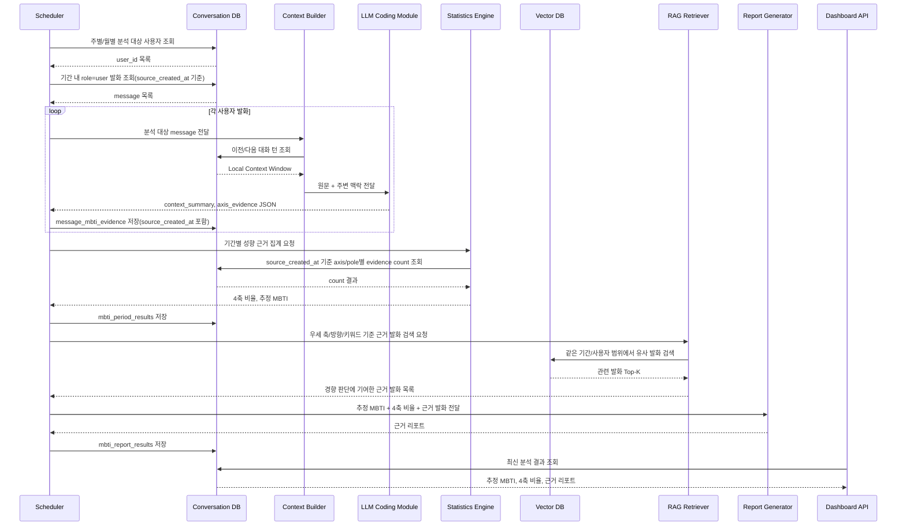
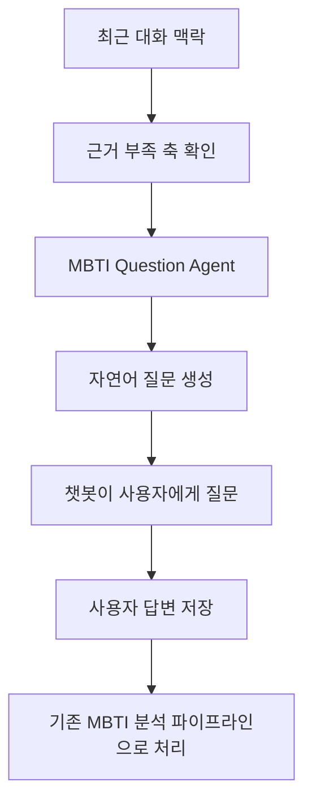
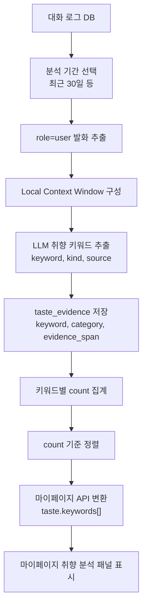
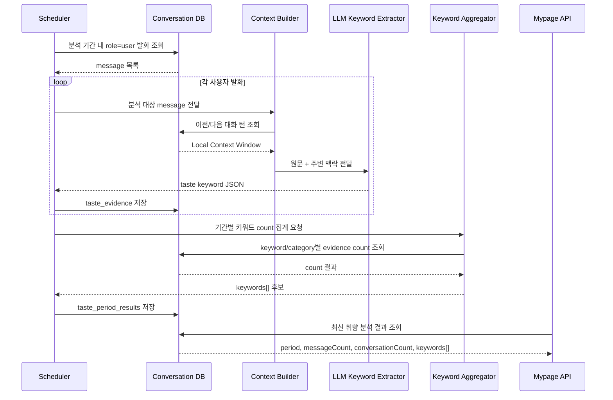
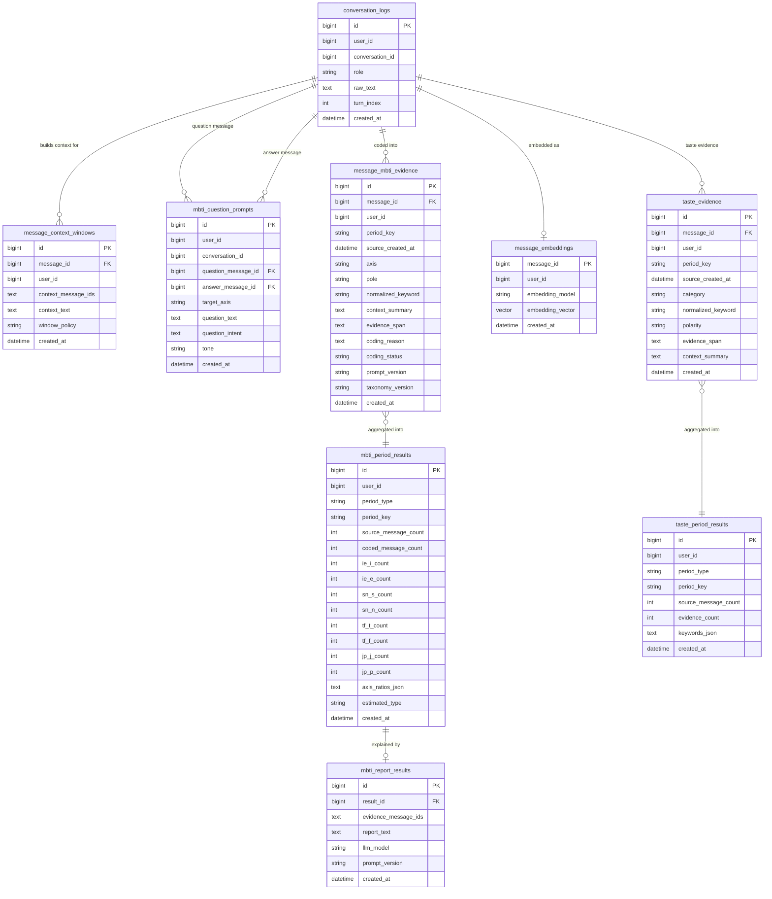

# MBTI 성향 및 취향 분석 대시보드 프로세스 흐름 보고서 — 현실 권장 구조 최종 개편본

## 0. 개편 목적

본 문서는 기존 `ML/DL 기반 MBTI 분류`, `LLM 직접 MBTI 판정`, `Semantic Differential 평정`, `TF-IDF/키워드 점수식`을 제거하고, 실제 서비스에서 설명 가능하고 운영 가능한 구조로 MBTI 성향 추정 파이프라인을 재정의한다.

최종 권장 구조는 아래와 같다.

```text
주별/월별 사용자 대화 로그
→ role=user 발화 추출
→ 개별 발화 + 주변 대화 맥락 구성(Local Context Window)
→ LLM이 발화 맥락 요약
→ 맥락 기반 4축 성향 근거 키워드/근거 문장 추출
→ I/E, S/N, T/F, J/P 선호쌍 코드와 원본 발화 시각 저장
→ 원본 발화 시각 기준으로 기간별 축·방향별 근거 수 집계
→ 두 방향 상대 비율 계산
→ 최종 추정 MBTI 유형 산출
→ Vector RAG로 경향을 만든 실제 근거 발화 검색
→ 검색된 발화로 근거 리포트 생성
→ 마이페이지/대시보드 표시용 API 응답 생성
```

핵심은 `LLM이 MBTI를 맞힌다`가 아니라, `LLM은 개별 발화를 코딩 가능한 근거 단위로 정리하고, 점수는 서버가 고정 산식으로 계산한다`는 점이다.

---

## 1. 핵심 결론


| 항목      | 최종 채택 방식                         |
| ------- | -------------------------------- |
| 시스템 성격  | 멀티에이전트가 아니라 멀티스텝 LLM 분석 파이프라인    |
| 분석 단위   | 주별/월별 기간 + 개별 사용자 발화             |
| 맥락 보강   | Local Context Window 우선 |
| LLM 역할  | 발화 맥락 요약, 근거 문장 추출, 4축 키워드 코딩    |
| 점수 계산   | 원본 발화 시각 기준 축별 두 방향 근거 수의 상대 비율 |
| MBTI 산출 | 각 축의 우세 방향 조합                    |
| 근거 리포트 | Vector RAG로 실제 근거 발화를 검색해 작성 |
| 질문 생성 | 챗봇이 성향 근거가 드러나는 자연어 질문을 생성 |
| 취향 분석   | 마이페이지 취향 패널에 맞춘 관심사/취향 키워드 표 제공  |


---

## 2. 적용 근거와 한계

### 2.1 공식 MBTI에서 차용하는 부분

MBTI는 네 개의 선호쌍을 사용한다.


| 축   | 선호쌍                         | 본 시스템의 해석                     |
| --- | --------------------------- | ----------------------------- |
| IE  | Introversion / Extraversion | 에너지 방향, 사회적 상호작용 후 회복 방식      |
| SN  | Sensing / iNtuition         | 구체 정보 중심인지, 가능성/패턴 중심인지       |
| TF  | Thinking / Feeling          | 판단 기준이 논리/원칙 중심인지, 관계/감정 중심인지 |
| JP  | Judging / Perceiving        | 계획/확정 중심인지, 유연/탐색 중심인지        |


본 시스템은 공식 MBTI 검사 문항을 사용하지 않으므로 공식 MBTI 점수나 공식 검사 결과를 산출하지 않는다. 다만 공식 MBTI의 4개 선호쌍 구조를 분석 taxonomy로 사용한다.

### 2.2 텍스트 분석에서 차용하는 부분

대화 로그는 검사 문항 응답이 아니라 자연어 텍스트다. 따라서 각 발화는 먼저 내용분석(content analysis) 방식으로 코딩 가능한 단위로 바뀌어야 한다. 내용분석은 텍스트 안의 단어, 주제, 개념의 존재를 체계적으로 식별하고 범주화한 뒤 그 빈도와 의미를 분석하는 방식이다.

본 시스템에서 내용분석은 다음 절차에 해당한다.

```text
발화 원문
→ 주변 맥락 포함
→ 맥락 요약
→ 성향 근거 문장 추출
→ 정규화 키워드 도출
→ 4축 선호쌍 코드 부여
→ 기간별 빈도 집계
```

### 2.3 점수의 의미

본 점수는 공식 MBTI 검사 점수가 아니라, 일정 기간의 사용자 대화에서 관찰된 `4축 성향 근거 키워드의 상대 비율`이다.

따라서 화면 표현은 아래처럼 제한한다.

```text
허용: 최근 한 달 대화에서 I 관련 근거가 E 관련 근거보다 더 많이 관찰되었습니다.
금지: 이 사용자는 객관적으로 I형입니다.
```

---

## 3. 전체 프로세스 흐름도




---

## 4. 시퀀스 다이어그램




---

## 5. 맥락 요약 방식

### 5.1 Local Context Window 우선

개별 발화 하나만으로는 맥락이 부족할 수 있다. 따라서 분석 대상 발화만 LLM에 넣지 않고, 인접 대화 턴을 함께 제공한다.

권장 입력 단위는 아래와 같다.

```text
분석 대상 사용자 발화
+ 직전 assistant 응답 1개
+ 직전 사용자 발화 1개
+ 필요 시 직후 사용자 발화 1개
```

예시:

```text
직전 assistant: 이번 주말에 사람들과 약속을 잡아보는 건 어때요?
분석 대상 user: 좋긴 한데 약속 끝나면 혼자 조용히 있어야 회복돼요.
```

이 경우 `혼자`라는 단어 자체가 아니라, `사회적 교류 이후 혼자 회복하려는 맥락`이 I 방향 근거로 코딩된다.

### 5.2 MVP 맥락 정책

맥락 요약과 성향 근거 추출은 대부분 인접 대화만으로 충분하다. MVP에서는 분석 대상 발화와 직접 연결된 주변 턴만 사용한다.

따라서 기본 정책은 다음과 같다.


| 상황                  | 권장 방식                    |
| ------------------- | ------------------------ |
| 일반 발화               | Local Context Window만 사용 |
| 짧지만 앞뒤 맥락이 충분한 발화   | Local Context Window 사용  |
| 너무 짧고 앞뒤 맥락도 부족한 발화 | 코딩하지 않음                  |
| 최종 리포트 작성           | 저장된 evidence_span만 사용     |


---

## 6. LLM 출력 스키마

LLM은 MBTI 유형을 직접 출력하지 않는다. 반드시 코딩 가능한 구조화 결과만 출력한다.

```json
{
  "message_id": "msg_1024",
  "context_summary": "사회적 교류는 긍정하지만 약속 이후 혼자 조용히 회복하려는 맥락이 나타난다.",
  "coding_status": "coded",
  "axis_evidence": [
    {
      "axis": "IE",
      "pole": "I",
      "normalized_keyword": "혼자 회복",
      "evidence_span": "약속 끝나면 혼자 조용히 있어야 회복돼요",
      "coding_reason": "사회적 상호작용 이후 에너지 회복 방식이 내향 쪽에 가깝다."
    }
  ]
}
```

코딩이 어려운 발화는 아래처럼 저장한다.

```json
{
  "message_id": "msg_1025",
  "context_summary": "단독으로는 성향 판단에 필요한 맥락이 부족하다.",
  "coding_status": "insufficient_context",
  "axis_evidence": []
}
```

---

## 7. 4축 성향 키워드 taxonomy

초기 taxonomy는 운영 가능한 최소 단위로 둔다. 키워드는 원문 단어가 아니라 맥락 기반 정규화 키워드다.


| 축   | 방향  | 정규화 키워드 예시                                     |
| --- | --- | ---------------------------------------------- |
| IE  | I   | 혼자 회복, 조용한 환경 선호, 깊은 대화 선호, 사회적 피로, 생각 정리 후 말함 |
| IE  | E   | 사람과 에너지, 모임 선호, 말하면서 정리, 외부 활동 선호, 즉시 대화       |
| SN  | S   | 구체적 사실, 실제 경험, 현실 조건, 세부 정보, 현재 가능한 선택         |
| SN  | N   | 가능성 탐색, 의미 해석, 패턴 발견, 미래 시나리오, 추상적 연결          |
| TF  | T   | 논리 기준, 효율, 원인 분석, 객관 판단, 일관성, 원칙               |
| TF  | F   | 감정 고려, 관계 영향, 공감, 배려, 상처/위로, 가치 판단             |
| JP  | J   | 계획, 확정, 마감, 정리, 통제감, 먼저 결정                     |
| JP  | P   | 유연함, 즉흥, 선택지 유지, 변화 가능성, 상황 대응, 미루기            |


taxonomy는 고정 불변이 아니라 운영 중 사람 검수와 로그 샘플링으로 개선한다.

---

## 8. 점수 계산식

### 8.1 기본 원칙

점수 계산은 LLM이 하지 않는다. 서버가 저장된 코딩 결과를 사용해 deterministic하게 계산한다.

중복 방지를 위해 같은 발화 안에서 같은 축·방향·정규화 키워드는 1회만 계산한다.

```text
valid_evidence = unique(message_id, axis, pole, normalized_keyword)
```

### 8.2 축별 count

기간 `T`에서 축 `a`의 방향 `p`에 해당하는 근거 수는 다음과 같이 계산한다.

주의할 점은 집계 기준이 LLM 코딩 결과 생성 시각이 아니라 원본 사용자 발화의 생성 시각이어야 한다는 것이다. 배치가 다음 날 실행되어도 6월 발화는 6월 기간 결과에 포함되어야 하므로, 집계 기준 필드는 `source_created_at`으로 둔다.

```text
C(a, p, T) = count(valid_evidence where axis = a and pole = p and source_created_at ∈ T)
```

### 8.3 상대 비율

축별 점수는 반대되는 두 방향의 상대 비율로 계산한다.

```text
Ratio(a, p, T)
= C(a, p, T) / [C(a, p, T) + C(a, q, T)] × 100
```

축별 예시는 다음과 같다.

```text
I_ratio = I_count / (I_count + E_count) × 100
E_ratio = E_count / (I_count + E_count) × 100

N_ratio = N_count / (N_count + S_count) × 100
S_ratio = S_count / (N_count + S_count) × 100

F_ratio = F_count / (F_count + T_count) × 100
T_ratio = T_count / (F_count + T_count) × 100

J_ratio = J_count / (J_count + P_count) × 100
P_ratio = P_count / (J_count + P_count) × 100
```

### 8.4 최종 MBTI 유형 산출

각 축에서 우세 비율이 더 높은 방향을 선택한다.

```text
IE: I_ratio > E_ratio → I, otherwise E
SN: N_ratio > S_ratio → N, otherwise S
TF: F_ratio > T_ratio → F, otherwise T
JP: J_ratio > P_ratio → J, otherwise P
```

예시:

```text
I 72 / E 28 → I
N 61 / S 39 → N
T 57 / F 43 → T
P 64 / J 36 → P

추정 MBTI = INTP
```

이 결과는 공식 MBTI 검사 결과가 아니라, 해당 기간 대화에서 관찰된 근거 비율을 조합한 추정 유형이다.

---

## 9. RAG 근거 리포트 생성

근거 리포트는 “어떤 발화가 이 경향을 파악하게 만들었는지”를 보여주는 RAG 적용 리포트다. 점수 계산은 저장된 `message_mbti_evidence` count로 끝내고, RAG는 계산 이후 실제 근거 발화를 찾아 설명하는 데만 사용한다.

### 9.1 리포트 입력

리포트 생성 입력은 아래 세 가지로 제한한다.

```text
- estimated_type
- axis_scores
- RAG로 검색된 근거 발화 목록
```

검색 기준은 아래처럼 단순하게 둔다.

```text
- 분석 기간
- 우세 축/방향
- normalized_keyword
- evidence_span
```

### 9.2 리포트 출력

리포트는 축별로 짧게 작성한다.

```text
- IE: I 관련 근거가 E보다 더 많이 관찰되었습니다. 예: "약속 끝나면 혼자 조용히 있어야 회복돼요."
- SN: N 관련 근거가 S보다 더 많이 관찰되었습니다. 예: "앞으로 이런 패턴이 반복될 것 같아요."
```

금지 표현은 명확하다. “당신은 INTP입니다”처럼 단정하지 않고, “최근 대화에서 INTP에 가까운 근거가 더 많이 관찰되었습니다”처럼 표시한다. 또한 RAG로 검색된 발화 밖의 내용을 새로 추론해 덧붙이지 않는다.

---

## 10. 챗봇 질문 생성 에이전트

MBTI 성향 추정은 사용자의 자연 대화에서 관찰된 근거를 기반으로 한다. 다만 사용자가 짧게 답하거나 일상 대화가 충분히 쌓이지 않은 경우에는, 챗봇이 성향 근거가 드러나는 답변을 자연스럽게 유도할 수 있다.

이 역할을 `MBTI Question Agent`로 둔다. 이 에이전트는 MBTI 유형을 판정하지 않고, 사용자가 자신의 선택 방식, 회복 방식, 판단 기준, 계획 방식을 말하게 만드는 질문만 생성한다.

### 10.1 역할

```text
입력:
- 최근 대화 맥락
- 아직 근거가 부족한 축
- 현재 대화 분위기

출력:
- 사용자에게 던질 자연어 질문 1개
- 질문이 겨냥하는 축(axis)
- 질문 의도(question_intent)
```

### 10.2 질문 생성 원칙

| 원칙 | 설명 |
| --- | --- |
| 검사처럼 묻지 않음 | “당신은 계획형인가요?”처럼 직접 묻지 않는다. |
| 하나의 질문은 하나의 축만 겨냥 | 한 번에 여러 성향을 캐묻지 않는다. |
| 대화 맥락에 붙임 | 뜬금없는 성격 테스트 질문이 아니라 현재 대화의 후속 질문처럼 만든다. |
| 선택지를 강요하지 않음 | 사용자가 자유롭게 설명할 수 있는 질문을 우선한다. |
| 결과를 즉시 말하지 않음 | 답변 직후 “당신은 I네요” 같은 피드백을 하지 않는다. |

### 10.3 축별 질문 예시

| 축 | 질문 예시 | 기대되는 근거 |
| --- | --- | --- |
| IE | “사람들을 만나고 나면 보통 어떤 방식으로 다시 에너지를 회복해요?” | 혼자 회복, 사람과 에너지 |
| SN | “결정을 할 때 실제로 겪은 사례가 더 도움이 돼요, 아니면 앞으로의 가능성을 상상해보는 게 더 도움이 돼요?” | 구체 경험, 가능성 탐색 |
| TF | “누군가와 의견이 다를 때, 먼저 사실관계를 정리하는 편이에요 아니면 상대 감정을 먼저 살피는 편이에요?” | 논리 기준, 감정 고려 |
| JP | “해야 할 일이 생기면 먼저 계획을 잡아두는 편이에요, 아니면 상황을 보면서 조정하는 편이에요?” | 계획/확정, 유연/상황 대응 |

### 10.4 출력 스키마

```json
{
  "question": "사람들을 만나고 나면 보통 어떤 방식으로 다시 에너지를 회복해요?",
  "target_axis": "IE",
  "question_intent": "사회적 상호작용 이후 에너지 회복 방식 확인",
  "tone": "casual"
}
```

이 질문에 대한 사용자의 답변은 일반 대화 로그로 저장된다. 이후 기존 MBTI 분석 파이프라인이 동일하게 `role=user` 발화를 추출하고, LLM 코딩 및 서버 집계를 수행한다. 질문 생성 에이전트는 분석 결과를 직접 계산하지 않는다.

### 10.5 챗봇 적용 흐름



---

## 11. 멀티에이전트 여부

MBTI 분석 파이프라인 자체는 멀티에이전트 구조가 아니다. 역할은 여러 단계로 분리되어 있지만, 자율 에이전트들이 협업해 판단하는 구조가 아니라 고정된 분석 파이프라인이다.

다만 `MBTI Question Agent`는 분석 파이프라인의 판단 에이전트가 아니라, 챗봇 대화 중 적절한 질문을 생성하는 보조 모듈이다. 이 모듈은 점수 계산이나 유형 산출에 직접 관여하지 않는다.

```text
현재 분석 구조: 멀티스텝 LLM 분석 파이프라인
챗봇 보조 구조: MBTI Question Agent
선택 고도화: 품질검수 Agent, 리포트검증 Agent, 근거부족판정 Agent
```

MVP에서 Agent를 도입하지 않는 이유는 다음과 같다.


| 이유     | 설명                                     |
| ------ | -------------------------------------- |
| 재현성    | 고정 파이프라인이 결과 추적과 재계산에 유리하다.            |
| 운영 단순성 | 배치 분석, 실패 재시도, 로그 저장이 쉽다.              |
| 과장 방지  | 현재 요구사항은 자율 의사결정보다 구조화 추출과 통계 집계에 가깝다. |


MVP+에서만 아래 Agent를 검토한다.


| Agent             | 역할                          |
| ----------------- | --------------------------- |
| Coding QA Agent   | LLM 코딩 결과가 taxonomy와 맞는지 검토 |
| Evidence QA Agent | 근거 문장이 실제 원문과 맞는지 검토        |
| Report QA Agent   | 리포트가 근거 없는 단정을 하지 않는지 검토    |


---

## 12. 취향/관심사 분석

취향 분석은 MBTI와 분리한다. 다만 동일한 대화 로그와 Local Context Window, LLM 구조화 추출 구조를 공유할 수 있다.


| 항목  | MBTI 성향 분석             | 취향/관심사 분석              |
| --- | ---------------------- | ---------------------- |
| 목적  | 4축 성향 경향 점수            | 반복적으로 관찰된 취향 키워드 표시 |
| 계산  | 축별 두 방향 count 비율       | 키워드 mention_count     |
| 출력  | 추정 MBTI, 4축 비율, 근거 리포트 | 마이페이지 `taste.keywords[]` |


취향 분석 산출물은 마이페이지의 취향 분석 패널에서 바로 쓰는 `keywords[]`로 제한한다.

```text
KeywordCount(k, T) = 기간 T에서 키워드 k가 근거로 인정된 횟수
KeywordRank(k, T) = KeywordCount 기준 내림차순 순위
```

최종 표시 예시는 아래처럼 단순하다.

```text
로파이 음악 / 최근 관심사 / 14회 / 휴식, 집중 관련 대화 / 06.22
감정 기록 / 간접 취향 신호 / 11회 / 하루 정리, 메모 관련 대화 / 06.21
```

### 12.1 취향 분석 프로세스 흐름도



### 12.2 취향 분석 시퀀스 다이어그램



### 12.3 마이페이지 취향 패널 API 매핑

현재 `mypage.vue`의 취향 분석 패널은 키워드 테이블 중심이다. 따라서 백엔드는 내부 저장 구조를 그대로 노출하지 않고, 마이페이지에서 바로 렌더링 가능한 납작한 응답으로 변환한다.

프론트가 기대하는 필드는 다음과 같다.

```text
taste.period
taste.conversationCount
taste.messageCount
taste.threshold
taste.keywords[].text
taste.keywords[].kind
taste.keywords[].count
taste.keywords[].source
taste.keywords[].lastSeen
taste.notices[]
taste.updated
```

권장 응답 예시는 아래와 같다.

```json
{
  "updated": "오늘 14:20",
  "period": "최근 30일",
  "messageCount": 128,
  "conversationCount": 18,
  "threshold": "5회 이상",
  "keywords": [
    {
      "text": "로파이 음악",
      "kind": "최근 관심사",
      "count": 14,
      "source": "휴식, 집중 관련 대화",
      "lastSeen": "06.22"
    },
    {
      "text": "감정 기록",
      "kind": "간접 취향 신호",
      "count": 11,
      "source": "하루 정리, 메모 관련 대화",
      "lastSeen": "06.21"
    }
  ],
  "notices": [
    "저장된 대화 로그의 맥락에서 일정 기준 이상 반복된 키워드만 표시합니다.",
    "직접 말한 취향이 아니어도 반복 맥락이 충분한 경우 간접 취향 신호로 분류합니다."
  ]
}
```

`kind`는 화면에서 사용자가 이해하기 쉬운 라벨로 제한한다.

| 내부 분류 | 마이페이지 표시 라벨 |
| --- | --- |
| interest | 최근 관심사 |
| inferred_preference | 간접 취향 신호 |
| conversation_preference | 대화 선호 |
| recovery_routine | 회복 루틴 |

`source`는 원문 전체가 아니라 대표 근거의 짧은 맥락 요약으로 둔다. 사용자가 상세 근거를 요청할 때만 원문 snippet 목록을 별도 API로 제공한다.

---

## 13. 최적화 ERD




---

## 14. 대시보드 API 응답 예시

### 14.1 MBTI 성향 분석 응답

```json
{
  "estimated_type": "INTP",
  "axis_scores": {
    "IE": {"I": 72, "E": 28, "selected": "I"},
    "SN": {"N": 61, "S": 39, "selected": "N"},
    "TF": {"T": 57, "F": 43, "selected": "T"},
    "JP": {"P": 64, "J": 36, "selected": "P"}
  },
  "evidence_report": [
    "IE 축에서는 I 관련 근거가 더 많이 관찰되었습니다. 예: \"약속 끝나면 혼자 조용히 있어야 회복돼요.\"",
    "SN 축에서는 N 관련 근거가 더 많이 관찰되었습니다. 예: \"앞으로 이런 패턴이 반복될 것 같아요.\"",
    "TF 축에서는 T 관련 근거가 더 많이 관찰되었습니다. 예: \"원인을 먼저 정리해보고 싶어요.\"",
    "JP 축에서는 P 관련 근거가 더 많이 관찰되었습니다. 예: \"일단 선택지를 열어두고 봐요.\""
  ]
}
```

### 14.2 마이페이지 취향 분석 응답

`mypage.vue`의 취향 분석 패널은 아래 응답을 그대로 렌더링할 수 있다.

```json
{
  "updated": "오늘 14:20",
  "period": "최근 30일",
  "messageCount": 128,
  "conversationCount": 18,
  "threshold": "5회 이상",
  "keywords": [
    {
      "text": "로파이 음악",
      "kind": "최근 관심사",
      "count": 14,
      "source": "휴식, 집중 관련 대화",
      "lastSeen": "06.22"
    },
    {
      "text": "짧은 산책",
      "kind": "회복 루틴",
      "count": 7,
      "source": "회복 루틴 제안 대화",
      "lastSeen": "06.18"
    }
  ],
  "notices": [
    "저장된 대화 로그의 맥락에서 일정 기준 이상 반복된 키워드만 표시합니다.",
    "직접 말한 취향이 아니어도 반복 맥락이 충분한 경우 간접 취향 신호로 분류합니다."
  ]
}
```

---

## 15. 운영 검증 기준


| 검증 항목      | 기준                                      |
| ---------- | --------------------------------------- |
| 코딩 일관성     | 같은 발화에 대해 같은 taxonomy 코드가 반복적으로 나오는지 확인 |
| 근거 충실성     | evidence_span이 실제 원문에 존재하는지 확인          |
| 과잉해석 방지    | 근거 없는 축은 코딩하지 않는지 확인                    |
| RAG 리포트 충실성 | 근거 리포트가 검색된 실제 발화 밖으로 확장되지 않는지 확인 |
| 사용자 표시 안정성 | 공식 검사나 진단처럼 보이는 표현을 사용하지 않는지 확인          |
| 마이페이지 매핑 안정성 | 취향 분석 API가 `mypage.vue`의 `taste.keywords[]` 구조와 일치하는지 확인 |


운영 초기에는 샘플링 검수 테이블을 둔다.

```text
message_id
raw_text
context_summary
axis
pole
normalized_keyword
human_agree: yes/no
review_note
```

---

## 16. 최종 권장 프로세스

```text
1. 주별/월별 분석 기간을 정한다.
2. 해당 기간의 role=user 발화만 조회한다.
3. 각 발화에 대해 Local Context Window를 구성한다.
4. LLM이 맥락 요약, 근거 문장, 정규화 키워드를 추출한다.
5. 추출 결과를 I/E, S/N, T/F, J/P 선호쌍 taxonomy에 코딩한다.
6. 코딩 결과를 message_mbti_evidence에 저장한다. 이때 원본 발화 시각(source_created_at)을 함께 저장한다.
7. 기간별로 source_created_at 기준 축·방향별 근거 수를 집계한다.
8. 각 축에서 두 방향의 상대 비율을 계산한다.
9. 우세 방향을 조합해 추정 MBTI 유형을 산출한다.
10. Vector RAG로 우세 축/방향과 관련된 실제 근거 발화를 검색한다.
11. 검색된 발화만 사용해 근거 리포트를 작성한다.
12. 마이페이지/대시보드에는 추정 MBTI 유형, 4축 비율, 근거 리포트만 표시한다.
13. 취향 분석은 별도 키워드 랭킹 기능으로 운영하되, 마이페이지 `taste.keywords[]` 형태로 변환해 제공한다.
```

---

## 17. 결론

본 개편안의 핵심은 다음과 같다.

```text
LLM은 판단자가 아니라 코더다.
점수는 GPT가 매기는 것이 아니라 서버가 count 비율로 계산한다.
맥락 요약은 Local Context Window로 처리한다.
MVP는 멀티에이전트가 아니라 멀티스텝 LLM 분석 파이프라인이다.
최종 산출물은 추정 MBTI 유형, 4축 비율, RAG 근거 리포트 세 가지로 제한한다.
RAG는 점수 계산이 아니라, 어떤 실제 발화가 경향 파악에 영향을 줬는지 보여주는 리포트 단계에만 사용한다.
취향 분석은 내부 랭킹 결과를 마이페이지 취향 패널이 바로 표시할 수 있는 키워드 테이블 형태로 변환한다.
```

따라서 이 시스템은 공식 MBTI 검사나 심리 진단이 아니다. 그러나 일정 기간의 사용자 대화에서 어떤 성향 근거가 더 많이 관찰되는지를 설명 가능한 방식으로 계산하고, 실제 근거 발화를 함께 제시하는 대화 기반 성향 경향 분석 기능으로는 현실적으로 구현 가능하다.

---

## 참고 근거

1. The Myers-Briggs Company / Myers-Briggs Foundation: MBTI는 네 개의 preference pairs를 기반으로 16유형을 구성한다.
  [https://www.myersbriggs.org/my-mbti-personality-type/the-16-mbti-personality-types/](https://www.myersbriggs.org/my-mbti-personality-type/the-16-mbti-personality-types/)
2. Columbia University Mailman School of Public Health: Content analysis는 텍스트에서 words, themes, concepts의 존재를 체계적으로 식별하고 분석하는 방법이다.
  [https://www.publichealth.columbia.edu/research/population-health-methods/content-analysis](https://www.publichealth.columbia.edu/research/population-health-methods/content-analysis)
3. Lewis et al. (2020), Retrieval-Augmented Generation for Knowledge-Intensive NLP Tasks: RAG는 검색된 근거를 활용해 생성 결과를 보강하는 구조다. 본 시스템에서는 근거 리포트 생성 단계에만 제한적으로 사용한다.
  [https://arxiv.org/abs/2005.11401](https://arxiv.org/abs/2005.11401)
4. Liu et al. (2023), G-Eval: LLM을 고정 기준과 form-filling 방식으로 평가에 활용하는 접근을 제안한다. 본 시스템에서는 LLM 코딩/리포트 QA 고도화 시 참고한다.
  [https://arxiv.org/abs/2303.16634](https://arxiv.org/abs/2303.16634)
