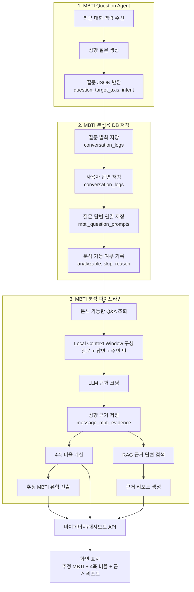
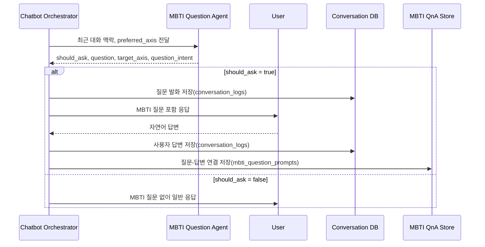
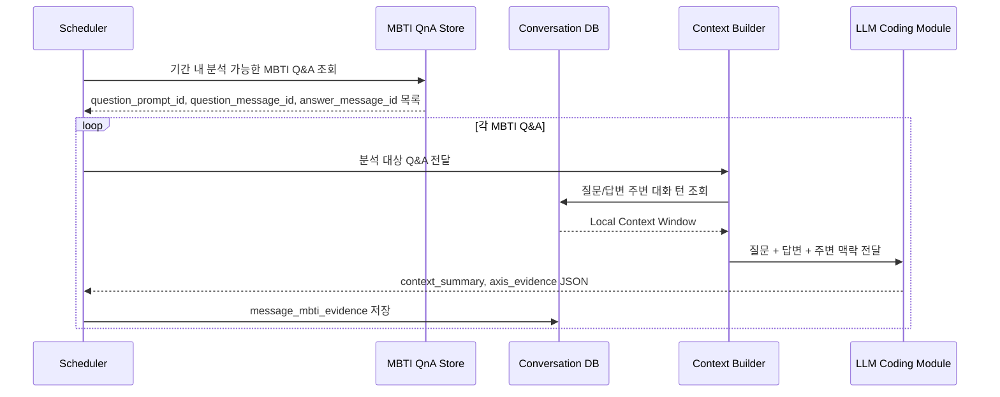
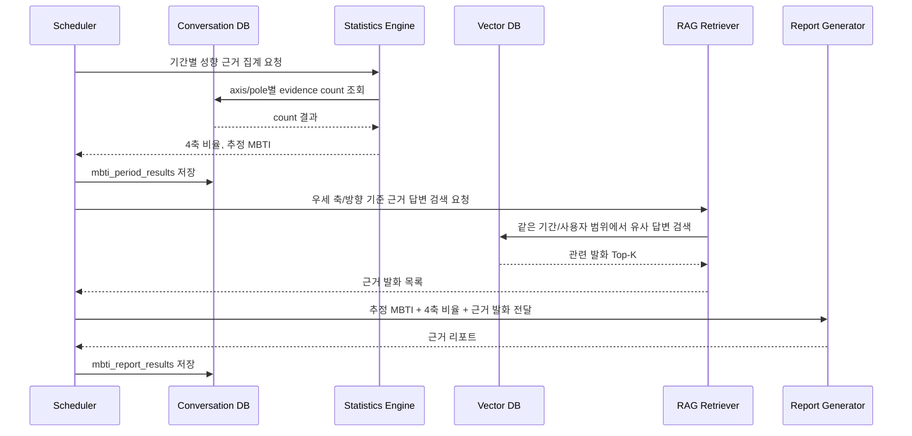
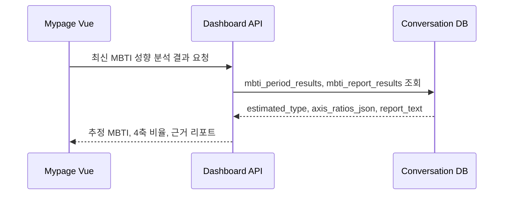
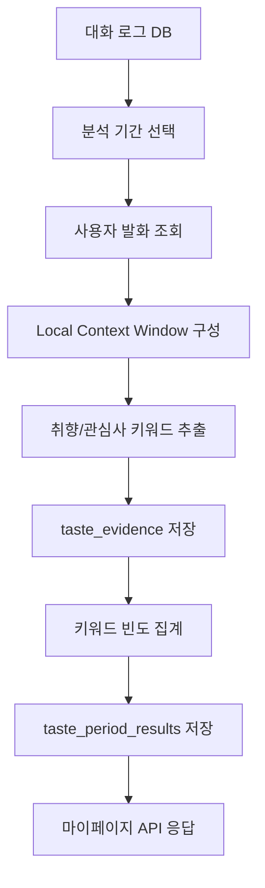
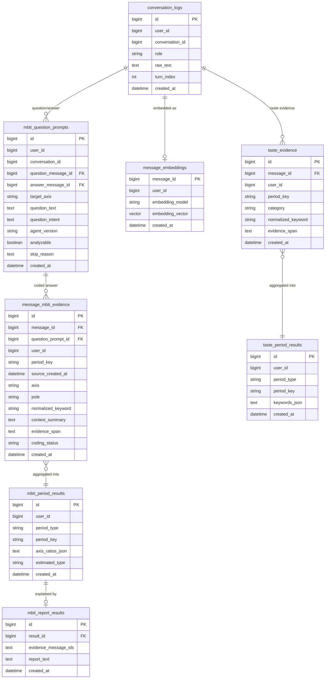

# MBTI 성향 및 취향 분석 대시보드 프로세스 흐름 보고서

## 0. 개편 목적

본 문서는 MBTI 성향 추정과 취향 분석을 마이페이지/대시보드에 제공하기 위한 현실적인 처리 흐름을 정리한다.

핵심 전제는 일반 대화 로그 전체를 그대로 MBTI 분석 대상으로 삼지 않는다는 점이다. 사용자의 대화가 많이 쌓여도 4축 성향을 판단할 맥락이 없는 대화만 누적될 수 있다. 따라서 MBTI 분석은 먼저 `MBTI Question Agent`가 성향 근거가 드러날 수 있는 질문을 만들고, 그 질문에 대한 사용자 답변을 별도로 축적한 뒤 수행한다.

전체 흐름은 다음과 같다.

```text
1. MBTI Question Agent가 질문 생성
2. 질문/답변을 DB에 저장하고 Q&A로 연결
3. 분석 가능한 Q&A만 MBTI 분석 파이프라인에 전달
4. LLM은 답변을 성향 근거 단위로 코딩
5. 서버가 4축 비율과 추정 MBTI 유형 계산
6. RAG로 실제 근거 답변을 찾아 근거 리포트 생성
7. 마이페이지/대시보드에 추정 MBTI, 4축 비율, 근거 리포트 표시
```

이 구조에서 LLM은 MBTI 유형을 직접 판정하지 않는다. LLM은 답변을 코딩 가능한 근거로 정리하고, 최종 비율과 유형 산출은 서버가 저장된 근거 count로 계산한다.

---

## 1. 핵심 결론

| 항목 | 권장 방식 |
| --- | --- |
| 선행 단계 | MBTI Question Agent로 분석 가능한 Q&A를 먼저 축적 |
| 분석 대상 | 일반 대화 전체가 아니라 `mbti_question_prompts`에 연결된 Q&A |
| LLM 역할 | 맥락 요약, 근거 문장 추출, 4축 성향 코드 부여 |
| 점수 계산 | 서버가 축별 두 방향 근거 수의 상대 비율 계산 |
| 최종 산출물 | 추정 MBTI 유형, 4축 비율, RAG 근거 리포트 |
| 취향 분석 | MBTI와 분리해 키워드 랭킹 형태로 제공 |
| 마이페이지 연동 | `mypage.vue`가 바로 렌더링할 수 있는 API 응답으로 변환 |

---

## 2. 전체 프로세스 흐름도



---

## 3. 시퀀스 다이어그램

단일 시퀀스 다이어그램에 모든 흐름을 넣으면 지나치게 커진다. 따라서 질문 축적, 근거 코딩, 결과 생성, 화면 조회로 나눈다.

### 3.1 MBTI 분석용 Q&A 축적



### 3.2 Q&A 근거 코딩



### 3.3 MBTI 결과 및 RAG 근거 리포트 생성



### 3.4 마이페이지 조회



---

## 4. MBTI Question Agent 설계

`MBTI Question Agent`는 MBTI 유형을 판정하지 않는다. 사용자가 자신의 선택 방식, 회복 방식, 판단 기준, 계획 방식을 자연스럽게 말하도록 질문을 생성하는 역할만 맡는다.

### 4.1 입력

```json
{
  "recent_context": [
    {"role": "user", "text": "요즘 팀플 일정 맞추는 게 너무 피곤해요."},
    {"role": "assistant", "text": "어떤 부분이 제일 부담스럽게 느껴졌어요?"}
  ],
  "preferred_axis": "JP",
  "axis_evidence_counts": {
    "IE": 3,
    "SN": 1,
    "TF": 2,
    "JP": 0
  },
  "last_question_axis": "IE",
  "tone": "soft_casual"
}
```

### 4.2 출력

```json
{
  "should_ask": true,
  "question": "해야 할 일이 생기면 먼저 계획을 잡아두는 편이에요, 아니면 상황을 보면서 조정하는 편이에요?",
  "target_axis": "JP",
  "question_intent": "계획/확정 선호와 유연/상황 대응 선호 확인",
  "tone": "casual"
}
```

`should_ask=false`이면 챗봇은 MBTI 질문을 포함하지 않는다. 위기, 강한 피로감, 명백한 거부감, 단답 흐름에서는 질문하지 않는 것이 기본값이다.

### 4.3 질문 생성 원칙

| 원칙 | 설명 |
| --- | --- |
| 검사처럼 묻지 않음 | “당신은 계획형인가요?”처럼 직접 묻지 않음 |
| 하나의 질문은 하나의 축만 겨냥 | IE, SN, TF, JP 중 하나만 확인 |
| 대화 맥락에 붙임 | 현재 대화의 후속 질문처럼 자연스럽게 생성 |
| 결과를 즉시 말하지 않음 | 답변 직후 “당신은 I네요” 같은 피드백 금지 |

### 4.4 축별 질문 예시

| 축 | 질문 예시 |
| --- | --- |
| IE | “사람들을 만나고 나면 보통 어떤 방식으로 다시 에너지를 회복해요?” |
| SN | “결정을 할 때 실제 경험이 더 도움이 돼요, 아니면 가능성을 상상해보는 게 더 도움이 돼요?” |
| TF | “의견이 다를 때 먼저 사실관계를 정리하는 편이에요, 아니면 상대 감정을 먼저 살피는 편이에요?” |
| JP | “해야 할 일이 생기면 먼저 계획을 잡아두는 편이에요, 아니면 상황을 보면서 조정하는 편이에요?” |

---

## 5. MBTI 분석 방식

### 5.1 LLM 코딩 출력

LLM은 MBTI 유형을 직접 출력하지 않고, 답변에서 관찰 가능한 근거만 구조화한다.

```json
{
  "message_id": "msg_1024",
  "context_summary": "사회적 교류 이후 혼자 조용히 회복하려는 맥락이 나타남.",
  "coding_status": "coded",
  "axis_evidence": [
    {
      "axis": "IE",
      "pole": "I",
      "normalized_keyword": "혼자 회복",
      "evidence_span": "약속 끝나면 혼자 조용히 있어야 회복돼요",
      "coding_reason": "사회적 상호작용 이후 에너지 회복 방식이 내향 쪽 근거에 가까움."
    }
  ]
}
```

코딩이 어려운 답변은 `coding_status=insufficient_context`로 저장하고 집계에서 제외한다.

### 5.2 점수 계산

점수는 LLM이 계산하지 않는다. 서버가 `message_mbti_evidence`에 저장된 근거 수를 집계한다.

```text
IE_I_ratio = I_count / (I_count + E_count)
IE_E_ratio = E_count / (I_count + E_count)
```

같은 방식으로 `SN`, `TF`, `JP` 축을 계산하고, 각 축의 우세 방향을 조합해 추정 MBTI 유형을 만든다.

표현은 단정하지 않는다.

```text
허용: 최근 대화에서 I 관련 근거가 E 관련 근거보다 더 많이 관찰되었습니다.
금지: 이 사용자는 객관적으로 I형입니다.
```

### 5.3 RAG 근거 리포트

RAG는 점수 계산에 사용하지 않는다. 계산이 끝난 뒤, 우세 축과 관련된 실제 사용자 답변을 찾아 근거 리포트에 넣는 용도로만 사용한다.

```text
IE: I 관련 근거가 E보다 더 많이 관찰되었습니다.
근거 예시: "약속 끝나면 혼자 조용히 있어야 회복돼요."
```

---

## 6. 취향/관심사 분석

취향 분석은 MBTI와 분리한다. MBTI는 Question Agent가 만든 Q&A만 분석하지만, 취향 분석은 일반 대화 로그에서 반복적으로 드러난 관심사 키워드를 추출한다.

### 6.1 취향 분석 흐름



### 6.2 마이페이지 응답 형태

현재 `mypage.vue`의 취향 분석 패널은 키워드 테이블 중심으로 볼 수 있으므로, 백엔드는 아래처럼 납작한 형태로 변환해 제공한다.

```json
{
  "period": "최근 30일",
  "keywords": [
    {
      "category": "음악",
      "keyword": "재즈",
      "score": 87,
      "frequency": 6,
      "source": "카페에서 듣는 잔잔한 재즈를 선호하는 발화가 반복됨"
    },
    {
      "category": "여행",
      "keyword": "조용한 숙소",
      "score": 74,
      "frequency": 4,
      "source": "사람이 적고 조용한 숙소를 선호하는 발화가 반복됨"
    }
  ]
}
```

---

## 7. ERD



---

## 8. 대시보드 API 응답

### 8.1 MBTI 성향 분석

```json
{
  "estimated_type": "INTP",
  "axis_ratios": {
    "IE": {"I": 0.72, "E": 0.28},
    "SN": {"S": 0.35, "N": 0.65},
    "TF": {"T": 0.68, "F": 0.32},
    "JP": {"J": 0.42, "P": 0.58}
  },
  "evidence_report": "최근 대화에서는 혼자 회복하려는 표현, 가능성을 먼저 탐색하는 표현, 논리 기준으로 판단하는 표현이 더 자주 관찰되었습니다."
}
```

### 8.2 취향 분석

```json
{
  "period": "최근 30일",
  "keywords": [
    {
      "category": "음악",
      "keyword": "재즈",
      "score": 87,
      "frequency": 6,
      "source": "잔잔한 재즈를 선호하는 발화가 반복됨"
    }
  ]
}
```

---

## 9. 최종 권장 프로세스

```text
[1단계: MBTI 분석용 대화로그 축적]
1. 챗봇 시스템이 MBTI Question Agent를 호출한다.
2. MBTI Question Agent가 자연어 질문을 생성한다.
3. 챗봇은 질문을 사용자에게 전달한다.
4. 질문 발화와 사용자 답변을 conversation_logs에 저장한다.
5. 질문-답변 연결을 mbti_question_prompts에 저장한다.
6. 이 단계에서는 MBTI 유형을 산출하지 않는다.

[2단계: MBTI 분석]
7. 주별/월별 분석 기간을 정한다.
8. mbti_question_prompts에 연결된 분석 가능한 Q&A만 조회한다.
9. LLM이 답변을 4축 성향 근거로 코딩한다.
10. 코딩 결과를 message_mbti_evidence에 저장한다.
11. 서버가 축별 두 방향 근거 수를 집계하고 4축 비율을 계산한다.
12. 우세 방향을 조합해 추정 MBTI 유형을 산출한다.
13. RAG로 실제 근거 답변을 찾아 근거 리포트를 만든다.
14. 마이페이지/대시보드에 추정 MBTI, 4축 비율, 근거 리포트를 제공한다.

[3단계: 취향 분석]
15. 취향 분석은 일반 대화 로그에서 관심사 키워드를 추출한다.
16. 결과는 마이페이지 취향 패널에 맞는 keywords 배열로 제공한다.
```

---

## 10. 결론

이 구조의 핵심은 MBTI 분석을 일반 대화 전체에 의존하지 않는다는 점이다. 먼저 `MBTI Question Agent`로 분석 가능한 Q&A를 축적하고, 그 데이터만 분석 파이프라인에 넣는다.

따라서 이 기능은 공식 MBTI 검사나 심리 진단이 아니다. 다만 사용자의 답변에서 어떤 성향 근거가 더 많이 관찰되는지를 설명 가능한 방식으로 계산하고, 실제 근거 답변을 함께 제시하는 대화 기반 성향 경향 분석 기능으로는 구현 가능하다.
