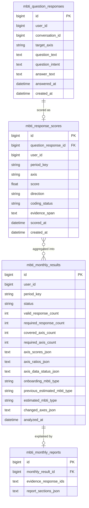
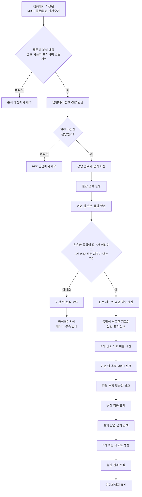
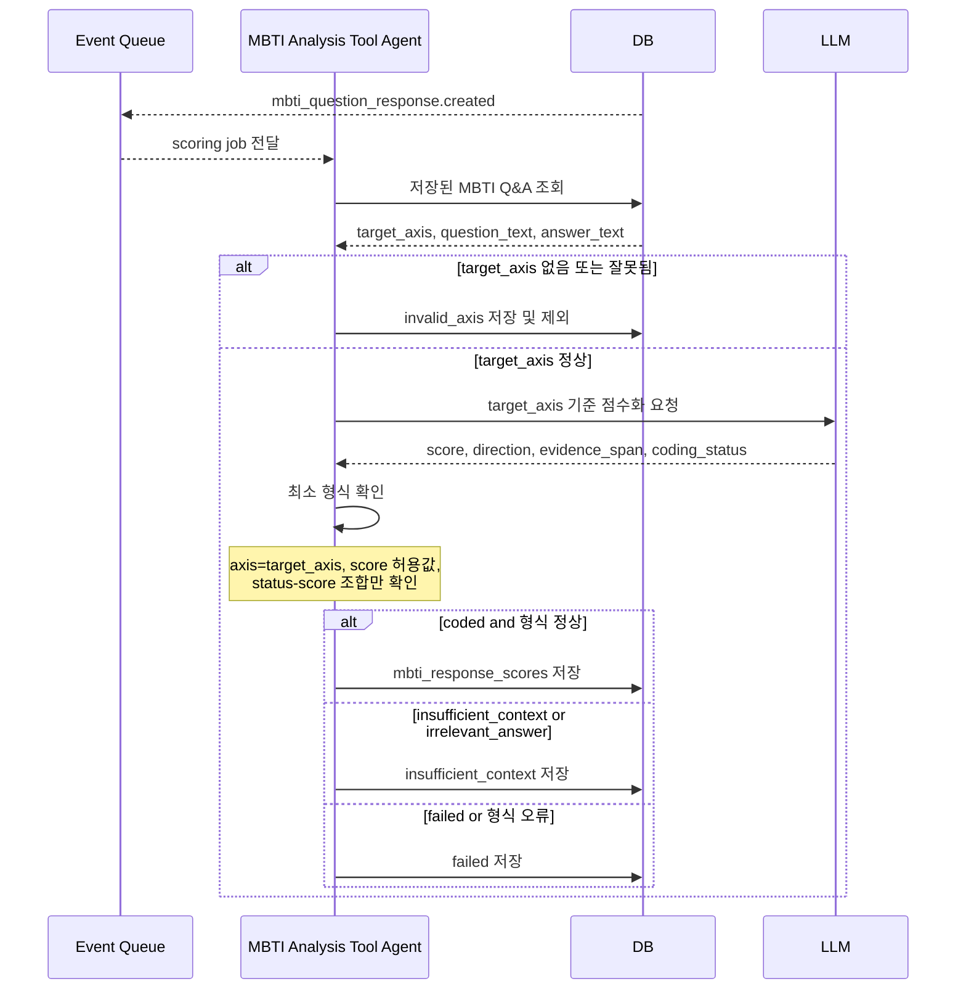
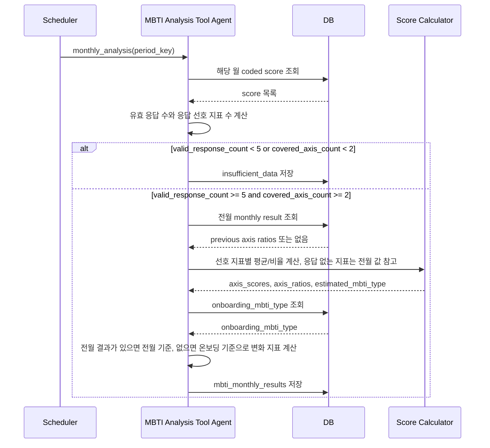
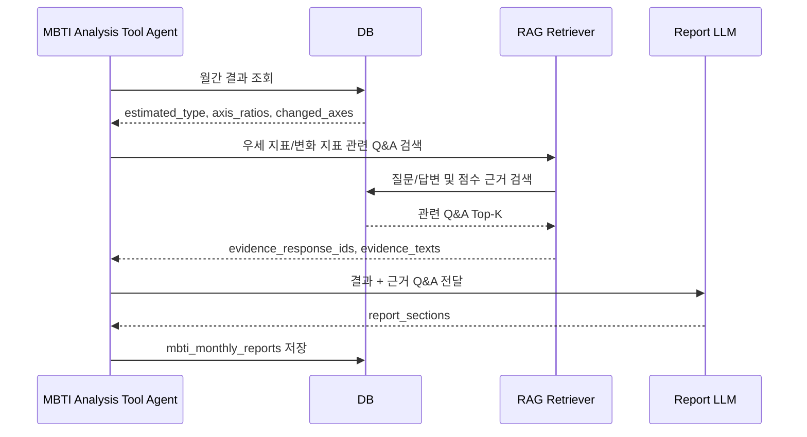
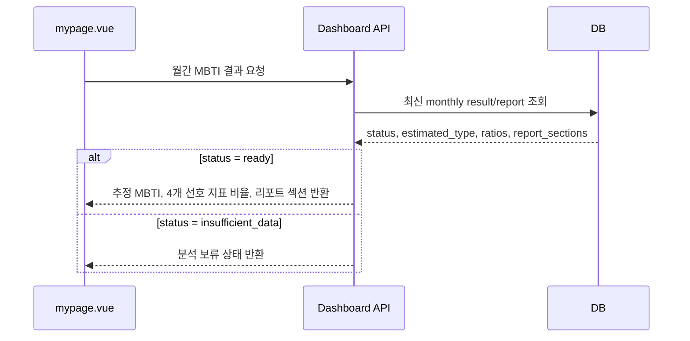
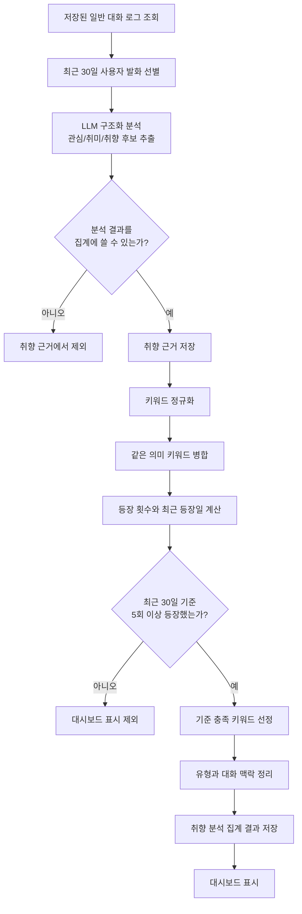
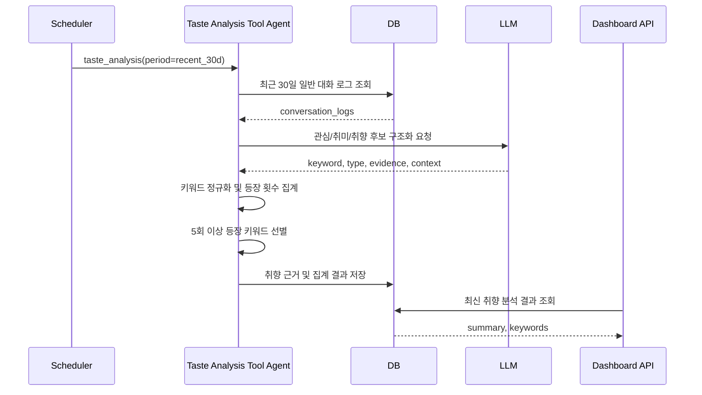
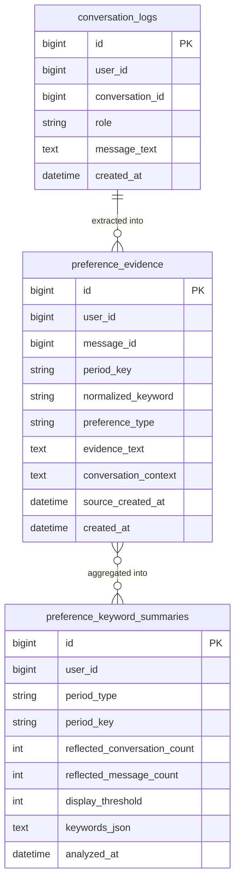

# MBTI 월간 성향 및 취향 분석 파이프라인 보고서

## 0. 목적

이 문서는 **챗봇 담당 시스템이 이미 저장한 MBTI 질문/답변 결과물**을 가져와 월 단위로 분석하는 파이프라인을 정리한다.

이 문서의 범위는 챗봇 내부 질문 생성, 챗봇 응답 구성, 사용자에게 질문을 노출하는 과정이 아니다. 분석 파이프라인은 이미 저장된 Q&A를 입력으로 받아 다음 결과를 만든다.

```text
- 월간 추정 MBTI
- 4개 선호 지표 비율
- 전월 MBTI 추정 결과 대비 변화 경향 리포트
- 실제 답변 기반 근거 리포트
- 최근 대화 기반 취향/관심 키워드 집계 현황
```

이 기능은 공식 MBTI 검사가 아니다. 저장된 MBTI 관련 답변을 바탕으로 "이번 달에는 어떤 성향이 더 많이 관찰되었는지"를 보여주는 보조 분석 기능이다.

---

## 1. 입력 전제

분석 파이프라인은 챗봇 결과물을 직접 생성하지 않는다. 아래 형태의 MBTI Q&A가 DB에 저장되어 있다고 전제한다.

```json
{
  "question_response_id": 1024,
  "user_id": 1,
  "conversation_id": 77,
  "question_message_id": 501,
  "answer_message_id": 502,
  "question_text": "낯선 모임에서 먼저 말을 거는 편인가요?",
  "answer_text": "친한 사람이 있으면 먼저 말하지만, 완전히 낯선 곳에서는 조용합니다.",
  "target_axis": "IE",
  "answered_at": "2026-06-24T21:10:00+09:00"
}
```

가장 중요한 입력값은 `target_axis`다. 구현 컬럼명은 `target_axis`로 두지만, 보고서 본문에서는 이를 **MBTI 선호 지표**라고 부른다.

```text
허용값: IE, SN, TF, JP
```

`target_axis`는 LLM이 어떤 선호 지표만 분석해야 하는지 알려주는 표지다. 예를 들어 `target_axis=IE`인 답변은 IE 선호 지표만 점수화하고, SN/TF/JP는 판단하지 않는다.

MBTI에서 일반적으로 말하는 네 구분은 `preference pairs`, `dichotomies`, 또는 `dimensions`로 설명된다. 한국어 문서에서는 이를 `선호 지표`, `선호 쌍`, `이분 척도` 정도로 옮길 수 있다. 본 문서에서는 구현 담당자가 이해하기 쉽게 **선호 지표**를 기본 용어로 사용한다.


| 코드  | 선호 지표 이름  | 양쪽 선호                             |
| --- | --------- | --------------------------------- |
| IE  | 에너지 방향 선호 | Extraversion(E) / Introversion(I) |
| SN  | 인식 기능 선호  | Sensing(S) / Intuition(N)         |
| TF  | 판단 기능 선호  | Thinking(T) / Feeling(F)          |
| JP  | 생활 양식 선호  | Judging(J) / Perceiving(P)        |


참고로 MBTI에서 `S/N`, `T/F`는 Jung의 심리 기능과 연결되어 각각 정보를 받아들이는 방식과 판단/결정 방식으로 설명되고, `E/I`는 에너지 또는 주의 방향, `J/P`는 외부 세계를 대하는 생활 양식 선호로 설명된다. 따라서 엄밀하게는 모두 같은 의미의 "축"이라기보다 네 개의 선호 쌍으로 보는 것이 더 자연스럽다.

---

## 2. 전체 방향


| 항목     | 권장 방식                                         |
| ------ | --------------------------------------------- |
| 분석 시작점 | DB에 저장된 MBTI Q&A                              |
| 분석 대상  | 일반 대화 전체가 아니라 `target_axis`가 있는 MBTI Q&A      |
| 점수 방식  | 질문 단위 Likert 점수화                              |
| 점수 범위  | `-1.0, -0.5, 0, +0.5, +1.0`                   |
| 분석 단위  | 월간                                            |
| 최소 조건  | 해당 월 유효 MBTI 응답 총 5개 이상, 최소 2개 선호 지표 이상 응답 존재 |
| 변화 기준  | 전월 월간 추정 결과와 이번 달 추정 결과 비교                    |
| 근거 리포트 | RAG로 실제 답변을 찾아 생성                             |


일반 대화 전체를 MBTI 분석에 넣지 않는 이유는 단순하다. 일상 대화에는 MBTI 선호 지표를 판단할 수 없는 발화가 많다. 따라서 챗봇 담당 영역에서 MBTI 질문/답변으로 저장한 데이터만 분석하는 것이 더 안정적이다.

---

## 3. 기본 프로세스

```text
1. 분석 파이프라인이 해당 월의 MBTI Q&A를 조회한다.
2. Q&A에 target_axis가 있는지 확인한다.
3. LLM이 target_axis 기준으로 답변을 점수화한다.
4. 서버가 최소 형식만 확인하고 점수화 결과를 저장한다.
5. 월간 배치가 해당 월의 유효 점수를 조회한다.
6. 유효 응답이 총 5개 미만이거나 응답 선호 지표가 2개 미만이면 분석하지 않는다.
7. 조건을 충족하면 선호 지표별 평균 점수를 계산한다.
8. 선호 지표별 평균 점수를 4개 선호 지표 비율로 변환한다.
9. 월간 추정 MBTI를 산출한다.
10. 전월 월간 추정 결과와 비교해 4개 선호 지표의 변화 경향을 확인한다.
11. RAG로 실제 답변 근거를 검색한다.
12. 근거 리포트를 생성한다.
13. 마이페이지에서 조회할 수 있도록 결과를 저장한다.
```

---

## 4. 점수화 방식

질문 1개는 하나의 측정 단위로 본다. 답변이 길더라도 점수는 하나만 만든다.

```text
Q&A 1개
→ target_axis 1개
→ score 1개
```

점수는 Likert 방식으로 준다. 공식 MBTI 채점식을 복제하는 것이 아니라, 자가 성향 테스트에서 흔히 쓰는 문항별 점수 합산 방식을 대화형 답변에 맞게 적용한다.

0.5 단위를 쓰는 이유는 5점 Likert 응답을 `-1.0 ~ +1.0` 범위로 정규화하면 각 단계 간격이 0.5가 되기 때문이다. Likert 방식은 보통 "매우 반대/반대/중립/동의/매우 동의"처럼 대칭적인 5개 선택지를 두고, 여러 문항의 응답을 합산하거나 평균내는 방식으로 사용된다. 이 문서에서는 그 구조를 MBTI 선호 지표 점수에 맞게 바꿔 사용한다.

기본 변환식은 다음과 같다.

```text
raw_likert_score = 1, 2, 3, 4, 5
normalized_score = (raw_likert_score - 3) / 2
```

변환 결과:

```text
1점 → -1.0
2점 → -0.5
3점 →  0
4점 → +0.5
5점 → +1.0
```

즉, 0.5 단위는 임의로 만든 값이 아니라 5점 척도를 `-1.0 ~ +1.0` 범위로 선형 변환한 결과다. LLM은 사용자의 자연어 답변을 직접 1~5 선택지로 받지는 않지만, 답변 강도를 아래 5단계 중 하나로 분류한 뒤 동일한 정규화 점수를 부여한다.

음수 점수는 오류가 아니다. `-1.0 ~ +1.0`은 양쪽 선호를 0 기준으로 표현하기 위한 내부 계산값이다. 예를 들어 IE에서 `+`는 E, `-`는 I를 뜻한다. 화면에는 음수를 그대로 보여주지 않고, 아래 월간 계산 단계에서 비율로 변환한다.


| 점수   | 의미               |
| ---- | ---------------- |
| +1.0 | + 방향 성향이 뚜렷함     |
| +0.5 | + 방향 성향이 약하게 우세함 |
| 0    | 중립 또는 양쪽 혼합      |
| -0.5 | - 방향 성향이 약하게 우세함 |
| -1.0 | - 방향 성향이 뚜렷함     |


실제 적용 예시는 다음과 같다.


| LLM 판단 단계     | raw 점수 | normalized 점수 | 예시 의미                 |
| ------------- | ------ | ------------- | --------------------- |
| - 방향이 뚜렷함     | 1      | -1.0          | IE 선호 지표에서 뚜렷한 I      |
| - 방향이 약하게 우세함 | 2      | -0.5          | IE 선호 지표에서 약한 I       |
| 중립/혼합         | 3      | 0             | IE 선호 지표에서 E/I 판단 어려움 |
| + 방향이 약하게 우세함 | 4      | +0.5          | IE 선호 지표에서 약한 E       |
| + 방향이 뚜렷함     | 5      | +1.0          | IE 선호 지표에서 뚜렷한 E      |


이 방식의 장점은 질문 1개가 점수 1개로 고정된다는 점이다. 답변이 길어서 근거 문장이 여러 개 나와도 점수가 여러 번 누적되지 않는다. 따라서 월간 계산은 `점수 총합 / 유효 응답 수`로 단순하게 처리할 수 있다.

참고 근거:

```text
- Likert 척도는 응답자의 동의/비동의 또는 태도 강도를 단계형 선택지로 측정하는 방식이다.
- 5점 Likert 문항은 보통 양쪽 극단과 중립을 포함하는 대칭 구조를 갖는다.
- 여러 문항의 응답값을 합산하거나 평균내어 하나의 척도 점수로 사용하는 방식이 일반적이다.
- 따라서 본 문서의 -1.0, -0.5, 0, +0.5, +1.0 구조는 5점 Likert 문항을 중심값 0 기준으로 정규화한 것이다.
```

외부 참고 자료:

```text
- Likert scale 개요: https://en.wikipedia.org/wiki/Likert_scale
- Likert scale의 심리학 설문 활용 개요: https://www.verywellmind.com/what-is-a-likert-scale-2795333
```

선호 지표별 부호는 고정한다.


| 선호 지표 | + 방향 | - 방향 |
| ----- | ---- | ---- |
| IE    | E    | I    |
| SN    | S    | N    |
| TF    | T    | F    |
| JP    | J    | P    |


예시:

```json
{
  "question_response_id": 1024,
  "axis": "IE",
  "score": -0.5,
  "direction": "slightly_I",
  "coding_status": "coded",
  "evidence_span": "완전히 낯선 곳에서는 조용합니다.",
  "reason": "낯선 환경에서 먼저 상호작용하기보다 조용히 있는 경향이 나타남"
}
```

판단이 어려운 답변은 억지로 점수를 주지 않는다.

```json
{
  "question_response_id": 1025,
  "axis": "TF",
  "score": null,
  "direction": "unknown",
  "coding_status": "insufficient_context",
  "evidence_span": null
}
```

`insufficient_context`는 월간 유효 응답 수에서 제외한다. 단순히 양쪽이 비슷한 답변은 `score=0`, `coding_status=coded`로 저장하고 유효 응답에 포함한다.

핵심은 `score=0`과 `score=null`을 구분하는 것이다.


| 상황              | coding_status        | score       | 월간 유효 응답 포함 여부 |
| --------------- | -------------------- | ----------- | -------------- |
| 한쪽 선호가 뚜렷함      | coded                | +1.0 / -1.0 | 포함             |
| 한쪽 선호가 약하게 우세함  | coded                | +0.5 / -0.5 | 포함             |
| 양쪽 선호가 비슷하게 섞임  | coded                | 0           | 포함             |
| 답변이 너무 짧거나 모호함  | insufficient_context | null        | 제외             |
| 질문과 무관한 답변      | irrelevant_answer    | null        | 제외             |
| LLM 호출 또는 파싱 실패 | failed               | null        | 제외             |


따라서 유효 응답은 "사용자가 답변했다"가 아니라, LLM이 해당 선호 지표에 대해 `coded` 상태로 점수를 산출한 응답이다.

### 4.1 MVP 기준 최소 검증

3주 MVP에서는 복잡한 검증과 재시도 로직을 넣지 않는다. LLM이 점수화한 결과를 서버가 최소 형식만 확인한 뒤 저장한다.

MVP 검증 기준은 아래 정도로 제한한다.


| 확인 항목    | 기준                                              | 실패 시 처리                            |
| -------- | ----------------------------------------------- | ---------------------------------- |
| 선호 지표 일치 | LLM이 반환한 `axis`가 원본 `target_axis`와 같음           | invalid_axis로 제외                   |
| 점수 허용값   | `score`가 `-1.0, -0.5, 0, +0.5, +1.0, null` 중 하나 | failed로 제외                         |
| 상태-점수 조합 | `coded`면 score 필수, 그 외 상태면 score는 null          | failed 또는 insufficient_context로 제외 |


`evidence_span`은 RAG 리포트의 근거로 사용하기 위해 저장하지만, MVP에서는 문장 포함 여부를 엄격하게 검증하지 않는다. 대신 프롬프트에서 "근거 문장은 반드시 답변 안의 표현을 사용하라"고 강하게 지시한다.

복잡한 검증은 고도화 단계로 둔다.

```text
고도화 후보:
- evidence_span이 실제 answer_text에 포함되는지 확인
- reason과 evidence_span의 충돌 여부 확인
- 검증 실패 시 1회 재시도
```

---

## 5. 월간 계산 방식

월간 배치는 해당 월의 유효 MBTI 점수를 조회한다.

```text
axis_avg = 해당 선호 지표 점수 총합 / 해당 선호 지표 유효 응답 수
```

예를 들어 IE 선호 지표 점수가 아래와 같다면:

```text
[-1.0, -0.5, 0, -1.0, +0.5]
```

계산 결과:

```text
IE_avg = -2.0 / 5 = -0.4
```

비율은 다음처럼 바꾼다.

```text
positive_ratio = (axis_avg + 1) / 2
negative_ratio = 1 - positive_ratio
```

이 변환 때문에 평균 점수가 음수여도 화면 비율 계산에는 문제가 없다. `axis_avg=-0.4`라면 +방향 비율은 30%, -방향 비율은 70%가 된다.

IE 선호 지표에서 `axis_avg=-0.4`이면:

```text
E_ratio = 0.3
I_ratio = 0.7
```

화면에는 이렇게 표시할 수 있다.

```json
{
  "IE": {
    "I": 0.7,
    "E": 0.3
  }
}
```

각 선호 지표에서 비율이 높은 방향을 조합해 월간 추정 MBTI를 만든다.

---

## 6. 최소 분석 조건

해당 월에 유효 MBTI 응답이 너무 적으면 분석하지 않는다. MVP 기준은 전체 유효 응답 수와 선호 지표 분포를 함께 본다.

```text
월간 분석 가능 조건:
- 전체 유효 MBTI 응답 수 >= 5
- 유효 응답이 존재하는 선호 지표 수 >= 2
```

유효 응답 기준:

```text
- MBTI Q&A로 저장된 답변
- target_axis 존재
- LLM 점수화 성공
- coding_status = coded
- score가 허용된 5개 값 중 하나
```

여기서 `score=0`은 유효 응답이다. 양쪽 선호가 비슷하거나 중립으로 판단 가능한 답변이기 때문이다. 반대로 `score=null`은 유효 응답이 아니다. 판단 근거가 부족하거나 답변이 무관하거나 처리에 실패한 경우다.

조건을 충족하지 못하면 결과를 이렇게 저장한다.

```json
{
  "period_key": "2026-06",
  "status": "insufficient_data",
  "valid_response_count": 3,
  "required_response_count": 5,
  "covered_axis_count": 1,
  "required_axis_count": 2,
  "message": "2026년 6월에는 MBTI 경향을 분석하기 위한 유효 응답이 부족하거나 응답 선호 지표가 2개 미만입니다."
}
```

이 조건을 두는 이유는 답변이 너무 적으면 한두 문장만으로 MBTI가 크게 흔들릴 수 있고, 한 선호 지표에만 응답이 몰리면 전체 경향을 설명하기 어렵기 때문이다. 다만 각 선호 지표별 5개를 요구하면 한 달에 총 20개 응답이 필요해져 현실적으로 분석 성공률이 낮아진다. 그래서 MVP에서는 `총 5개 + 최소 2개 선호 지표`를 기준으로 둔다.

선호 지표별 응답이 없는 경우에는 이번 달 새 점수를 억지로 만들지 않는다. 전월 결과가 있으면 해당 선호 지표는 전월 비율을 참고하고, 리포트에서 "이번 달 해당 선호 지표의 응답 근거가 부족해 전월 경향을 참고했다"고 설명한다. 전월 결과도 없으면 해당 선호 지표는 `insufficient_axis_data`로 표시한다.

---

## 7. 리포트 구성

월간 리포트는 길게 쓰지 않고 아래 3개 항목만 포함한다.

```text
1. MBTI 변화 경향 현황
2. MBTI 추정 및 경향분석 근거
3. 현재 MBTI에 대한 간단한 설명
```

MBTI 변화 경향은 **온보딩 입력 MBTI에서 시작해 매월 추정 결과를 이어가는 방식**으로 본다. 다만 매월 리포트의 직접 비교 대상은 온보딩 MBTI가 아니라 **전월의 월간 추정 결과**다.

```text
온보딩 MBTI: INFP
2026년 5월 추정 MBTI: INFP
2026년 6월 추정 MBTI: INTP
```

첫 번째 항목에서는 전월 추정 결과와 이번 달 추정 결과를 선호 지표 단위로 비교한다. 온보딩 MBTI는 첫 분석월에 전월 결과가 없을 때만 초기 기준점으로 사용한다.

```text
IE: I 유지
SN: N 유지
TF: F → T 변화
JP: P 유지
```

변화 정도는 별도 등급 필드로 강하게 산출하지 않는다. 리포트 문장 안에서 "대체로 유지", "일부 축에서 다르게 관찰"처럼 간단히 설명하면 충분하다.

두 번째 항목에서는 RAG로 찾은 실제 답변을 근거로 어떤 선호 지표의 점수가 왜 그렇게 나왔는지 설명한다.

세 번째 항목에서는 현재 추정 MBTI의 일반적인 특징을 짧게 설명한다. 단, 사용자를 단정하지 않고 "이번 달 응답 기준으로는 이런 경향에 가깝다"는 식으로 표현한다.

---

## 8. RAG 근거 검색

RAG는 점수 계산에 쓰지 않는다. 점수 계산은 저장된 `score`의 평균으로 끝낸다.

RAG는 계산 이후 실제 답변 근거를 찾는 데만 쓴다.

```text
- 월간 추정 MBTI를 뒷받침하는 답변
- 전월 결과와 달라진 선호 지표의 답변
- 비율이 비슷한 경계 선호 지표의 답변
```

예시 리포트:

```text
[1. MBTI 변화 경향 현황]
2026년 5월에는 INFP에 가까운 경향이었지만, 2026년 6월 응답에서는 INTP에 가까운 경향이 관찰되었습니다. IE, SN, JP 선호 지표는 전월과 유사하고, TF 선호 지표에서 F보다 T 방향의 응답이 더 많이 나타났습니다.

[2. MBTI 추정 및 경향분석 근거]
"먼저 기준을 정하고 사실관계를 확인한 뒤 결정한다"는 답변처럼 판단 기준을 논리적으로 정리하려는 표현이 확인되었습니다. 이 근거 때문에 TF 선호 지표에서 T 비율이 더 높게 계산되었습니다.

[3. 현재 MBTI에 대한 간단한 설명]
INTP는 보통 가능성을 탐색하고 논리적으로 구조화해 이해하려는 경향으로 설명됩니다. 다만 여기서는 성격을 확정하는 것이 아니라, 2026년 6월 답변에서 관찰된 경향으로 해석해야 합니다.
```

---

## 9. 저장 구조

### 9.1 MBTI 분석 ERD

`mbti_question_responses`는 챗봇 담당 영역에서 저장한 결과물로 본다. 분석 파이프라인은 이 데이터를 조회해서 점수와 월간 결과를 만든다.




---

## 10. 전체 프로세스 흐름도




---

## 11. 시퀀스 다이어그램

### 11.1 Q&A 점수화




### 11.2 월간 분석




### 11.3 RAG 리포트 생성




### 11.4 마이페이지 조회




---

## 12. API 응답 예시

### 12.1 분석 완료

```json
{
  "status": "ready",
  "period_type": "monthly",
  "period_key": "2026-06",
  "valid_response_count": 9,
  "required_response_count": 5,
  "covered_axis_count": 3,
  "required_axis_count": 2,
  "onboarding_mbti_type": "INFP",
  "previous_estimated_mbti_type": "INFP",
  "estimated_mbti_type": "INTP",
  "changed_axes": ["TF"],
  "axis_ratios": {
    "IE": {"I": 0.7, "E": 0.3},
    "SN": {"S": 0.36, "N": 0.64},
    "TF": {"T": 0.58, "F": 0.42},
    "JP": {"J": 0.39, "P": 0.61}
  },
  "report_sections": [
    {
      "title": "MBTI 변화 경향 현황",
      "content": "2026년 5월에는 INFP에 가까운 경향이었지만, 2026년 6월 응답에서는 INTP에 가까운 경향이 관찰되었습니다. IE, SN, JP 선호 지표는 전월과 유사하고 TF 선호 지표에서 T 방향 응답이 더 많이 나타났습니다."
    },
    {
      "title": "MBTI 추정 및 경향분석 근거",
      "content": "먼저 기준을 정하고 사실관계를 확인한 뒤 결정한다는 답변이 확인되어, TF 선호 지표에서 T 비율이 더 높게 계산되었습니다."
    },
    {
      "title": "현재 MBTI에 대한 간단한 설명",
      "content": "INTP는 보통 가능성을 탐색하고 논리적으로 구조화해 이해하려는 경향으로 설명됩니다. 여기서는 2026년 6월 답변 기준의 추정 경향으로 해석합니다."
    }
  ]
}
```

### 12.2 데이터 부족

```json
{
  "status": "insufficient_data",
  "period_type": "monthly",
  "period_key": "2026-06",
  "valid_response_count": 3,
  "required_response_count": 5,
  "covered_axis_count": 1,
  "required_axis_count": 2,
  "message": "2026년 6월에는 MBTI 경향을 분석하기 위한 유효 응답이 부족하거나 응답 선호 지표가 2개 미만입니다."
}
```

---

## 13. 취향 분석 파이프라인

취향 분석은 MBTI와 다르게 별도 질문 Q&A를 사용하지 않는다. 저장된 일반 대화 로그에서 관심 분야, 취미, 취향, 대화 선호를 LLM으로 구조화 추출한 뒤 최근 기간 기준으로 집계한다.

이 기능은 정교한 성향 추정보다 **대시보드 집계 현황 표시**가 목적이다. 스크린샷 기준으로 화면에는 아래 정보가 필요하다.

```text
- 조회 기간
- 반영 대화 수
- 반영 발화 수
- 표시 기준
- 기준 충족 키워드 목록
- 키워드 유형
- 등장 횟수
- 대화 맥락
- 최근 등장일
```

### 13.1 취향 분석 기준


| 항목     | 권장 방식                       |
| ------ | --------------------------- |
| 분석 입력  | 저장된 일반 대화 로그                |
| 분석 기간  | 최근 30일                      |
| LLM 역할 | 관심/취미/취향 후보 키워드와 근거 발화 구조화  |
| 서버 역할  | 키워드 정규화, 등장 횟수 집계, 표시 기준 적용 |
| 표시 기준  | 최근 30일 기준 5회 이상 등장          |
| 주요 산출물 | 기준 충족 키워드 목록과 집계 현황         |


키워드 유형은 MVP에서는 단순하게 3개로 둔다.


| 유형       | 의미                                      | 예시            |
| -------- | --------------------------------------- | ------------- |
| 최근 관심사   | 최근 대화에서 직접 반복된 관심 주제                    | 로파이 음악, 실내 식물 |
| 간접 취향 신호 | 직접 취향이라고 말하지 않았지만 반복 맥락상 취향으로 볼 수 있는 신호 | 감정 기록, 짧은 산책  |
| 대화 선호    | 사용자가 요청하거나 선호하는 대화 방식/추천 방향             | 선택지 줄이기       |


### 13.2 취향 분석 프로세스 흐름도




### 13.3 취향 분석 시퀀스 다이어그램




### 13.4 취향 분석 ERD




### 13.5 취향 분석 API 응답 예시

```json
{
  "status": "ready",
  "period_type": "recent_30d",
  "period_label": "최근 30일",
  "reflected_conversation_count": 18,
  "reflected_message_count": 128,
  "display_threshold": 5,
  "updated_at": "2026-06-24T14:20:00+09:00",
  "keywords": [
    {
      "keyword": "로파이 음악",
      "type": "최근 관심사",
      "count": 14,
      "conversation_context": "휴식, 집중 관련 대화",
      "last_seen": "06.22"
    },
    {
      "keyword": "감정 기록",
      "type": "간접 취향 신호",
      "count": 11,
      "conversation_context": "하루 정리, 메모 관련 대화",
      "last_seen": "06.21"
    },
    {
      "keyword": "실내 식물",
      "type": "최근 관심사",
      "count": 8,
      "conversation_context": "공간 안정감, 책상 꾸미기 대화",
      "last_seen": "06.19"
    }
  ],
  "guide": "저장된 대화 로그의 반복 맥락에서 일정 기준 이상 반복된 키워드만 표시합니다."
}
```

---

## 14. 책임 분리


| 영역                        | 책임                                                               |
| ------------------------- | ---------------------------------------------------------------- |
| 챗봇 담당 영역                  | MBTI 질문/답변 Q&A 저장                                                |
| MBTI Analysis Tool Agent  | 저장된 Q&A 점수화, 최소 형식 확인, 최소 조건 판단, 선호 지표별 평균/비율 계산, 전월 대비 변화 지표 확인 |
| Taste Analysis Tool Agent | 일반 대화 로그에서 취향 근거 추출, 키워드 정규화, 최근 30일 집계                          |
| RAG Retriever             | 우세 지표/변화 지표 관련 실제 Q&A 검색                                         |
| Report LLM                | 검색된 근거와 현재 추정 MBTI 설명을 바탕으로 3개 섹션 리포트 생성                         |
| Dashboard API             | `mypage.vue`가 바로 렌더링할 수 있는 응답 반환                                 |


---

## 15. 최종 권장 흐름

MBTI 분석:

```text
챗봇 담당 영역에서 저장된 MBTI Q&A 조회
→ target_axis 검증
→ LLM이 답변 1개당 점수 1개 산출
→ 서버가 최소 형식 확인 후 저장
→ 월간 유효 응답 총 5개 이상이고 최소 2개 선호 지표 이상인지 확인
→ 선호 지표별 평균 점수 계산
→ 4개 선호 지표 비율 및 월간 추정 MBTI 산출
→ 전월 월간 추정 결과와 비교해 변화 지표 확인
→ RAG로 실제 답변 근거 검색
→ 3개 섹션 리포트 생성
→ 마이페이지 표시
```

취향 분석:

```text
저장된 일반 대화 로그 조회
→ 최근 30일 사용자 발화 선별
→ LLM이 관심/취미/취향 후보 추출
→ 키워드 정규화 및 병합
→ 5회 이상 등장 키워드만 선정
→ 집계 현황 저장
→ 대시보드 표시
```

이 구조는 챗봇 내부 구현과 분석 파이프라인을 분리한다. MBTI 분석 담당자는 `target_axis`, `score`, `coding_status`, `period_key`, `valid_response_count`를 일관되게 관리하면 되고, 취향 분석 담당자는 `normalized_keyword`, `preference_type`, `count`, `conversation_context`, `last_seen`을 일관되게 관리하면 된다.