# MBTI 월간 성향 및 취향 분석 파이프라인 보고서

## 확정 MBTI 프로세스 흐름도

MBTI 월간 분석 프로세스는 **단순화된 파이프라인 흐름도**로 확정한다. 이 흐름도는 IE, SN, TF, JP 네 선호지표 축을 각각 독립적으로 판단하되, 같은 로직을 4번 반복해서 그리지 않고 공통 처리 흐름으로 표현한다.

저장 단계는 흐름도 박스로 표시하지 않는다. 점수화 결과, 월간 대표 결과, 선호지표 축별 결과, 리포트 결과는 각 산출물이 만들어진 직후 저장 구조에 따라 저장한다.

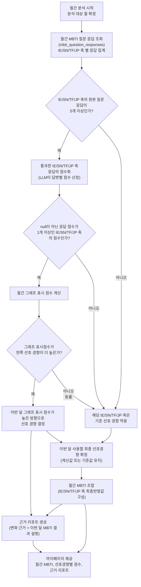

## 점수 산정 안정성 보강 흐름도

아래 흐름도는 기존 확정 MBTI 프로세스 흐름도를 대체하지 않는다. 기존 흐름도의 `D. 통과한 IE/SN/TF/JP 축 응답의 점수화` 단계를 더 안정적으로 구현하기 위한 내부 보강 흐름이다. 목적은 LLM이 같은 자유서술형 답변을 보고 개별 응답 점수를 미세하게 다르게 산출하는 문제를 줄이고, 최소 검증을 통과한 점수만 월간 그래프 표시 점수 계산에 사용하도록 하는 것이다.

이 프로젝트의 MBTI Q&A는 **질문은 고정되어 있고 답변은 자유서술형**이라고 전제한다. 따라서 LLM에게 점수를 직접 산정하게 하지 않고, `target_axis`별로 미리 정의한 Big Five 기반 루브릭 코드 목록 안에서 답변을 분류하게 한다. 점수 규칙은 사람이 정의한 Big Five 5단계 성향 루브릭과 서버 매핑에 고정하고, LLM은 자유서술형 답변을 가장 적절한 `rubric_code`에 매칭하는 역할만 수행한다.

점수 안정화 로직의 핵심은 다음 세 가지다.

```text
1. IE/SN/TF/JP 표시 축에 대응하는 Big Five 성향 루브릭을 사람이 정의한다.
2. LLM은 자유서술형 답변을 해당 target_axis의 rubric_code 중 하나에 매칭한다.
3. 서버는 rubric_code를 5단계 점수로 변환하고, 최소 검증을 통과한 점수만 월간 계산에 사용한다.
```

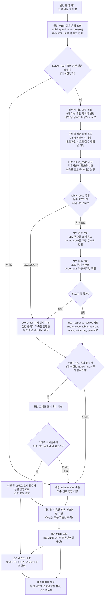

이 보강 흐름의 핵심은 원래 흐름도처럼 월간 분석의 전체 흐름을 유지하되, 점수화 내부를 **선호경향별 루브릭 기반 채점**으로 바꾸는 것이다. 질문은 이미 `target_axis`를 갖고 있으므로 LLM은 어떤 축을 판단할지 새로 정하지 않는다. 대신 해당 축에 연결된 선호경향 루브릭 목록 안에서 자유서술형 답변이 어느 코드에 가장 가까운지 고른다.

위 흐름도에서 추가된 부분은 `점수화 대상 응답 선정`부터 `mbti_response_scores 저장`까지다. 이 구간만 기존 `통과한 IE/SN/TF/JP 축 응답의 점수화` 단계를 내부적으로 풀어쓴 것이며, 그 뒤의 월간 그래프 표시 점수 계산, 선호 경향 결정, 월간 MBTI 조합, 리포트 생성 흐름은 기존 확정 흐름도와 동일하게 유지한다.

각 추가 노드의 의미는 아래와 같다.

| 노드 | 의미 |
| --- | --- |
| 루브릭 버전 파일 로드 | 서버가 `mbti_scoring_rubrics.v1.json` 같은 배포 파일을 읽는다. 루브릭 정의를 DB 테이블에서 조회하지 않는다. |
| LLM `rubric_code` 매칭 | LLM은 점수를 직접 산정하지 않고, 자유서술형 답변을 허용된 `rubric_code` 중 하나로 분류한다. |
| 서버 점수 변환 | 서버가 루브릭 파일의 고정 매핑에 따라 `rubric_code`를 `score`로 변환한다. |
| 서버 최소 검증 | `rubric_code` 존재 여부와 `target_axis` 허용 여부만 확인한다. |
| `mbti_response_scores` 저장 | 루브릭 원본은 저장하지 않고, `rubric_code`, `rubric_version`, `score`, `evidence_span`을 저장한다. |

예를 들어 `target_axis=IE`인 질문이라면, IE 축 공통 선호경향 루브릭은 다음처럼 구성할 수 있다.

```text
IE_E_STRONG        → +1.0
IE_E_WEAK          → +0.5
IE_MIXED_BALANCED  →  0.0
IE_I_WEAK          → -0.5
IE_I_STRONG        → -1.0
IE_EXCLUDE_CONTEXTUAL     → null
IE_EXCLUDE_INSUFFICIENT   → null
```

LLM 출력은 숫자 점수가 아니라 아래처럼 제한한다.

```json
{
  "target_axis": "IE",
  "rubric_code": "IE_I_WEAK",
  "evidence_span": "완전히 낯선 곳에서는 조용합니다",
  "reason": "낯선 환경에서 먼저 말하기 어렵다는 약한 I 근거"
}
```

서버는 `rubric_code`를 기준으로만 점수를 변환한다. 이때 서버 최소 검증은 `rubric_code`가 실제 루브릭 파일에 존재하는지, 원본 Q&A의 `target_axis`에 허용된 코드인지, 점수가 LLM 출력값이 아니라 서버 매핑으로만 계산되는지를 확인하는 정도로 제한한다. `EXCLUDE_*` 코드는 점수 계산에서 제외하고, `MIXED_BALANCED`는 실제로 양쪽 근거가 비슷한 무게로 함께 나타난 경우에만 `0.0`으로 사용한다. `evidence_span`은 리포트 근거로 저장하되, MVP에서는 실제 답변 포함 여부를 엄격한 서버 검증 조건으로 두지 않는다.

반복 실행 안정성을 위해 같은 응답을 다시 점수화해야 할 때는 기존 `mbti_response_scores`에 저장된 `rubric_code`, `score`, `evidence_span`을 우선 재사용한다. 프롬프트, 모델, 루브릭 정의, 점수 매핑 규칙이 바뀌는 경우에만 버전을 올려 새 점수화 결과와 기존 결과를 구분한다. 이 방식은 "LLM이 MBTI 점수를 직접 매긴다"가 아니라, **선호경향별 루브릭 채점 시스템에 LLM을 자유서술형 답변 해석기로 붙인 구조**로 설명할 수 있다.


※ 근거 리포트 생성은 두 입력을 함께 사용한다.

- 이번 달 표시 점수가 높은 방향으로 선호 경향이 결정된 축: 변화 근거를 실제 응답에서 선별한다.
- 월간 MBTI 조합 결과: 이번 달 MBTI 결과에 대한 짧은 설명을 생성한다.
- MVP+에서는 Graph RAG를 사용해 확정된 월간 MBTI 성격 유형의 간단 설명을 리포트에 보강할 수 있다. 이 설명은 `score`, `axis_avg`, `selected_letter`를 바꾸지 않으며, 리포트 문장 생성에만 사용한다.

---


## 0. 목적

이 문서는 **챗봇 담당 시스템이 이미 저장한 MBTI 질문/답변 결과물**을 가져와 월 단위로 분석하는 파이프라인을 정리한다.

이 문서의 범위는 챗봇 내부 질문 생성, 챗봇 응답 구성, 사용자에게 질문을 노출하는 과정이 아니다. 분석 파이프라인은 이미 저장된 Q&A를 입력으로 받아 다음 결과를 만든다.

```text
- 이번 달 MBTI 성격 유형
- 전달 MBTI 성격 유형 또는 현재 월 이전의 최신 기준 MBTI 성격 유형
- 4개 선호지표 축별 점수와 표시 점수
- 실제 답변 기반 근거 리포트
- 최근 대화 기반 취향/관심 키워드 집계 현황
```

이 기능은 공식 MBTI 검사가 아니다. 저장된 MBTI 관련 답변을 바탕으로 "이번 달에는 어떤 성향이 더 많이 관찰되었는지"를 보여주는 보조 분석 기능이다.

---


## 0.1 용어 기준

이 문서에서는 MBTI 관련 용어를 아래처럼 구분해 사용한다.


| 구분         | 용어                     | 예시                     | 의미                                        |
| ---------- | ---------------------- | ---------------------- | ----------------------------------------- |
| 선호지표 축     | IE, SN, TF, JP         | `IE`, `SN`, `TF`, `JP` | 어떤 성향 쌍을 측정할지 나타내는 분석 축이다.                |
| 선호 경향      | I, E, S, N, T, F, J, P | `I`, `E`, `N`, `T`     | 각 선호지표 축 안에서 선택되는 한쪽 방향이다.                |
| MBTI 성격 유형 | 4개 선호 경향의 조합           | `INFP`, `INTP`         | IE/SN/TF/JP 각 축에서 선택된 선호 경향을 조합한 4글자 결과다. |


예를 들어 `IE`는 선호지표 축이고, `I`와 `E`는 그 축 안에서 선택될 수 있는 선호 경향이다. `INFP`는 네 개의 선호 경향 `I`, `N`, `F`, `P`를 조합한 MBTI 성격 유형이다.

구현 컬럼명은 기존 이름을 유지한다. 예를 들어 `target_axis`, `axis`, `selected_letter`, `estimated_mbti_type` 같은 컬럼명은 DB 스키마의 명확성을 위해 유지하되, 본문 설명에서는 각각 선호지표 축, 선택된 선호 경향, MBTI 성격 유형으로 풀어 설명한다.

---


## 1. 입력 전제

분석 파이프라인은 챗봇 결과물을 직접 생성하지 않는다. MBTI Q&A 테이블에는 챗봇 담당 영역에서 이미 선별해 저장한 MBTI 관련 질문/답변 쌍만 들어온다고 전제한다. 따라서 분석 파이프라인은 일반 대화가 섞였는지, 질문이 MBTI 관련 질문인지 다시 판별하지 않는다. 아래 형태의 MBTI Q&A가 DB에 저장되어 있다고 전제한다.

```json
{
  "question_response_id": 1024,
  "user_id": 1,
  "conversation_id": 77,
  "question_message_id": 501,
  "answer_message_id": 502,
  "question_text": "낯선 모임에서 먼저 말을 거는 편인가요?",
  "answer_text": "친한 사람이 있으면 먼저 말하지만, 완전히 낯선 곳에서는 조용합니다.",
  "target_axis": "IE",
  "answered_at": "2026-06-24T21:10:00+09:00"
}
```

가장 중요한 입력값은 `target_axis`다. 구현 컬럼명은 `target_axis`로 두지만, 보고서 본문에서는 이를 **선호지표 축**이라고 부른다.

```text
허용값: IE, SN, TF, JP
```

`target_axis`는 LLM이 어떤 선호지표 축만 분석해야 하는지 알려주는 표지다. 예를 들어 `target_axis=IE`인 답변은 IE 선호지표 축만 점수화하고, SN/TF/JP는 판단하지 않는다.

MBTI에서 일반적으로 말하는 네 구분은 `preference pairs`, `dichotomies`, 또는 `dimensions`로 설명된다. 한국어 문서에서는 이를 `선호지표 축`, `선호 쌍`, `이분 척도` 정도로 옮길 수 있다. 본 문서에서는 구현 담당자가 이해하기 쉽게 **선호지표 축**을 기본 용어로 사용한다.


| 코드  | 선호지표 축 이름 | 양쪽 선호 경향                          |
| --- | --------- | --------------------------------- |
| IE  | 에너지 방향 선호 | Extraversion(E) / Introversion(I) |
| SN  | 인식 기능 선호  | Sensing(S) / Intuition(N)         |
| TF  | 판단 기능 선호  | Thinking(T) / Feeling(F)          |
| JP  | 생활 양식 선호  | Judging(J) / Perceiving(P)        |


참고로 MBTI에서 `S/N`, `T/F`는 Jung의 심리 기능과 연결되어 각각 정보를 받아들이는 방식과 판단/결정 방식으로 설명되고, `E/I`는 에너지 또는 주의 방향, `J/P`는 외부 세계를 대하는 생활 양식 선호로 설명된다. 따라서 엄밀하게는 모두 같은 의미의 "축"이라기보다 네 개의 선호 쌍으로 보는 것이 더 자연스럽다.

---


## 2. 전체 방향


| 항목       | 권장 방식                                                                                  |
| -------- | -------------------------------------------------------------------------------------- |
| 분석 시작점   | DB에 저장된 MBTI Q&A                                                                       |
| 분석 대상    | MBTI Q&A 테이블에 저장된 질문/답변 쌍                                                              |
| 점수 방식    | 질문 단위 Likert 점수화                                                                       |
| 점수 범위    | `-1.0, -0.5, 0, +0.5, +1.0`                                                            |
| 분석 단위    | 월간                                                                                     |
| 1차 개시 조건 | 해당 월 DB에 저장된 MBTI Q&A 원본 레코드 기준으로, 선호지표 축별 저장 건수가 5개 이상인 선호지표 축만 점수화/분석 시도 대상이 됨       |
| 2차 개시 조건 | 1차 개시를 통과한 선호지표 축 중 숫자 점수(`coding_status=coded`)가 최소 1개 이상 있는 선호지표 축만 이번 달 계산값으로 변화 반영 |
| 저장 방식    | 월간 대표 결과와 IE/SN/TF/JP별 선호지표 축 결과를 분리 저장                                                |
| 변화 기준    | 현재 월 이전의 가장 최근 월간 추정 MBTI 성격 유형과 이번 달 추정 MBTI 성격 유형 비교                                 |
| 근거 리포트   | 계산에 사용된 score row를 SQL로 조회하고 점수 기준으로 대표 근거를 선별해 생성                                     |


일반 대화 전체를 MBTI 분석에 넣지 않는 이유는 단순하다. 일상 대화에는 MBTI 선호지표 축을 판단할 수 없는 발화가 많다. 이 필터링은 챗봇 담당 영역에서 끝난 것으로 보고, 분석 파이프라인은 MBTI Q&A 테이블에 저장된 데이터만 점수화와 월간 집계 대상으로 사용한다.

---


## 3. 기본 프로세스

프로세스는 서두의 확정 흐름도 순서대로 진행한다.

```text
1. 월간 MBTI Q&A 조회
   - 해당 월의 `mbti_question_responses`를 조회한다.
   - `target_axis` 기준으로 IE/SN/TF/JP별 원본 Q&A 수를 집계한다.

2. 1차 개시 판단
   - 같은 선호지표 축의 원본 Q&A가 5개 이상이면 점수화 대상으로 본다.
   - 5개 미만이면 이번 달 새 계산을 하지 않고 기준 선호 경향을 적용한다.

3. 답변 점수화
   - 1차 개시를 통과한 축의 Q&A만 선호경향별 루브릭 매칭 대상으로 본다.
   - LLM은 자유서술형 답변을 원본 Q&A의 `target_axis`에 연결된 `rubric_code` 중 하나로 분류한다.
   - 서버는 `rubric_code`를 고정 점수로 변환하고, 결과를 `mbti_response_scores`에 저장한다.

4. 2차 개시 판단
   - null이 아닌 숫자 점수(`coding_status=coded`)가 1개 이상이면 평균 계산 대상으로 본다.
   - 숫자 점수가 없으면 이번 달 새 방향을 확정하지 않고 기준 선호 경향을 적용한다.

5. 그래프 표시 점수와 선호 경향 결정
   - 2차 개시를 통과한 축만 평균 점수와 표시 점수를 계산한다.
   - 표시 점수에서 한쪽 선호 경향이 더 높으면 그 방향을 이번 달 `selected_letter`로 정한다.
   - 표시 점수가 동률이면 새 방향을 확정하지 않고 기준 선호 경향을 적용한다.

6. 월간 MBTI 조합
   - 이번 달 계산값과 기준 선호 경향을 합쳐 IE/SN/TF/JP의 최종 선호 경향을 만든다.
   - 네 축의 최종 선호 경향을 조합해 월간 추정 MBTI 성격 유형을 산출한다.

7. 근거 리포트 생성 및 마이페이지 제공
   - 이번 달 계산에 실제 사용된 score row에서 대표 근거 답변을 선별한다.
   - 리포트는 변화 현황, 답변 근거, 현재 MBTI 간단 설명으로 구성한다.
   - 월간 결과, 축별 결과, 리포트를 저장한 뒤 마이페이지 API가 함께 반환한다.
```

MBTI Q&A 테이블에는 이미 분석 대상 질문/답변만 저장되므로, 분석 파이프라인은 별도의 MBTI 관련성 검증을 반복하지 않는다. 핵심은 **축별 독립 판단**과 **부분 갱신**이다. IE/SN/TF/JP 중 이번 달 근거가 충분한 축만 갱신하고, 기준을 충족하지 못한 축은 과거 월간 결과 또는 온보딩 값에서 이어받는다.

### 3.1 단계별 세부 설계

아래 표는 확정 흐름도의 각 노드를 개발자가 구현 단위로 옮길 때의 기준이다. 구현에서는 한 번의 월간 분석 실행을 `user_id + period_key` 단위로 처리하고, IE/SN/TF/JP는 같은 로직을 축별로 반복한다.


| 단계                         | 입력                                      | 출력                                            | 구현 맥락                                                                                                                        |
| -------------------------- | --------------------------------------- | --------------------------------------------- | ---------------------------------------------------------------------------------------------------------------------------- |
| 1. 월간 분석 시작, 분석 대상 월 확정    | `user_id`, 실행일 또는 요청 월                  | `period_key`, 조회 기간 시작/종료                     | 배치 실행 시 KST 기준 월을 확정한다. 재실행 가능성을 고려해 같은 `user_id + period_key`는 upsert 대상으로 본다.                                              |
| 2. 월간 MBTI Q&A 조회 및 축별 집계  | `period_key`, `mbti_question_responses` | 축별 Q&A 목록, `qna_count`                        | `target_axis IN (IE,SN,TF,JP)`만 축별 그룹으로 묶는다. 이 단계에서는 Q&A를 새로 만들거나 일반 대화를 다시 판별하지 않는다.                                        |
| 3. 원본 질문 응답 5개 이상 여부 판단    | 축별 Q&A 목록                               | `primary_open`, `primary_closed` 축 목록         | 축마다 독립 판단한다. 5개 미만인 축은 점수화하지 않고 기준 선호 경향 적용 단계로 보낸다.                                                                         |
| 4. 통과 축 응답 점수화             | 1차 개시 축의 Q&A, 기존 score row              | `mbti_response_scores`                        | 이미 점수화된 Q&A는 재사용하고, 없는 Q&A만 LLM 점수화를 요청한다. Q&A 1개당 score row 1개를 만든다.                                                        |
| 5. null이 아닌 점수 1개 이상 여부 판단 | 축별 score row                            | `secondary_open`, `secondary_closed` 축 목록     | `coding_status=coded`이고 `score IS NOT NULL`인 row만 평균 계산에 사용한다. 하나도 없으면 기준 선호 경향 적용 단계로 보낸다.                                  |
| 6. 월간 그래프 표시 점수 계산         | 2차 개시 축의 coded score row                | `axis_avg`, `axis_ratios`, 표시 점수              | 평균 점수를 계산한 뒤 화면 표시용 양쪽 비율로 변환한다. 표시 점수 계산식은 한 곳의 공통 함수로 둔다.                                                                  |
| 7. 표시 점수 우세 여부 판단          | `axis_ratios` 또는 표시 점수                  | 우세 방향 또는 `tie_carried`                        | 평균 원점수가 아니라 화면에 보여줄 표시 점수 기준으로 판단한다. 양쪽 표시 점수가 같으면 동률로 본다.                                                                   |
| 8. 이번 달 선호 경향 결정           | 우세 방향, 축별 부호 매핑                         | 이번 달 계산 기반 `selected_letter`                  | IE/SN/TF/JP별 `+/-` 방향 매핑을 사용한다. 예: IE에서 `+`는 E, `-`는 I다.                                                                     |
| 9. 최종 선호 경향 확정             | 이번 달 계산값 또는 기준 선호 경향 후보                 | 축별 최종 `selected_letter`, `data_status`        | 계산값이 있으면 `current_month`, 없으면 기준값 출처에 따라 `carried_from_previous`, `carried_from_onboarding`, `insufficient_axis_data`를 기록한다. |
| 10. 월간 MBTI 조합             | IE/SN/TF/JP 최종 `selected_letter`        | `estimated_mbti_type` 또는 산출 불가 상태             | 네 축이 모두 확정되면 4글자 MBTI를 만든다. 하나라도 산출 불가면 대표 결과는 `insufficient_data`로 둔다.                                                      |
| 11. 근거 리포트 생성              | 월간 대표 결과, 축별 결과, score row              | `report_sections_json`, `evidence_items_json` | 변경 축과 이번 달 반영 축을 중심으로 실제 계산에 사용된 답변 근거를 선별한다. 기준 유지 축은 유지 사유만 설명한다.                                                          |
| 12. 근거 리포트 생성 입력 병합        | `selected_letter` 결정 결과, 월간 MBTI 조합 결과  | 리포트 생성용 컨텍스트                                  | 흐름도상 리포트 노드는 계산값 결정과 월간 MBTI 조합에서 모두 입력을 받는다. 구현에서는 두 결과가 준비된 뒤 리포트를 한 번만 생성한다.                                              |
| 13. 기준 선호 경향 적용            | 기준 미충족 축, 과거 월간 결과, 온보딩 MBTI            | 기준 `selected_letter` 또는 산출 불가                 | 현재 월 이전의 최신 축별 결과를 먼저 찾고, 없으면 온보딩 MBTI에서 해당 축의 글자를 가져온다. 둘 다 없으면 해당 축은 산출 불가다.                                               |


### 3.2 테스트 전략

테스트는 축별 분기와 최종 조합이 의도대로 동작하는지를 검증하는 방향으로 구성한다. 실제 LLM 호출은 단위 테스트에서 고정 응답으로 대체하고, LLM 프롬프트 자체는 별도 샘플셋으로 평가한다.


| 테스트 대상       | 테스트 데이터                                          | 기대 결과                                                     |
| ------------ | ------------------------------------------------ | --------------------------------------------------------- |
| 분석 대상 월 확정   | 실행일 `2026-06-28`, 요청 월 없음                        | `period_key=2026-06`                                      |
| 1차 개시 통과     | IE Q&A 5개, SN Q&A 4개                             | IE는 `primary_open=true`, SN은 `primary_closed`             |
| 2차 개시 통과     | IE score 5개 중 coded 1개, TF score 5개 모두 null      | IE는 `secondary_open=true`, TF는 `secondary_closed`         |
| 표시 점수 우세     | TF 평균 점수 `0.2`                                   | TF의 `selected_letter=T`                                   |
| 표시 점수 동률     | IE 표시 점수 `I 50% / E 50%`                         | 새 방향 확정 없이 기준값 유지, `tie_carried`                          |
| 기준값 적용       | SN 이번 달 Q&A 2개, 과거 월간 SN=`N`                     | SN `selected_letter=N`, 기준 출처는 과거 월간 결과                   |
| 온보딩 fallback | JP 과거 월간 결과 없음, 온보딩 MBTI=`INFP`                  | JP `selected_letter=P`, 기준 출처는 온보딩                        |
| 산출 불가        | 특정 축 계산값 없음, 과거 결과 없음, 온보딩 없음                    | 해당 축 `insufficient_axis_data`, 대표 결과는 `insufficient_data` |
| 월간 MBTI 조합   | I, N, T, P 확정                                    | `estimated_mbti_type=INTP`                                |
| 리포트 근거 선별    | TF selected_letter=T, score `1.0`, `0.5`, `-0.5` | T 방향 양수 score 중 절댓값 큰 답변이 대표 근거 우선                        |
| 재실행/upsert   | 같은 `user_id + period_key`로 두 번 실행                | 월간 대표 결과와 축별 결과가 중복 insert되지 않고 갱신                        |


통합 테스트용 최소 데이터는 한 사용자에 대해 `2026-05` 기존 월간 결과 `INFP`, `2026-06` Q&A를 축별로 다르게 구성한다. 예를 들어 IE는 5개 coded로 I 유지, TF는 6개 coded로 T 변경, SN은 2개라 기준값 유지, JP는 0개라 온보딩 값 유지로 만들면 부분 갱신, 변화 축, fallback, 리포트 생성을 한 번에 검증할 수 있다.

---


## 4. 점수화 방식

질문 1개는 하나의 측정 단위로 본다. 답변이 길더라도 점수는 하나만 만든다.

```text
Q&A 1개
→ target_axis 1개
→ score 1개
```

점수는 Likert 방식으로 준다. 공식 MBTI 채점식을 복제하는 것이 아니라, 자가 성향 테스트에서 흔히 쓰는 문항별 점수 합산 방식을 대화형 답변에 맞게 적용한다.

0.5 단위를 쓰는 이유는 5점 Likert 응답을 `-1.0 ~ +1.0` 범위로 정규화하면 각 단계 간격이 0.5가 되기 때문이다. Likert 방식은 보통 "매우 반대/반대/중립/동의/매우 동의"처럼 대칭적인 5개 선택지를 두고, 여러 문항의 응답을 합산하거나 평균내는 방식으로 사용된다. 이 문서에서는 그 구조를 MBTI 선호지표 축별 점수에 맞게 바꿔 사용한다.

기본 변환식은 다음과 같다.

```text
raw_likert_score = 1, 2, 3, 4, 5
normalized_score = (raw_likert_score - 3) / 2
```

변환 결과:

```text
1점 → -1.0
2점 → -0.5
3점 →  0
4점 → +0.5
5점 → +1.0
```

즉, 0.5 단위는 임의로 만든 값이 아니라 5점 척도를 `-1.0 ~ +1.0` 범위로 선형 변환한 결과다. LLM은 사용자의 자연어 답변을 직접 1~5 선택지로 받지는 않지만, 답변 강도를 아래 5단계 중 하나로 분류한 뒤 동일한 정규화 점수를 부여한다.

음수 점수는 오류가 아니다. `-1.0 ~ +1.0`은 양쪽 선호 경향을 0 기준으로 표현하기 위한 내부 계산값이다. 예를 들어 IE에서 `+`는 E, `-`는 I를 뜻한다. 화면에는 음수를 그대로 보여주지 않고, 아래 월간 계산 단계에서 비율로 변환한다.


| 점수   | 의미               |              |
| ---- | ---------------- | ------------ |
| +1.0 |                  | + 방향 성향이 뚜렷함 |
| +0.5 | + 방향 성향이 약하게 우세함 |              |
| 0    | 중립 또는 양쪽 혼합      |              |
| -0.5 | - 방향 성향이 약하게 우세함 |              |
| -1.0 | - 방향 성향이 뚜렷함     |              |


실제 적용 예시는 다음과 같다.


| LLM 판단 단계     | raw 점수 | normalized 점수 | 예시 의미                  |
| ------------- | ------ | ------------- | ---------------------- |
| - 방향이 뚜렷함     | 1      | -1.0          | IE 선호지표 축에서 뚜렷한 I      |
| - 방향이 약하게 우세함 | 2      | -0.5          | IE 선호지표 축에서 약한 I       |
| 중립/혼합         | 3      | 0             | IE 선호지표 축에서 E/I 판단 어려움 |
| + 방향이 약하게 우세함 | 4      | +0.5          | IE 선호지표 축에서 약한 E       |
| + 방향이 뚜렷함     | 5      | +1.0          | IE 선호지표 축에서 뚜렷한 E      |


이 방식의 장점은 질문 1개가 점수 1개로 고정된다는 점이다. 답변이 길어서 근거 문장이 여러 개 나와도 점수가 여러 번 누적되지 않는다. 따라서 평균 점수 계산은 `점수 총합 / 숫자 점수가 산출된 응답 수`로 단순하게 처리할 수 있다.

참고 근거:

```text
- Likert 척도는 응답자의 동의/비동의 또는 태도 강도를 단계형 선택지로 측정하는 방식이다.
- 5점 Likert 문항은 보통 양쪽 극단과 중립을 포함하는 대칭 구조를 갖는다.
- 여러 문항의 응답값을 합산하거나 평균내어 하나의 척도 점수로 사용하는 방식이 일반적이다.
- 따라서 본 문서의 -1.0, -0.5, 0, +0.5, +1.0 구조는 5점 Likert 문항을 중심값 0 기준으로 정규화한 것이다.
```

외부 참고 자료:

```text
- Likert scale 개요: https://en.wikipedia.org/wiki/Likert_scale
- Likert scale의 심리학 설문 활용 개요: https://www.verywellmind.com/what-is-a-likert-scale-2795333
```

선호지표 축별 부호는 고정한다.


| 선호지표 축 | + 방향 | - 방향 |
| ------ | ---- | ---- |
| IE     | E    | I    |
| SN     | S    | N    |
| TF     | T    | F    |
| JP     | J    | P    |


예시:

```json
{
  "question_response_id": 1024,
  "axis": "IE",
  "score": -0.5,
  "direction": "slightly_negative",
  "coding_status": "coded",
  "evidence_span": "완전히 낯선 곳에서는 조용합니다.",
  "reason": "낯선 환경에서 먼저 상호작용하기보다 조용히 있는 경향이 나타남"
}
```

판단이 어려운 답변은 억지로 점수를 주지 않는다.

```json
{
  "question_response_id": 1025,
  "axis": "TF",
  "score": null,
  "direction": "unknown",
  "coding_status": "insufficient_context",
  "evidence_span": null,
  "reason": "답변만으로 해당 선호지표 축의 방향을 판단하기 어려움"
}
```

`insufficient_context`는 월간 유효 응답 수에서 제외한다. 단순히 양쪽이 비슷한 답변은 `score=0`, `coding_status=coded`로 저장하고 유효 응답에 포함한다.

핵심은 `score=0`과 `score=null`을 구분하는 것이다.


| 상황                | coding_status        | score       | 월간 유효 응답 포함 여부 |
| ----------------- | -------------------- | ----------- | -------------- |
| 한쪽 선호 경향이 뚜렷함     | coded                | +1.0 / -1.0 | 포함             |
| 한쪽 선호 경향이 약하게 우세함 | coded                | +0.5 / -0.5 | 포함             |
| 양쪽 선호 경향이 비슷하게 섞임 | coded                | 0           | 포함             |
| 답변이 너무 짧거나 모호함    | insufficient_context | null        | 제외             |
| LLM 호출 또는 파싱 실패   | failed               | null        | 제외             |


따라서 여기서 말하는 유효 응답은 "사용자가 답변했다"가 아니라, LLM이 해당 선호지표 축에 대해 `coded` 상태로 점수를 산출한 응답이다. 단, 이 유효 응답 개념은 평균 점수 계산용이며, 월간 분석 개시 조건은 별도로 `mbti_question_responses`에 저장된 Q&A 원본 레코드 수를 기준으로 판단한다.

### 4.1 LLM 점수화 결과 스키마

MVP에서 LLM 점수화 결과는 아래 JSON 형태로 고정한다. 분석 파이프라인은 이 스키마를 기준으로 점수화 결과를 저장하고, 월간 집계에는 `coding_status=coded`인 응답만 사용한다.

```json
{
  "axis": "IE",
  "score": -0.5,
  "direction": "slightly_negative",
  "coding_status": "coded",
  "evidence_span": "완전히 낯선 곳에서는 조용합니다.",
  "reason": "낯선 환경에서 먼저 상호작용하기보다 조용히 있는 경향이 나타남"
}
```

필드별 기준은 다음과 같다.


| 필드              | 타입             | 허용값/기준                                                                                               | 설명                                 |
| --------------- | -------------- | ---------------------------------------------------------------------------------------------------- | ---------------------------------- |
| `axis`          | string         | `IE`, `SN`, `TF`, `JP`                                                                               | 원본 Q&A의 `target_axis`와 같은 값이어야 한다. |
| `score`         | number 또는 null | `-1.0`, `-0.5`, `0`, `0.5`, `1.0`, `null`                                                            | `coded`일 때만 숫자 점수를 가진다.            |
| `direction`     | string         | `strong_positive`, `slightly_positive`, `neutral`, `slightly_negative`, `strong_negative`, `unknown` | 점수 방향을 사람이 읽기 쉽게 표현한 값이다.          |
| `coding_status` | string         | `coded`, `insufficient_context`, `failed`                                                            | 월간 집계 포함 여부를 결정하는 상태값이다.           |
| `evidence_span` | string 또는 null | 답변 안의 표현 사용                                                                                          | 리포트 근거로 활용할 수 있는 실제 답변 표현이다.       |
| `reason`        | string         | 짧은 판단 사유                                                                                             | 왜 해당 점수로 판단했는지 설명한다.               |


`coding_status=coded`이면 `score`는 반드시 숫자여야 한다. `insufficient_context` 또는 `failed`이면 `score=null`, `direction=unknown`으로 저장한다.

### 4.2 MVP 기준 점수화 결과 저장 기준

3주 MVP에서는 복잡한 검증과 재시도 로직을 넣지 않는다. MBTI Q&A 테이블에는 이미 MBTI 관련 질문/답변만 저장된다고 보기 때문에, 분석 파이프라인은 Q&A 자체가 MBTI 분석 대상인지 다시 검증하지 않는다.

서버는 LLM이 점수화한 결과를 저장한다. MVP에서는 복잡한 재검토나 재시도 로직을 두지 않고, 저장 시 아래 기준만 사용한다.

MVP의 점수화 결과 저장 기준은 아래 정도로 제한한다.


| 확인 항목     | 기준                                              | 실패 시 처리                            |
| --------- | ----------------------------------------------- | ---------------------------------- |
| 선호지표 축 일치 | LLM이 반환한 `axis`가 원본 `target_axis`와 같음           | failed로 제외                         |
| 점수 허용값    | `score`가 `-1.0, -0.5, 0, +0.5, +1.0, null` 중 하나 | failed로 제외                         |
| 상태-점수 조합  | `coded`면 score 필수, 그 외 상태면 score는 null          | failed 또는 insufficient_context로 제외 |


`evidence_span`은 근거 리포트의 근거로 사용하기 위해 저장하지만, MVP에서는 문장 포함 여부를 엄격하게 검증하지 않는다. 대신 프롬프트에서 "근거 문장은 반드시 답변 안의 표현을 사용하라"고 강하게 지시한다.

복잡한 검증은 고도화 단계로 둔다.

```text
고도화 후보:
- evidence_span이 실제 answer_text에 포함되는지 확인
- reason과 evidence_span의 충돌 여부 확인
- 검증 실패 시 1회 재시도
```

LLM 점수화의 정확성은 아래 방식으로 관리한다.


| 관리 지점      | 전략                                                          | 구현 기준                                                        |
| ---------- | ----------------------------------------------------------- | ------------------------------------------------------------ |
| 축 고정       | 프롬프트에 `target_axis` 하나만 전달하고, 다른 축은 판단하지 말라고 명시한다.          | 반환 `axis`가 원본 `target_axis`와 다르면 저장하지 않고 `failed` 처리한다.      |
| 점수 범위 제한   | 허용 점수를 `-1.0, -0.5, 0, 0.5, 1.0, null`로 고정한다.               | 허용값 밖의 점수는 `failed` 처리한다.                                    |
| 상태-점수 일관성  | `coded`일 때만 숫자 점수를 허용한다.                                    | `coded + null`, `insufficient_context + 숫자` 조합은 저장하지 않는다.    |
| 근거 문장      | `evidence_span`은 답변 안의 표현을 사용하도록 지시한다.                      | MVP에서는 프롬프트 제약을 우선하고, 고도화 시 문자열 포함 검증을 추가한다.                 |
| 중립과 불충분 구분 | 양쪽 성향이 섞인 답변은 `score=0`, 판단 자체가 어려운 답변은 `score=null`로 구분한다. | `score=0`은 월간 평균에 포함하고, `score=null`은 제외한다.                  |
| 샘플셋 평가     | 축별 대표 답변 샘플과 기대 점수를 만들어 프롬프트 변경 때마다 비교한다.                   | IE/SN/TF/JP별로 강한 +, 약한 +, 중립, 약한 -, 강한 -, 불충분 샘플을 최소 1개씩 둔다. |


샘플셋 평가는 운영 코드의 단위 테스트와 분리한다. 단위 테스트는 LLM 응답을 고정해 저장/집계 로직을 검증하고, 샘플셋 평가는 실제 LLM 프롬프트가 기대 JSON과 충분히 일치하는지 확인한다. 프롬프트를 바꿀 때는 최소한 아래 항목을 확인한다.

```text
- JSON 파싱 성공률
- axis 일치율
- 허용 점수 범위 준수율
- coded/null 상태 일관성
- evidence_span이 답변에서 가져온 표현인지 여부
- 사람이 만든 기대 점수와 LLM 점수의 일치 또는 인접 비율
```

---


## 5. 월간 계산 방식

월간 계산은 1차 개시와 2차 개시를 분리한다. 이 분리는 "질문/답변 데이터가 충분히 쌓였는가"와 "실제로 숫자 점수를 계산할 수 있는가"가 서로 다른 문제이기 때문이다.

또한 IE, SN, TF, JP는 독립적인 선호지표 축으로 취급한다. 따라서 한 달 안에 4개 선호지표 축을 모두 새로 분석하지 않아도 된다. 이번 달에 기준을 충족한 선호지표 축만 갱신하고, 기준을 충족하지 못한 선호지표 축은 과거 월간 결과 또는 온보딩 MBTI 성격 유형의 선호 경향을 유지한다.

### 5.1 1차 개시: DB 저장 Q&A 수 기준

월간 배치는 먼저 해당 월의 MBTI Q&A 원본 레코드를 조회하고, `target_axis` 기준으로 저장 건수를 계산한다. 여기서 1차 개시 조건은 `mbti_response_scores`의 `coding_status=coded` 개수가 아니라, `mbti_question_responses`**에 저장된 Q&A 원본 레코드 수**다.

```text
axis_qna_count = 해당 월 mbti_question_responses에서 target_axis별 저장 건수
primary_open = axis_qna_count >= required_qna_count_per_axis
```

MVP 기본값은 아래와 같다.

```text
required_qna_count_per_axis = 5
```

예를 들어 해당 월 DB 저장 건수가 아래와 같다면:

```text
IE: 5개
SN: 2개
TF: 6개
JP: 0개
```

1차 개시 결과는 선호지표 축별로 아래처럼 독립 저장한다.

```text
IE.primary_open = true
SN.primary_open = false
TF.primary_open = true
JP.primary_open = false
```

이때 IE와 TF만 점수화/분석 시도 대상이 된다. SN과 JP는 이번 달 DB 저장 건수가 5개 미만이므로 새 점수/비율/선호 경향을 월간 MBTI 성격 유형 판단에 반영하지 않고, 과거 월간 선호지표 축별 결과에서 가장 최근 해당 선호 경향을 찾아 유지한다. 과거 월간 선호 경향이 없으면 온보딩 MBTI 성격 유형의 해당 선호 경향을 참고하고, 온보딩 MBTI 성격 유형의 선호 경향도 없으면 해당 선호지표 축은 `insufficient_axis_data`로 표시한다.

### 5.2 2차 개시: 점수 계산 가능성 기준

1차 개시를 통과한 선호지표 축이 확정된 뒤에는 해당 선호지표 축에 속한 Q&A의 점수화 결과를 사용해 평균 점수를 계산할 수 있는지 확인한다. 평균 계산에는 실제로 숫자 점수가 산출된 `coding_status=coded` 결과만 사용한다.

```text
axis_scored_count = 해당 선호지표 축의 coding_status=coded 숫자 점수 수
secondary_open = primary_open = true이고 axis_scored_count >= required_scored_count_per_axis
```

MVP 기본값은 아래와 같다.

```text
required_scored_count_per_axis = 1
```

2차 개시 기준을 최소 1개로 두는 이유는 평균 계산 자체가 숫자 점수 없이는 불가능하기 때문이다. 다만 서비스 안정성을 더 높이고 싶다면 운영 정책으로 `required_scored_count_per_axis`를 3개 또는 5개로 올릴 수 있다. MVP에서는 DB 저장 Q&A 5개 이상이라는 1차 조건이 이미 질문량 기준의 안전장치 역할을 하므로, 2차 조건은 "계산 가능한 숫자 점수가 존재하는가"를 확인하는 최소 조건으로 둔다.

예를 들어 IE는 DB 저장 Q&A가 5개라서 1차 개시를 통과했지만, 점수화 결과가 모두 `insufficient_context`라면 IE는 2차 개시를 통과하지 못한다. 이 경우 IE는 이번 달 평균을 계산하지 않고 과거 월간 결과 또는 온보딩 MBTI 성격 유형의 선호 경향을 유지한다.

```text
IE.primary_open = true
IE.scored_count = 0
IE.secondary_open = false
IE.data_status = secondary_closed
```

반대로 IE의 coded 점수가 하나 이상 있으면 IE도 2차 개시를 통과한다.

```text
IE.primary_open = true
IE.scored_count = 5
IE.secondary_open = true
IE.data_status = current_month
```


### 5.3 평균 점수와 표시 점수 계산

2차 개시를 통과한 선호지표 축에 대해서만 평균 점수를 계산한다.

```text
axis_avg = 해당 선호지표 축 coded 점수 총합 / 해당 선호지표 축 coded 점수 수
```

예를 들어 IE 선호지표 축의 coded 점수가 아래와 같다면:

```text
[-1.0, -0.5, 0, -1.0, +0.5]
```

계산 결과:

```text
IE_avg = -2.0 / 5 = -0.4
```

비율은 다음처럼 바꾼다.

```text
positive_ratio = (axis_avg + 1) / 2
negative_ratio = 1 - positive_ratio
```

이 식은 `-1.0 ~ +1.0` 범위의 평균 점수를 `0 ~ 1` 범위의 표시값으로 바꾸는 선형 정규화에서 나온다. 일반적인 정규화식은 `(값 - 최솟값) / (최댓값 - 최솟값)`이고, 여기서 최솟값은 `-1`, 최댓값은 `+1`이므로 `(axis_avg - (-1)) / (1 - (-1)) = (axis_avg + 1) / 2`가 된다.

따라서 이 값은 공식 MBTI 검사에서 제공하는 성격 구성 비율이 아니라, 해당 월의 응답 평균을 화면에서 양쪽 선호 경향의 상대적 표시 점수로 보여주기 위한 환산값이다. 이 변환 때문에 평균 점수가 음수여도 화면 표시 점수 계산에는 문제가 없다. `axis_avg=-0.4`라면 +방향 표시 점수는 30점, -방향 표시 점수는 70점이 된다.

IE 선호지표 축에서 `axis_avg=-0.4`이면:

```text
E_ratio = 0.3
I_ratio = 0.7
```

축별 저장 레코드에는 이렇게 남길 수 있다.

```json
{
  "axis": "IE",
  "axis_avg": -0.4,
  "axis_ratios": {
    "I": 0.7,
    "E": 0.3
  },
  "selected_letter": "I"
}
```


### 5.4 부분 갱신 규칙

월간 MBTI 성격 유형은 4개 선호지표 축을 반드시 모두 새로 계산해야 산출되는 값이 아니다. 이번 달에 2차 개시까지 통과한 선호지표 축만 새로 갱신하고, 나머지 선호지표 축은 기준값 탐색 결과를 유지한다.

```text
이번 달 갱신 대상 = secondary_open = true인 선호지표 축
이번 달 유지 대상 = secondary_open = false인 IE/SN/TF/JP
```

기준값은 아래 순서로 찾는다. 여기서 중요한 점은 전월 하나만 확인하고 멈추지 않는다는 것이다. 전월 결과가 없거나, 전월 결과에는 해당 선호지표 축의 선택된 선호 경향이 없으면 과거 월간 결과를 계속 거슬러 올라간다.

```text
1. 현재 월보다 이전인 월간 선호지표 축별 결과 중 같은 선호지표 축의 selected_letter가 존재하는 가장 최근 결과
2. 과거 월간 결과에서 찾지 못하면 온보딩 MBTI 성격 유형의 해당 선호지표 축
3. 둘 다 없으면 insufficient_axis_data
```

예를 들어 2026년 6월의 SN이 이번 달 기준 미충족이고 2026년 5월 결과가 없다면, 2026년 4월, 2026년 3월처럼 과거 월간 결과를 계속 내려가며 SN의 `selected_letter`를 찾는다. 그래도 없을 때만 온보딩 MBTI 성격 유형의 S/N 값을 사용한다.

동률, 저장 건수 부족, 점수화 실패는 아래 규칙으로 처리한다.


| 상황                                                               | 처리 방식                                  | data_status              |
| ---------------------------------------------------------------- | -------------------------------------- | ------------------------ |
| DB 저장 Q&A가 5개 이상이고, coded 점수가 1개 이상이며, coded 평균에서 한쪽 표시 점수가 더 높음 | 표시 점수가 높은 방향을 이번 달 방향으로 사용             | `current_month`          |
| DB 저장 Q&A가 5개 이상이고, coded 점수가 1개 이상이지만, coded 평균에서 양쪽 표시 점수가 동률  | 이번 달 방향을 새로 확정하지 않고 기준값 탐색 결과 유지       | `carried_from_previous`  |
| DB 저장 Q&A가 5개 미만                                                 | 1차 개시 미통과. 이번 달 계산에서 제외하고 기준값 탐색 결과 유지 | `primary_closed`         |
| DB 저장 Q&A는 5개 이상이지만 숫자 점수가 하나도 없음                                | 2차 개시 미통과. 평균 계산에서 제외하고 기준값 탐색 결과 유지   | `secondary_closed`       |
| 과거 월간 결과와 온보딩에서도 기준값을 찾지 못함                                      | 해당 선호지표 축은 산출 불가로 표시                   | `insufficient_axis_data` |


과거 기준값을 유지한 선호지표 축이 섞여도 월간 추정 MBTI 성격 유형은 산출할 수 있다. 다만 IE/SN/TF/JP 각각에 대해 `mbti_monthly_axis_results`에 1차 개시 여부, 2차 개시 여부, 점수 계산 여부, 선택된 선호 경향, 유지 사유를 독립적으로 저장한다. 리포트에서도 유지 사유를 지표별로 구분해 설명한다.

---


## 6. 분석 개시 조건

해당 월의 분석 개시 조건은 **1차 개시 조건**과 **2차 개시 조건**으로 나눈다. 1차 개시는 DB 저장 Q&A 원본 레코드 수 기준이고, 2차 개시는 실제 계산 가능한 숫자 점수 기준이다. 두 조건은 IE, SN, TF, JP별로 독립적으로 판단한다.

### 6.1 1차 개시 조건

1차 개시는 선호지표 축별 DB 저장 건수로 판단한다. IE, SN, TF, JP 각각에 대해 `mbti_question_responses`에 저장된 원본 Q&A가 5개 이상 쌓인 선호지표 축만 점수화/분석 시도 대상으로 삼는다.

```text
1차 개시 조건:
- IE 저장 Q&A 수 >= 5이면 IE는 primary_open=true
- SN 저장 Q&A 수 >= 5이면 SN은 primary_open=true
- TF 저장 Q&A 수 >= 5이면 TF는 primary_open=true
- JP 저장 Q&A 수 >= 5이면 JP는 primary_open=true
```

여기서 저장 Q&A 수는 아래 조건으로 센다.

```text
- mbti_question_responses에 저장된 레코드
- user_id와 period_key가 해당 월에 해당함
- target_axis가 IE, SN, TF, JP 중 하나임
```

`coding_status`, `score`, `insufficient_context` 여부는 1차 개시 조건에 사용하지 않는다. 이 값들은 1차 개시를 통과한 선호지표 축에 대해 점수화와 계산 가능성을 확인할 때 사용한다.

### 6.2 2차 개시 조건

2차 개시는 1차 개시를 통과한 선호지표 축에 대해서만 판단한다. 해당 선호지표 축의 Q&A를 점수화한 뒤, `coding_status=coded`이고 숫자 `score`가 있는 결과가 1개 이상이면 실제 월간 계산값으로 반영할 수 있다.

```text
2차 개시 조건:
- primary_open=true인 선호지표 축
- 해당 선호지표 축의 coded 숫자 점수 수 >= 1
```

2차 개시를 통과한 선호지표 축만 `secondary_open=true`가 된다. 월간 MBTI 성격 유형 변화 판단과 비율 갱신은 `secondary_open=true`인 지표에서만 수행한다.

운영 안정성을 더 높이고 싶다면 `required_scored_count_per_axis`를 3 또는 5로 높일 수 있다. 다만 MVP 기본값은 1로 둔다. 1차 개시에서 이미 DB 저장 Q&A 5개 이상을 요구하기 때문에, 2차 개시는 계산 가능한 점수가 존재하는지 확인하는 최소 안전장치로 둔다.

### 6.3 예시

예를 들어 해당 월 DB 저장 건수가 아래와 같다고 하자.

```text
IE: 5개
SN: 2개
TF: 6개
JP: 0개
```

1차 개시 결과는 아래와 같다.

```text
IE.primary_open = true
SN.primary_open = false
TF.primary_open = true
JP.primary_open = false
```

이후 점수화 결과가 아래와 같다면:

```text
IE coded 점수 수: 5개
TF coded 점수 수: 6개
```

2차 개시 결과는 아래와 같다.

```text
IE.secondary_open = true
TF.secondary_open = true
```

따라서 이번 달에는 IE와 TF만 점수를 계산해 변화 여부를 반영한다. SN과 JP는 1차 개시 조건을 충족하지 못했으므로 새로 계산하지 않고 과거 월간 선호지표 축별 결과에서 가장 최근 해당 선호 경향을 찾아 유지한다. 과거 월간 선호 경향이 없으면 온보딩 MBTI 성격 유형을 참고하고, 그것도 없으면 해당 선호지표 축은 `insufficient_axis_data`로 둔다.

반대로 IE의 DB 저장 Q&A는 5개지만 coded 점수가 0개라면 IE는 1차 개시만 통과하고 2차 개시는 통과하지 못한다.

```text
IE.primary_open = true
IE.secondary_open = false
```

이 경우 IE는 "질문 데이터는 충분히 쌓였지만 계산 가능한 점수가 없어 이번 달 변화 반영은 보류"로 처리하고 기준값 탐색 결과를 유지한다.

### 6.4 저장 예시

월간 분석 결과는 두 층으로 저장한다. `mbti_monthly_results`에는 해당 월의 대표 결과를 저장하고, `mbti_monthly_axis_results`에는 IE, SN, TF, JP 각각의 1차 개시, 2차 개시, 계산값, 유지 여부를 독립 레코드로 저장한다.

대표 결과 예시는 아래와 같다.

```json
{
  "period_key": "2026-06",
  "status": "ready",
  "qna_response_count": 13,
  "required_qna_count_per_axis": 5,
  "required_scored_count_per_axis": 1,
  "onboarding_mbti_type": "INFP",
  "previous_estimated_mbti_type": "INFP",
  "previous_period_key": "2026-05",
  "estimated_mbti_type": "INTP",
  "display_summary": {
    "current_month_mbti": "INTP",
    "previous_mbti": "INFP",
    "previous_mbti_label": "2026년 5월 MBTI",
    "axis_score_label": "4개 선호지표 축 선호지표 점수",
    "report_label": "근거 리포트"
  },
  "changed_axes": ["TF"]
}
```

선호지표 축별 결과는 아래처럼 별도 레코드로 저장한다.

```json
[
  {
    "axis": "IE",
    "qna_count": 5,
    "required_qna_count": 5,
    "primary_open": true,
    "scored_count": 5,
    "required_scored_count": 1,
    "secondary_open": true,
    "axis_avg": -0.4,
    "axis_ratios": {"I": 0.7, "E": 0.3},
    "baseline_letter": "I",
    "baseline_source": "latest_monthly_result",
    "baseline_period_key": "2026-05",
    "previous_letter": "I",
    "selected_letter": "I",
    "data_status": "current_month"
  },
  {
    "axis": "SN",
    "qna_count": 2,
    "required_qna_count": 5,
    "primary_open": false,
    "scored_count": 0,
    "required_scored_count": 1,
    "secondary_open": false,
    "axis_avg": null,
    "axis_ratios": null,
    "baseline_letter": "N",
    "baseline_source": "latest_monthly_result",
    "baseline_period_key": "2026-04",
    "previous_letter": "N",
    "selected_letter": "N",
    "data_status": "primary_closed"
  },
  {
    "axis": "TF",
    "qna_count": 6,
    "required_qna_count": 5,
    "primary_open": true,
    "scored_count": 6,
    "required_scored_count": 1,
    "secondary_open": true,
    "axis_avg": 0.16,
    "axis_ratios": {"T": 0.58, "F": 0.42},
    "baseline_letter": "F",
    "baseline_source": "latest_monthly_result",
    "baseline_period_key": "2026-05",
    "previous_letter": "F",
    "selected_letter": "T",
    "data_status": "current_month"
  },
  {
    "axis": "JP",
    "qna_count": 0,
    "required_qna_count": 5,
    "primary_open": false,
    "scored_count": 0,
    "required_scored_count": 1,
    "secondary_open": false,
    "axis_avg": null,
    "axis_ratios": null,
    "baseline_letter": "P",
    "baseline_source": "onboarding",
    "baseline_period_key": null,
    "previous_letter": "P",
    "selected_letter": "P",
    "data_status": "primary_closed"
  }
]
```

1차 개시를 통과한 선호지표 축이 하나도 없으면 이번 달에는 새로 계산할 선호지표 축이 없다. 과거 월간 결과 또는 온보딩 기준값이 있으면 화면에는 기존 추정값을 유지해서 보여줄 수 있지만, 이번 달 변화 반영은 하지 않는다.

```json
{
  "period_key": "2026-06",
  "status": "no_current_updates",
  "qna_response_count": 4,
  "required_qna_count_per_axis": 5,
  "required_scored_count_per_axis": 1,
  "estimated_mbti_type": "INFP",
  "changed_axes": [],
  "message": "2026년 6월에는 DB 저장 Q&A가 5개 이상인 선호지표 축이 없어 MBTI 경향 변화를 새로 반영하지 않았습니다."
}
```

과거 월간 결과 또는 온보딩 기준값도 없어 4개 선호 경향을 구성할 수 없으면 `insufficient_data`로 저장한다.

```json
{
  "period_key": "2026-06",
  "status": "insufficient_data",
  "qna_response_count": 4,
  "required_qna_count_per_axis": 5,
  "required_scored_count_per_axis": 1,
  "estimated_mbti_type": null,
  "changed_axes": [],
  "message": "2026년 6월에는 새로 계산 가능한 선호지표 축도 없고 유지할 기준 MBTI 성격 유형도 없어 월간 추정 MBTI 성격 유형을 산출할 수 없습니다."
}
```

이 조건을 두는 이유는 선호지표 축마다 측정 대상이 다르기 때문이다. IE 응답이 충분하다고 해서 SN, TF, JP까지 함께 판단하면 근거가 부족한 선호지표 축이 월간 MBTI 성격 유형을 흔들 수 있다. 따라서 이번 달에 2차 개시까지 통과한 선호지표 축만 변화 계산에 반영하고, 나머지는 기존 월간 추정 MBTI 성격 유형 또는 온보딩 MBTI 성격 유형의 선호 경향을 유지한다.

선호지표 축별 DB 저장 건수가 5개 이상이어도 이번 달 표시 점수가 동률이면 이번 달 새 방향을 억지로 확정하지 않는다. 과거 월간 선호지표 축별 결과가 있으면 해당 선호지표 축은 기준값 탐색 결과를 유지하고, 선호지표 축별 결과의 `data_status`에는 `carried_from_previous`로 표시한다. 과거 월간 선호 경향도 없으면 온보딩 MBTI 성격 유형의 선호 경향을 참고하고, 온보딩 MBTI 성격 유형의 선호 경향도 없으면 해당 선호지표 축은 `insufficient_axis_data`로 표시한다.

---


## 7. 리포트 구성

월간 리포트는 계산 결과를 다시 판정하는 문서가 아니라, 이미 확정된 월간 MBTI 결과를 사용자가 이해할 수 있게 설명하는 문서다. 길게 쓰지 않고 아래 3개 항목만 포함한다.

```text
1. MBTI 변화 경향 현황
2. MBTI 추정 및 경향분석 근거
3. 현재 MBTI 성격 유형에 대한 간단한 설명
```

각 항목의 작성 기준은 다음과 같다.


| 항목                  | 작성 내용                                                                | 사용 데이터                                                                |
| ------------------- | -------------------------------------------------------------------- | --------------------------------------------------------------------- |
| MBTI 변화 경향 현황       | 이전 기준 MBTI와 이번 달 MBTI를 비교하고, 어떤 축이 새로 반영되었는지와 어떤 축이 기준값을 유지했는지 설명한다. | `previous_estimated_mbti_type`, `estimated_mbti_type`, `axis_results` |
| MBTI 추정 및 경향분석 근거   | 이번 달 계산에 실제 사용된 답변 중 대표 근거를 골라 왜 해당 선호 경향이 선택되었는지 설명한다.              | `mbti_response_scores`, `evidence_span`, `reason`, 원본 Q&A             |
| 현재 MBTI 성격 유형 간단 설명 | 최종 월간 MBTI 성격 유형을 짧게 설명한다. MVP+에서는 Graph RAG로 유형 설명 문장을 보강할 수 있다.    | `estimated_mbti_type`, Graph RAG 설명 후보                                |


변화 비교의 기준은 현재 월 이전에 저장된 가장 최근 월간 추정 MBTI 성격 유형이다. 직전 월 결과가 없으면 더 이전 월간 결과를 찾고, 월간 결과가 전혀 없을 때만 온보딩 MBTI 성격 유형을 기준값으로 사용한다.

리포트에서는 축별 상태를 분명히 구분한다.

```text
current_month: 이번 달 점수로 새로 반영된 축
primary_closed: 원본 Q&A가 5개 미만이라 기준값을 유지한 축
secondary_closed: 원본 Q&A는 충분하지만 숫자 점수가 없어 기준값을 유지한 축
tie_carried: 표시 점수가 동률이라 기준값을 유지한 축
carried_from_previous / carried_from_onboarding: 기준값 출처
```

따라서 `primary_closed`, `secondary_closed`, `tie_carried` 축은 새 성향 근거를 억지로 만들지 않는다. 이 축들은 "이번 달 새 근거로 바뀐 축"이 아니라 "기준값을 유지한 축"으로 설명한다.

---


## 8. SQL 기반 점수 기여 답변 선별 및 근거 리포트 생성

근거 리포트는 **이번 달 계산에 실제로 사용된 score row**를 설명 재료로 사용한다. 전체 일반 대화에서 새 근거를 찾지 않고, `mbti_response_scores`에 저장된 `score`, `evidence_span`, `reason`과 원본 Q&A만 사용한다.

역할은 아래처럼 분리한다. 이 구분이 중요하다.

```text
점수 계산: mbti_response_scores.score 합산/평균
선택된 선호 경향 결정: axis_avg, 비율, 동률 처리 정책 기준
근거 리포트: 계산에 사용된 score row 중 대표 evidence_span과 reason을 선별해 설명
```

즉, 근거 리포트는 판정 엔진이 아니다. 이미 확정된 `axis_avg`, `selected_letter`, `changed_axes`, `data_status`를 설명하기 위한 후속 산출물이다.

### 8.1 작성 절차

리포트 작성은 아래 순서로 처리한다.

```text
1. 월간 결과 조회
   - `mbti_monthly_results`에서 이번 달 MBTI, 이전 기준 MBTI, 변경 축을 조회한다.
   - `mbti_monthly_axis_results`에서 IE/SN/TF/JP별 `selected_letter`, `data_status`, 표시 점수를 조회한다.

2. 리포트 대상 축 선정
   - 변화 축과 이번 달 새로 반영된 축을 우선한다.
   - 기준값 유지 축은 유지 사유만 설명한다.

3. 근거 후보 조회
   - 대상 축의 `coding_status=coded` score row를 SQL로 조회한다.
   - 원본 질문, 답변, `evidence_span`, `reason`을 함께 가져온다.

4. 대표 근거 선별
   - 선택된 선호 경향 방향과 같은 부호의 점수를 우선한다.
   - 점수 절댓값이 크고 근거 문장이 명확한 답변을 우선한다.
   - 같은 대화의 답변만 반복되지 않도록 필요하면 conversation_id를 분산한다.

5. 리포트 문장 생성
   - 1번 섹션은 이전 기준 MBTI와 이번 달 MBTI의 변화/유지 현황을 쓴다.
   - 2번 섹션은 대표 답변 근거로 점수 방향을 설명한다.
   - 3번 섹션은 확정된 월간 MBTI 유형을 짧게 설명한다.
```


### 8.2 리포트 대상 축 선정

근거 리포트는 모든 축에 같은 강도로 근거를 만들지 않는다. 아래 축을 우선한다.


| 대상 축           | 처리 방식  | 설명                                                                                    |
| -------------- | ------ | ------------------------------------------------------------------------------------- |
| 변화 선호지표 축      | 최우선    | `previous_letter`와 `selected_letter`가 달라진 축                                           |
| 이번 달 반영 선호지표 축 | 우선     | `secondary_open=true`, `data_status=current_month`인 축                                 |
| 경계 선호지표 축      | 선택     | 비율 차이가 작거나 `axis_avg`가 0에 가까운 축                                                       |
| 기준값 유지 선호지표 축  | 제한적 설명 | `primary_closed`, `secondary_closed`, `carried_from_previous`는 새 성향 근거가 아니라 유지 사유를 설명 |


### 8.3 SQL 조회 예시

대표 근거 후보는 먼저 SQL로 명확하게 제한한다.

```sql
SELECT
  q.id AS question_response_id,
  q.question_text,
  q.answer_text,
  q.conversation_id,
  q.answered_at,
  s.score,
  s.evidence_span,
  s.reason
FROM mbti_response_scores s
JOIN mbti_question_responses q
  ON q.id = s.question_response_id
WHERE q.user_id = :user_id
  AND q.period_key = :period_key
  AND s.axis = :axis
  AND s.coding_status = 'coded';
```

그다음 애플리케이션 레이어에서 `selected_letter` 방향과 점수 절댓값을 기준으로 정렬한다. DB에서 바로 정렬하려면 아래 기준을 사용할 수 있다.

```sql
ORDER BY
  CASE
    WHEN :selected_direction = 'positive' AND s.score > 0 THEN 0
    WHEN :selected_direction = 'negative' AND s.score < 0 THEN 0
    ELSE 1
  END,
  ABS(s.score) DESC,
  CASE WHEN s.evidence_span IS NOT NULL THEN 0 ELSE 1 END,
  q.answered_at DESC;
```


### 8.4 대표 근거 선별 기준

합산 점수 변화의 근거는 단순히 관련 있어 보이는 답변이 아니라, 실제 점수 계산에서 선택 방향에 기여한 답변이어야 한다. 대표 근거는 아래 기준으로 선별한다.

```text
1. selected_letter 방향과 같은 부호의 score 우선
2. abs(score)가 큰 답변 우선
3. evidence_span이 명확한 답변 우선
4. 변화 선호지표 축의 답변 우선
5. 최근 답변 또는 서로 다른 conversation_id의 답변을 적절히 분산
6. 경계 선호지표 축은 필요할 때 score=0 또는 반대 방향 답변도 함께 사용해 혼합성을 설명
```

예를 들어 TF에서 `+` 방향이 T이고 이번 달 `selected_letter=T`라면 `score > 0`인 답변을 우선 선별한다. IE에서 `-` 방향이 I이고 이번 달 `selected_letter=I`라면 `score < 0`인 답변을 우선 선별한다.

기준값 유지 축은 성향 근거가 아니라 유지 사유를 설명한다. 예를 들어 SN 축이 `primary_closed`라면 "이번 달 SN 관련 Q&A가 5개 미만이라 과거 기준값을 유지했다"라고 쓴다.

### 8.5 리포트 문장 생성 규칙

리포트 문장은 아래 규칙을 지킨다.

```text
- 사용자를 단정하지 않고 "이번 달 관찰된 답변 기준"으로 표현한다.
- 변경 축과 유지 축을 구분한다.
- 계산에 포함되지 않은 답변을 변화 근거로 쓰지 않는다.
- 기준 미충족 축에 대해 성향 근거를 만들지 않는다.
- Graph RAG를 쓰는 경우에도 MBTI 유형 설명 문장 보강에만 사용한다.
```

Graph RAG는 MVP+ 기능이다. 사용하더라도 `estimated_mbti_type`에 대한 일반 설명 후보를 가져와 3번 섹션의 설명을 보강하는 정도로 제한한다. Graph RAG 결과가 `score`, `axis_avg`, `selected_letter`를 바꾸면 안 된다.

### 8.6 SQL 기반 선별 단계의 제한

SQL 기반 근거 선별 단계는 아래를 하지 않는다.

```text
- selected_letter를 다시 결정하지 않는다.
- score를 다시 계산하지 않는다.
- 전체 일반 대화에서 새로운 MBTI 근거를 가져오지 않는다.
- 계산에 포함되지 않은 답변으로 변화 원인을 설명하지 않는다.
- 기준 미충족 축에 대해 성향 근거를 억지로 만들지 않는다.
```

즉, 이 단계는 판정 엔진이 아니라 설명 엔진이다. 이미 계산된 변화 결과를 설명하기 위해, 계산에 사용된 답변과 점수화 근거 중 대표성이 높은 항목을 고르는 역할만 수행한다.

### 8.7 예시 리포트

```text
[1. MBTI 변화 경향 현황]
2026년 5월에는 INFP에 가까운 경향이었지만, 2026년 6월에는 INTP에 가까운 결과로 표시됩니다. 이번 달에는 IE와 TF 선호지표 축이 1차·2차 개시 조건을 모두 충족해 새로 반영되었고, SN과 JP는 DB 저장 Q&A 수가 기준보다 적어 과거 월간 결과 또는 온보딩에서 찾은 기준값을 유지했습니다.

[2. MBTI 추정 및 경향분석 근거]
TF 선호지표 축은 이전 기준값에서는 F였지만, 이번 달 계산에서는 T 방향 답변의 누적 점수가 더 높게 나타났습니다. 특히 "먼저 기준을 정하고 사실관계를 확인한 뒤 결정한다"는 답변처럼 판단 과정에서 기준과 사실관계를 우선하는 표현이 확인되어, 이번 달 TF 점수가 T 방향으로 이동한 근거로 사용되었습니다.

[3. 현재 MBTI 성격 유형에 대한 간단한 설명]
INTP는 보통 가능성을 탐색하고 논리적으로 구조화해 이해하려는 경향으로 설명됩니다. 다만 여기서는 2026년 6월에 충분히 관찰된 일부 선호지표 축만 갱신하고 나머지는 기준값을 유지한 추정 결과로 해석해야 합니다.
```


## 9. 저장 구조

저장 구조는 월간 MBTI 성격 유형 분석 결과를 서비스 화면에서 안정적으로 조회하고, 다음 월 분석에서 이전 기준값을 다시 사용할 수 있도록 구성한다. 기본 ERD는 분석 과정의 모든 로그를 남기는 구조가 아니라, 실제 운영에서 계속 조회·계산·표시되는 데이터만 중심으로 둔다.

핵심 저장 단위는 아래 6개다.

```text
1. mbti_question_responses     : MBTI Q&A 원본
2. mbti_response_scores        : Q&A별 루브릭 매칭 및 점수화 결과
3. mbti_monthly_results        : 월간 대표 MBTI 성격 유형 결과
4. mbti_monthly_axis_results   : IE/SN/TF/JP별 계산 결과
5. mbti_monthly_reports        : 마이페이지 리포트 본문과 대표 근거
6. mbti_monthly_analysis_jobs  : 월간 분석 비동기 실행 상태
```

이 구조에서 월간 대표 결과와 4개 선호지표 축별 결과는 분리한다. 월간 대표 결과는 사용자가 보는 최종 MBTI 성격 유형을 담고, 선호지표 축별 결과는 IE, SN, TF, JP 각각의 개시 여부, 평균 점수, 비율, 선택된 선호 경향, 기준값 유지 여부를 담는다. 이렇게 분리해야 “이번 달 INTP”라는 대표값뿐 아니라 “TF는 이번 달 계산값으로 T가 되었고, SN은 기준값을 유지했다”는 설명이 가능하다.

운영상 월초에 모든 사용자를 동시에 분석하지 않는다. 월초 스케줄러는 분석 대상 후보를 선별해 `mbti_monthly_analysis_jobs`에 작업을 만들고, MBTI Analysis Worker가 동시 실행 수와 LLM 호출량을 제한하면서 순차 처리한다. 마이페이지는 분석 엔진을 직접 실행하지 않고 저장된 월간 결과를 우선 조회하며, 결과가 없고 분석 가능성이 있으면 job을 예약한 뒤 `analysis_pending` 또는 `analysis_running` 상태를 반환한다.

### 9.1 기간 식별 기준: `period_key`

`period_key`는 데이터가 어느 분석 기간에 속하는지 나타내는 월 단위 식별자다. 월간 분석에서는 `YYYY-MM` 형식으로 저장한다.

```text
예: period_key = "2026-06"
```

`answered_at`은 사용자가 원본 Q&A에 답변한 시각이고, `analyzed_at`은 월간 분석이 실제로 실행된 시각이다. 2026년 6월 데이터를 2026년 7월 1일 새벽에 분석할 수 있으므로, 분석 실행 시각만으로는 해당 결과가 어느 월의 결과인지 알기 어렵다.

```text
period_key  = 분석 대상 월
answered_at = 사용자가 원본 Q&A에 답변한 시각
analyzed_at = 실제 월간 분석을 실행한 시각
```

원본 Q&A의 `period_key`는 `answered_at`을 서비스 기준 타임존으로 변환해 산출한다. 이후 점수, 월간 대표 결과, 선호지표 축별 결과, 리포트는 같은 분석 대상 월을 기준으로 연결된다.

```sql
WHERE user_id = :user_id
  AND period_key = '2026-06'
```

`period_key`가 있으면 같은 사용자의 월별 결과를 구분하고, 현재 월 이전의 최신 기준값을 찾고, 마이페이지에서 특정 월 결과를 조회하는 쿼리가 단순해진다.

### 9.2 운영 필수 ERD

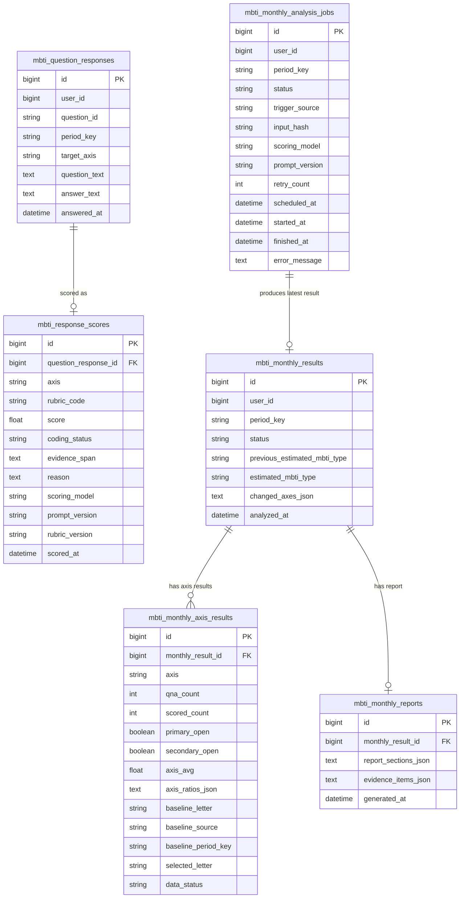


### 9.3 테이블별 역할


| 테이블                          | 역할                        | 운영상 의미                                                                                |
| ---------------------------- | ------------------------- | ------------------------------------------------------------------------------------- |
| `mbti_question_responses`    | MBTI 분석 대상으로 저장된 질문/답변 원본 | 월간 분석의 입력 데이터다. 1차 개시 조건은 이 테이블의 월별·선호지표 축별 저장 건수로 판단한다.                              |
| `mbti_response_scores`       | Q&A 1개에 대한 루브릭 매칭 및 점수화 결과 | 월간 평균 점수와 리포트 근거 선별의 기준 데이터다. 선택된 `rubric_code`와 서버 변환 점수를 함께 저장한다. `coding_status=coded`인 점수만 월간 계산에 포함한다. |
| `mbti_monthly_results`       | 특정 사용자·특정 월의 대표 MBTI 결과   | 마이페이지에서 “이번 달 MBTI 성격 유형”, “이전 기준 MBTI 성격 유형”, “변화 선호지표 축”을 보여주는 기준 테이블이다.            |
| `mbti_monthly_axis_results`  | IE/SN/TF/JP별 계산 결과        | 4개 선호지표 축을 독립적으로 판단한 결과다. 각 선호지표 축이 이번 달 계산값인지, 기준값 유지인지, 데이터 부족인지 설명한다.              |
| `mbti_monthly_reports`       | 월간 결과를 설명하는 리포트 본문과 대표 근거 | 사용자에게 보여줄 문장형 설명과 그 설명에 사용된 대표 답변 근거를 저장한다.                                           |
| `mbti_monthly_analysis_jobs` | 월간 분석 실행 상태와 재시도 관리       | 월초 또는 마이페이지 조회 시 생성되는 비동기 작업이다. 많은 사용자를 한 번에 LLM 호출하지 않도록 작업 상태, 재시도 횟수, 입력 해시를 관리한다. |


### 9.4 컬럼별 설명


#### 9.4.1 `mbti_question_responses`

`mbti_question_responses`는 챗봇 담당 시스템이 이미 선별해 저장한 MBTI 관련 Q&A 원본이다. 분석 파이프라인은 이 테이블의 데이터를 다시 일반 대화와 구분하지 않고, 저장된 Q&A를 월간 분석 입력으로 사용한다.


| 컬럼              | 설명                                                       |
| --------------- | -------------------------------------------------------- |
| `id`            | Q&A 원본 레코드의 식별자다. 점수화 결과와 리포트 근거가 이 값을 통해 원본 답변으로 연결된다.  |
| `user_id`       | 분석 대상 사용자 식별자다. 월간 결과와 마이페이지 조회의 기본 조건이다.                |
| `question_id`   | 챗봇 담당 시스템이 사용한 고정 MBTI 질문 식별자다. 운영 추적과 질문별 품질 분석에 사용한다. |
| `period_key`    | 답변이 속하는 분석 대상 월이다. `answered_at`을 서비스 기준 타임존으로 변환해 산출한다. |
| `target_axis`   | 이 Q&A가 측정하는 선호지표 축이다. 허용값은 `IE`, `SN`, `TF`, `JP`다.      |
| `question_text` | 사용자에게 제시된 MBTI 관련 질문이다. 관리자 확인이나 근거 표시에서 사용한다.           |
| `answer_text`   | 사용자의 실제 답변이다. 점수화와 리포트 근거의 원문이다.                         |
| `answered_at`   | 사용자가 답변한 시각이다. 월간 묶음 산정, 최신성 판단, 근거 정렬에 사용할 수 있다.        |


`target_axis`는 4개 선호지표 축 독립 판단의 출발점이다. IE 질문은 IE 루브릭 안에서만 분류하고, TF 질문은 TF 루브릭 안에서만 분류한다. 하나의 Q&A가 여러 축 점수를 동시에 만들지 않는다는 점을 명확히 하기 위해 원본 Q&A에 `target_axis`를 둔다. `question_id`는 루브릭 선택의 기본 기준이 아니라, 어떤 고정 질문에서 나온 응답인지 추적하고 질문별 품질을 점검하기 위한 값이다.

#### 9.4.2 루브릭 파일 관리

MVP에서는 선호경향별 루브릭 정의를 DB에 저장하지 않고, 버전이 붙은 JSON 파일로 관리한다. 실제 v1 루브릭 파일은 `docs/한재웅/datasets/mbti_scoring_rubrics.v1.json`에 둔다. 점수화 서버는 이 파일을 로드해 LLM 프롬프트와 서버 점수 변환에 사용하고, DB에는 루브릭 원본 전체를 저장하지 않는다. DB에는 점수화 결과에 사용된 `rubric_code`와 `rubric_version`만 남긴다.

루브릭 파일은 "모범 답안"이 아니라 **Big Five 기반 성향 신호 정의**다. 이 구조에서는 Big Five 계열 검사의 성향 축을 1차 기준으로 삼고, 월간 결과를 사용자에게 설명하기 위해 IE/SN/TF/JP 형태의 MBTI식 선호 라벨로 변환한다. 즉, MBTI 공식 설명은 최종 라벨의 이름과 해석을 확인하는 보조 참고이고, 개별 응답 채점의 1차 기준은 Big Five 성향 축이다.

Big Five 기반 채점 축은 아래처럼 사용한다.

| 표시 선호지표 축 | Big Five 1차 기준 | 채점 관점 |
| --- | --- | --- |
| IE | Extraversion | 외부 상호작용·사회적 에너지 쪽 근거가 높으면 E, 낮거나 혼자 반성·회복하는 근거가 강하면 I로 본다. |
| SN | Openness | 구체적 사실·익숙한 경험·실용성 근거가 강하면 S, 추상적 연결·가능성·새로움 근거가 강하면 N으로 본다. |
| TF | Agreeableness | 객관 기준·비개인적 분석·비판적 검토 근거가 강하면 T, 공감·관계·조화 근거가 강하면 F로 본다. |
| JP | Conscientiousness | 계획·정리·마감·완료 근거가 강하면 J, 유연성·선택지 유지·상황 적응 근거가 강하면 P로 본다. |

이 대응은 Big Five에서 MBTI식 라벨을 도출하기 위한 운영상 매핑이다. 예를 들어 `P`를 무책임함으로 해석하거나, `T`를 배려가 없음으로 해석하지 않는다. 루브릭은 사용자의 답변에 드러난 **성향 신호, 판단 기준, 행동 선호**만 분류한다. 또한 Big Five의 Neuroticism은 일부 성격 모델에서 A/T 같은 정체성 라벨과 연결될 수 있지만, 이 프로젝트의 IE/SN/TF/JP 네 축 점수에는 사용하지 않는다.

루브릭은 축마다 7개 코드만 둔다. 실제 점수는 Big Five 검사처럼 한 축을 5단계 정도로 나누는 방식에 맞춰 `강한 한쪽`, `약한 한쪽`, `균형`, `약한 반대쪽`, `강한 반대쪽`으로 제한한다. 여기에 운영상 판단불가 2종을 추가한다.

| 축 | 코드 구조 |
| --- | --- |
| IE | `IE_E_STRONG`, `IE_E_WEAK`, `IE_MIXED_BALANCED`, `IE_I_WEAK`, `IE_I_STRONG`, `IE_EXCLUDE_CONTEXTUAL`, `IE_EXCLUDE_INSUFFICIENT` |
| SN | `SN_S_STRONG`, `SN_S_WEAK`, `SN_MIXED_BALANCED`, `SN_N_WEAK`, `SN_N_STRONG`, `SN_EXCLUDE_CONTEXTUAL`, `SN_EXCLUDE_INSUFFICIENT` |
| TF | `TF_T_STRONG`, `TF_T_WEAK`, `TF_MIXED_BALANCED`, `TF_F_WEAK`, `TF_F_STRONG`, `TF_EXCLUDE_CONTEXTUAL`, `TF_EXCLUDE_INSUFFICIENT` |
| JP | `JP_J_STRONG`, `JP_J_WEAK`, `JP_MIXED_BALANCED`, `JP_P_WEAK`, `JP_P_STRONG`, `JP_EXCLUDE_CONTEXTUAL`, `JP_EXCLUDE_INSUFFICIENT` |

판단불가 코드는 두 가지로 분리한다. `EXCLUDE_CONTEXTUAL`은 사용자가 답변했지만 역할, 일정, 피로, 마감 강제처럼 일시 상황만 설명해 선호경향으로 보기 어려운 경우다. `EXCLUDE_INSUFFICIENT`는 답변 자체가 너무 짧거나 축과 무관해 판단 근거가 부족한 경우다. 두 코드는 모두 `score=null`로 저장하고 월간 평균 계산에서 제외한다.

루브릭의 `signals_ko`는 키워드 매칭용 정답 목록이 아니라 예시 표현이다. 루브릭에 없는 표현이어도 `decision_rule_ko`의 의미와 Big Five 1차 기준에 부합하면 가장 가까운 `STRONG`, `WEAK`, `MIXED_BALANCED` 코드로 분류한다. `EXCLUDE_INSUFFICIENT`는 표현이 낯설어서가 아니라, 해당 Big Five 성향 축을 판단할 근거가 실제로 부족할 때만 사용한다.

#### 9.4.3 `mbti_response_scores`

`mbti_response_scores`는 Q&A 1개에 대해 생성된 루브릭 매칭 및 점수화 결과다. 점수는 원본 Q&A의 `target_axis`와 같은 선호지표 축에 대해서만 생성된다.


| 컬럼                     | 설명                                                                            |
| ---------------------- | ----------------------------------------------------------------------------- |
| `id`                   | 점수화 결과 레코드의 식별자다. 리포트 대표 근거에서 특정 score row를 참조할 때 사용한다.                       |
| `question_response_id` | 원본 Q&A와 연결되는 FK다. 이 값을 통해 `user_id`, `period_key`, 원본 질문/답변을 확인한다.            |
| `axis`                 | 이 점수가 어느 선호지표 축에 대한 점수인지 나타낸다. 원본 Q&A의 `target_axis`와 같은 값이어야 한다.             |
| `rubric_code`          | LLM이 선택한 루브릭 코드다. 리포트 근거와 디버깅에서 "왜 이 점수가 나왔는지" 추적하는 핵심 값이다.                 |
| `score`                | `-1.0`, `-0.5`, `0`, `0.5`, `1.0` 중 하나이거나 판단 불가 시 `null`이다. 월간 평균 계산의 핵심 값이다. |
| `coding_status`        | 점수화 결과의 사용 가능 상태다. `coded`인 경우만 월간 평균 계산에 포함한다.                               |
| `evidence_span`        | 해당 점수를 부여한 근거가 되는 답변 내 표현이다. 리포트 대표 근거로 사용할 수 있다.                             |
| `reason`               | 점수 판단 사유다. 리포트 생성 시 근거 문장을 구성하는 데 사용한다.                                       |
| `scoring_model`        | 루브릭 매칭에 사용한 LLM 모델이다. 재현성 점검과 재점수화 비교에 사용한다.                                  |
| `prompt_version`       | 루브릭 매칭 프롬프트 버전이다. 프롬프트가 바뀐 경우 기존 결과와 구분한다.                                  |
| `rubric_version`       | 점수화에 사용한 루브릭 버전이다. 루브릭 개정 전후 점수를 구분한다.                                       |
| `scored_at`            | 점수화가 수행된 시각이다. 재점수화 여부나 최신 점수 확인에 사용할 수 있다.                                   |


`axis`는 정규화 관점에서는 원본 Q&A의 `target_axis`와 중복처럼 보일 수 있다. 그러나 이 시스템은 4개 선호지표 축을 독립적으로 계산하므로 score row 자체를 볼 때 IE/SN/TF/JP 중 어느 선호지표 축의 점수인지 바로 드러나야 한다. 따라서 `axis`는 운영 필수 컬럼으로 둔다.

저장 시에는 아래 조건을 확인한다.

```text
mbti_response_scores.axis = mbti_question_responses.target_axis
mbti_response_scores.rubric_code는 mbti_response_scores.axis에 허용된 루브릭 코드여야 한다
```

이 검증이 있어야 IE 질문에 TF 루브릭 코드가 잘못 연결되는 문제를 막을 수 있다.

#### 9.4.4 `mbti_monthly_results`

`mbti_monthly_results`는 사용자 1명의 특정 월 대표 결과를 저장한다. 4개 선호지표 축별 결과를 조합해 산출한 월간 추정 MBTI 성격 유형과 이전 기준 MBTI를 함께 보관한다.


| 컬럼                             | 설명                                                                |
| ------------------------------ | ----------------------------------------------------------------- |
| `id`                           | 월간 대표 결과의 식별자다. 선호지표 축별 결과와 리포트가 이 값을 기준으로 연결된다.                  |
| `user_id`                      | 결과가 속한 사용자 식별자다.                                                  |
| `period_key`                   | 결과가 설명하는 분석 대상 월이다.                                               |
| `status`                       | 월간 결과 상태다. 예: `ready`, `no_current_updates`, `insufficient_data`. |
| `previous_estimated_mbti_type` | 현재 월 이전에 저장된 가장 최근 월간 추정 MBTI 성격 유형이다. 변화 비교의 기준이다.               |
| `estimated_mbti_type`          | 이번 달 최종 추정 MBTI 성격 유형이다. 축별 `selected_letter` 4개를 조합해 산출한다.       |
| `changed_axes_json`            | 이전 기준값과 이번 달 결과가 달라진 선호지표 축 목록이다. 예: `["TF"]`.                    |
| `analyzed_at`                  | 월간 분석을 실행한 시각이다. 같은 월 결과를 갱신할 때 최신 결과 판단에 사용한다.                   |


`mbti_monthly_results`는 마이페이지의 대표 카드에 해당한다. 사용자는 이 테이블의 값을 통해 “이번 달 MBTI 성격 유형”, “이전 MBTI 성격 유형”, “변화한 선호지표 축”을 확인한다.

#### 9.4.5 `mbti_monthly_axis_results`

`mbti_monthly_axis_results`는 월간 대표 결과를 구성하는 4개 선호지표 축별 상세 결과다. 한 `monthly_result_id` 아래에는 IE, SN, TF, JP별로 최대 4개 레코드가 저장된다.


| 컬럼                    | 설명                                                                                                                             |
| --------------------- | ------------------------------------------------------------------------------------------------------------------------------ |
| `id`                  | 선호지표 축별 결과 레코드의 식별자다.                                                                                                          |
| `monthly_result_id`   | 월간 대표 결과와 연결되는 FK다.                                                                                                            |
| `axis`                | 선호지표 축별 결과가 나타내는 선호지표 축이다. 허용값은 `IE`, `SN`, `TF`, `JP`다.                                                                       |
| `qna_count`           | 해당 월에 이 선호지표 축으로 저장된 원본 Q&A 수다. 1차 개시 조건 판단에 사용한다.                                                                             |
| `scored_count`        | 해당 월에 `coding_status=coded`로 점수화된 Q&A 수다. 2차 개시 조건 판단에 사용한다.                                                                   |
| `primary_open`        | 원본 Q&A 수가 1차 개시 기준을 충족했는지 나타낸다.                                                                                                |
| `secondary_open`      | 계산 가능한 숫자 점수가 있어 월간 평균을 계산할 수 있는지 나타낸다.                                                                                        |
| `axis_avg`            | `coded` 점수의 평균값이다. `secondary_open=false`이면 `null`일 수 있다.                                                                      |
| `axis_ratios_json`    | 화면 표시용 양쪽 선호 경향 비율이다. 예: `{ "T": 0.58, "F": 0.42 }`.                                                                           |
| `baseline_letter`     | 이번 달 새 계산값을 사용하지 못할 때 유지할 기준 글자다. 과거 월간 결과 또는 온보딩에서 가져온다.                                                                      |
| `baseline_source`     | 기준 글자의 출처다. 예: `latest_monthly_result`, `onboarding`, `none`.                                                                  |
| `baseline_period_key` | 기준 글자가 과거 월간 결과에서 온 경우 해당 월을 나타낸다. 온보딩 출처이면 `null`일 수 있다.                                                                      |
| `selected_letter`     | 해당 선호지표 축의 최종 선택된 선호 경향이다. 이번 달 계산값 또는 기준값 유지 결과가 들어간다.                                                                        |
| `data_status`         | 이 선호지표 축의 최종 상태다. 예: `current_month`, `primary_closed`, `secondary_closed`, `carried_from_previous`, `insufficient_axis_data`. |


이 테이블은 확정 흐름도의 “이번 달 계산값으로 selected_letter 결정”과 “직전 기준값 유지”를 모두 담는 핵심 테이블이다. 예를 들어 TF는 이번 달 계산값으로 `T`가 될 수 있고, SN은 이번 달 Q&A가 부족해 과거 기준값 `N`을 유지할 수 있다. 두 경우 모두 최종 선택된 선호 경향은 `selected_letter`에 저장되고, 그 선택 경로는 `data_status`와 `baseline_*` 컬럼으로 설명한다.

#### 9.4.6 `mbti_monthly_reports`

`mbti_monthly_reports`는 월간 결과를 사용자에게 설명하는 리포트 본문과 대표 근거 목록을 저장한다.


| 컬럼                     | 설명                                                     |
| ---------------------- | ------------------------------------------------------ |
| `id`                   | 리포트 레코드의 식별자다.                                         |
| `monthly_result_id`    | 리포트가 설명하는 월간 대표 결과의 FK다.                               |
| `report_sections_json` | 마이페이지에 표시할 리포트 본문이다. 3개 섹션 구조를 JSON으로 저장한다.            |
| `evidence_items_json`  | 리포트 생성에 사용된 대표 근거 답변 목록이다. 원본 Q&A와 score row 참조를 포함한다. |
| `generated_at`         | 리포트가 생성된 시각이다.                                         |


대표 근거는 별도 테이블을 만들지 않고 `evidence_items_json`에 포함한다. 기본 서비스에서는 리포트 본문과 함께 대표 근거 몇 개를 보여주는 정도면 충분하므로, 근거별 별도 상태 관리 테이블은 두지 않는다.

```json
[
  {
    "axis": "TF",
    "question_response_id": 1024,
    "response_score_id": 3001,
    "score": 1.0,
    "evidence_span": "먼저 기준을 정하고 사실관계를 확인한 뒤 결정한다",
    "reason": "판단 과정에서 기준과 사실관계를 우선함",
    "role": "changed_axis_main"
  }
]
```


#### 9.4.7 `mbti_monthly_analysis_jobs`

`mbti_monthly_analysis_jobs`는 월간 MBTI 분석을 실제로 실행하기 전후의 운영 상태를 저장한다. 분석 엔진의 계산 결과 자체는 `mbti_monthly_results`, `mbti_monthly_axis_results`, `mbti_monthly_reports`에 저장하고, job 테이블은 많은 사용자를 대상으로 분석을 안전하게 분산 실행하기 위한 큐 상태를 담당한다.


| 컬럼               | 설명                                                                        |
| ---------------- | ------------------------------------------------------------------------- |
| `id`             | 분석 job의 식별자다.                                                             |
| `user_id`        | 분석 대상 사용자 식별자다.                                                           |
| `period_key`     | 분석 대상 월이다. 예: `2026-06`.                                                  |
| `status`         | job 상태다. 예: `pending`, `running`, `completed`, `failed`, `skipped`.       |
| `trigger_source` | job 생성 경로다. 예: `monthly_scheduler`, `dashboard_on_demand`, `admin_retry`. |
| `input_hash`     | 분석 입력의 해시값이다. 같은 사용자·월·입력·모델·프롬프트 버전이면 중복 LLM 호출을 피하는 기준으로 사용한다.          |
| `scoring_model`  | 점수화에 사용한 모델명이다. 예: `gpt-5.4-mini`.                                        |
| `prompt_version` | 점수화 및 리포트 프롬프트 버전이다. 프롬프트가 바뀐 경우 기존 캐시를 재사용할지 판단하는 기준이다.                  |
| `retry_count`    | 실패 후 재시도 횟수다. 운영에서는 상한을 두어 무한 재시도를 막는다.                                   |
| `scheduled_at`   | job이 예약된 시각이다.                                                            |
| `started_at`     | worker가 job을 실행하기 시작한 시각이다.                                               |
| `finished_at`    | job이 완료, 실패, 스킵으로 종료된 시각이다.                                               |
| `error_message`  | 실패 사유다. API 장애, JSON 파싱 실패, 입력 데이터 부족 등 운영 확인에 필요한 짧은 메시지를 저장한다.          |


`status=skipped`는 오류가 아니라 분석할 필요가 없음을 뜻한다. 예를 들어 해당 월에 새 MBTI Q&A가 없고 이미 같은 `input_hash`의 월간 결과가 저장되어 있으면 job은 LLM 호출 없이 `skipped`로 종료할 수 있다. `status=failed`가 되더라도 마이페이지는 기존 최신 월간 결과를 계속 보여주고, 이번 달 분석 상태만 별도 안내로 표시한다.

### 9.5 운영 조회 흐름

마이페이지에서 특정 월 결과를 보여줄 때는 `mbti_monthly_results`를 기준으로 조회한다.

```text
1. user_id + period_key로 mbti_monthly_results를 조회한다.
2. monthly_result_id로 mbti_monthly_axis_results 4개 선호지표 축 결과를 조회한다.
3. monthly_result_id로 mbti_monthly_reports를 조회한다.
4. report_sections_json과 evidence_items_json을 함께 반환한다.
```

월간 분석 배치에서는 `mbti_question_responses`와 `mbti_response_scores`를 사용해 선호지표 축별 평균을 계산하고, 그 결과를 `mbti_monthly_results`와 `mbti_monthly_axis_results`에 저장한다. 리포트는 확정된 `selected_letter`와 계산에 사용된 score row를 기준으로 대표 근거를 고른 뒤 `mbti_monthly_reports`에 저장한다.

### 9.6 Graph RAG 적용 시 MVP+ 확장

Graph RAG를 적용하더라도 기본 ERD의 의미는 바뀌지 않는다. Graph RAG는 MBTI를 새로 판정하거나 `score`, `axis_avg`, `selected_letter`를 바꾸는 기능이 아니라, 리포트 대표 근거를 더 잘 고르고 확정된 MBTI 성격 유형의 간단 설명을 보강하기 위한 MVP+ 기능이다.

따라서 Graph RAG 결과는 월간 계산 흐름에 되먹임하지 않는다. 사용 위치는 리포트 생성 단계로 제한한다.

```text
- 확정된 월간 MBTI 성격 유형에 대한 간단 설명 생성
- 변화 선호지표 축에 대한 대표 근거 답변 선별 보조
- fallback으로 유지된 선호지표 축과 이번 달 새로 반영된 선호지표 축의 설명 구분
```

운영상 최소 확장은 score row에 대응하는 embedding 참조를 저장하는 정도로 둔다.

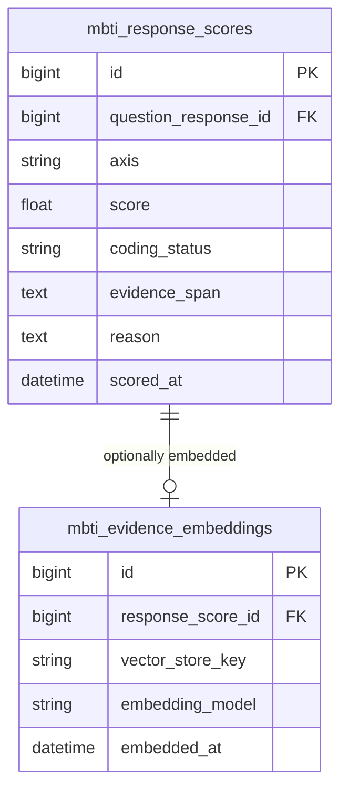


`mbti_evidence_embeddings`는 검색 인프라에 저장된 벡터를 찾기 위한 참조 테이블이다. 최종 리포트에 실제로 사용된 근거는 여전히 `mbti_monthly_reports.evidence_items_json`에 저장한다. 검색 후보 순위나 retrieval score는 사용자 화면의 핵심 데이터가 아니므로 기본 운영 ERD에는 포함하지 않는다.

### 9.7 저장 및 중복 실행 정책

배치나 이벤트가 중복 실행되어도 같은 월 결과가 의도치 않게 여러 개 생기지 않도록 `user_id + period_key`를 기본 저장 기준으로 둔다. 최신 결과만 서비스 화면에 보여주는 MVP에서는 같은 월 결과를 갱신하는 방식이 단순하다.


| 저장 대상                        | 기준 키                                                 | 저장 정책                                                                    |
| ---------------------------- | ---------------------------------------------------- | ------------------------------------------------------------------------ |
| `mbti_question_responses`    | `id`                                                 | 챗봇 담당 시스템이 저장한 Q&A 원본이다. `answered_at` 기준으로 `period_key`를 확정해 저장한다.      |
| `mbti_response_scores`       | `question_response_id + rubric_version + prompt_version` | 같은 Q&A, 같은 루브릭 버전, 같은 프롬프트 버전의 매칭 결과는 재사용한다. 루브릭 또는 프롬프트가 바뀌면 새 결과와 구분한다. |
| `mbti_monthly_results`       | `user_id + period_key`                               | 해당 월 대표 결과는 1개만 유지한다. 재분석 시 같은 row를 갱신한다.                                |
| `mbti_monthly_axis_results`  | `monthly_result_id + axis`                           | 하나의 월간 결과 아래 IE/SN/TF/JP별 결과를 최대 4개 유지한다.                                |
| `mbti_monthly_reports`       | `monthly_result_id`                                  | 하나의 월간 결과에 리포트 1개를 유지한다. 대표 근거는 `evidence_items_json`에 함께 저장한다.          |
| `mbti_monthly_analysis_jobs` | `user_id + period_key + input_hash + prompt_version` | 같은 입력과 같은 프롬프트 버전의 분석 job은 중복 생성하지 않는다. 실행 중이면 기존 job 상태를 반환한다.          |
| `mbti_evidence_embeddings`   | `response_score_id`                                  | Graph RAG MVP+ 확장을 적용할 때만 사용한다. 같은 score row에 대한 embedding 참조는 1개만 유지한다. |


루브릭 정의와 점수 매핑은 DB 저장 대상에 포함하지 않는다. `mbti_scoring_rubrics.v1.json`처럼 버전이 붙은 배포 파일로 관리하고, DB에는 실제 응답 판정에 사용된 `rubric_code`와 `rubric_version`만 남긴다.

재분석이 발생하면 아래처럼 처리한다.

```text
1. user_id + period_key로 mbti_monthly_results를 조회한다.
2. 기존 결과가 없으면 insert한다.
3. 기존 결과가 있으면 estimated_mbti_type, changed_axes_json, analyzed_at 등을 update한다.
4. monthly_result_id + axis 기준으로 선호지표 축별 결과를 upsert한다.
5. monthly_result_id 기준으로 리포트를 upsert한다.
```

이 저장 정책은 “현재 서비스 화면에 보여줄 최신 월간 결과”에 집중한다. 과거 실행 이력 전체가 서비스 기능으로 필요해지는 경우에는 실행 이력 테이블을 별도로 둘 수 있다.

### 9.8 대량 사용자 운영 정책

월초에 전체 사용자의 MBTI 분석을 즉시 실행하면 LLM 호출량, 토큰 비용, 처리 시간, 실패 재시도 문제가 커진다. 따라서 운영 구조는 **분석 대상 선별 → job 예약 → 제한된 worker 처리 → 저장 결과 조회**를 기본으로 한다.

월초 스케줄러는 모든 사용자를 즉시 분석하지 않고 아래 조건을 기준으로 job 후보를 줄인다.

```text
- 해당 월 또는 직전 월에 MBTI Q&A가 새로 저장된 사용자
- 선호지표 축 중 하나 이상이 1차 개시 조건에 근접하거나 충족한 사용자
- 최근 로그인했거나 마이페이지를 실제로 조회한 사용자
- 아직 해당 period_key의 월간 결과가 없거나 input_hash가 달라진 사용자
```

마이페이지 조회 시점에도 같은 원칙을 적용한다. 이미 `mbti_monthly_results`와 `mbti_monthly_reports`가 있으면 저장된 결과를 즉시 반환한다. 결과가 없고 분석 가능성이 있으면 API가 직접 LLM을 호출하지 않고 `dashboard_on_demand` job을 만든 뒤 `analysis_pending` 또는 `analysis_running` 상태를 반환한다. 결과가 없고 분석 조건도 부족하면 job을 만들지 않고 기존 기준값 또는 데이터 부족 상태를 반환한다.

LLM 호출은 아래 기준으로 최소화한다.

```text
- 1차 개시를 통과하지 못한 축은 점수화하지 않는다.
- 이미 점수화된 question_response_id는 같은 prompt_version과 scoring_model이면 재사용한다.
- user_id + period_key + input_hash + scoring_model + prompt_version이 같으면 월간 결과와 리포트를 재사용한다.
- 리포트 생성은 월간 결과가 바뀌었거나 대표 근거 입력이 바뀐 경우에만 다시 수행한다.
- API 장애나 JSON 파싱 실패가 발생하면 retry_count 상한 안에서만 재시도하고, 기존 최신 결과를 유지한다.
```

운영 상태는 `pending`, `running`, `completed`, `failed`, `skipped` 정도로 충분하다. 대시보드는 `completed` 결과를 읽는 것이 기본이며, `pending/running` 상태에서는 “이번 달 분석 준비 중” 안내와 함께 직전 완료 결과를 보여줄 수 있다. 이 정책은 사용자 수가 늘어나도 월초 순간 부하와 토큰 비용이 한꺼번에 폭증하지 않도록 하기 위한 것이다.

## 10. 전체 프로세스 흐름도

확정 흐름도는 문서 서두에 둔 단순화된 파이프라인을 기준으로 한다. 이 장에서는 흐름도를 반복하지 않고, 각 분기와 저장 시점만 정리한다.

### 10.1 분기 판단 기준


| 흐름도 분기                      | 판단 기준                                                    | 결과                                            |
| --------------------------- | -------------------------------------------------------- | --------------------------------------------- |
| 원본 질문 응답이 5개 이상인가?          | 해당 월에 저장된 MBTI Q&A 중 같은 선호지표 축의 원본 Q&A가 5개 이상인지 확인한다.    | 5개 이상이면 점수화로 진행하고, 5개 미만이면 기준 선호 경향을 적용한다.    |
| null이 아닌 응답 점수가 1개 이상인가?    | 점수화 결과 중 월간 평균 계산에 사용할 수 있는 `coded` 숫자 점수가 1개 이상인지 확인한다. | 1개 이상이면 표시 점수를 계산하고, 없으면 기준 선호 경향을 적용한다.      |
| 그래프 표시 점수가 한쪽 선호 경향이 더 높은가? | 양쪽 선호 경향의 표시 점수를 비교한다.                                   | 한쪽이 더 높으면 이번 달 값으로 반영하고, 동률이면 기준 선호 경향을 적용한다. |


### 10.2 기준 선호 경향 적용

기준 선호 경향은 아래 순서로 찾는다.

```text
1. 현재 월 이전의 가장 최근 월간 축별 결과
2. 과거 월간 축별 결과가 없으면 온보딩 MBTI 성격 유형의 해당 선호 경향
3. 둘 다 없으면 해당 선호지표 축은 산출 불가
```

따라서 월간 MBTI 성격 유형은 4개 선호지표 축 전체를 매달 새로 판정하는 값이 아니다. 이번 달 충분한 근거가 있는 축만 갱신하고, 나머지는 기준 선호 경향을 이어받는 부분 갱신형 월간 추정값이다.

### 10.3 저장 시점

저장은 흐름도 박스로 표시하지 않고 각 산출물 생성 직후 수행한다.


| 저장 시점          | 저장 위치                        | 저장 내용                                                       |
| -------------- | ---------------------------- | ----------------------------------------------------------- |
| 분석 예약/실행 상태 변경 | `mbti_monthly_analysis_jobs` | 분석 대상 사용자, 월, 입력 해시, job 상태, 재시도 횟수, 오류 메시지                 |
| 응답 루브릭 매칭 직후  | `mbti_response_scores`       | Q&A별 선택 루브릭 코드, 서버 변환 점수, 점수화 상태, 근거 표현, 판단 사유, 사용한 루브릭 버전 |
| 월간 MBTI 조합 직후  | `mbti_monthly_results`       | 해당 월의 대표 MBTI 성격 유형, 이전 기준 MBTI, 변화 축, 결과 상태                |
| 월간 MBTI 조합 직후  | `mbti_monthly_axis_results`  | IE/SN/TF/JP별 Q&A 수, 숫자 점수 수, 평균 점수, 표시 점수, 최종 선호 경향, 기준값 출처 |
| 근거 리포트 생성 직후   | `mbti_monthly_reports`       | 리포트 본문, 대표 근거 답변 목록                                         |


루브릭 파일은 코드/배포 산출물로 관리하므로 런타임 저장 시점에는 포함하지 않는다. 루브릭을 개정할 때는 파일 버전을 올리고, 이후 생성되는 `mbti_response_scores` row에 새 `rubric_version`을 기록한다.


### 10.4 화면 응답

마이페이지에는 아래 정보를 함께 제공한다.

```text
- 이번 달 MBTI 성격 유형
- 전달 또는 현재 월 이전의 최신 기준 MBTI 성격 유형
- IE/SN/TF/JP별 표시 점수, 선택된 선호 경향, 이번 달 반영 여부
- 근거 리포트
```

API는 월간 대표 결과, 축별 결과, 리포트 결과를 조합해 화면용 응답을 만든다. 기준 미달 축도 숨기지 않고 `data_status`와 기준값 출처를 함께 내려준다.

---


## 11. 시퀀스 다이어그램


### 11.1 Q&A 점수화

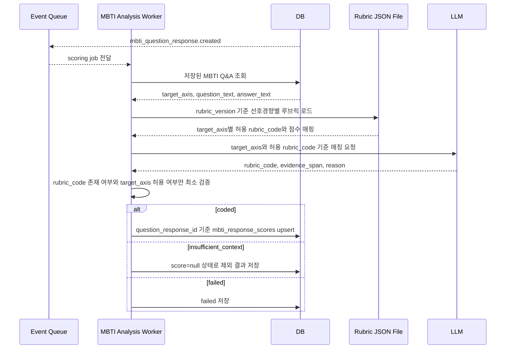


### 11.2 월간 분석

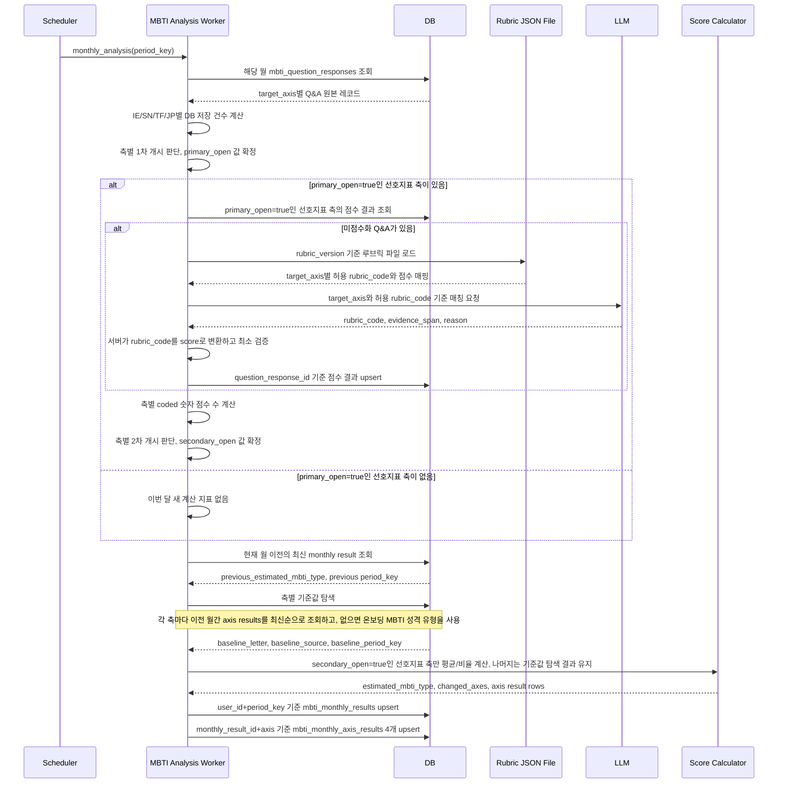


### 11.3 SQL 기반 점수 기여 근거 리포트 생성

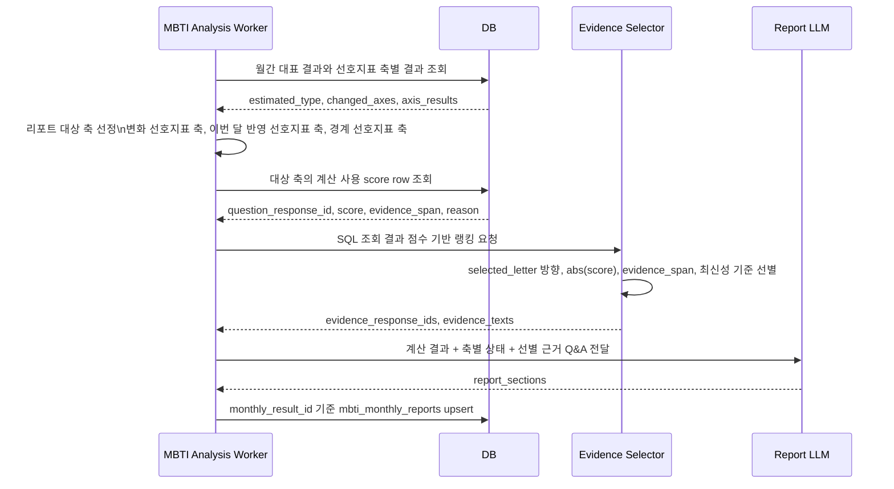


### 11.4 마이페이지 조회

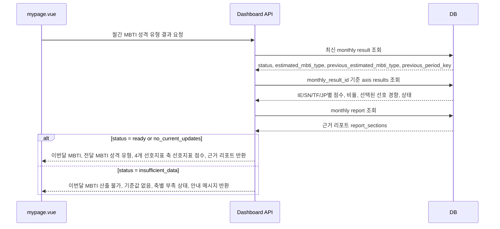


마이페이지의 결과창은 `estimated_mbti_type`만 단독으로 보여주지 않는다. 사용자가 이번 달 결과가 어떻게 만들어졌는지 확인할 수 있도록 전달 MBTI 성격 유형과 IE/SN/TF/JP 네 선호지표 축의 점수와 표시 점수, 반영 상태, 근거 리포트를 함께 제공한다.

### 11.5 가입 첫달/다음달 이후 MBTI 화면 분기

프론트엔드 화면 설계는 `app/frontend/src/views/mypage/mypage.vue`의 MBTI 패널을 기준으로 맞춘다. 현재 화면에는 두 가지 표시 모드가 이미 분리되어 있다.


| 화면 모드             | 프론트 상태값                         | 표시 대상                                | 표시 내용                                                      | 숨기는 내용                                     |
| ----------------- | ------------------------------- | ------------------------------------ | ---------------------------------------------------------- | ------------------------------------------ |
| 가입 첫달 온보딩 MBTI 화면 | `mbtiViewMode = onboardingType` | 가입 후 첫 월, 아직 전달 월간 분석 데이터가 없는 사용자    | 온보딩에서 사용자가 직접 입력한 MBTI 유형, 온보딩 MBTI 기준 유형 설명, 간단한 안내 리포트   | 월간 점수 그래프, 전월 대비 변화, 실제 Q&A 근거 리포트         |
| 다음달 이후 월간 분석 화면   | `mbtiViewMode = onboardingNext` | 가입 다음달부터, 전달 또는 이전 월간 분석 기준값이 있는 사용자 | 현재 기준 MBTI, 전 MBTI, IE/SN/TF/JP 선호지표 그래프, 실제 Q&A 기반 근거 리포트 | 없음. 단, 부족한 축은 `data_status`로 기준값 유지 사유를 표시 |


이 분기는 단순한 프론트 예시 스위치가 아니라 실제 API 응답 설계에 포함되어야 한다. Dashboard API는 MBTI 패널 조회 응답에 `view_mode`를 내려주고, 프론트는 이 값으로 위 두 화면 중 하나를 렌더링한다.

```text
view_mode = onboarding_type
→ 프론트 `onboardingType` 화면
→ 온보딩 자기보고 MBTI만 보여준다.
→ 리포트 영역에는 유형 설명과 "가입 첫달이라 월간 대화 기반 분석은 다음달부터 제공된다"는 안내만 둔다.
→ `axis_results`, `previous_estimated_mbti_type`, 근거 기반 `report_sections`는 비워도 된다.

view_mode = monthly_analysis
→ 프론트 `onboardingNext` 화면
→ 전달까지 쌓인 데이터와 이번 월간 분석 결과를 함께 보여준다.
→ 현재/전 MBTI, 축별 그래프, 변경 글자 강조, 근거 리포트를 모두 표시한다.
```

가입 첫달 여부는 `user.joined_at` 또는 온보딩 완료일을 KST 기준 월 단위로 자른 값과 조회 대상 `period_key`를 비교해 판단한다. 예를 들어 `joined_at=2026-06-15`이고 조회 대상이 `period_key=2026-06`이면 `view_mode=onboarding_type`이다. `period_key=2026-07`부터는 2026년 6월에 쌓인 데이터가 월간 분석 입력이 될 수 있으므로 `view_mode=monthly_analysis`를 우선 시도한다.

첫달 화면에서는 온보딩 MBTI가 분석 결과처럼 보이면 안 된다. 따라서 API 응답도 `status=onboarding_only`처럼 별도 상태를 두고, `estimated_mbti_type` 대신 `onboarding_mbti_type`을 대표 표시값으로 사용한다. 리포트는 근거 리포트가 아니라 `type_description_sections` 또는 `report_sections` 안의 `source=onboarding_description` 항목으로 구분한다. 이때 문구는 "직접 입력한 MBTI 기준의 간단 설명"이며, 실제 대화 데이터 근거를 인용하지 않는다.

다음달 이후 화면에서는 현재 문서의 월간 분석 파이프라인을 그대로 사용한다. 다만 월간 데이터가 일부 축에서 부족하면 화면 자체를 첫달 화면으로 되돌리지 않고, `axis_results.data_status`로 `primary_closed`, `secondary_closed`, `carried_from_onboarding`, `carried_from_previous` 등을 내려준다. 프론트는 그래프를 유지하되 부족 축은 기준값 유지로 설명하고, 근거 리포트에는 실제로 갱신된 축과 유지된 축을 구분해서 작성한다.

### 11.6 화면 분기 시퀀스

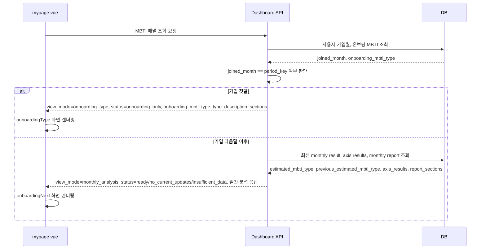


### 11.7 월초 대량 분석 운영 시퀀스

월초 스케줄러는 모든 사용자의 분석을 즉시 실행하지 않는다. 먼저 분석 후보를 선별해 job을 만들고, worker가 동시 실행 수와 LLM 호출량을 제한하면서 처리한다. 대시보드는 저장된 완료 결과를 우선 조회하며, 결과가 없을 때만 온디맨드 job을 예약한다.

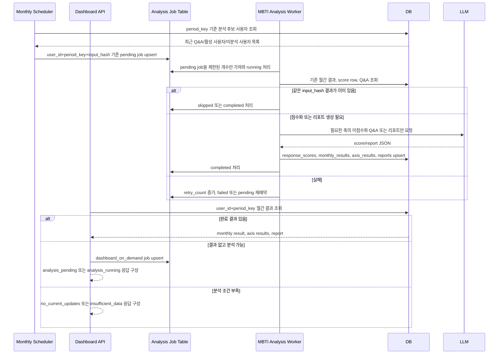


---


## 12. API 응답 예시


### 12.1 가입 첫달 온보딩 MBTI만 표시

가입 첫달에는 전달에 쌓인 월간 데이터가 없으므로 월간 분석 결과처럼 보이게 만들지 않는다. API는 `view_mode=onboarding_type`, `status=onboarding_only`를 반환하고, 프론트는 `mypage.vue`의 `onboardingType` 화면처럼 온보딩에서 직접 입력한 MBTI와 간단한 유형 설명만 표시한다.

```json
{
  "view_mode": "onboarding_type",
  "status": "onboarding_only",
  "period_type": "monthly",
  "period_key": "2026-06",
  "joined_month": "2026-06",
  "onboarding_mbti_type": "INFP",
  "estimated_mbti_type": null,
  "previous_estimated_mbti_type": null,
  "axis_results": [],
  "report_sections": [
    {
      "source": "onboarding_description",
      "title": "온보딩 MBTI 기준 유형 설명",
      "content": "INFP는 보통 개인의 가치와 감정의 흐름을 중요하게 여기고, 자신에게 의미 있는 일에 깊게 몰입하는 경향으로 설명됩니다. 이 설명은 가입 시 직접 입력한 MBTI를 바탕으로 한 간단 안내입니다."
    },
    {
      "source": "onboarding_description",
      "title": "월간 분석 안내",
      "content": "가입 첫달에는 전달에 쌓인 MBTI 질문·답변 데이터가 없으므로 점수 그래프와 실제 근거 리포트를 표시하지 않습니다. 가입 다음달부터 전달 데이터가 충분히 쌓이면 월간 분석 화면으로 전환됩니다."
    }
  ],
  "message": "가입 첫달에는 온보딩에서 입력한 MBTI 유형과 간단한 설명만 제공합니다."
}
```


### 12.2 분석 완료

DB는 선호지표 축별 결과를 독립 레코드로 저장하지만, API는 마이페이지 결과창 렌더링이 편하도록 이번 달 MBTI 성격 유형, 전달 MBTI 성격 유형, 4개 선호지표 축 선호지표 점수, 근거 리포트를 한 응답으로 조립해 내려준다. 축별 정보는 `axis_results` 배열로 제공한다.

```json
{
  "view_mode": "monthly_analysis",
  "status": "ready",
  "period_type": "monthly",
  "period_key": "2026-06",
  "qna_response_count": 13,
  "required_qna_count_per_axis": 5,
  "required_scored_count_per_axis": 1,
  "onboarding_mbti_type": "INFP",
  "previous_estimated_mbti_type": "INFP",
  "estimated_mbti_type": "INTP",
  "changed_axes": ["TF"],
  "axis_results": [
    {
      "axis": "IE",
      "qna_count": 5,
      "required_qna_count": 5,
      "primary_open": true,
      "scored_count": 5,
      "required_scored_count": 1,
      "secondary_open": true,
      "axis_avg": -0.4,
      "axis_score": -0.4,
      "axis_score_display": "I 70% / E 30%",
      "axis_ratios": {"I": 0.7, "E": 0.3},
      "baseline_letter": "I",
      "baseline_source": "latest_monthly_result",
      "baseline_period_key": "2026-05",
      "previous_letter": "I",
      "selected_letter": "I",
      "data_status": "current_month"
    },
    {
      "axis": "SN",
      "qna_count": 2,
      "required_qna_count": 5,
      "primary_open": false,
      "scored_count": 0,
      "required_scored_count": 1,
      "secondary_open": false,
      "axis_avg": null,
      "axis_score": null,
      "axis_score_display": "N 64% / S 36%",
      "axis_ratios": {"S": 0.36, "N": 0.64},
      "baseline_letter": "N",
      "baseline_source": "latest_monthly_result",
      "baseline_period_key": "2026-04",
      "previous_letter": "N",
      "selected_letter": "N",
      "data_status": "primary_closed"
    },
    {
      "axis": "TF",
      "qna_count": 6,
      "required_qna_count": 5,
      "primary_open": true,
      "scored_count": 6,
      "required_scored_count": 1,
      "secondary_open": true,
      "axis_avg": 0.16,
      "axis_score": 0.16,
      "axis_score_display": "T 58% / F 42%",
      "axis_ratios": {"T": 0.58, "F": 0.42},
      "baseline_letter": "F",
      "baseline_source": "latest_monthly_result",
      "baseline_period_key": "2026-05",
      "previous_letter": "F",
      "selected_letter": "T",
      "data_status": "current_month"
    },
    {
      "axis": "JP",
      "qna_count": 0,
      "required_qna_count": 5,
      "primary_open": false,
      "scored_count": 0,
      "required_scored_count": 1,
      "secondary_open": false,
      "axis_avg": null,
      "axis_score": null,
      "axis_score_display": "P 61% / J 39%",
      "axis_ratios": {"J": 0.39, "P": 0.61},
      "baseline_letter": "P",
      "baseline_source": "onboarding",
      "baseline_period_key": null,
      "previous_letter": "P",
      "selected_letter": "P",
      "data_status": "primary_closed"
    }
  ],
  "report_sections": [
    {
      "title": "MBTI 변화 경향 현황",
      "content": "2026년 5월에는 INFP에 가까운 경향이었지만, 2026년 6월에는 INTP에 가까운 결과로 표시됩니다. 이번 달에는 IE와 TF 선호지표 축이 1차 개시와 2차 개시 조건을 모두 충족해 새로 반영되었고, SN과 JP는 DB 저장 Q&A 수가 기준보다 적어 기준값 탐색 결과를 유지했습니다."
    },
    {
      "title": "MBTI 추정 및 경향분석 근거",
      "content": "먼저 기준을 정하고 사실관계를 확인한 뒤 결정한다는 답변이 확인되어, TF 선호지표 축에서 T 비율이 더 높게 계산되었습니다."
    },
    {
      "title": "현재 MBTI 성격 유형에 대한 간단한 설명",
      "content": "INTP는 보통 가능성을 탐색하고 논리적으로 구조화해 이해하려는 경향으로 설명됩니다. 여기서는 2026년 6월에 충분히 관찰된 일부 선호지표 축만 갱신하고 나머지는 기준값을 유지한 추정 결과로 해석합니다."
    }
  ]
}
```


### 12.3 이번 달 갱신 없음

```json
{
  "view_mode": "monthly_analysis",
  "status": "no_current_updates",
  "period_type": "monthly",
  "period_key": "2026-06",
  "qna_response_count": 4,
  "required_qna_count_per_axis": 5,
  "required_scored_count_per_axis": 1,
  "previous_estimated_mbti_type": "INFP",
  "estimated_mbti_type": "INFP",
  "changed_axes": [],
  "axis_results": [
    {
      "axis": "IE",
      "qna_count": 4,
      "required_qna_count": 5,
      "primary_open": false,
      "scored_count": 0,
      "required_scored_count": 1,
      "secondary_open": false,
      "axis_avg": null,
      "axis_ratios": null,
      "baseline_letter": "I",
      "baseline_source": "latest_monthly_result",
      "baseline_period_key": "2026-04",
      "previous_letter": "I",
      "selected_letter": "I",
      "data_status": "primary_closed"
    }
  ],
  "message": "2026년 6월에는 DB 저장 Q&A가 5개 이상인 선호지표 축이 없어 MBTI 경향 변화를 새로 반영하지 않았습니다."
}
```


### 12.4 데이터 부족

```json
{
  "view_mode": "monthly_analysis",
  "status": "insufficient_data",
  "period_type": "monthly",
  "period_key": "2026-06",
  "qna_response_count": 4,
  "required_qna_count_per_axis": 5,
  "required_scored_count_per_axis": 1,
  "previous_estimated_mbti_type": null,
  "estimated_mbti_type": null,
  "changed_axes": [],
  "axis_results": [
    {
      "axis": "IE",
      "qna_count": 4,
      "required_qna_count": 5,
      "primary_open": false,
      "scored_count": 0,
      "required_scored_count": 1,
      "secondary_open": false,
      "axis_avg": null,
      "axis_ratios": null,
      "previous_letter": null,
      "selected_letter": null,
      "data_status": "insufficient_axis_data"
    }
  ],
  "message": "2026년 6월에는 새로 계산 가능한 선호지표 축도 없고 유지할 기준 MBTI 성격 유형도 없어 월간 추정 MBTI 성격 유형을 산출할 수 없습니다."
}
```


### 12.5 분석 대기 또는 진행 중

월초 대량 분석이나 마이페이지 온디맨드 요청으로 job이 생성되었지만 아직 완료되지 않은 경우다. 이때 API는 LLM 분석을 동기 실행하지 않고, 기존 완료 결과가 있으면 함께 내려준다. 프론트는 기존 결과를 보여주면서 이번 달 분석이 준비 중임을 안내할 수 있다.

```json
{
  "view_mode": "monthly_analysis",
  "status": "analysis_pending",
  "period_type": "monthly",
  "period_key": "2026-07",
  "analysis_job": {
    "status": "pending",
    "trigger_source": "dashboard_on_demand",
    "scheduled_at": "2026-07-01T09:03:00+09:00"
  },
  "latest_completed_result": {
    "period_key": "2026-06",
    "estimated_mbti_type": "INTP",
    "previous_estimated_mbti_type": "INFP"
  },
  "message": "이번 달 MBTI 분석이 예약되었습니다. 완료 전까지는 가장 최근 완료된 월간 결과를 표시합니다."
}
```

---


## 13. 취향 분석 파이프라인

취향 분석은 MBTI와 다르게 별도 질문 Q&A를 사용하지 않는다. 저장된 일반 대화 로그에서 관심 분야, 취미, 취향, 대화 선호를 LLM으로 구조화 추출한 뒤 최근 기간 기준으로 집계한다.

이 기능은 정교한 성향 추정보다 **대시보드 집계 현황 표시**가 목적이다. 스크린샷 기준으로 화면에는 아래 정보가 필요하다.

```text
- 조회 기간
- 반영 대화 수
- 반영 발화 수
- 표시 기준
- 기준 충족 키워드 목록
- 키워드 유형
- 등장 횟수
- 대화 맥락
- 최근 등장일
```


### 13.1 취향 분석 기준


| 항목     | 권장 방식                       |
| ------ | --------------------------- |
| 분석 입력  | 저장된 일반 대화 로그                |
| 분석 기간  | 최근 30일                      |
| LLM 역할 | 관심/취미/취향 후보 키워드와 근거 발화 구조화  |
| 서버 역할  | 키워드 정규화, 등장 횟수 집계, 표시 기준 적용 |
| 표시 기준  | 최근 30일 기준 5회 이상 등장          |
| 주요 산출물 | 기준 충족 키워드 목록과 집계 현황         |


키워드 유형은 MVP에서는 단순하게 3개로 둔다.


| 유형       | 의미                                      | 예시            |
| -------- | --------------------------------------- | ------------- |
| 최근 관심사   | 최근 대화에서 직접 반복된 관심 주제                    | 로파이 음악, 실내 식물 |
| 간접 취향 신호 | 직접 취향이라고 말하지 않았지만 반복 맥락상 취향으로 볼 수 있는 신호 | 감정 기록, 짧은 산책  |
| 대화 선호    | 사용자가 요청하거나 선호하는 대화 방식/추천 방향             | 선택지 줄이기       |


### 13.2 취향 분석 프로세스 흐름도

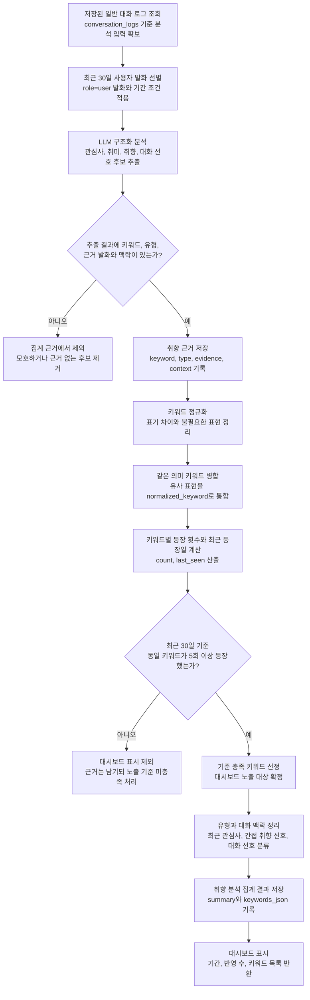


### 13.3 취향 분석 시퀀스 다이어그램

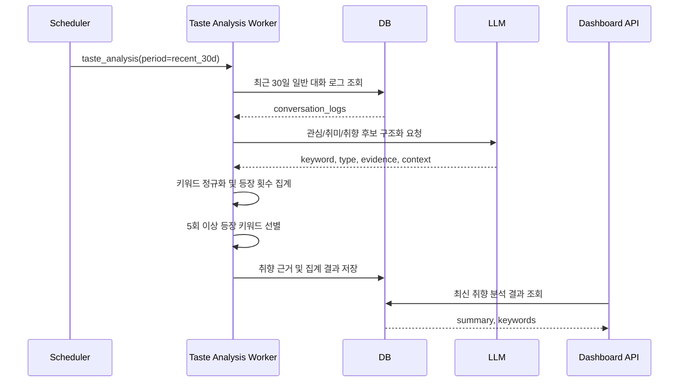


### 13.4 취향 분석 ERD

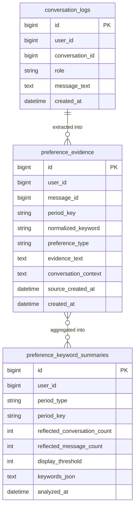


### 13.5 취향 분석 API 응답 예시

```json
{
  "status": "ready",
  "period_type": "recent_30d",
  "period_label": "최근 30일",
  "reflected_conversation_count": 18,
  "reflected_message_count": 128,
  "display_threshold": 5,
  "updated_at": "2026-06-24T14:20:00+09:00",
  "keywords": [
    {
      "keyword": "로파이 음악",
      "type": "최근 관심사",
      "count": 14,
      "conversation_context": "휴식, 집중 관련 대화",
      "last_seen": "06.22"
    },
    {
      "keyword": "감정 기록",
      "type": "간접 취향 신호",
      "count": 11,
      "conversation_context": "하루 정리, 메모 관련 대화",
      "last_seen": "06.21"
    },
    {
      "keyword": "실내 식물",
      "type": "최근 관심사",
      "count": 8,
      "conversation_context": "공간 안정감, 책상 꾸미기 대화",
      "last_seen": "06.19"
    }
  ],
  "guide": "저장된 대화 로그의 반복 맥락에서 일정 기준 이상 반복된 키워드만 표시합니다."
}
```

---


## 14. 책임 분리


| 영역                    | 책임                                                                                                                                     |
| --------------------- | -------------------------------------------------------------------------------------------------------------------------------------- |
| 챗봇 담당 영역              | MBTI 질문/답변 Q&A 선별 및 저장                                                                                                                 |
| Monthly Scheduler     | 월초에 분석 대상 후보를 선별하고 `mbti_monthly_analysis_jobs`를 예약한다. 전체 사용자를 즉시 분석하지 않고 입력 변화와 활성도를 기준으로 작업량을 제한한다.                                  |
| MBTI Analysis Worker  | `pending` job을 제한된 개수만 가져와 저장된 MBTI Q&A 점수화, 선호지표 축별 1차·2차 개시 판단, 축별 평균/비율 계산, 월간 대표 결과와 선호지표 축별 결과 저장, 이전 최신 월간 결과 대비 변화 지표 확인을 수행한다. |
| Analysis Job Table    | 사용자·월·입력 해시·모델·프롬프트 버전 기준으로 중복 실행을 막고, `pending/running/completed/failed/skipped` 상태와 재시도 횟수를 관리한다.                                    |
| Taste Analysis Worker | 일반 대화 로그에서 취향 근거 추출, 키워드 정규화, 최근 30일 집계                                                                                                |
| Evidence Selector     | 계산 사용 score row를 SQL로 조회하고 점수 기준으로 대표 evidence_span 선별                                                                                 |
| Report LLM            | 선별된 근거와 현재 추정 MBTI 성격 유형 설명을 바탕으로 3개 섹션 리포트 생성                                                                                         |
| Dashboard API         | 저장된 월간 결과를 우선 조회해 `mypage.vue`가 바로 렌더링할 수 있는 응답을 반환한다. 결과가 없고 분석 가능성이 있으면 직접 LLM을 호출하지 않고 온디맨드 job을 예약한다.                              |


---


## 15. 최종 권장 흐름

MBTI 분석은 **4개 선호지표 축을 매월 모두 새로 판정하는 구조가 아니라, 이번 달에 충분한 Q&A가 쌓인 선호지표 축만 갱신하고 나머지는 기존 기준값을 이어받는 부분 갱신형 월간 추정 구조**로 운영한다.

```text
MBTI Q&A 저장
→ 월초 또는 마이페이지 조회 시 분석 대상 후보 선별
→ user_id + period_key + input_hash 기준 월간 분석 job 예약
→ worker가 동시 실행 수와 LLM 호출량을 제한하며 pending job 처리
→ 월간 MBTI Q&A 조회 및 IE/SN/TF/JP별 응답 수 집계
→ 원본 Q&A가 5개 이상인 축만 1차 개시
→ 루브릭 버전 파일에서 target_axis별 허용 rubric_code와 점수 매핑 로드
→ 1차 개시 축의 답변 중 미점수화 Q&A만 LLM으로 rubric_code 매칭
→ 서버가 rubric_code를 고정 점수로 변환하고 mbti_response_scores 저장
→ coded 숫자 점수가 1개 이상인 축만 2차 개시
→ 2차 개시 축의 평균 점수와 그래프 표시 점수 계산
→ 표시 점수가 높은 방향을 이번 달 selected_letter로 반영
→ 기준 미충족 또는 동률 축은 과거 월간 결과, 없으면 온보딩 값으로 유지
→ IE/SN/TF/JP 최종 선호 경향을 조합해 월간 추정 MBTI 성격 유형 산출
→ 월간 대표 결과와 축별 결과 저장
→ 월간 결과 또는 대표 근거 입력이 바뀐 경우에만 3개 섹션 리포트 생성
→ MVP+에서는 Graph RAG로 확정 MBTI 유형의 간단 설명을 보강
→ 마이페이지는 저장된 월간 MBTI, 이전 기준 MBTI, 축별 점수, 근거 리포트를 조회해 제공
```

이 흐름에서 `5개 미만`은 데이터 자체가 무효라는 뜻이 아니다. 해당 Q&A row는 DB에 남지만, 그 선호지표 축이 이번 달 1차 개시를 통과하지 못했으므로 이번 달 점수화와 변화 반영에서 제외한다는 의미다.

결과 저장은 두 층으로 나눈다. `mbti_monthly_results`는 해당 월의 대표 상태, 최종 추정 MBTI, 이전 기준 MBTI, 변경 축 요약을 저장한다. `mbti_monthly_axis_results`는 IE/SN/TF/JP별 Q&A 수, 개시 여부, 평균 점수, 표시 점수, 선택된 선호 경향, 기준값 출처, `data_status`를 저장한다.

선호지표 축별 상태는 `current_month`, `primary_closed`, `secondary_closed`, `tie_carried`, `carried_from_previous`, `carried_from_onboarding`, `insufficient_axis_data`로 구분한다. 이 상태값은 마이페이지와 리포트에서 “이번 달 새로 반영된 축”과 “기준값을 유지한 축”을 구분하는 기준이 된다.

운영 관점에서는 대시보드 요청이 분석 엔진을 직접 실행하지 않는 것이 중요하다. 대시보드는 저장된 완료 결과를 읽고, 결과가 없을 때만 온디맨드 job을 예약한다. job이 `pending` 또는 `running`이면 “분석 준비 중” 상태와 직전 완료 결과를 함께 보여줄 수 있고, job이 실패해도 기존 결과를 유지해 화면을 깨지 않게 한다.

취향 분석:

```text
저장된 일반 대화 로그 조회
→ 최근 30일 사용자 발화 선별
→ LLM이 관심/취미/취향 후보 추출
→ 키워드 정규화 및 병합
→ 5회 이상 등장 키워드만 선정
→ 집계 현황 저장
→ 대시보드 표시
```

이 구조는 챗봇 내부 구현과 분석 파이프라인을 분리한다. MBTI 분석 담당자는 `target_axis`, `score`, `coding_status`, `period_key`, `mbti_monthly_results`, `mbti_monthly_axis_results`, `primary_open`, `secondary_open`, `baseline_source`, `selected_letter`, `data_status`를 일관되게 관리하면 되고, 취향 분석 담당자는 `normalized_keyword`, `preference_type`, `count`, `conversation_context`, `last_seen`을 일관되게 관리하면 된다.
