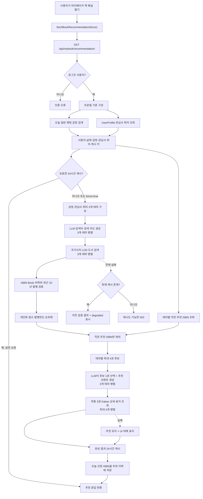

# 책 추천 기능 데이터 흐름 및 처리 보고서

- 작성 기준일: 2026-07-16
- 대상 기능: 마이페이지 `오늘의 책 추천`
- 대상 API: `GET /api/mybook/recommendation/`
- 기준 코드: 현재 워크스페이스 구현
- 문서 목적: 책 추천 기능이 어떤 데이터를 어디서 가져오고, 어떤 규칙으로 처리하며, 어떤 외부 서비스에 무엇을 전달하는지 추적 가능하게 설명한다.

## 1. 결론 요약

현재 책 추천은 다음 세 축으로 구성된다.

1. **개인화 기준 수집**
   - 오늘 일반 채팅에서 집계한 대표 감정
   - 사용자 프로필의 관심사
   - 사용자 프로필의 취미
2. **실재 도서 후보 검색·검증**
   - 문화체육관광부 국립중앙도서관 국가서지 LOD 기반 서지 정보 제공 API
   - 유효 ISBN, RDF `Book` 자료유형, 비학위·비교재, 최근 10년 이내 발행 조건을 통과한 일반 단행본만 허용
3. **AI 큐레이션**
   - OpenAI LLM이 검색어를 설계
   - 직전 추천을 제외한 상위 후보 중 가장 적합한 한 권과 개인화 추천 코멘트를 생성

도서 제목·저자·출판사·초록·주제·ISBN은 국립중앙도서관 데이터에서 가져온다. 서버는 테마별 직전 추천 ISBN만 제외하고, LLM은 남은 개인화 상위 후보 중 가장 적합한 `candidate_id`와 추천사를 작성한다. 사용자용 책 상세 링크와 표지는 Kakao Daum 책 검색의 ISBN 응답을 사용하고, 표지만 Open Library Covers로 보완한다.

> [!IMPORTANT]
> 화면에서 사용하는 “AI 맞춤 추천사”는 책 전문이나 독자 리뷰를 읽고 작성한 비평이 아니다. 국가서지의 제목·저자·출판사·주제어·초록 일부와 사용자 맥락으로 작성한 **개인화 추천 코멘트**다.

## 2. 구성요소와 책임

| 구분 | 구성요소 | 책임 |
|---|---|---|
| 프런트엔드 | `BookPanel.vue` | 로딩·오류·추천 탭·표지·서지정보·AI 코멘트·출처 표시 |
| 프런트엔드 API | `mypage.api.js` | 인증 쿠키를 포함해 추천 API 호출, 오류 메시지 변환 |
| Django API | `mybook/views.py` | 인증, 사용자 기준 수집, 캐시, 장애 시 이전 결과 또는 503 반환 |
| 추천 에이전트 | `mybook/agent.py` | 테마 구성, 검색어 생성, 국가서지 검색, 검증, 순위화, 서평 및 표지 보강 |
| 채팅 감정 분석 | `ai/agents/nodes.py` | 사용자 채팅을 기쁨·슬픔·분노·일반으로 분류 |
| 채팅 저장 | `chat/views.py`, `chat/models.py` | 분석 감정을 일반 채팅의 assistant 메시지에 저장 |
| 사용자 프로필 | `user.models.UserProfile` | 관심사·취미 제공 |
| 외부 서지 서비스 | 공공데이터포털 국가서지 API | 일반 도서 후보 메타데이터 제공 |
| 외부 책 정보 서비스 | Kakao Daum 책 검색 API | ISBN별 Daum 책 상세 링크와 표지 이미지 제공 |
| 외부 보완 표지 | Open Library Covers | Kakao 표지가 없을 때 ISBN 표지 이미지 보완 |
| 외부 AI 서비스 | OpenAI API | 테마별 검색어 설계와 추천 코멘트 생성 |
| Django cache | 설정된 공용 캐시 | 완성 추천 결과, 직전 선정 ISBN 이력, 표지 조회 결과 저장 |

주요 코드 위치:

- API 라우팅: [`app/backend/config/urls.py`](../../app/backend/config/urls.py), [`app/backend/mybook/urls.py`](../../app/backend/mybook/urls.py)
- 요청·감정·캐시 처리: [`app/backend/mybook/views.py`](../../app/backend/mybook/views.py)
- 추천 핵심 로직: [`app/backend/mybook/agent.py`](../../app/backend/mybook/agent.py)
- 감정 분류: [`ai/agents/nodes.py`](../../ai/agents/nodes.py)
- 채팅 감정 저장: [`app/backend/chat/views.py`](../../app/backend/chat/views.py)
- 프런트엔드 호출: [`app/frontend/src/views/mypage/mypage.api.js`](../../app/frontend/src/views/mypage/mypage.api.js)
- 화면 표시: [`app/frontend/src/views/mypage/components/BookPanel.vue`](../../app/frontend/src/views/mypage/components/BookPanel.vue)

## 3. 전체 처리 플로우



## 4. 단계별 상세 처리

### 4.1 프런트엔드 요청

책 패널이 활성화되면 `loadBookData()`가 실행되고 `fetchBookRecommendation()`을 호출한다.

- 일반 진입: `GET /api/mybook/recommendation/`
- 새로 추천받기: `GET /api/mybook/recommendation/?force=true`
- `credentials: include`로 세션 쿠키 포함
- 브라우저 캐시는 `cache: no-store`로 사용하지 않음
- 첫 요청이 실패하면 개발환경용 `http://localhost:8000` 주소를 한 번 더 시도

`force=true`는 서버 캐시를 삭제하는 것이 아니라, 캐시가 있어도 새 추천 생성을 시도하라는 의미다. 새 생성에 실패하면 기존 캐시를 안전망으로 다시 사용한다.

### 4.2 인증과 사용자 기준 수집

Django API는 `IsAuthenticated`를 요구한다. 인증된 사용자를 기준으로 다음 값을 구성한다.

| 값 | 출처 | 책 추천 사용 여부 |
|---|---|---|
| `today_emotion` | 오늘 채팅 감정 집계 | 사용 |
| `interests` | `UserProfile.interests` | 사용 |
| `hobbies` | `UserProfile.hobbies` | 사용 |
| `age` | `UserProfile.age` 또는 생년월일 계산 | 현재 사용하지 않음 |
| `gender` | `UserProfile.gender` | 현재 사용하지 않음 |

나이와 성별은 프로필 객체에는 포함되지만 검색어·순위·서평 프롬프트에는 전달되지 않는다. 외부 노출용 `data_used`에서도 나이·성별 표현을 차단한다.

### 4.3 오늘의 감정 산출

오늘의 감정은 프로필에서 직접 선택한 값이나 마음리포트 결과가 아니라 **오늘 일반 채팅의 감정 라벨**에서 가져온다.

#### 4.3.1 채팅 턴의 감정 생성

사용자 메시지는 채팅 LangGraph의 `analysis_node`에서 다음 방식으로 처리된다.

1. 기본 분류: KcELECTRA + XGBoost 기반 4감정 모델
2. 모델 확신도 `0.70` 이상: 모델 결과 채택
3. 확신도 미달: 최근 대화 맥락을 포함해 LLM이 재분류
4. 10자 미만 초단문: 원칙적으로 직전 감정 유지
5. 초단문이어도 모델 확신도 `0.90` 이상: 새 감정으로 변경
6. 위기 신호: 안전 대응을 위해 `sadness`로 고정
7. 사진 입력: 비전 모델이 장면 캡션과 감정을 함께 판단

분류값은 `joy`, `sadness`, `anger`, `normal` 중 하나이며, 일반 모드 채팅에서 assistant 메시지의 `emotion_label`로 저장된다. 시크릿 채팅은 DB에 저장되지 않으므로 책 추천 집계에 포함되지 않는다.

#### 4.3.2 책 추천용 대표 감정 집계

추천 API는 다음 조건으로 오늘의 감정을 집계한다.

- 현재 로그인 사용자
- 서버 로컬 날짜 기준 오늘
- `role="assistant"`
- `emotion_label`이 존재하는 메시지
- 빈 값과 `normal` 제외
- 남은 라벨 중 출현 횟수가 가장 많은 값 선택
- `joy → 기쁨`, `sadness → 슬픔`, `anger → 분노`

비정상 감정이 하나도 없으면 값이 `None`이 되고, 추천 에이전트가 이를 `평온`으로 대체한다.

현재 집계는 **시간 순 가중치 점수 합산 방식**을 사용하여 최신성을 적극 반영한다. 대화 순서 index가 최신일수록 더 큰 가중치 `(i + 1) / N`을 부여하며, `normal`도 제외하지 않고 함께 집계한다. 사용자의 감정이 슬픔/분노에서 평온(normal)으로 해소되었다면 자연스럽게 "평온"이 대표 감정으로 최종 산출됩니다.

### 4.4 추천 결과 캐시

캐시 키는 다음 상태를 JSON으로 직렬화한 뒤 MD5 해시로 만든다.

```json
{
  "version": 17,
  "user_id": 7,
  "date": "2026-07-16",
  "emotion": "슬픔",
  "interests": ["음악"],
  "hobbies": ["사진"]
}
```

- 캐시 TTL: 24시간
- 테마별 마지막 선정 ISBN 이력 TTL: 32일
- 같은 날짜의 이력은 제외 조건으로 사용하지 않고, 이전 날짜의 마지막 추천만 제외
- 감정·관심사·취미 또는 날짜가 달라지면 다른 캐시 키 사용
- 완성된 일반책 추천만 캐시
- 실패 응답이나 빈 추천은 캐시하지 않음
- 강제 갱신 실패 시 아직 유효한 기존 캐시가 있으면 `is_stale=true`, `service_status.state="degraded"`로 반환

### 4.5 추천 테마 구성

항상 다음 3개 테마를 만든다.

| 테마 ID | 화면명 | 핵심 기준 | 값이 없을 때 |
|---|---|---|---|
| `emotion` | 오늘의 감정 추천 | 오늘의 주된 감정 | `평온` |
| `interests` | 관심사 기반 추천 | 프로필 관심사 | 일반 `교양 입문` 방향 |
| `hobbies` | 취미 기반 추천 | 프로필 취미 | 일반 `취미 실용` 방향 |

세 테마의 검색 의도 생성은 최대 3개 스레드로 병렬 실행된다.

#### 4.5.1 관심사·취미가 두 개 이상일 때

관심사나 취미가 여러 개여도 값마다 별도의 추천 탭이나 추천 도서를 만들지는 않는다. 전체 목록을 하나의 테마 기준으로 묶어 최종 1권을 추천한다.

예시:

```json
{
  "interests": ["음악", "영화"],
  "hobbies": ["사진", "산책"]
}
```

이 경우 최종 결과는 다음과 같다.

- 관심사 추천: `음악`과 `영화` 후보가 함께 경쟁해 최종 1권
- 취미 추천: `사진`과 `산책` 후보가 함께 경쟁해 최종 1권
- `음악 1권 + 영화 1권` 또는 `사진 1권 + 산책 1권`으로 분리하지 않음

처리 순서:

1. LLM 검색어 프롬프트에는 해당 테마의 값을 쉼표로 연결해 모두 전달한다.
2. LLM이 만든 2~4개 내용 주제어를 먼저 각각 검색한다.
3. 대표 검색 의도와 프로필 핵심 값까지 확장해 얻은 후보를 하나의 후보 풀로 합친다.
4. 개인화 점수 계산에서는 모든 값을 핵심 토큰으로 취급한다.
5. 프로필 핵심 값이 일치하거나, 생성한 내용 주제어가 주제·초록에 실제 일치한 책만 남긴다.
6. 합쳐진 후보 중 상위 최대 4권을 LLM에 전달하고 최종 1권을 선택한다.

예를 들어 관심사가 `음악`, `영화`라면 다음 모두 후보가 될 수 있다.

| 후보 | 처리 |
|---|---|
| 음악만 일치 | 허용 |
| 영화만 일치 | 허용 |
| 음악·영화 모두 일치 | 허용, 두 토큰 점수가 누적되어 유리할 수 있음 |
| 둘 다 불일치 | 제거 |

관심사·취미 값은 날짜에 따라 재정렬하지 않고 모두 동일한 개인화 평가에 사용한다. 매일의 다양성은 후보 순서를 임의로 바꾸는 대신 테마별 직전 추천 ISBN만 제외하는 방식으로 확보한다. 기본 후보 풀 기준은 12권이다.

LLM 검색어 생성에 실패했을 때 관심사는 앞의 최대 2개 값을 결합하고, 취미는 앞의 최대 2개 값 뒤에 `실용`을 붙인다. 세 번째 이후 값은 폴백 복합 검색어에는 들어가지 않지만, 정상 국가서지 검색의 개별 기준 검색어에는 포함될 수 있다.

### 4.6 LLM 검색어 설계

각 테마는 OpenAI LLM에 테마별 핵심 값과 검색 규칙을 전달한다.

- 기본 모델: `MYBOOK_OPENAI_MODEL`, 미설정 시 `gpt-5.4-mini`
- temperature: `0.25`
- 최대 출력 토큰: `220`
- 출력 형식: JSON
- 대표 검색 의도: 정제 후 최대 5단어
- 내용 주제어: 2~4개, 각 최대 3단어

프롬프트는 입력 문구와 비슷한 가상의 책 제목을 만들지 않고, 사용자가 실제로 읽고 싶어 할 내용·하위 주제·방법·관점을 구조화하도록 지시한다. JSON에는 `keyword`와 별도로 `content_terms` 배열을 반환한다.

테마별 지침:

- 감정: 좋은 감정은 유지·음미하도록 돕고, 나쁜 감정은 가볍고 명랑하게 해소하여 기분을 환기할 수 있는 도서
- 관심사: 가벼운 에세이를 배제하고, 관심사 분야를 더욱 자세히 파고들어 풍부한 지식을 탐구할 수 있는 심화 도서
- 취미: 단순 감성을 지양하고, 구체적인 고급 기술/가이드/감상론 등으로 실력을 발전시킬 수 있는 전문성 도서

LLM이 실패하거나 JSON 파싱에 실패하면 결정적 폴백 검색어를 사용한다.

| 테마 | 폴백 예시 |
|---|---|
| 감정 | `슬픔 마음 소설` |
| 관심사 | 관심사 앞 2개 결합 |
| 취미 | `사진 실용` |

### 4.7 국가서지 도서 검색

#### 4.7.1 데이터 원천

- 기본 엔드포인트: `https://apis.data.go.kr/1371029/BookInformationService_v2/getbookList_v2`
- 공공데이터포털: [문화체육관광부 국립중앙도서관_서지 정보 제공 서비스](https://www.data.go.kr/data/15154402/openapi.do)
- 국가서지 LOD 안내: [국립중앙도서관 국가서지 LOD](https://www.nl.go.kr/NL/contents/N11000000000.do)

요청 파라미터:

| 파라미터 | 값 |
|---|---|
| `serviceKey` | `NLK_BIBLIO_SERVICE_KEY` 또는 `DATA_GO_KR_SERVICE_KEY` |
| `pageNo` | 조회 페이지 |
| `numOfRows` | 기본 최대 20 |
| `type` | `json` |
| `label` | 검색어 |

#### 4.7.2 검색어 확장 순서

`_search_nlk_books()`는 LLM 검색어만 보내지 않는다.

1. LLM이 만든 각 내용 주제어 전체를 우선 조회
2. 대표 검색 의도 전체를 조회
3. 내용 주제어와 대표 검색 의도의 개별 핵심 토큰을 추가 조회
4. 마지막으로 프로필 핵심 값의 검색어를 보완 조회
5. 중복을 제거해 최대 8개의 검색어 변형 사용

예를 들어 취미가 `사진`이고 내용 주제어가 `시각적 스토리텔링`, `관찰과 서사`라면 두 주제를 먼저 검색한 뒤 대표 검색 의도와 `사진`으로 범위를 넓힌다.

> [!NOTE]
> 국가서지 API에 사용자 ID, 나이, 성별 또는 전체 프로필 객체를 전송하지는 않는다. 다만 감정·관심사·취미의 값이 검색어로 직접 사용될 수 있으므로, “개인 프로필이 전혀 전달되지 않는다”기보다는 **식별자 없는 개인화 검색어만 전달된다**고 설명하는 편이 정확하다.

#### 4.7.3 페이지 탐색

첫 페이지에서 충분한 일반책을 찾지 못하면 전체 페이지 수를 계산해 다음 위치를 표본 조회한다.

- 전체의 약 20% 지점
- 전체의 약 40% 지점
- 전체의 약 60% 지점
- 전체의 약 80% 지점
- 마지막 페이지

이는 학위논문 등 비일반 자료가 많은 대규모 결과에서 ISBN을 가진 단행본을 빠르게 찾기 위한 휴리스틱이다. 표본 페이지의 탐색 범위를 5개 영역으로 촘촘히 쪼개 중간 페이지의 좋은 일반 단행본 누락 가능성을 낮추었습니다.

#### 4.7.4 재시도와 타임아웃

- 기본 요청 타임아웃: 8초
- 기본 재시도 횟수: 2회, 최초 호출 포함 최대 3회
- 재시도 대상: 연결 오류, 타임아웃, `429`, `500`, `502`, `503`, `504`
- 백오프: 0.25초, 0.5초
- `NODATA_ERROR`는 정상적인 빈 검색 결과로 처리
- 모든 검색어 요청이 실패하면 `NLK_SERVICE_UNAVAILABLE`

세 테마의 국가서지 검색은 병렬이지만, 한 테마 안의 검색어·페이지 조회는 순차 처리된다.

### 4.8 서지 응답 정규화

국가서지 항목을 다음 내부 필드로 변환한다.

| 내부 필드 | 국가서지 원본 필드 |
|---|---|
| `title` | `DCTERMS_title`, `RDFS_label`, `label` |
| `author` | `DC_creator`, `DCTERMS_creator` |
| `publisher` | `DC_publisher` |
| `description` | `DCTERMS_abstract`, `DCTERMS_description` |
| `subjects` | `DCTERMS_subject`, `NLON_keyword` |
| `link` | Kakao 응답의 Daum 책 상세 URL, 미응답 시 Daum ISBN 검색 URL |
| `isbn` | `BIBO_isbn` |
| `bibliographic_id` | `BIBLIO_ID` |
| `issued_year` | `DCTERMS_issued` 등 날짜 필드의 4자리 연도 |
| `material_types` | `RDF_type`, `DC_type` |

### 4.9 일반 단행본 강제 검증

후보는 다음 조건을 모두 통과해야 한다.

1. 제목 존재
2. ISBN-10 또는 ISBN-13 존재
3. ISBN 체크섬 유효
4. `RDF_type`에 `/Book` 자료유형 존재
5. `BIBLIO_ID`가 학위논문 계열 `KDM`으로 시작하지 않음
6. 학위·학과·학위연도 필드가 없음
7. 제목에 학위논문 표식이 없음
8. 제목에 비교양 독서자료 제외어가 없음
9. 발행연도가 확인되며 현재 연도 기준 10년 전 이후임

예를 들어 2026년에는 2016년 발행 도서까지 허용하고 2015년 이전 도서는 제외한다. 발행연도 미확인 도서도 오래된 책일 가능성을 배제할 수 없으므로 제외한다.

제외 제목 예시:

- 학위논문, 학위 청구, 석사학위, 박사학위
- 교과서, 지도서, 문제집, 수험서, 정답과 해설
- 연구보고서, 교육과정 개발, `에 관한 연구`

중복 제거:

- 동일 ISBN 제거
- 공백을 제거하고 소문자화한 동일 제목 제거

따라서 같은 제목의 다른 판본도 한 권만 남는다.

### 4.10 개인화 순위 계산

LLM 대표 검색 의도·내용 주제어·테마 핵심 값에서 최대 12개의 개인화 토큰을 만든다. `추천`, `도서`, `책`, `입문`, `실용`, `교양`, `소설`, `에세이` 같은 일반어는 제거한다.

#### 4.10.1 텍스트 일치 점수

| 일치 위치 | 기본 점수 |
|---|---:|
| 제목 | +3 |
| 주제어 | +12 |
| 초록 | +9 |

프로필 핵심 값에서 나온 토큰은 위 점수를 2배로 계산한다. 즉 관심사 `음악`이 제목·주제·초록에 모두 있으면 최대 `(3+12+9)×2 = 48점`을 얻는다. 제목만 비슷한 후보보다 실제 주제·초록이 맞는 후보가 우선되도록 한 배점이다.

#### 4.10.2 부가 점수

| 항목 | 처리 |
|---|---|
| 최신성 | 최근 10년 후보 안에서 신간일수록 최대 +8, 오래될수록 감소 |
| 초록 존재 | +1 |
| ISBN-13 | +1 |
| 취미 실용 표식 | 방법·기술·가이드·레시피·촬영 등 +4 |
| 취미 비적합 표식 | 측량·탐측·창립·교육과정·교재 등 -6 |
| 감정 적합 표식 | 위로·회복·행복·감정·휴식·치유 등 +2 |

프로필 핵심 토큰이 제목·주제·초록 중 하나에 일치하거나, 생성한 내용 주제어가 주제·초록에 실제 일치한 책만 최종 순위에 남긴다. 정렬 우선순위는 다음과 같다.

1. 개인화 점수 내림차순
2. 발행연도 내림차순
3. 제목 오름차순

테마별 상위 최대 4권에 `book_1`~`book_4` 후보 ID를 부여한다.

#### 4.10.3 여러 값의 점수 누적 규칙

관심사·취미 값이 여러 개면 각 값에서 만든 토큰의 일치 점수를 모두 더한다. 핵심 토큰은 각각 2배 가중치를 받는다.

예를 들어 관심사가 `음악`, `영화`이고 어떤 책이 제목에서 `음악`, 주제어에서 `영화`와 일치한다면 이론상 다음 점수를 얻는다.

```text
음악 제목 일치: 3 × 2 = 6
영화 주제어 일치: 12 × 2 = 24
핵심어 일치 합계: 30
```

다만 현재 로직은 값별 최소 후보 수나 값별 추천 할당량을 보장하지 않는다. 후보가 풍부한 첫 번째 값과 여러 값을 동시에 포함한 책이 상대적으로 유리하다.

### 4.11 LLM의 최종 도서 선택과 추천 코멘트

테마별 최대 4권의 다음 정보가 LLM에 전달된다.

- 후보 ID
- 제목
- 저자
- 출판사
- 주제어 최대 120자
- 초록 최대 120자
- 오늘의 주된 감정
- 프로필 관심사
- 프로필 취미
- 현재 테마의 핵심 기준
- 대표 검색 의도, 내용 주제어와 생성 의도

최종 선택 프롬프트도 제목이 입력 문구와 비슷하다는 이유만으로 고르지 않고, 주제와 초록에 드러난 실제 내용 적합도를 가장 중요하게 판단하도록 명시한다. `candidate_id` 기반의 기존 AI 최종 선택 방식은 유지한다.

생성 설정:

- 모델: `MYBOOK_OPENAI_MODEL`, 기본 `gpt-5.4-mini`
- temperature: `0.45`
- 최대 출력 토큰: `360`
- 테마 3개 병렬 호출
- 출력: `candidate_id`, `genre`, `review`

LLM은 직전 추천을 제외한 개인화 상위 후보 중 현재 사용자 맥락에 가장 적합한 `candidate_id`를 선택하고 추천사를 작성한다. 존재하지 않는 ID를 반환하면 서버 순위 1위 후보를 사용하며, LLM 호출 자체가 실패해도 같은 후보와 국가서지 초록 앞 80자로 결정적 대체 추천 문구를 만든다.

LLM이 받지 않는 정보:

- 책 전문
- 외부 독자 리뷰·평점
- 판매량
- 표지 이미지
- ISBN
- 실제 목차
- 초록 120자 이후의 내용

### 4.12 책 상세 링크와 표지 이미지 보강

최종 선정된 최대 3권에 대해서만 ISBN으로 Kakao Daum 책 검색을 조회한다. 국립중앙도서관과 Google Books의 상세·표지 API는 사용하지 않는다.

- 우선 조회: `GET https://dapi.kakao.com/v3/search/book`
- 인증: `Authorization: KakaoAK {REST_API_KEY}`
- 검색 파라미터: `query={ISBN}`, `target=isbn`
- 사용 필드: `url`, `thumbnail`, `isbn`
- 상세 링크 보완: `https://search.daum.net/search?w=book&q={ISBN}`
- 보완 URL: `https://covers.openlibrary.org/b/isbn/{ISBN}-L.jpg?default=false`
- 최대 동시 조회: 3개
- 타임아웃: 3초
- 재시도: 없음

캐시 정책:

- 외부 책 링크·표지 결정 결과: 7일
- 키: `mybook:external-book:v3:{isbn}`

URL 안전 처리:

- 상세 링크는 `search.daum.net`만 허용
- 표지는 Kakao CDN, Daum CDN, Open Library Covers 호스트만 허용
- 허용 호스트의 HTTP URL은 HTTPS로 승격
- 그 외 호스트는 거부

표지 조회 실패는 전체 추천 실패로 전파하지 않는다. 이미지가 없거나 브라우저 로딩에 실패하면 프런트엔드가 책 제목 첫 글자로 만든 대체 표지를 보여준다.

### 4.13 응답 조립과 화면 표시

응답은 원천 서지정보와 AI 생성정보를 분리한다.

```json
{
  "books": [
    {
      "theme_id": "hobbies",
      "title": "선택된 책",
      "image": "https://...",
      "source_result": {
        "title": "선택된 책",
        "author": "저자",
        "publisher": "출판사",
        "description": "국가서지 초록",
        "subjects": ["사진술"],
        "isbn": "978...",
        "general_book_verified": true,
        "provider": {"id": "nlk_national_bibliography_lod"},
        "cover_provider": {"id": "nlk_isbn_bibliography"}
      },
      "ai_curation": {
        "genre": "예술서",
        "review": "AI 개인화 추천 코멘트",
        "theme": "취미 기반 추천",
        "theme_reason": "검색 의도"
      }
    }
  ],
  "is_cached": false,
  "is_stale": false,
  "service_status": {"state": "healthy", "retryable": false}
}
```

프런트엔드는 감정·관심사·취미 순서로 탭을 고정하고, 각 탭에 다음을 표시한다.

- 공식 표지 또는 대체 표지
- 국가서지 제목·저자·출판사
- AI 장르·추천 코멘트
- 추천에 사용한 테마 기준
- ISBN·일반 단행본 검증 여부
- 국가서지와 표지 출처
- 캐시 또는 이전 결과 사용 상태

## 5. 외부 전송 데이터와 개인정보 경계

| 수신자 | 전송 데이터 | 전송하지 않는 데이터 | 목적 |
|---|---|---|---|
| 공공데이터포털 국가서지 API | 검색어, 인증키, 페이지 정보 | 사용자 ID, 이름, 나이, 성별, 전체 프로필 | 도서 후보 검색 |
| Kakao Daum 책 검색 API | 최종 도서 ISBN, Kakao REST API 키 | 사용자 감정·관심사·취미·ID | ISBN과 일치하는 Daum 상세 링크·표지 조회 |
| Open Library Covers | 최종 도서 ISBN | 사용자 감정·관심사·취미·ID | Kakao 표지가 없을 때 대체 표지 조회 |
| OpenAI 검색어 생성 | 해당 테마명, 핵심 기준과 값 | 사용자 ID, 이름, 나이, 성별 | 검색어·의도 생성 |
| OpenAI 추천 코멘트 | 감정, 관심사, 취미, 후보 도서의 제목·저자·출판사·주제·초록 일부 | 사용자 ID, 이름, 나이, 성별, 책 전문 | 후보 선택·추천 코멘트 생성 |

주의사항:

- 관심사·취미·감정 자체가 민감할 수 있으므로 OpenAI 전송 사실을 개인정보처리방침에 명시할 필요가 있다.
- 국가서지 API에는 식별정보가 없지만 관심사·취미 값이 검색어로 전달될 수 있다.
- 시크릿 채팅 감정은 책 추천에 반영되지 않는다.
- 화면 응답의 `processing_notice.nlk.personal_profile_sent=false`는 “식별 가능한 전체 프로필 미전송”이라는 의미로 해석해야 한다.

## 6. 장애 처리 매트릭스

| 장애 | 서버 처리 | 사용자 화면 |
|---|---|---|
| 국가서지 키 없음 | `NLK_CREDENTIALS_MISSING` | 캐시 없으면 재시도 가능한 503 |
| 국가서지 전체 연결 실패 | `NLK_SERVICE_UNAVAILABLE` | 기존 캐시가 있으면 이전 추천, 없으면 503 |
| 특정 검색어·표본 페이지 실패 | 다른 검색어·페이지 계속 시도 | 충분한 후보가 있으면 정상 |
| 특정 테마 일반책 후보 없음 | 폴백 검색어로 한 번 더 검색 | 그래도 없으면 전체 새 추천 실패 |
| LLM 검색어 생성 실패 | 규칙 기반 폴백 검색어 | 정상 진행 |
| LLM 추천 코멘트 실패 | 1순위 후보 + 대체 코멘트 | 정상 진행 |
| Kakao 책 API 키 없음·조회 실패 | Daum ISBN 검색 링크와 Open Library 표지로 보완 | 상세 검색·표지 또는 대체 표지 표시 |
| 표지 이미지 브라우저 로딩 실패 | 서버 영향 없음 | `@error`로 대체 표지 전환 |
| 강제 갱신 실패 + 기존 캐시 존재 | 캐시 반환, `degraded` 표시 | 이전 추천 안내 표시 |
| 예기치 않은 오류 + 캐시 없음 | `BOOK_RECOMMENDATION_UNEXPECTED_ERROR` | 재시도 가능한 503 |

## 7. 운영 설정

| 환경변수 | 기본값 | 역할 |
|---|---|---|
| `OPENAI_API_KEY` | 없음 | 검색어·추천 코멘트 생성 |
| `MYBOOK_OPENAI_MODEL` | `gpt-5.4-mini` | 책 추천 전용 LLM 모델 |
| `NLK_BIBLIO_SERVICE_KEY` | 없음 | 국가서지 도서 검색 인증키 |
| `DATA_GO_KR_SERVICE_KEY` | 없음 | 국가서지 공용 대체 키 |
| `NLK_BOOK_API_URL` | 공공데이터포털 `getbookList_v2` | 국가서지 검색 엔드포인트 |
| `NLK_BOOK_TIMEOUT_SECONDS` | `8` | 국가서지 요청 타임아웃 |
| `NLK_BOOK_RETRY_COUNT` | `2` | 국가서지 추가 재시도 횟수 |
| `NLK_BOOK_PAGE_SIZE` | `20` | 페이지당 후보 수, 최대 20 |
| `NLK_BOOK_CANDIDATE_POOL_SIZE` | `12` | 충분한 후보 풀 기준, 최소 8 |
| `KAKAO_REST_API_KEY` | `KAKAO_CLIENT_ID` | Kakao Daum 책 검색 인증키 |
| `KAKAO_BOOK_API_URL` | Kakao `v3/search/book` | 상세 링크·표지 우선 조회 엔드포인트 |
| `BOOK_COVER_TIMEOUT_SECONDS` | `3` | 외부 표지 조회 타임아웃 |
| `BOOK_COVER_CACHE_SECONDS` | 7일 | 외부 표지 결정 캐시 |

`manage.py check`는 국가서지 도서 검색 키가 없을 때 `mybook.W001` 경고를 발생시킨다. Kakao 책 검색은 `KAKAO_REST_API_KEY`를 우선 사용하고, 없으면 소셜 로그인용 `KAKAO_CLIENT_ID`를 재사용한다.

## 8. 검증 현황

2026-07-16 기준 실행 결과:

- `manage.py test mybook`: 27개 테스트 통과
- 프런트엔드 `npm run build`: 통과
- 검증 범위:
  - 실제 국가서지 응답 계약 정규화
  - 학위논문·비도서·무ISBN 자료 제외
  - 10년 초과·발행연도 미확인 도서 제외와 10년 경계 포함
  - 프로필 기준 우선 개인화 순위
  - 취미 실용서 우선 처리
  - 타임아웃 재시도
  - 서비스 장애와 정상 무결과 구분
  - 503 및 강제 갱신 시 이전 캐시 반환
  - Kakao Daum 책 상세 링크 및 ISBN 검색 링크 생성
  - 직전 추천 ISBN 제외 및 나머지 후보 순위 보존
  - Kakao 표지 파싱 및 Open Library 보완
  - 표지 조회 실패 시 추천 유지
  - 프런트엔드 표지 오류 폴백 빌드

관련 테스트: [`app/backend/mybook/tests.py`](../../app/backend/mybook/tests.py)

## 9. 현재 확인된 한계와 위험

### 9.1 감정 대표값 최신성 (개선 완료)

- (해결) 시간 순서 기반의 가중치를 활용하여 최신 감정의 추세를 정확히 반영하며, `normal`(평온) 상태도 배제하지 않고 집계하여 감정 상태 변화가 자연스럽게 반영됩니다.

### 9.2 “서평”이라는 표현의 강도 (개선 완료)

- (해결) UI 명칭 및 시스템 설명을 모두 현실적인 범위를 대표하는 "AI 추천사" 혹은 "AI 맞춤 추천사"로 변경하여 올바른 안내를 제공합니다.

### 9.3 국가서지 페이지 표본 탐색은 완전 탐색이 아님 (개선 완료)

- (해결) 표본 탐색 범위를 `[0.2, 0.4, 0.6, 0.8, 1.0]`의 5개 지점으로 조밀화하여 중간 페이지에 적합한 책이 있을 시의 누락 확률을 낮추었습니다.

### 9.4 여러 관심사·취미의 균등 배분을 보장하지 않음

- 모든 관심사·취미는 검색과 개인화 점수에 반영되지만 값별로 동일한 후보 수를 강제하지는 않는다. 균등 배분보다 전체 맥락에서 가장 적합한 책을 우선하기 위한 의도적인 정책이다.

### 9.5 한 테마의 후보 부족이 전체 새 추천을 실패시킴 (개선 완료)

- (해결) 특정 테마 후보 부족 시 전체 에러로 전파되지 않고, 해당 탭만 비우고 성공한 테마들은 정상적으로 반환하도록 설계되었습니다. 또한, UI 내에서 실패한 탭에 대해 [이 테마 추천만 다시 받기]로 개별 테마 갱신(`theme` 파라미터 지원)을 요청할 수 있도록 연동했습니다.

### 9.6 국립중앙도서관 표지 API 의존 제거 (개선 완료)

- Kakao Daum 책 검색과 Open Library Covers 보완 경로로 교체해 국립중앙도서관 및 Google Books 표지 API에 의존하지 않는다.
- Kakao 상세·표지가 없으면 Daum ISBN 검색 링크와 Open Library 표지를 사용하고, 이미지 로딩까지 실패하면 UI 대체 표지를 표시한다.

### 9.8 시점별 외부 서비스 접근성

2026-07-15 점검 환경에서는 다음이 관찰됐다.

| 호스트 | DNS | HTTPS 443 |
|---|---|---|
| `apis.data.go.kr` | 정상 | 정상 |
| `www.data.go.kr` | 정상 | 정상 |
| `www.nl.go.kr` | `124.137.58.36` | 연결 실패 |
| `books.nl.go.kr` | `124.137.58.36` | 연결 실패 |

국가서지 도서 검색 API는 계속 사용하지만 사용자 화면의 책 정보 이동과 표지 로딩은 국립중앙도서관 웹 호스트의 상태에 의존하지 않는다. 시점·네트워크별 접근성은 운영 서버에서 별도 확인해야 한다.

## 10. 운영 점검 체크리스트

- [ ] `NLK_BIBLIO_SERVICE_KEY`로 `getbookList_v2` 정상 응답 확인
- [ ] 운영 서버에서 `www.nl.go.kr:443` 연결 확인
- [ ] 운영 서버에서 Kakao Daum 책 검색과 Open Library Covers 표지 응답 확인
- [ ] `OPENAI_API_KEY`와 `MYBOOK_OPENAI_MODEL` 확인
- [ ] Redis 등 다중 프로세스 공용 Django cache 확인
- [ ] `python manage.py check`에서 `mybook.W001` 미발생 확인
- [ ] `python manage.py test mybook` 통과 확인
- [ ] 프런트엔드 `npm run build` 통과 확인
- [ ] 개인정보처리방침에 OpenAI 전송 항목 반영 확인
- [ ] 추천 화면의 국가서지·표지·AI 콘텐츠 출처 구분 확인
- [ ] 강제 새로고침 실패 시 이전 추천 안내 확인
- [ ] 표지 API 차단 시 대체 표지 표시 확인

## 11. 코드 기준 핵심 함수 색인

| 기능 | 함수 |
|---|---|
| API 진입·캐시·장애 처리 | `mybook.views.book_recommendation` |
| 오늘 대표 감정 | `mybook.views._get_today_dominant_emotion` |
| 추천 전체 오케스트레이션 | `BookRecommendationAgent.recommend` |
| 테마 구성 | `BookRecommendationAgent._build_themes` |
| 검색어 생성 | `BookRecommendationAgent._build_search_intent` |
| 국가서지 검색 | `BookRecommendationAgent._search_nlk_books` |
| 국가서지 HTTP 호출 | `_request_nlk_books` |
| ISBN 정규화·검증 | `_normalize_isbn`, `_valid_isbn_checksum` |
| 일반책 판정 | `_is_general_book` |
| 개인화 순위 | `_rank_personalized_books` |
| 추천 코멘트 생성 | `_generate_single_review`, `_single_review_prompt` |
| 표지 보강 | `_enrich_book_covers`, `_request_nlk_cover` |
| 최종 응답 조립 | `_book_payload` |
| 프런트엔드 API | `fetchBookRecommendation` |
| 프런트엔드 화면 | `BookPanel.vue` |

---

이 문서는 현재 구현을 설명한 기준 문서다. 추천 규칙, API 엔드포인트, 캐시 버전 또는 개인정보 전송 범위가 변경되면 코드와 함께 갱신해야 한다.
