# MBTI 성향 및 취향 분석 대시보드 프로세스 흐름 보고서

## 1. 목적

본 문서는 챗봇 대화 로그를 기반으로 사용자의 MBTI 4축 경향을 추정하고, 별도 기능으로 취향/가치관 정보를 구조화해 대시보드에서 추정 유형, 축별 경향 점수, 키워드, 근거 리포트를 제공하기 위한 최적화된 시스템 흐름을 정리한다.

이 기능은 심리 진단이나 고정된 성격 판정이 아니라, 사용자의 최근 대화 표현에서 관찰되는 경향을 시각화하는 보조 기능이다.

### 핵심 결론

본 시스템은 같은 사용자 대화 로그를 사용하지만, `MBTI 성향 분석`과 `취향/가치관 분석`을 서로 다른 기능으로 분리한다.

| 기능 | 핵심 방식 | 이유 |
| --- | --- | --- |
| MBTI 성향 분석 | 발화 임베딩 + ML 4축 분류 | 점수 계산의 일관성, 검증 가능성, 운영 비용 측면에서 유리하다. |
| MBTI 근거 리포트 | Vector RAG + LLM | 모델 점수를 설명할 실제 사용자 발화를 찾아 자연어 리포트로 만든다. |
| 취향/가치관 분석 | LLM 구조화 추출 + RAG | 취향, 가치관, 선호는 고정 라벨보다 정보 추출 문제에 가깝다. |
| MVP+ 고도화 | 검증셋 우선, 이후 DL/GraphRAG | 모델을 복잡하게 만들기 전에 실제 서비스 발화에서 통하는지 확인해야 한다. |

따라서 최종 구조는 `공통 로그/임베딩 계층`을 만들고, 그 위에서 MBTI 분석 파이프라인과 취향/가치관 분석 파이프라인을 독립적으로 운영하는 방식이 가장 적절하다.

### 대표 데이터셋 보고서

본 MVP의 대표 학습 데이터는 Hugging Face의 `epinfomax/mbti-korean-dataset`이다. 한국어 텍스트와 MBTI 라벨이 함께 제공되며, 현재 목표인 "한국어 사용자 발화에서 MBTI 4축 경향을 추정하는 모델"을 만들기 위한 기본 데이터로 사용한다.

| 항목 | 내용 |
| --- | --- |
| 데이터명 | `epinfomax/mbti-korean-dataset` |
| 데이터 출처 | Hugging Face: `https://huggingface.co/datasets/epinfomax/mbti-korean-dataset` |
| 원천 형식 | `train`, `validation`, `test` parquet 파일 |
| 실사용 형식 | CSV 변환 후 `text`, `label`, `mbti_type`, `EI`, `NS`, `FT`, `JP` 컬럼으로 구성 |
| 저장 위치 | `etl/datasets/실사용 데이터/epinfomax_mbti_korean_4axis/` |

데이터 구성은 아래와 같다.

| split | 원본 row | 전처리 후 row | 제거 row |
| --- | ---: | ---: | ---: |
| train | 14,564 | 14,550 | 14 |
| validation | 1,820 | 1,819 | 1 |
| test | 1,821 | 1,821 | 0 |

라벨은 원본 정수 라벨을 16가지 MBTI 유형으로 복원한 뒤, 모델 학습 목적에 맞게 4축 라벨로 분리한다.

| 원본 라벨 | 변환 라벨 |
| --- | --- |
| `label` | 원본 정수 라벨 |
| `mbti_type` | `ENFJ`, `INFP` 같은 16유형 |
| `EI` | `E` 또는 `I` |
| `NS` | `N` 또는 `S` |
| `FT` | `F` 또는 `T` |
| `JP` | `J` 또는 `P` |

이 데이터를 사용하는 이유는 다음과 같다.

| 판단 항목 | 내용 |
| --- | --- |
| 한국어 적합성 | 한국어 텍스트 기반 데이터이므로 한국어 챗봇 사용자 발화와 언어적 거리가 비교적 작다. |
| 라벨 적합성 | 16유형 라벨을 4축 라벨로 분해할 수 있어 현재 모델 구조와 잘 맞는다. |
| 크기 적절성 | 전처리 후 train 14,550건, validation 1,819건, test 1,821건으로 MVP 검증 기준을 충족한다. |
| 임베딩 학습 적합성 | 텍스트를 임베딩한 뒤 4개 이진 분류 모델을 학습하기에 충분한 최소 규모를 확보한다. |

다만 한계도 명확하다.

| 한계 | 보완 방향 |
| --- | --- |
| 실제 챗봇 로그가 아니다 | MVP 이후 실제 사용자 동의 기반 대화 로그를 추가 수집해 도메인 차이를 줄인다. |
| 데이터의 말투가 서비스 사용자 말투와 다를 수 있다 | 초기에는 보수적으로 사용하고, 반말/감정발화 로그가 쌓이면 재학습 또는 보정한다. |
| MBTI 직접 언급이 포함될 수 있다 | 유형명, 영문자, MBTI 별칭, 일반 MBTI 언급을 텍스트 내부에서 제거한다. |
| 점수형 라벨이 아니라 유형 라벨이다 | 유형을 4축 이진 라벨로 분리하고, 모델 출력 확률을 경향 점수로 사용한다. |
| 성격 진단 데이터로 보기 어렵다 | 결과를 확정 판정이 아니라 대화 기반 경향 추정으로 제한한다. |

전처리 과정은 행을 최대한 보존하는 방향으로 수행한다. MBTI 유형명, 영문자, 불필요한 기호는 행 전체를 삭제하지 않고 `text` 내부에서 제거하며, 숫자와 감정 표현에 도움이 되는 일부 기호는 보수적으로 유지한다. 최종 결과는 원본 split을 임의로 다시 나누지 않고 그대로 유지한다.

### 보조 검증용 한국어 대화 데이터셋

학습 데이터와 실제 챗봇 서비스 발화 사이에는 말투와 상황 차이가 있을 수 있다. 이를 확인하기 위해 별도의 한국어 대화 데이터셋을 검증용으로 둔다.

| 항목 | 내용 |
| --- | --- |
| 데이터명 | `jojo0217/korean_safe_conversation` |
| 데이터 출처 | Hugging Face: `https://huggingface.co/datasets/jojo0217/korean_safe_conversation` |
| 라이선스 | Apache-2.0 |
| 저장 위치 | `etl/datasets/원천 데이터/huggingface_jojo0217_korean_safe_conversation/` |
| 주요 파일 | `train.jsonl`, `raw/conversation.jsonl`, `raw/gamseong.jsonl` |
| 사용 목적 | MBTI 학습이 아니라 한국어 챗봇형 사용자 발화 검증 |

이 데이터셋은 MBTI 라벨이 없으므로 4축 모델 학습에는 사용하지 않는다. 대신 `instruction` 컬럼을 사용자 발화 후보로 보고, 전처리/임베딩/RAG/리포트 파이프라인이 실제 한국어 대화형 입력에서도 안정적으로 작동하는지 검증하는 데 사용한다.

### LLM 단독 분석을 메인 구조로 두지 않는 이유

LLM에게 대화 로그 전체를 주고 MBTI 4축을 바로 분석하게 할 수도 있다. 그러나 본 시스템에서는 LLM을 메인 판단 엔진이 아니라 리포트 생성과 근거 구조화에 사용한다.

| 문제 | 설명 |
| --- | --- |
| 일관성 | 같은 입력이라도 모델 버전, 프롬프트, 설정에 따라 결과가 흔들릴 수 있다. |
| 점수 보정 | LLM이 만든 `68%` 같은 수치는 검증된 확률로 보기 어렵다. |
| 편향 | MBTI 밈이나 고정관념에 기대어 단순 판단할 위험이 있다. |
| 환각 | 실제 발화에 없는 근거를 그럴듯하게 설명할 수 있다. |
| 평가 어려움 | ML처럼 accuracy, F1, ROC-AUC, calibration을 체계적으로 비교하기 어렵다. |
| 비용/속도 | 사용자별 장기 로그를 매번 LLM으로 분석하면 운영 비용과 지연이 커진다. |

따라서 역할을 아래처럼 분리한다.

```text
ML 모델: 4축 경향 점수 계산
Vector DB / GraphDB: 근거 검색
LLM: 근거 리포트 작성과 관계 구조화
Agent: 선택 사항, 리포트 품질 관리
```

```text
사용자 발화
-> 전처리
-> 임베딩
-> ML 모델 추론
-> 4축 경향 점수
-> 추정 MBTI 유형
-> 근거 발화 검색
-> LLM 리포트
-> 대시보드 표시
```

## 2. 전체 시스템 흐름

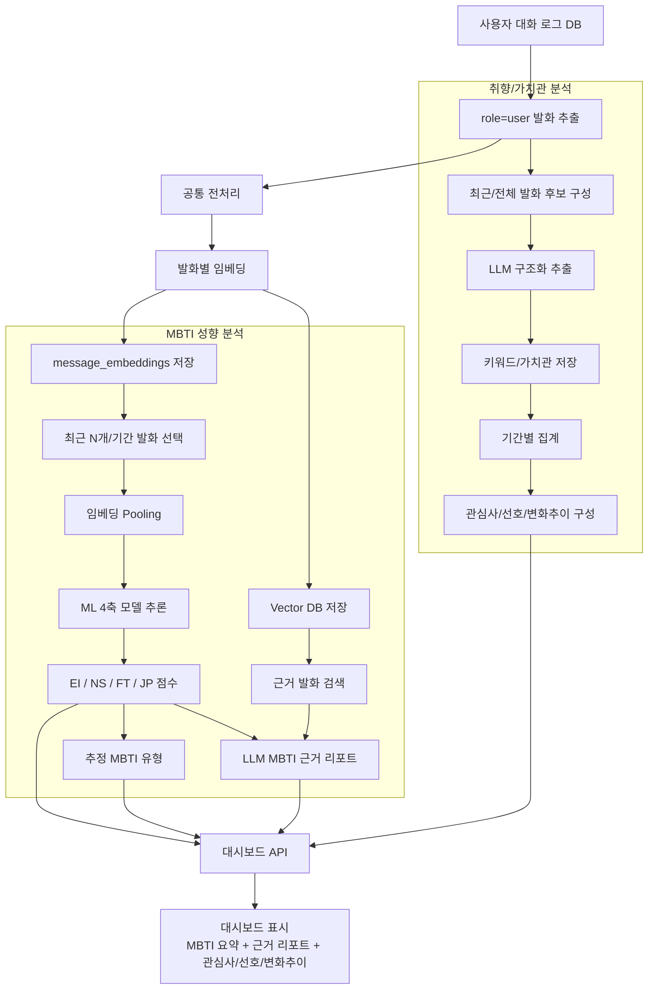

이 흐름에서 `대화 로그`, `전처리`, `임베딩`, `Vector DB`는 공통 기반이다. 이후 MBTI 성향 분석은 ML 중심으로, 취향/가치관 분석은 LLM 구조화 추출 중심으로 분리한다.

## 3. 오프라인 학습 파이프라인

오프라인 학습 파이프라인은 모델을 만드는 과정이다. 이 과정은 서비스 운영 중 매 요청마다 수행하지 않고, 데이터나 모델이 갱신될 때 별도로 실행한다.

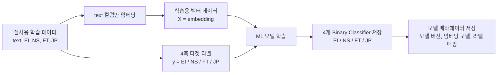

### 학습 입력

| 항목 | 사용 방식 |
| --- | --- |
| `text` | 임베딩 입력 |
| `label` | 원본 정수 라벨, 검수/추적용 |
| `mbti_type` | 원복된 16유형, 검수/추적용 |
| `EI` | E/I 모델 타겟 |
| `NS` | N/S 모델 타겟 |
| `FT` | F/T 모델 타겟 |
| `JP` | J/P 모델 타겟 |

임베딩은 `text`에만 적용한다. `label`, `mbti_type`, `EI`, `NS`, `FT`, `JP`는 임베딩 입력에 포함하지 않는다.

## 4. 실사용 데이터 전처리 기준

현재 실사용 데이터는 아래 위치에 저장된다.

```text
etl/datasets/실사용 데이터/epinfomax_mbti_korean_4axis/
```

전처리 스크립트는 아래 위치에 둔다.

```text
etl/scripts/personality_training/preprocess_epinfomax_korean_4axis.py
```

### 현재 전처리 정책

| 처리 대상 | 정책 |
| --- | --- |
| 영문 MBTI 유형명 | `text` 내부에서 제거 |
| 한글 MBTI 별칭 | `text` 내부에서 제거 |
| `MBTI`, `엠비티아이`, `성격유형` | `text` 내부에서 제거 |
| 영문자 | 제거 |
| 숫자 | 유지 |
| 감정기호 | `?`, `!`, `~`, `.`, `ㅋ`, `ㅎ`, `ㅜ`, `ㅠ`만 유지 |
| 감정기호 반복 | 최대 3개로 축약 |
| 기타 기호/문장부호 | 제거 |
| 공백 | 앞뒤 공백 제거, 연속 공백 1칸으로 축약 |
| 문맥 깨진 행 | 정제 후 한글/숫자 5자 미만만 제거 |

숫자는 나이, 기간, 횟수, 비율, 강도, 순서 정보를 보존할 수 있으므로 유지한다.

## 5. 임베딩 단계

임베딩 단계의 역할은 전처리된 `text`를 고정 길이 벡터로 변환하는 것이다.

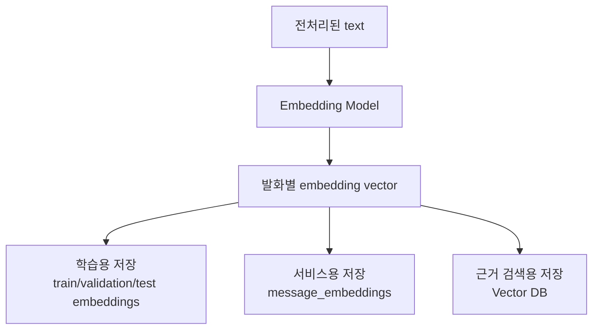

### 학습용 임베딩 산출물 권장 구조

```text
etl/datasets/실사용 데이터/epinfomax_mbti_korean_embeddings/
├─ train_embeddings.npy
├─ validation_embeddings.npy
├─ test_embeddings.npy
├─ train_labels.csv
├─ validation_labels.csv
├─ test_labels.csv
└─ embedding_metadata.json
```

`embedding[i]`와 `labels.iloc[i]`의 row 순서가 반드시 일치해야 한다.

### ML 모델 활용이 실현 가능한 이유

임베딩 기반 ML 모델이 가능한 이유는 `text`가 단순한 문자열 1개로 들어가는 것이 아니라, 임베딩 모델을 거치며 수백에서 수천 차원의 의미 벡터로 변환되기 때문이다. 즉 ML 모델 입장에서는 피처가 하나가 아니라, 문장의 의미, 감정, 주제, 표현 방식, 가치 판단 단서가 압축된 고차원 수치 피처 묶음을 입력으로 받는다.

```text
text 1개
-> embedding vector
-> [0.013, -0.221, 0.087, ..., 0.044]
-> 수백/수천 개의 수치 피처
-> EI / NS / FT / JP 분류 모델 입력
```

이 구조가 성립하는 핵심 근거는 다음과 같다.

| 근거 | 설명 |
| --- | --- |
| 임베딩은 의미 피처다 | 임베딩 벡터는 단어 빈도만이 아니라 문장의 의미, 말투, 감정, 의도, 주제 유사성을 수치 공간에 반영한다. |
| MBTI 4축은 텍스트 신호와 연결될 수 있다 | 자기표현, 의사결정 기준, 감정 표현, 관계 방식, 계획성 표현 등은 발화 안에 반복적으로 나타날 수 있다. |
| 라벨이 존재한다 | 현재 데이터셋은 `text`와 MBTI 라벨이 함께 있으므로 지도학습이 가능하다. |
| 4축 분리는 난이도를 낮춘다 | 16유형을 한 번에 맞히는 문제보다 `E/I`, `N/S`, `F/T`, `J/P`를 각각 예측하는 문제가 더 단순하고 검증하기 쉽다. |
| 데이터 규모가 MVP 기준을 충족한다 | 전처리 후 train 14,550건, validation 1,819건, test 1,821건으로 초기 실험과 검증이 가능하다. |
| 결과를 확률로 다룰 수 있다 | 모델 출력 확률을 경향 점수로 사용하면 "확정 판정"이 아니라 "상대적 경향"으로 표현할 수 있다. |

다만 이것은 "반드시 높은 정확도가 나온다"는 의미가 아니다. 정확히는 "실험 가능한 구조가 성립한다"는 뜻이며, 실제 사용 가능성은 validation/test 성능으로 확인해야 한다.

따라서 증명 절차는 아래처럼 둔다.

| 검증 항목 | 기준 |
| --- | --- |
| baseline 비교 | 랜덤 예측 또는 다수 클래스 예측보다 각 축 모델이 유의미하게 좋아야 한다. |
| 축별 성능 | `EI`, `NS`, `FT`, `JP`를 각각 accuracy, F1, ROC-AUC로 평가한다. |
| calibration | 모델이 70%라고 예측한 결과가 실제로 그 정도 신뢰도를 갖는지 확인한다. |
| split 유지 | 사용자가 임의로 split하지 않고 원본 train/validation/test로 검증한다. |
| 리포트 검증 | ML 점수와 RAG 근거 발화가 서로 모순되지 않는지 샘플링 검수한다. |

초기 MVP에서 목표는 "완벽한 MBTI 판별기"가 아니라, 챗봇 대화에서 드러나는 반복적 표현을 바탕으로 4축 경향을 통계적으로 추정하는 것이다. 이 조건에서는 임베딩 + ML 구조가 가장 구현 가능하고, 평가 가능하며, 운영 비용도 낮다.

## 6. ML 모델 학습 설계

현재 목적은 확정 MBTI 진단이 아니라 4축 경향 점수 추정이다. 따라서 16유형 단일 분류보다 4축 이진 분류가 적합하다.

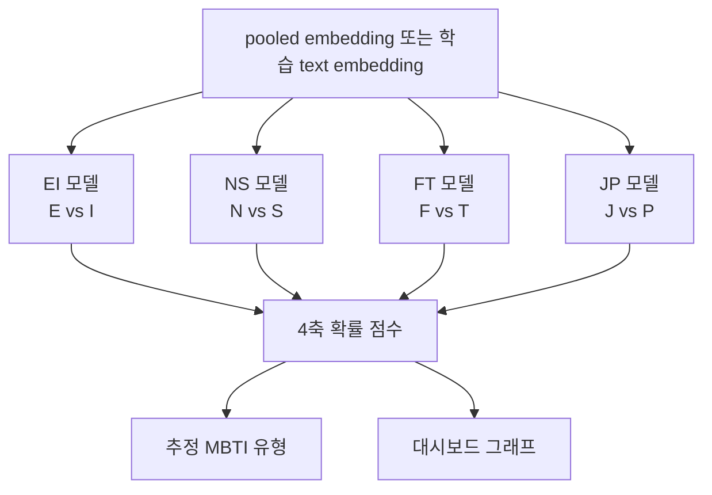

### 권장 모델 구조

초기 구현은 4개의 독립 binary classifier를 권장한다.

```text
EI_model.pkl
NS_model.pkl
FT_model.pkl
JP_model.pkl
```

장점:

- 축별 성능을 따로 확인하기 쉽다.
- 축별 threshold 조정이 가능하다.
- 특정 축의 데이터 불균형이나 성능 저하에 개별 대응할 수 있다.
- 대시보드 점수 설명이 직관적이다.

## 7. 사용자 발화 수집 및 추론 파이프라인

서비스 DB에는 사용자 발화와 시스템 발화가 순서대로 쌓인다. MBTI 성향 추정에는 사용자 발화만 사용한다.

대화 로그는 연속적으로 쌓이더라도 분석 단위는 반드시 `message` 단위로 관리한다. 즉 전체 대화를 하나의 긴 문자열로 합쳐 저장하는 것이 아니라, 사용자 발화와 시스템 발화를 순서 정보와 함께 분리 저장해야 한다.

```text
conversation_id
message_id
user_id
role
content
created_at
turn_index
```

MBTI 추론에서는 `role = user`인 발화만 사용한다. 챗봇의 시스템 발화나 assistant 응답은 사용자의 성향 신호가 아니므로 추론 입력에서 제외한다.

### 발화 적용 방식

| 방식 | 판단 |
| --- | --- |
| 발화 1개만 넣고 즉시 MBTI 추론 | 권장하지 않음. 단일 발화는 감정 상태나 순간 맥락의 영향이 크다. |
| 특정 기간의 발화를 하나의 긴 텍스트로 합쳐 임베딩 | 가능은 하지만 근거 추적, 가중치 조정, 노이즈 제거가 어렵다. |
| 발화 하나하나를 임베딩하고 추론 시 여러 발화를 pooling | 권장. 저장, 검색, 근거 제시, 재계산에 가장 유리하다. |

따라서 저장과 임베딩은 발화 단위로 수행하고, 실제 MBTI 추론은 최근 N개 또는 특정 기간의 발화 임베딩을 묶어 수행한다.

```text
사용자 발화 1개 저장
-> 발화 1개 전처리
-> 발화 1개 임베딩
-> message_embeddings 저장

추론 시점
-> 최근 N개 또는 특정 기간의 사용자 발화 조회
-> 너무 짧거나 의미 없는 발화 제외 또는 낮은 가중치
-> 발화 임베딩 pooling
-> ML 모델 추론
-> 4축 경향 점수 산출
```

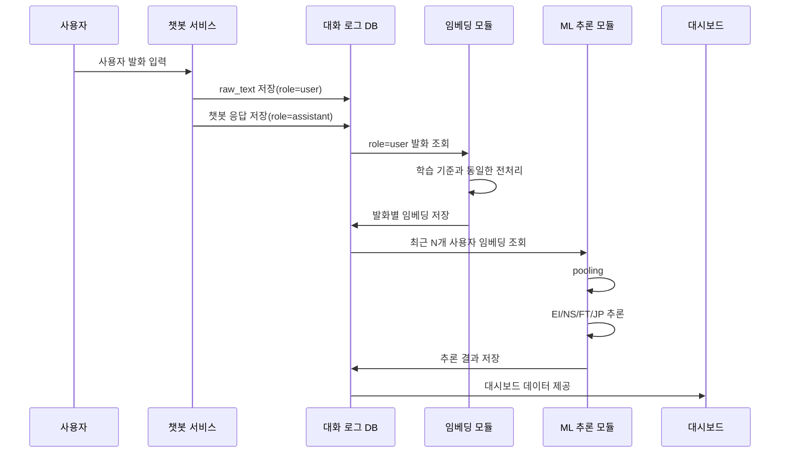

### 사용자 발화 선택 기준

| 조건 | 권장 정책 |
| --- | --- |
| 발화 수 부족 | 의미 있는 사용자 발화 5개 미만이면 추정 보류 |
| 초기 추정 | 사용자 발화 5~10개부터 낮은 신뢰도로 표시 |
| 기본 추정 | 최근 20~50개 사용자 발화 |
| 기간 기준 | 최근 7일 또는 최근 30일 |
| 장기 분석 | 최근 100개 또는 최근 30일 누적 발화 |
| 너무 짧은 발화 | 단독 임베딩 제외 또는 낮은 가중치 |

대시보드에는 분석 기준을 함께 표시한다. 예를 들어 "최근 30개 사용자 발화 기준", "최근 7일 대화 기준"처럼 범위를 명시해야 사용자가 결과를 과도하게 해석하지 않는다.

## 8. Pooling 전략

대시보드에서는 단일 발화 하나로 성향을 판단하지 않고, 사용자 발화 여러 개를 묶어 판단한다.

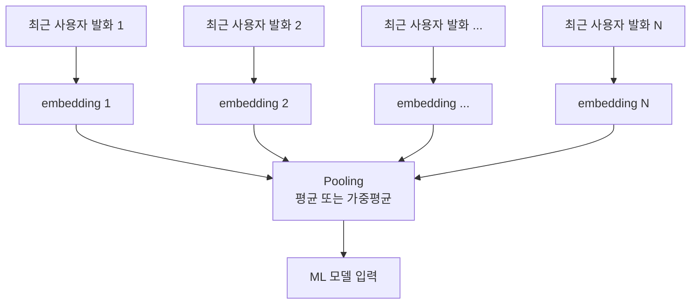

초기 구현은 평균 pooling으로 충분하다. 이후 최근 발화에 더 높은 가중치를 주는 time-decay pooling을 검토할 수 있다.

## 9. 4축 확률 조합 및 대시보드 출력

ML 모델의 산출물은 16유형 문자열이 아니라 4개 축의 기준 확률이다. 본 문서에서는 저장 기준을 아래처럼 통일한다.

| 저장 컬럼 | 의미 | 반대 확률 |
| --- | --- | --- |
| `ei_score` | `P(E)` | `P(I) = 1 - ei_score` |
| `ns_score` | `P(N)` | `P(S) = 1 - ns_score` |
| `ft_score` | `P(F)` | `P(T) = 1 - ft_score` |
| `jp_score` | `P(J)` | `P(P) = 1 - jp_score` |

예를 들어 ML 출력이 아래와 같다면:

```json
{
  "ei_score": 0.32,
  "ns_score": 0.61,
  "ft_score": 0.57,
  "jp_score": 0.36
}
```

각 축의 양쪽 확률은 다음처럼 계산한다.

```text
E 32% / I 68%
N 61% / S 39%
F 57% / T 43%
J 36% / P 64%
```

최종 유형은 각 축에서 더 높은 쪽의 글자를 순서대로 이어 붙인다.

```text
EI 축: I 선택
NS 축: N 선택
FT 축: F 선택
JP 축: P 선택

추정 유형 = I + N + F + P = INFP
```

이때 대시보드에는 `INFP`만 표시하지 않고, 축별 확률 차이도 함께 표시한다. 같은 INFP라도 `I 90%, N 88%, F 85%, P 92%`와 `I 52%, N 54%, F 53%, P 51%`는 해석 강도가 다르기 때문이다.

| 우세 확률 | 표시 강도 | 리포트 표현 |
| ---: | --- | --- |
| 70% 이상 | 뚜렷함 | 해당 축의 경향이 비교적 뚜렷하게 관찰된다. |
| 55% 이상 70% 미만 | 약간 우세 | 해당 축이 약간 우세하나 상황에 따라 달라질 수 있다. |
| 50% 이상 55% 미만 | 경계 | 두 성향이 비슷하게 나타나므로 단정하지 않는다. |

축별 우세 확률은 `max(기준 확률, 1 - 기준 확률)`로 계산한다. 전체 신뢰도는 초기에는 단순 규칙으로 산출한다.

```text
축별 우세 확률 = max(P(기준 글자), P(반대 글자))
축별 경계도 = abs(P(기준 글자) - 0.5)

high   = 평균 우세 확률 70% 이상이고, 모든 축이 60% 이상
medium = 의미 있는 발화 수가 충분하고, 대부분 축이 55% 이상
low    = 의미 있는 발화 수가 부족하거나, 55% 미만 경계 축이 2개 이상
```

대시보드 최종 화면에는 내부 확률 전체를 표처럼 노출하지 않는다. 사용자가 보는 화면은 아래 4개 영역으로 제한한다.

| 화면 영역 | 표시 내용 | 데이터 출처 |
| --- | --- | --- |
| 성향점수 방사형 그래프 | 선택된 4글자의 우세 확률 | `axis_scores_json` |
| 최종 유형 | 예: `INFP` | 축별 우세 글자 조합 |
| 신뢰도 배지 | 예: `신뢰도 72%` | 평균 우세 확률과 발화 수 기준 |
| 근거 분석 리포트 | 3~4줄 요약 근거 | RAG 검색 결과 + LLM 요약 |

따라서 대시보드는 확정 진단이 아니라 최근 대화 기반 경향 요약으로 표시한다.

```text
MBTI 분석  F-MY-004 · 최근 30일 기준

성향점수 방사형 그래프
INFP   신뢰도 72%

근거 분석 리포트
1) 외향성: 사람/약속 언급 빈도 높음
2) 직관: 미래 시나리오 탐색 표현 반복
3) 감정: 상대 감정 고려 표현 많음
4) 인식: 선택지를 열어두는 경향

주의문구
비의료 참고 정보입니다. 데이터 부족 시 분석 불가 사유를 표시합니다.
```

화면의 방사형 그래프는 `E/I`, `N/S`, `F/T`, `P/J` 양쪽 확률을 모두 보여주기보다, 최종 조합에 사용된 글자의 우세 확률만 사용한다.

```text
그래프 축: I, N, F, P
그래프 값: 68, 61, 57, 64
```

단, 내부 데이터에는 반대 확률도 보존한다. 이는 리포트 생성, 경계 축 표시, 추후 상세 화면 확장에 필요하기 때문이다.

```json
{
  "estimated_type": "INFP",
  "confidence_score": 0.72,
  "confidence_label": "medium",
  "source_message_count": 32,
  "display_axes": [
    {"label": "I", "score": 0.68},
    {"label": "N", "score": 0.61},
    {"label": "F", "score": 0.57},
    {"label": "P", "score": 0.64}
  ],
  "axis_scores": {
    "EI": {"E": 0.32, "I": 0.68, "selected": "I", "strength": "medium"},
    "NS": {"N": 0.61, "S": 0.39, "selected": "N", "strength": "medium"},
    "FT": {"F": 0.57, "T": 0.43, "selected": "F", "strength": "weak"},
    "JP": {"J": 0.36, "P": 0.64, "selected": "P", "strength": "medium"}
  }
}
```

## 10. RAG 기반 근거 리포트 생성

RAG는 MBTI를 예측하는 역할이 아니라, 모델 결과를 설명할 근거 발화를 찾고 리포트를 생성하는 역할이다.

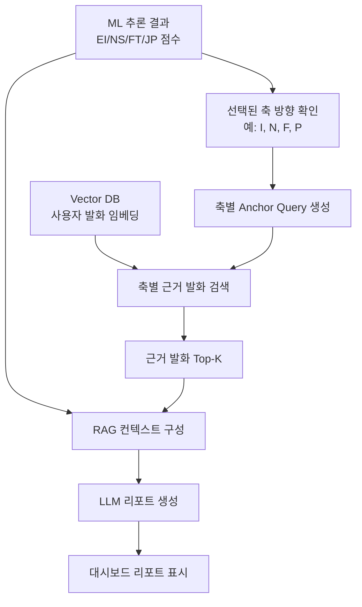

### 축별 Anchor Query 예시

| 축 | 검색 방향 | Anchor Query 예시 |
| --- | --- | --- |
| EI | I | 혼자 있는 시간, 사회적 피로, 조용한 회복 |
| EI | E | 사람들과의 교류, 대화 에너지, 외부 활동 |
| NS | N | 가능성, 의미, 상상, 미래 걱정 |
| NS | S | 현실적 상황, 구체적 경험, 실제 문제 |
| FT | F | 감정, 공감, 관계, 상처, 위로 |
| FT | T | 논리, 원칙, 판단, 효율, 사실 |
| JP | J | 계획, 정리, 확정, 마감, 통제 |
| JP | P | 즉흥, 유연함, 선택지, 자유, 변화 |

### RAGAS 기반 RAG 검증

RAGAS는 MBTI 4축 확률 자체를 평가하는 도구가 아니라, 그 확률을 설명하기 위해 검색한 근거와 LLM 리포트가 실제 사용자 발화에 충실한지 검증하는 도구로 사용한다. 즉 ML 모델은 `몇 %인가`를 계산하고, RAGAS는 `왜 그렇게 해석했는가`라는 설명 품질을 점검한다.

| RAGAS 데이터 항목 | 본 서비스에서의 의미 |
| --- | --- |
| `question` | 4축 점수와 선택된 축을 바탕으로 한 리포트 생성 요청 |
| `contexts` | Vector DB에서 검색된 사용자 근거 발화 |
| `answer` | LLM이 생성한 MBTI/취향 리포트 |
| `ground_truth` | 사람이 검수했거나 기준 프롬프트로 만든 모범 리포트 |
| `reference_contexts` | 모범 리포트가 반드시 참고해야 하는 근거 발화 |

| 평가 항목 | 적용 방식 |
| --- | --- |
| Context Precision | 검색된 발화들이 리포트 근거로 적절한지 확인한다. |
| Context Recall | 필요한 근거 발화를 충분히 가져왔는지 확인한다. |
| Faithfulness | 리포트가 검색된 발화에 없는 내용을 지어내지 않았는지 확인한다. |
| Answer Relevancy | 리포트가 4축 경향 설명과 대시보드 목적에 맞는지 확인한다. |

평가 절차는 `테스트 발화 세트 준비 -> 4축 확률 생성 -> 근거 발화 검색 -> LLM 리포트 생성 -> RAGAS 평가 -> 낮은 점수 케이스 샘플 검수` 순서로 둔다. 이 결과를 바탕으로 anchor query, 검색 Top-K, 리포트 프롬프트, 낮은 신뢰도 표현 기준을 조정한다.

RAGAS만으로는 MBTI 성향 리포트의 모든 품질을 판단하기 어렵다. 이 기능은 정답이 하나인 QA가 아니라 사용자 발화 기반 해석 리포트이므로 아래 기준을 별도로 둔다.

| 커스텀 검증 항목 | 기준 |
| --- | --- |
| 근거-축 일치성 | 예를 들어 F/T 근거로 제시된 발화가 실제로 감정/논리 판단과 관련 있는지 확인한다. |
| 과잉해석 방지 | 단일 발화 하나로 성격을 단정하지 않는지 확인한다. |
| 불확실성 표현 | 신뢰도가 낮을 때 낮다고 표현하는지 확인한다. |
| 금지 표현 준수 | 진단, 확정, 낙인처럼 보이는 표현을 피하는지 확인한다. |
| 원문 근거 유지 | 리포트의 핵심 주장마다 근거 message_id 또는 발화 스니펫이 연결되는지 확인한다. |

결론적으로 RAGAS는 적용하는 것이 맞지만, 최종 검증은 `RAGAS + 도메인 커스텀 평가 + 샘플링 사람 검수`로 구성한다.

## 11. 취향/가치관 분석 기능

취향, 가치관, 좋아하는 것, 싫어하는 것, 반복 관심사 추출은 MBTI 분석과 같은 대화 로그를 사용하지만 독립된 기능으로 설계한다. MBTI 분석은 4축 점수를 계산하는 예측 기능이고, 취향/가치관 분석은 사용자 발화에서 명시적 또는 반복적으로 드러나는 정보를 구조화하는 추출 기능이다.

| 구분 | MBTI 성향 분석 | 취향/가치관 분석 |
| --- | --- | --- |
| 목적 | 4축 경향 점수와 추정 유형 표시 | 사용자의 취향, 선호, 가치관, 관심사 표시 |
| 중심 모델 | 임베딩 + ML 4축 분류 모델 | LLM 구조화 추출 |
| 입력 | 최근 N개 또는 특정 기간의 사용자 발화 임베딩 pooling | 최근/전체 사용자 발화 묶음과 관련 근거 발화 |
| 출력 | `EI`, `NS`, `FT`, `JP` 점수, 추정 유형 | 최근 관심사, 선호 경향, 변화 추이 |
| 리포트 | RAG + LLM 근거 리포트 | 화면용 키워드 칩과 간단한 근거 요약 |
| 검증 | 축별 ML 성능 + RAGAS/커스텀 리포트 검증 | 추출 정확도 + 근거 일치성 + 중복/과잉추론 검증 |

이 기능은 처음부터 별도 ML 모델을 만들기보다 LLM 구조화 추출로 시작하는 것이 적절하다. 취향과 가치관은 고정 라벨 분류보다 정보 추출에 가깝고, 사용자마다 표현 방식이 다양하기 때문이다.

화면설계서의 취향 분석 화면(`F-MY-005`) 기준으로 최종 대시보드는 아래 4개 영역만 표시한다.

| 화면 영역 | 표시 내용 | 산출 기준 |
| --- | --- | --- |
| 최근 관심사 | 반복 등장 주제 키워드 칩 | 최근 기간 내 주제 빈도와 근거 발화 수 |
| 선호 경향 | 표현/콘텐츠 성향 칩 | 긍정 반응, 요청 패턴, 반복 선호 표현 |
| 변화 추이 | 항목별 상승/하락 퍼센트 | 이전 기간 대비 언급 비율 변화 |
| 데이터 안내 | 분석 불가 사유와 다음 갱신 조건 | 최소 발화 수, 근거 부족, 최근 데이터 부족 |

예시 화면 산출물은 아래와 같다.

```text
최근 관심사: 산책, 음악, 관계, 영화
선호 경향: 차분한 대화, 추천 반응, 짧은 계획
변화 추이: 음악 +18%, 산책 +12%, 관계 -6%
안내: 데이터 부족 시 분석 불가 사유와 다음 갱신 조건 표시
```

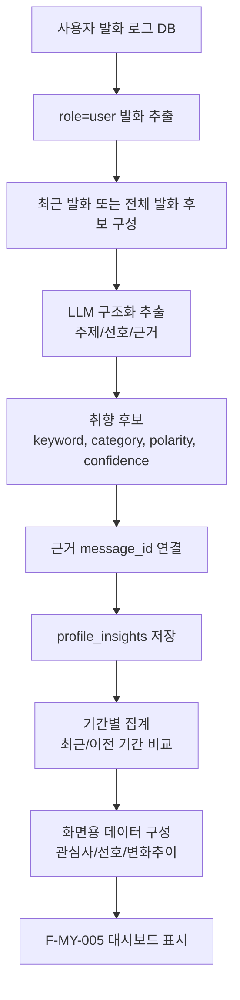

구조화 저장 예시는 아래와 같다. `category`는 화면 영역과 연결되도록 `interest`, `preference`, `trend`를 기본값으로 둔다.

```json
{
  "category": "interest",
  "keyword": "산책",
  "polarity": "positive",
  "confidence": 0.82,
  "mention_count": 7,
  "trend_delta": 0.12,
  "evidence_message_ids": ["msg_102", "msg_118"],
  "summary": "최근 대화에서 산책 관련 언급이 반복적으로 나타난다."
}
```

변화 추이는 단순 언급 수가 아니라 기간별 비율 차이로 계산한다. 예를 들어 최근 30일 중 `음악` 언급 비율이 이전 30일 대비 18%p 증가하면 화면에는 `음악 +18%`로 표시한다. 데이터가 부족하면 추이를 억지로 계산하지 않고 "최근 데이터 부족" 또는 "비교 기간 부족"을 표시한다.

주의할 점은 LLM에게 전체 로그를 한 번에 주고 "좋아하는 것을 찾아줘"라고만 요청하지 않는 것이다. 그렇게 하면 비용이 커지고, 오래된 정보와 최근 정보가 섞이며, 실제 근거가 없는 추론이 생길 수 있다. 따라서 발화 단위 저장, 근거 message_id 연결, 기간별 집계, 화면용 데이터 구성 단계를 분리한다.

## 12. 에이전트 적용 위치

이 기능은 대시보드 중심 기능이므로 에이전트는 필수 구성요소가 아니다. 초기 구현에서는 규칙 기반 파이프라인과 LLM 리포트 템플릿만으로 충분하다.

에이전트를 붙인다면 아래 위치가 적절하다.

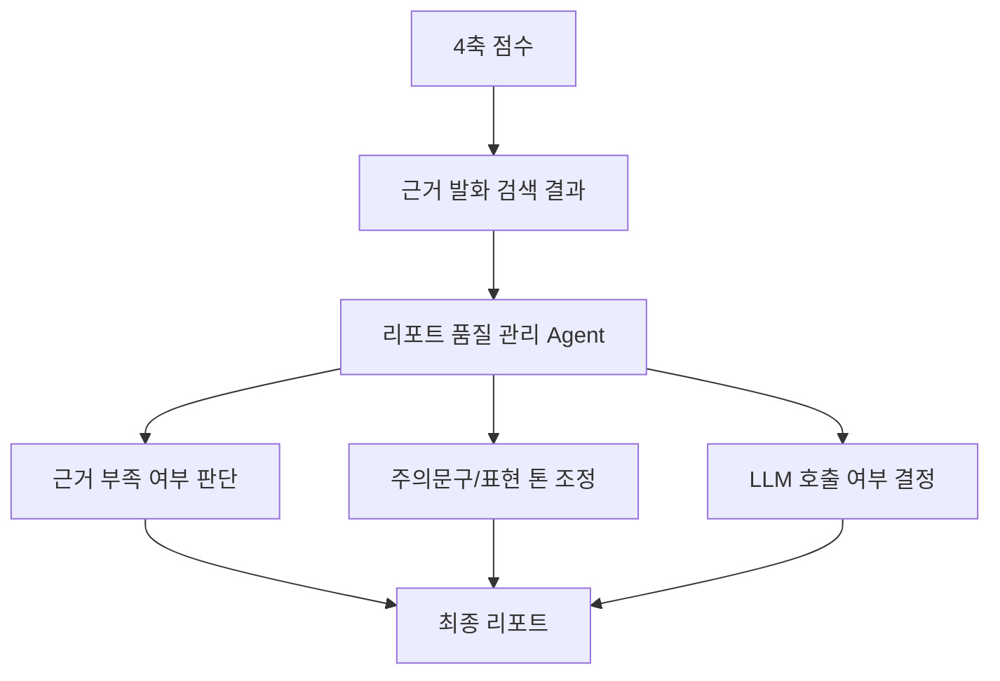

### 에이전트가 적합한 역할

- 리포트 생성 여부 판단
- 근거 발화가 부족한 축 표시
- 신뢰도 낮은 결과에 주의 문구 강화
- 대시보드 리포트 톤 조정
- 추론 결과가 애매한 축에 대한 추가 데이터 수집 제안

### 에이전트가 필요하지 않은 역할

- 임베딩 생성
- ML 모델 원점수 계산
- 4축 확률 계산
- 모델 저장/로드

점수 계산은 deterministic하게 유지하고, 에이전트는 설명 품질 관리에만 붙이는 것이 안전하다.

## 13. 권장 저장 구조

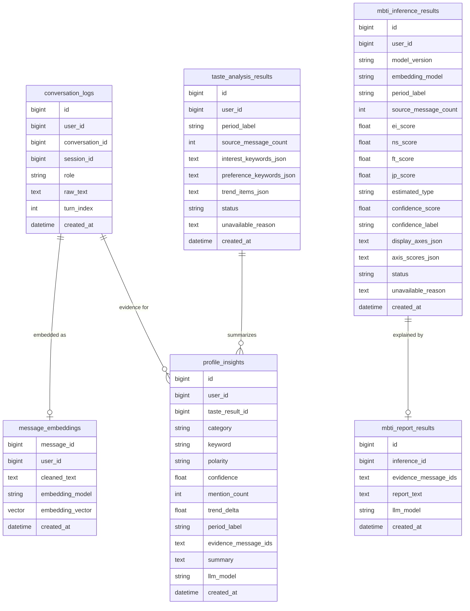

### 산출물별 저장 매핑

| 화면 산출물 | 저장 위치 | 설명 |
| --- | --- | --- |
| MBTI 최종 유형 | `mbti_inference_results.estimated_type` | 예: `INFP`, 축별 우세 글자 조합 결과 |
| MBTI 신뢰도 배지 | `confidence_score`, `confidence_label` | 예: `0.72`, `medium` |
| 성향점수 방사형 그래프 | `display_axes_json` | 예: `I 68`, `N 61`, `F 57`, `P 64` |
| 축별 내부 확률 | `axis_scores_json` | 양방향 확률과 선택 글자, 강도 보존 |
| MBTI 근거 리포트 | `mbti_report_results.report_text` | RAG 근거 기반 3~4줄 요약 |
| MBTI 분석 불가 안내 | `status`, `unavailable_reason` | 데이터 부족, 의미 발화 부족 등 |
| 취향 최근 관심사 | `taste_analysis_results.interest_keywords_json` | `산책`, `음악`, `관계`, `영화` 칩 |
| 취향 선호 경향 | `taste_analysis_results.preference_keywords_json` | `차분한 대화`, `추천 반응` 등 |
| 취향 변화 추이 | `taste_analysis_results.trend_items_json` | `음악 +18%`, `관계 -6%` 등 |
| 취향 근거 단위 | `profile_insights` | 키워드별 confidence, mention_count, evidence_message_ids |
| 취향 분석 불가 안내 | `taste_analysis_results.status`, `unavailable_reason` | 최소 발화 수 부족, 비교 기간 부족 등 |

## 14. 최종 권장 프로세스

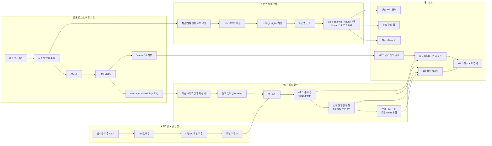

MBTI 분석과 취향/가치관 분석은 같은 `conversation_logs`, `message_embeddings`, `Vector DB`를 공유할 수 있다. 그러나 두 기능은 목적, 모델, 출력이 다르므로 결과 테이블과 평가 기준은 분리한다.

## 15. MVP와 MVP+ 고도화 전략

본 프로젝트는 한 번에 복잡한 DL/GraphRAG 구조로 진입하기보다, 먼저 MVP에서 예측과 설명이 가능한 구조를 만들고, 실제 서비스 로그와 사용자 피드백이 쌓이면 MVP+로 고도화하는 것이 적절하다.

```text
MVP:
Embedding + ML + Vector RAG + LLM Report

MVP+:
DL Fine-tuning + Vector RAG + GraphRAG + LLM Report
```

### 15.1 단계별 아키텍처 비교

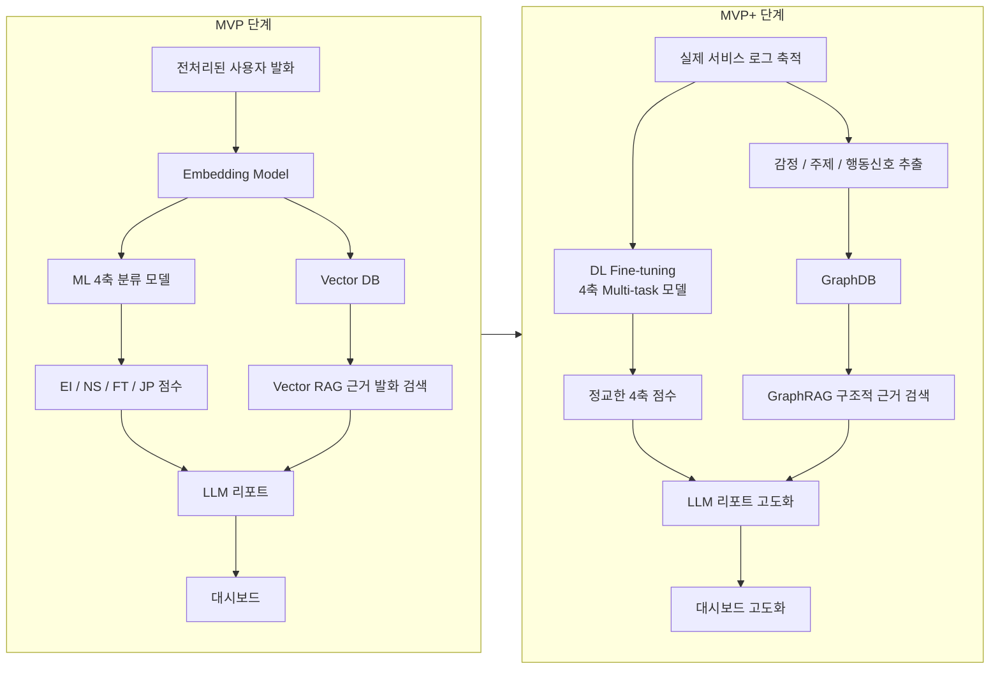

### 15.2 MVP 구성

MVP는 빠르게 구현하고 검증 가능한 구조를 목표로 한다.

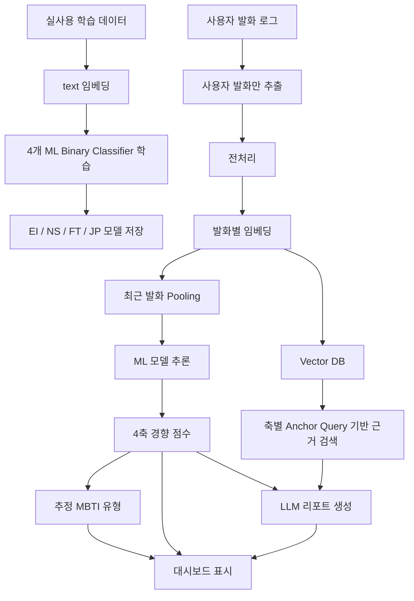

MVP의 주요 특징은 다음과 같다.

| 항목 | MVP 방식 |
| --- | --- |
| 예측 모델 | 임베딩 + 4개 ML binary classifier |
| 타겟 | `EI`, `NS`, `FT`, `JP` |
| 리포트 근거 | Vector RAG 기반 유사 발화 검색 |
| 리포트 생성 | LLM |
| 대시보드 | 추정 유형, 4축 점수 그래프, 근거 리포트 |
| 장점 | 구현 빠름, 성능 검증 쉬움, 구조 단순 |
| 한계 | 반말/챗봇 도메인 차이 보정 제한, 근거 구조화 약함 |

### 15.3 MVP+ 구성

MVP+는 실제 사용자 로그가 쌓인 뒤 모델 성능과 리포트 설명력을 높이는 고도화 단계다.

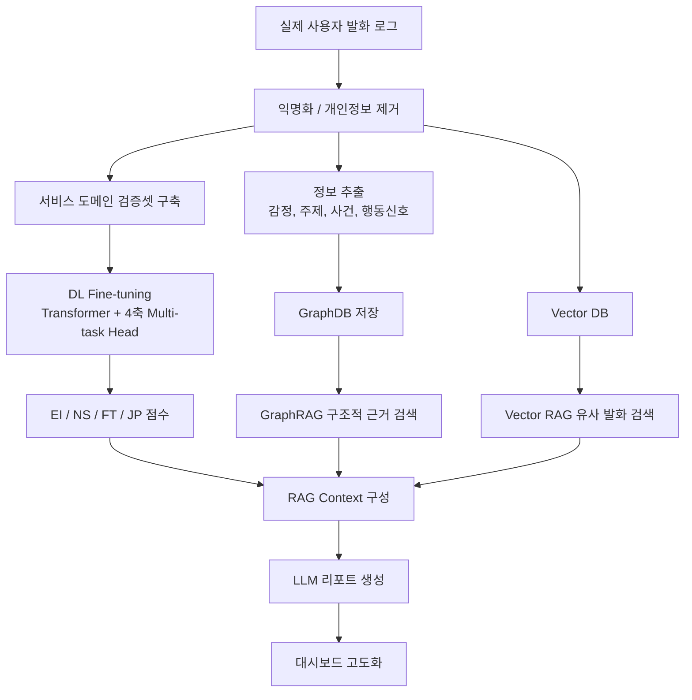

MVP+의 주요 특징은 다음과 같다.

| 항목 | MVP+ 방식 |
| --- | --- |
| 예측 모델 | DL fine-tuning 또는 4축 multi-task Transformer |
| 타겟 | 4축 동시 예측 |
| 리포트 근거 | Vector RAG + GraphRAG |
| GraphDB 노드 | User, Message, Emotion, Topic, BehaviorSignal, MBTIAxis |
| 장점 | 실제 챗봇 발화 도메인 적응, 근거 설명력 향상 |
| 한계 | 구현 복잡도 증가, 라벨링/검증셋 필요, 운영 비용 증가 |

### 15.4 GraphRAG 적용 방식

GraphRAG는 MBTI 점수를 직접 예측하는 엔진이 아니라, 근거 리포트를 더 구조적으로 만들기 위한 설명 레이어로 사용한다.

GraphDB를 구축하려면 발화에서 감정, 주제, 사건, 행동신호, 축 후보 관계를 추출해야 한다. 이 관계 추출은 단순 분류보다 문맥 이해가 많이 필요하므로 LLM을 사용하는 것이 현실적이다.

| 방식 | 적합한 역할 | 한계 |
| --- | --- | --- |
| ML 모델 | 정해진 타겟의 점수 계산, 반복 가능한 분류 | 새로운 관계 유형 추출이나 복합 문맥 해석에 약함 |
| LLM | 발화에서 감정/주제/행동신호/근거 문장을 구조화 | 점수 산출 엔진으로 쓰면 일관성과 보정 문제가 있음 |
| GraphDB | 추출된 관계 저장 및 탐색 | 관계를 직접 만들어내지는 않음 |

따라서 MVP+에서의 권장 역할 분담은 아래와 같다.

```text
ML/DL: 4축 점수 계산
LLM: 발화의 관계 추출
GraphDB: 관계 저장
GraphRAG: 구조적 근거 검색
LLM: 최종 리포트 작성
```

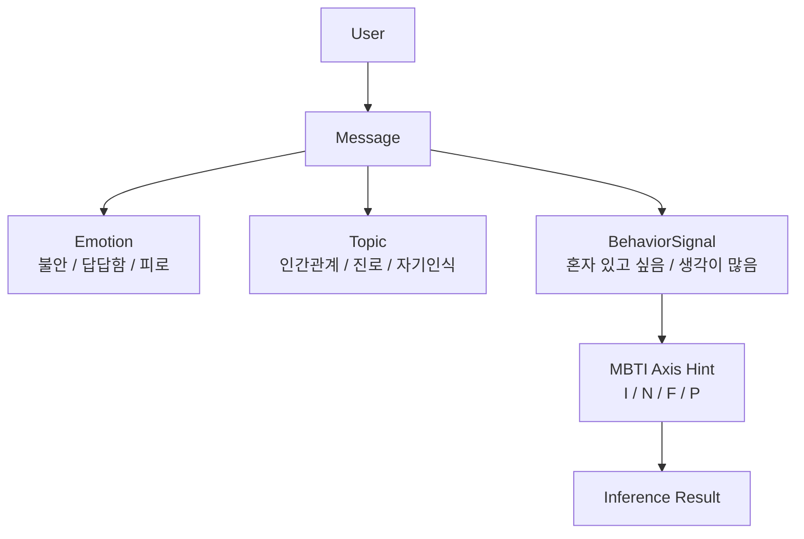

GraphDB에 저장할 수 있는 관계는 다음과 같다.

```text
(User)-[:WROTE]->(Message)
(Message)-[:EXPRESSES]->(Emotion)
(Message)-[:ABOUT]->(Topic)
(Message)-[:INDICATES]->(BehaviorSignal)
(BehaviorSignal)-[:SUPPORTS]->(MBTIAxis)
(InferenceResult)-[:BASED_ON]->(Message)
```

GraphRAG를 적용하면 리포트는 단순히 유사 발화를 나열하는 수준을 넘어서, 아래처럼 근거를 구조화할 수 있다.

```text
I 경향:
- 반복 감정: 피로, 부담
- 반복 주제: 대인관계
- 행동신호: 혼자 있고 싶음, 대화 후 지침
- 근거 발화: message_123, message_151
```

### 15.5 DL 고도화 방식

DL 고도화는 임베딩을 고정한 뒤 ML 모델만 학습하는 구조에서, Transformer encoder 자체를 서비스 목적에 맞게 조정하는 방식이다.

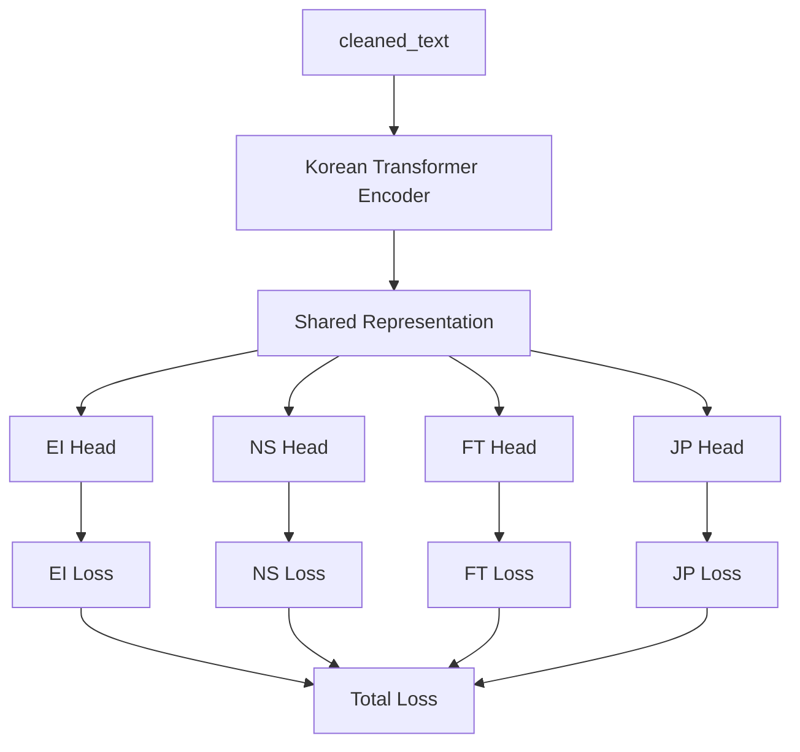

DL 구조의 핵심은 16유형 단일 분류가 아니라 4축 multi-task 학습이다.

```text
loss = EI_loss + NS_loss + FT_loss + JP_loss
```

DL은 다음 문제가 실제로 확인될 때 도입하는 것이 적절하다.

- 반말/챗봇 발화에서 ML 성능이 낮게 나타남
- 특정 축의 예측이 지속적으로 불안정함
- 임베딩 모델 교체만으로 도메인 차이가 완화되지 않음
- 실제 서비스 로그 기반 검증셋이 확보됨

### 15.6 단계별 전환 기준

| 전환 조건 | MVP 유지 | MVP+ 검토 |
| --- | --- | --- |
| 실제 로그 수 | 적음 | 충분히 축적됨 |
| 반말/챗봇 도메인 성능 | 문제 없음 | 성능 저하 확인 |
| 리포트 품질 | 근거 발화만으로 충분 | 근거가 단순하거나 반복적 |
| 구현 복잡도 | 낮게 유지 필요 | 고도화 여력 있음 |
| 설명력 요구 | 기본 리포트 | 감정/주제/행동신호 기반 설명 필요 |

### 15.7 시간이 촉박할 때의 우선순위

MVP+에서 하나만 선택해야 한다면, GraphRAG나 DL fine-tuning보다 `실제 사용자 발화 기반 검증셋 구축과 평가 체계`를 우선한다. 현재 가장 큰 리스크는 모델 구조 자체보다 학습 데이터와 실제 챗봇 사용자 발화의 차이가 얼마나 큰지 알 수 없다는 점이다.

| 우선순위 | 항목 | 이유 |
| ---: | --- | --- |
| 1 | 실제 사용자 발화 기반 검증셋 구축 | 현재 모델이 서비스 발화에서도 통하는지 확인하는 기준이다. |
| 2 | RAGAS + 커스텀 리포트 평가 | 근거 리포트가 원문 발화에 충실한지 검증한다. |
| 3 | GraphRAG | 리포트 설명력은 좋아지지만 구축 비용이 크다. |
| 4 | DL fine-tuning | 성능 개선 가능성은 있으나 검증셋 없이는 효과를 입증하기 어렵다. |

따라서 단기 우선순위는 아래처럼 잡는다.

```text
실제 사용자 발화 샘플 수집
-> 익명화 / 개인정보 제거
-> 검증 기준 작성
-> 기존 ML 모델 추론
-> 축별 성능과 리포트 품질 평가
-> 부족한 부분을 보고 GraphRAG 또는 DL 선택
```

### 15.8 최종 로드맵

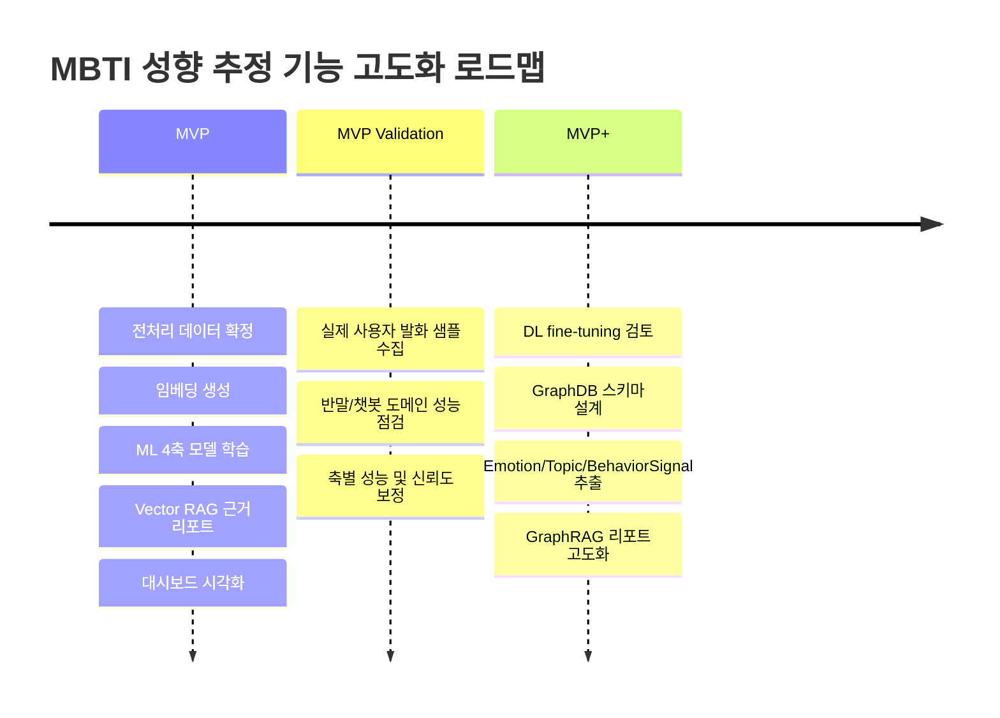

정리하면, 본 프로젝트의 현실적인 단계 구분은 아래와 같다.

```text
MVP = ML + Vector RAG
MVP+ = DL + GraphRAG
```

MVP는 먼저 동작하는 예측/설명 시스템을 만드는 단계이고, MVP+는 실제 서비스 로그를 활용해 도메인 적응과 설명력을 높이는 단계다.

## 16. 결론

가장 현실적인 구현 순서는 다음과 같다.

1. 실사용 데이터 전처리 완료
2. 학습 데이터 `text` 임베딩 생성
3. 4개 ML binary classifier 학습
4. 사용자 발화 로그에서 `role=user`만 추출
5. 학습과 동일한 전처리 적용
6. 발화별 임베딩 저장
7. 최근 사용자 발화 임베딩 pooling
8. ML 모델로 4축 점수 추론
9. 대시보드에 추정 유형과 4축 그래프 표시
10. Vector DB에서 축별 근거 발화 검색
11. LLM으로 근거 리포트 생성
12. 취향/가치관은 별도 LLM 구조화 추출로 저장
13. MBTI 점수, 근거 리포트, 취향 키워드를 대시보드에 함께 표시
14. 한국어 대화 검증셋과 실제 사용자 발화 샘플로 서비스 도메인 성능을 점검

핵심 역할 분담은 아래와 같다.

```text
ML 모델: 4축 경향 점수 계산
Vector DB: 근거 발화 검색
LLM: MBTI 리포트 작성, 취향/가치관 구조화 추출
RAGAS/커스텀 평가: 근거 리포트 품질 검증
Agent: 선택 사항, 리포트 품질 관리에만 사용
```

최종적으로 MVP는 `ML + Vector RAG + LLM Report`로 구현하고, MVP+는 실제 사용자 발화 기반 검증 결과를 본 뒤 `GraphRAG` 또는 `DL fine-tuning`을 선택적으로 도입한다. 이 순서가 가장 단순하면서도, 기능이 실제 서비스 대화에서도 성립하는지 증명하기 쉽다.
