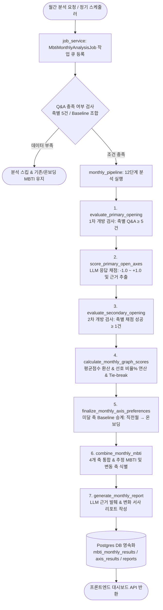

# 🧩 MBTI 성향 분석 백엔드·프론트엔드 종합 분석 보고서

본 보고서는 "빈틈사이" 서비스의 대화 기반 성향 분석 시스템인 **MBTI 성향 분석**의 백엔드 다단계 분석 파이프라인, 결정론적 이월/점수 산정 규칙, 그리고 프론트엔드 대시보드 표현 방식을 코드 수준에서 종합 분석하여 상세히 설명합니다.

---

## 1. 개요 및 핵심 철학

MBTI 성향 분석 기능은 사용자가 챗봇과 나눈 자연스러운 일상 대화 또는 전용 유도 Q&A 응답 데이터를 바탕으로 4개 선호지표 축(**IE, SN, TF, JP**)의 성향 변화를 정량적·정성적으로 분석하고, 지난달 대비 변동 양상과근거 서사를 시각적으로 제공하는 기능입니다.

### 💡 핵심 설계 원칙
1. **자연스러운 대화 기반 유도**: 사용자가 정형 검사지를 풀지 않더라도, 챗봇과의 대화 중 맥락에 맞게 던져지는 유도 질문(`MBTI_AXIS_QUESTION_DATA`)에 답하면 백엔드가 자동으로 해당 축의 성향 근거 데이터로 적재합니다.
2. **하이브리드 점수 체계 (LLM Scoring + Math Aggregation)**: 각 Q&A 답변의 성향 방향 채점은 LLM(`gpt-5.4-mini`)이 [-1.0, +1.0] 범위로 정밀 평가하고, 최종 퍼센트(%) 및 선호 문자의 결정은 백엔드의 수학적 평균 및 승계(Baseline Carry-over) 코드가 담당하여 일관성과 신뢰성을 확보합니다.
3. **단계적 이월(Carry-over) 및 멱도성 보장**: 데이터가 부족한 축은 직전 월간 리포트(`latest_monthly_result`) $\rightarrow$ 온보딩 입력값(`onboarding`) 순으로 안전하게 승계하며, 분석 작업은 백그라운드 작업 큐(`MbtiMonthlyAnalysisJob`)와 `input_hash`로 멱도성을 보증합니다.

---

## 2. 백엔드 멀티 단계 분석 파이프라인

MBTI 백엔드는 Django 내 `app/backend/mbti` 모듈에 모여 있으며, 챗봇 대화 중 실시간 수집 노드와 월간 배치 분석 파이프라인이 유기적으로 연동됩니다.

### 2.1 프로세스 흐름도 (Mermaid Diagram)



---

### 2.2 백엔드 파일 모듈 역할 상세

| 파일 / 모듈 | 주요 역할 및 담당 기능 |
| :--- | :--- |
| [`views.py`](file:///c:/Dev/project/SKN27-FINAL-4Team/app/backend/mbti/views.py) | MBTI 대시보드 API (`GET /monthly/demo/`), 비동기 요청 (`POST /monthly/request/`), 온보딩 저장 API |
| [`models.py`](file:///c:/Dev/project/SKN27-FINAL-4Team/app/backend/mbti/models.py) | `MbtiQuestionResponse`, `MbtiResponseScore`, `MbtiMonthlyResultRecord`, `MbtiMonthlyAxisResult`, `MbtiMonthlyReport`, `MbtiMonthlyAnalysisJob` 스키마 |
| [`constants.py`](file:///c:/Dev/project/SKN27-FINAL-4Team/app/backend/mbti/constants.py) | 4개 축(`IE, SN, TF, JP`), 32개 기본 질문 풀, 임계치, 모델 파라미터 단일 기준점 |
| [`monthly_pipeline.py`](file:///c:/Dev/project/SKN27-FINAL-4Team/app/backend/mbti/services/monthly_pipeline.py) | 12단계 전체 분석 파이프라인 통제 및 서브 서비스 오케스트레이션 |
| [`opening_rules.py`](file:///c:/Dev/project/SKN27-FINAL-4Team/app/backend/mbti/services/opening_rules.py) | 1차 개방(Q&A $\ge 5$건) 및 2차 개방(채점 $\ge 1$건) 물리적 개방 판단 |
| [`response_scoring.py`](file:///c:/Dev/project/SKN27-FINAL-4Team/app/backend/mbti/services/response_scoring.py) | OpenAI LLM(`gpt-5.4-mini`) 기반 사용자 답변 성향 방향 채점 및 이유/근거 스팬 추출 |
| [`graph_scores.py`](file:///c:/Dev/project/SKN27-FINAL-4Team/app/backend/mbti/services/graph_scores.py) | 축별 평균점수 환산, 선호 비율(%) 연산, 동률(Tie-break) 판단 |
| [`monthly_results.py`](file:///c:/Dev/project/SKN27-FINAL-4Team/app/backend/mbti/services/monthly_results.py) | Baseline 승계(직전 월간 $\rightarrow$ 온보딩), 최종 4글자 조합 및 변동 축(`changed_axes`) 식별 |
| [`reports.py`](file:///c:/Dev/project/SKN27-FINAL-4Team/app/backend/mbti/services/reports.py) | 대표 Q&A 근거 발췌, LLM 서사 리포트 생성, MyPage 렌더링용 구조화 payload 조립 |
| [`persona.py`](file:///c:/Dev/project/SKN27-FINAL-4Team/app/backend/mbti/services/persona.py) | MBTI 프롬프트 지침 구축 및 챗봇 페르소나 톤앤매너 매핑 |
| [`job_service.py`](file:///c:/Dev/project/SKN27-FINAL-4Team/app/backend/mbti/services/job_service.py) | DB 기반 비동기 분석 작업 큐 관리 및 멱도성(Idempotency) 검증 |
| [`ai/agents/mbti.py`](file:///c:/Dev/project/SKN27-FINAL-4Team/ai/agents/mbti.py) | 챗봇 대화 흐름(LangGraph) 내 MBTI 유도 질문 발화 및 실시간 답변 감지/저장 노드 |

---

## 3. 백엔드 핵심 규칙 및 결정론적 수식 (Backend Rules & Algorithms)

### 3.1 Q&A 수집 및 개방 조건 규칙 ([`opening_rules.py`](file:///c:/Dev/project/SKN27-FINAL-4Team/app/backend/mbti/services/opening_rules.py))
- **1차 개방 조건 (Primary Opening)**:
  - 해당 월에 특정 축(e.g. `IE`)의 Q&A 건수가 **최소 5건 이상** (`DEFAULT_REQUIRED_QNA_COUNT = 5`)일 때, 해당 축은 LLM 응답 채점 대상(`score_responses`)으로 개방됩니다.
- **2차 개방 조건 (Secondary Opening)**:
  - 1차 개방된 축 중 LLM이 성공적으로 채점(`coding_status == 'coded'`)한 건수가 **최소 1건 이상** (`DEFAULT_REQUIRED_SCORED_COUNT = 1`)일 때, 당월 그래프 점수 연산 대상(`calculate_graph_score`)으로 개방됩니다.
- **최소 분석 자격 (Eligibility Check)**:
  - 기존 기준(온보딩 입력값 또는 이전 월간 결과)이 있는 경우: 1개 축 이상만 충족해도 당월 성향 분석이 실행됩니다.
  - 기존 기준이 전혀 없는 신규 사용자: 4개 축 모두 Q&A 5건 이상을 충족해야 전체 분석이 수행됩니다.

---

### 3.2 LLM 채점 및 그래프 점수 환산 공식 ([`graph_scores.py`](file:///c:/Dev/project/SKN27-FINAL-4Team/app/backend/mbti/services/graph_scores.py))

#### 1) LLM 개별 답변 점수 ($s_i$)
LLM(`gpt-5.4-mini`)은 질문과 사용자의 답변 텍스트를 읽고 해당 축에 대한 점수 $s_i \in [-1.0, +1.0]$를 부여합니다.
- $+1.0$: 강한 양의 방향 (E, S, T, J)
- $-1.0$: 강한 음의 방향 (I, N, F, P)
- $0.0$: 중립 또는 판정 불가

#### 2) 축별 평균 점수 ($\text{axis\_avg}$) 및 선호 비율 연산
개방된 축의 유효 채점 결과 $N$개에 대해 평균 점수를 구하고, 이를 0~100% 퍼센트 비율로 환산합니다.

$$\text{axis\_avg} = \operatorname{clamp}\left(\frac{1}{N} \sum_{i=1}^{N} s_i, -1.0, 1.0\right)$$

$$\text{positive\_ratio} = \frac{\text{axis\_avg} + 1.0}{2.0}$$

$$\text{negative\_ratio} = 1.0 - \text{positive\_ratio}$$

- **화면 표시 퍼센트(%)**: 양의 방향 비중 $\text{positive\_ratio} \times 100\%$ (e.g. $\text{axis\_avg} = 0.4 \implies \text{positive\_ratio} = 0.7 \implies 70\%$)

#### 3) 동률(Tie-break) 및 선호 문자 선택 규칙
- $|\text{positive\_ratio} - \text{negative\_ratio}| \le 10^{-12}$ (`TIE_EPSILON`): 완벽한 동률로 판단하여 `tie_carried` 상태로 전환하며, 당월 문자를 선택하지 않고 Baseline 문자를 이월합니다.
- $\text{positive\_ratio} > \text{negative\_ratio}$: 양의 방향 문자 선택 (`E`, `S`, `T`, `J`)
- $\text{positive\_ratio} < \text{negative\_ratio}$: 음의 방향 문자 선택 (`I`, `N`, `F`, `P`)

---

### 3.3 Baseline 이월(Carry-over) 및 승계 우선순위 ([`monthly_results.py`](file:///c:/Dev/project/SKN27-FINAL-4Team/app/backend/mbti/services/monthly_results.py))
당월 Q&A 데이터가 부족하여 개방되지 않은 축은 다음의 4단계 우선순위에 따라 성향 문자와 비율을 승계합니다:

1. **1순위 (당월 직접 분석)**: 당월 Q&A 및 채점이 충족된 경우 $\implies$ `current_month`
2. **2순위 (직전 월간 결과 승계)**: 직전 월간 성향 결과(`latest_monthly_result`)가 존재하는 경우 $\implies$ `carried_from_previous`
3. **3순위 (온보딩 직접 입력 승계)**: 사용자가 온보딩에서 직접 선택한 MBTI가 존재하는 경우 $\implies$ `carried_from_onboarding`
4. **4순위 (데이터 부족)**: 어떠한 기준도 없는 경우 $\implies$ `insufficient_axis_data`

---

## 4. 프론트엔드 시각화 및 UI/UX 바인딩 (Frontend View)

프론트엔드는 마이페이지 내 전용 컴포넌트인 [`MbtiPanel.vue`](file:///c:/Dev/project/SKN27-FINAL-4Team/app/frontend/src/views/mypage/components/MbtiPanel.vue)에서 관리하며, 3가지 뷰 모드를 선택하여 전환할 수 있습니다.

```
MbtiPanel.vue (프론트엔드 메인)
├── 면책 조항 (aside.mbti-disclaimer): 심리검사/진단이 아닌 성향 참고 안내
├── 1. 온보딩 뷰 (mbtiViewMode === 'onboardingType')
│   ├── MBTI 16가지 유형 그리드 버튼 선택 및 저장
│   └── 등록된 온보딩 MBTI 유형 및 세부 특징 서사 카드
├── 2. 월간 분석 대시보드 뷰 (mbtiViewMode === 'onboardingNext')
│   ├── 데이터 미달 시: '월간 분석 준비 중' 엠프티 상태 & 온보딩 기준 칩
│   └── 데이터 분석 완료 시 (.mbti-combined-card):
│       ├── 현재 기준 MBTI vs 이전 기준 MBTI 비교 스택 (.mbti-type-stack)
│       │   └── 이번 달 새롭게 바뀐 알파벳은 노란색(#ffcf5a)으로 시각적 강조
│       ├── 현재 MBTI 선호성향 그래프 (.mbti-current-graph)
│       │   └── 4개 축(IE, SN, TF, JP) 게이지 바(Meter) & 퍼센트(%) 게이지
│       └── 근거 리포트 (.mbti-evidence-report): 대표 Q&A 및 LLM 변화 이유 리스트
└── 3. Q&A 대화 시뮬레이터 뷰 (mbtiViewMode === 'mockQna')
    ├── 축별 Q&A 진행 상황 프로그레스 바 (IE 5/5, SN 3/5 등)
    ├── 챗봇 질문 말풍선 & 사용자 답변 입력 텍스트 영역 (Ctrl + Enter 전송)
    └── 최소 요건 달성 시: '✨ 최소 요건 달성! 분석 결과 새로고침' 버튼 활성화
```

---

### 4.1 주요 뷰 모드별 UI 표현 및 바인딩 규칙

#### 1) 온보딩 MBTI 뷰 (`onboardingType`)
- 온보딩 시 사용자가 입력한 4자리 MBTI(e.g. `ENFP`)를 보여줍니다.
- 미입력 시 16가지 MBTI 버튼 그리드 선택 창이 노출되며, 선택 후 `선택 완료` 클릭 시 `POST /api/mbti/onboarding/` API로 데이터가 저장됩니다.

#### 2) 월간 분석 대시보드 뷰 (`onboardingNext`)
- **변동 문자 강조 (`isMbtiTypeLetterChanged`)**:
  - 이전 달 MBTI 대비 이번 달에 변화된 알파벳 문자(e.g. `INFP` $\rightarrow$ `ENFP` 변경 시 `E`)는 `#ffcf5a` 노란색으로 강조 렌더링되어 사용자가 변화를 즉시 인지할 수 있습니다.
- **4대 선호지표 게이지 그래프 (`graph-only-list`)**:
  - `IE`, `SN`, `TF`, `JP` 4개 축의 선호 비율 퍼센트(e.g. `E 경향 70%`)를 받아 애니메이션 게이지 바(`<div class="meter"><span :style="{ width: axis.score + '%' }"></span></div>`)로 표현합니다.
- **근거 리포트 (`mbti-evidence-report`)**:
  - 백엔드에서 발췌한 주요 대화 Q&A 및 성향 변화 서사를 리스트로 제공합니다.

#### 3) Q&A 대화 시뮬레이터 뷰 (`mockQna`)
- 사용자가 마이페이지 내에서 챗봇과의 유도 Q&A를 직접 경험해 볼 수 있는 모드입니다.
- **축별 진행률 필 칩 (`progress-pill`)**: 축별로 $5$건 중 몇 건이 수집되었는지 `5/5` 수치 및 완료 스타일(`is-complete`)로 시각화합니다.
- **Ctrl + Enter 전송 및 즉시 반영**: 답변 입력 시 즉시 `POST /api/mbti/mock-answer/`로 전송되어 축별 카운트가 갱신되고 다음 질문이 자동 동적 생성됩니다.

---

## 5. API 데이터 계약 (Payload Schema)

HTTP 요청/응답 규격 (백엔드 `dashboard_payload.py` $\leftrightarrow$ 프론트엔드 `mbti.api.js`):

```json
{
  "onboarding": {
    "type": "INFP",
    "period": "온보딩 직접 입력",
    "description": "열정적인 중재자 유형으로, 상상력이 풍부하고 깊은 공감 능력을 가지고 있습니다.",
    "report": ["온보딩에서 직접 설정하신 MBTI 성향 데이터입니다."]
  },
  "current": {
    "type": "ENFP",
    "periodKey": "2026-07",
    "monthLabel": "2026년 7월 기준",
    "axes": [
      { "pair": "IE", "label": "E", "score": 68.0, "status": "current_month" },
      { "pair": "SN", "label": "N", "score": 75.0, "status": "current_month" },
      { "pair": "TF", "label": "F", "score": 82.0, "status": "current_month" },
      { "pair": "JP", "label": "P", "score": 60.0, "status": "carried_from_previous" }
    ]
  },
  "previous": {
    "type": "INFP",
    "periodKey": "2026-06",
    "monthLabel": "2026년 6월 기준"
  },
  "report": [
    "이번 달 대화에서는 새로운 사람들과의 만남과 활동에 대해 긍정적인 표현이 크게 늘어났습니다.",
    "이에 따라 내향(I) 성향에서 외향(E) 성향으로의 유의미한 변화가 감지되었습니다."
  ],
  "analysis_job": {
    "status": "completed",
    "period_key": "2026-07"
  },
  "analysis_eligibility": {
    "eligible": true,
    "reason": "sufficient_qna_data",
    "period_key": "2026-07"
  }
}
```

---

## 6. 결론 및 종합 시사점

1. **정형 검사의 한계를 극복한 대화형 성향 추론**:
   - 사용자가 문항을 직접 푸는 지루함 없이, 챗봇과의 일상 대화나 간단한 Q&A만으로 MBTI 성향의 변화를 감지하는 고도화된 웰니스 경험을 제공합니다.
2. **수학적 안정성과 정밀성의 하이브리드 설계**:
   - LLM 채점의 유연성과 백엔드의 이월(Baseline Carry-over)/Tie-break 코드가 결합하여 일관성 있는 성향 그래프 데이터를 보장합니다.
3. **직관적인 프론트엔드 UX 완성도**:
   - 변화된 MBTI 알파벳의 노란색 하이라이팅, 4대 축 게이지 그래프, 그리고 Q&A 진행 상황 칩을 통해 사용자가 자신의 성향 변화를 재미있고 직관적으로 받아들일 수 있도록 우수하게 구현되어 있습니다.
