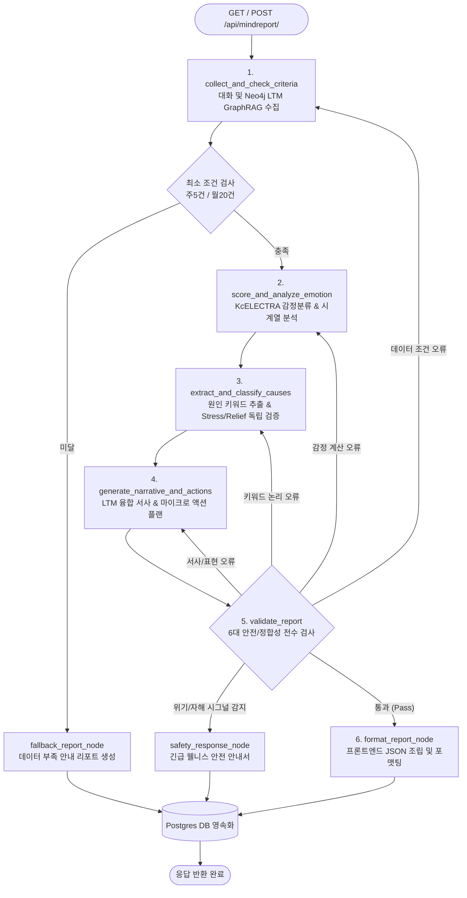

# 🌗 마음리포트(Mind Report) 백엔드·프론트엔드 종합 분석 보고서

본 보고서는 "빈틈사이" 서비스의 핵심 심리 분석 시스템인 **마음리포트(Mind Report)**의 백엔드 멀티 에이전트 아키텍처, 결정론적 규칙/산출식, 데이터 흐름, 그리고 프론트엔드 시각화 표현 방식을 코드 수준에서 종합 분석하여 상세히 설명합니다.

---

## 1. 개요 및 설계 철학

마음리포트는 사용자가 챗봇 캐릭터와 나눈 일상 대화 텍스트와 **Neo4j 그래프 데이터베이스(LTM: Long-Term Memory)**에 축적된 사건·인물·감정 관계 망을 종합 분석하여, 주간/월간 감정의 시계열 흐름 변화와 그 원인을 도출하고 다정한 자기 이해 가이드를 제공하는 핵심 분석 기능입니다.

### 💡 핵심 설계 원칙
1. **비진단적 웰니스 지향**: 점수 숫자(e.g. 75점)나 정신의학적 오진 가능성 단어(우울증, 장애 등)를 사용자에게 직접 노출하지 않고, "가벼웠던 날 / 잔잔했던 날 / 버거웠던 날"과 같은 은유적 멜로디와 언어로 전달합니다.
2. **하이브리드 파이프라인 (LangGraph + Deterministic Logic)**: 감정 분류 및 서사 생성에는 LLM(sLLM KcELECTRA / GPT)을 활용하되, 감정 점수 환산식, 시계열 흐름 분류, 가중치 정책 등은 백엔드 코드로 고정된 결정론적 수식을 적용해 할루시네이션을 방지합니다.
3. **엄격한 안전성 및 자가 복구(Revision Loop)**: 검증 에이전트(`MindReportValidationAgent`)가 생성물을 전수 실시간 검사하며, 오류 발견 시 원인을 추적하여 이전 노드로 되돌려 재수정하도록 제어합니다. 자해/위기 신호 포착 시 즉시 긴급 안전 리포트로 전환됩니다.

---

## 2. 백엔드 멀티 에이전트 아키텍처 (LangGraph Pipeline)

마음리포트 백엔드는 Django 내 `app/backend/mindreport` 모듈에 위치하며, **LangGraph** 기반의 다중 에이전트 상태 전이 및 감독 체계(`MindReportSupervisorAgent`)로 동작합니다.

### 2.1 프로세스 흐름도 (Mermaid Diagram)



---

### 2.2 백엔드 파일 모듈 역할 상세

| 파일 / 모듈 | 주요 역할 및 담당 기능 |
| :--- | :--- |
| [`views.py`](file:///c:/Dev/project/SKN27-FINAL-4Team/app/backend/mindreport/views.py) | API 엔드포인트 (`GET` 조회, `POST` 지금 확인). 인증 및 에러 핸들링 담당 |
| [`models.py`](file:///c:/Dev/project/SKN27-FINAL-4Team/app/backend/mindreport/models.py) | `MindReport` Django ORM 스키마 (생성된 주간/월간 리포트 영속 저장) |
| [`constants.py`](file:///c:/Dev/project/SKN27-FINAL-4Team/app/backend/mindreport/constants.py) | 생성 기준, 감정 점수 가중치, 시계열 임계값, 모델 파라미터 등의 단일 기준점 |
| [`graph_flow.py`](file:///c:/Dev/project/SKN27-FINAL-4Team/app/backend/mindreport/services/graph_flow.py) | LangGraph `StateGraph` 정의 및 수퍼바이저 라우터 제어 |
| [`graph_state.py`](file:///c:/Dev/project/SKN27-FINAL-4Team/app/backend/mindreport/services/graph_state.py) | 에이전트 간 전역 공유 상태 메모리 스키마 (`MindReportGraphState`) |
| [`collection.py`](file:///c:/Dev/project/SKN27-FINAL-4Team/app/backend/mindreport/services/collection.py) | 대화 로그 및 **Neo4j 그래프 DB** 기반 GraphRAG 장기 기억(LTM) 통합 수집 |
| [`scoring.py`](file:///c:/Dev/project/SKN27-FINAL-4Team/app/backend/mindreport/services/scoring.py) | KcELECTRA 감정 분류 및 결정론적 점수 환산식 연산 |
| [`electra_scorer.py`](file:///c:/Dev/project/SKN27-FINAL-4Team/app/backend/mindreport/services/electra_scorer.py) | 파인튜닝된 sLLM (KcELECTRA 4-Class) 추론 엔진 |
| [`emotion_flow.py`](file:///c:/Dev/project/SKN27-FINAL-4Team/app/backend/mindreport/services/emotion_flow.py) | 통계적 시계열 추세 분류 (상향, 하향, 변동성, 유지형) |
| [`keyword_candidates.py`](file:///c:/Dev/project/SKN27-FINAL-4Team/app/backend/mindreport/services/keyword_candidates.py) | 대화 텍스트 기반 감정 유발 원인 후보 키워드 식별 |
| [`cause_keywords.py`](file:///c:/Dev/project/SKN27-FINAL-4Team/app/backend/mindreport/services/cause_keywords.py) | 원인 키워드 독립 재검증 및 `stress` / `relief` 분류, 가중치 부여 |
| [`narrative.py`](file:///c:/Dev/project/SKN27-FINAL-4Team/app/backend/mindreport/services/narrative.py) | Neo4j LTM 연동 융합 분석 본문, 제목, 요약 및 실천 액션 카드 생성 |
| [`validation_agent.py`](file:///c:/Dev/project/SKN27-FINAL-4Team/app/backend/mindreport/services/validation_agent.py) | 6대 제약 검사, 안전 가드레일, 자가복구 Revision Loop 라우팅 |
| [`payloads.py`](file:///c:/Dev/project/SKN27-FINAL-4Team/app/backend/mindreport/services/payloads.py) | 프론트엔드 공개 API 계약 규격 변환 및 데이터 정규화 |

---

## 3. 백엔드 핵심 규칙 및 산출식 (Backend Rules & Algorithms)

### 3.1 수집 및 최소 생성 기준 규칙 ([`criteria_service.py`](file:///c:/Dev/project/SKN27-FINAL-4Team/app/backend/mindreport/services/criteria_service.py))
- **주간 리포트**: 해당 기간(최근 7일) 내 사용자 발화가 **최소 5건 이상** 존재해야 정상 생성.
- **월간 리포트**: 해당 기간(해당 월) 내 사용자 발화가 **최소 20건 이상** 존재해야 정상 생성.
- **미달 시 동작**: `fallback_report_node`로 분기하여 "기록 수집 중..." 폴백 리포트를 반환하며, 감정 그래프나 원인 분석을 강제로 추론하지 않습니다.

---

### 3.2 KcELECTRA 감정 수치화 및 상태 산출 공식 ([`scoring.py`](file:///c:/Dev/project/SKN27-FINAL-4Team/app/backend/mindreport/services/scoring.py))
사용자 발화 텍스트는 파인튜닝된 KcELECTRA 모델을 통해 4개 감정 클래스(`기쁨`, `슬픔`, `분노`, `일반`)의 확률 분포($P$)로 분류된 후, 날짜별 평균 확률에 대해 고정 가중합 수식을 적용합니다.

#### 1) 일별 감정 점수 (Daily Emotion Score)
$$\text{Emotion Score} = 70.0 \cdot P(\text{기쁨}) + 50.0 \cdot P(\text{일반}) + 40.0 \cdot P(\text{슬픔}) + 30.0 \cdot P(\text{분노})$$

- **기쁨 (Joy)**: 가중치 `70.0`
- **일반 (Normal)**: 가중치 `50.0`
- **슬픔 (Sadness)**: 가중치 `40.0`
- **분노 (Anger)**: 가중치 `30.0`

#### 2) 감정 상태 (Emotion State) 결정 분기
- $\text{Score} > 55.0 \implies \text{`positive`}$ (가벼웠던 날)
- $\text{Score} < 45.0 \implies \text{`negative`}$ (버거웠던 날)
- $45.0 \le \text{Score} \le 55.0 \implies \text{`neutral`}$ (잔잔했던 날)

> ⚠️ **중요**: 위 0~100점 점수는 백엔드 내부 연산 및 시계열 궤적 산출용으로만 사용되며, **프론트엔드 리포트 화면상에는 절대 수치(점수)를 노출하지 않습니다.**

---

### 3.3 통계적 시계열 추세 분류 규칙 ([`emotion_flow.py`](file:///c:/Dev/project/SKN27-FINAL-4Team/app/backend/mindreport/services/emotion_flow.py))
기간 동안의 일별 감정 점수 변화 양상을 4가지 흐름 유형으로 자동 분류합니다.

1. **점수 상향 (`score_upward`)**: 후반부 평균 점수가 전반부 대비 상승폭(`UPWARD_DELTA_THRESHOLD` $\ge 8.0$) 이상 상승한 경우. (Tone Color: `green`)
2. **점수 하향 (`score_downward`)**: 후반부 평균 점수가 전반부 대비 하락폭(`DOWNWARD_DELTA_THRESHOLD` $\le -8.0$) 이상 하락한 경우. (Tone Color: `red`)
3. **감정 변동성 (`score_volatile`)**: 점수의 표준편차가 기준치(`VOLATILITY_STDDEV_THRESHOLD` $\ge 16.0$) 이상이면서, 급격한 변동(18점 이상의 반전 상승/하락)이 교차 발생한 경우. (Tone Color: `gray`)
4. **유지형 (`score_maintenance`)**: 뚜렷한 추세 없이 특정 영역에 머무는 상태.
   - 긍정 우세 $\implies$ `green_maintenance` (초록 유지)
   - 부정 우세 $\implies$ `red_maintenance` (빨강 유지)
   - 중립 우세 $\implies$ `gray_maintenance` (회색 유지)

---

### 3.4 원인 키워드 분류 및 시각적 강조 가중치 규칙 ([`cause_keywords.py`](file:///c:/Dev/project/SKN27-FINAL-4Team/app/backend/mindreport/services/cause_keywords.py))
- `keyword_candidates.py`에서 사용자 발화 원문으로부터 명사구 키워드를 식별한 후, `cause_keywords.py`가 독립 재검증을 수행하여 감정에 미친 영향을 분류합니다:
  - `stress`: 부담, 긴장, 피로를 유발한 키워드
  - `relief`: 편안함, 안정, 이완을 유발한 키워드
  - `unresolved`: 인과성이 불명확한 키워드 (리포트 표시에서 자동 제외)
- **시각적 강조 정책 (Display Weight & Emphasis)**:
  - 감정 흐름이 '상향(`score_upward`)'일 경우, 이완 키워드는 채움형 `primary`로 강조하고, 스트레스 키워드는 윤곽형 `secondary` (가중치 0.7)로 표기하여 회복세를 visual hierarchy로 전달합니다.

---

### 3.5 검증, 자가복구(Revision Loop) 및 위기대응 규칙 ([`validation_agent.py`](file:///c:/Dev/project/SKN27-FINAL-4Team/app/backend/mindreport/services/validation_agent.py))
`MindReportValidationAgent`는 생성된 리포트 결과를 다음 6가지 기준으로 엄격 검사합니다:

1. **안전성 (Safety Check)**: 자해/자살 관련 위기 단어 포착 시, 즉시 `safety_response_node`로 전환하여 전문 핫라인(109, 1393) 및 자가안전 안내서로 대체 반환.
2. **비진단성/비단정성 (Non-Diagnostic)**: "우울증", "공황장애", "확실합니다", "원인입니다" 등 의학적 오진이나 단정적 표현 금지.
3. **개인정보/PII 보호**: 주민번호, 전화번호, 이메일 주소 포함 여부 검사.
4. **직접 인용 차단**: 따옴표(`"..."`)를 사용한 사용자 대화 원문 직접 인용 차단 (프라이버시 보호).
5. **내부 수치 비노출**: 점수(e.g. 68점), 확률(%), internal state(e.g. `green_maintenance`) 등의 단어가 사용자 서사에 노출되었는지 감시.
6. **자가 복구 회귀 (Revision Loop)**: 오류 포착 시 에러 지침서(`revision_instructions`)를 작성하여 해당 에이전트(Criteria / Emotion / Cause / Narrative)로 되돌려 수정을 요청 (최대 `max_retries` 횟수 내 반복).

---

## 4. 프론트엔드 시각화 및 UI/UX 바인딩 (Frontend View)

프론트엔드는 Vue 3 단일 페이지 컴포넌트인 [`ReportView.vue`](file:///c:/Dev/project/SKN27-FINAL-4Team/app/frontend/src/views/report/ReportView.vue)로 구성되며, 백엔드 payload 계약을 받아 시각적으로 아름답고 다정하게 표현합니다.

```
ReportView.vue (프론트엔드 메인)
├── 사이드바 (aside.side)
│   ├── 브랜드 캘리그라피 & 월별 필터 칩 (month-chip)
│   └── 주간/월간 리포트 목록 (report-list) & 잠금/열림 아이콘
└── 메인 보드 (section.board.report-card)
    ├── 헤더 (board-header): 리포트 제목 & 날짜/요일 표기
    ├── 1. 이번 기간의 한 줄 (card-oneline): summary
    ├── 2. 태그 속 마음 조각 (card-tags): Tag Cloud (#스트레스 / #이완)
    ├── 3. 감정 흐름 멜로디 (card-flow): SVG 3단계 영역 그래프 & 베지어 커브
    ├── 4. 마음이 놓였던 장면 (card-relief): 편안한 화음 & 팩트 날짜
    ├── 5. 마음이 무거워졌던 장면 (card-hard): 불협화음 & 팩트 날짜
    ├── 6. 작은 제안 (suggest-block): 3가지 마이크로 액션 카드 & 캐릭터 마스코트
    └── 하단 푸터 (report-actions): PDF 저장 버튼 (saveMindReportAsPdf)
```

---

### 4.1 주요 카드 섹션별 UI 표현 및 바인딩 규칙

#### 1) 이번 기간의 한 줄 (`card-oneline`)
- `currentReport.summary` 데이터를 바인딩하며, 하트 아이콘과 함께 이번 기간 사용자 마음의 핵심을 한 줄 서술로 전달합니다.

#### 2) 태그 속 마음 조각 (`card-tags`)
- `currentReport.causeLabels`에서 추출한 `#스트레스` (pink/gray), `#이완` (green/blue) 태그를 표시합니다.
- `emphasis: secondary` 속성이 부여된 태그는 글자 및 테두리가 약간 은은한 스타일(`is-secondary`)로 렌더링되어 visual hierarchy를 이룹니다.

#### 3) 감정 흐름 멜로디 (`card-flow` - SVG Graph)
- **3단계 영역 구분 (Soft Bands)**:
  - **가벼웠던 날** ($\text{Score} > 55$): 상단 영역 (`is-light-zone`)
  - **잔잔했던 날** ($45 \le \text{Score} \le 55$): 중앙 영역 (`is-steady-zone`)
  - **버거웠던 날** ($\text{Score} < 45$): 하단 영역 (`is-heavy-zone`)
- **SVG 베지어 곡선 연산**:
  - `scoreY(score)` 함수로 점수를 픽셀 $Y$ 좌표로 수식 변환하되, SVG 곡선의 점($X, Y$) 사이에 그라데이션 라인 세그먼트(`emotionSegments`)를 연결하여 매끄러운 멜로디 선으로 시각화합니다.
  - 날짜 축(`flow-date-axis`)에는 `02일`, `03일` 등의 일자가 정렬 표시됩니다.

#### 4) 화음 장면 (`card-relief` & `card-hard`)
- **편안한 화음 (`reliefReport`)**: 백엔드에서 검증된 이완 맥락 요약문과 근거 날짜(`reliefHarmonyDate`: e.g. `7월 12일 · 7월 14일`)를 조합하여 표시.
- **불협화음 (`stressReport`)**: 백엔드에서 검증된 스트레스 맥락 요약문과 근거 날짜(`hardHarmonyDate`)를 표시.

#### 5) 작은 제안 (`suggest-block`)
- 백엔드 `narrative.suggestionCards`에 포함된 최대 3개의 마이크로 실천 카드를 그리드 배치합니다.
- 각 카드마다 서비스 캐릭터 마스코트 (레드판다 `flowRedpanda`, 수달 `flowOtter`, 새 `flowBird`, 고양이 `flowCat`) 이미지를 순차적(`mascotFor(index)`)으로 바인딩합니다.
- 카드 구성: 실천 제목 (`title`), 추천 이유 (`reason`), 시작하는 방법 (`how`).

#### 6) PDF 저장 내보내기 (`reportPdfSaver.js` & `reportImageSaver.js`)
- `PDF 저장` 버튼 클릭 시 `saveMindReportAsPdf()`가 호출됩니다.
- [`reportImageSaver.js`](file:///c:/Dev/project/SKN27-FINAL-4Team/app/frontend/src/views/report/reportImageSaver.js)가 DOM 카드(`.report-card`)의 캔버스 그래픽을 1:1 고해상도로 렌더링한 후, [`reportPdfSaver.js`](file:///c:/Dev/project/SKN27-FINAL-4Team/app/frontend/src/views/report/reportPdfSaver.js)가 비율에 맞춘 단일 페이지 PDF 문서로 변환하여 다운로드합니다.

---

## 5. API 데이터 계약 (Payload Schema)

HTTP 요청/응답 규격 (백엔드 `payloads.py` $\leftrightarrow$ 프론트엔드 `report.js`):

```json
{
  "status": "success",
  "message": "정기 주간·월간 마음 리포트를 불러왔습니다.",
  "reports": [
    {
      "id": "weekly-1",
      "type": "주간 리포트",
      "range": "2026.07.13 ~ 2026.07.19 생성",
      "generatedAt": "2026-07-19T23:59:59+09:00",
      "title": "마음의 결을 차분히 따라간 일주일",
      "summary": "바쁜 업무 속에서도 조용한 산책으로 마음에 숨 쉴 틈을 주었던 시간이었어요.",
      "comfortMessage": "지친 날에는 잠깐의 휴식이 가장 큰 위로가 됩니다.",
      "stressCauses": ["야근", "프로젝트 제출"],
      "reliefCauses": ["저녁 산책", "따뜻한 차"],
      "causeLabels": [
        {
          "keyword": "저녁 산책",
          "causeType": "relief",
          "emphasis": "primary",
          "displayWeight": 1.0,
          "momentDescription": "퇴근 후 바람을 맞으며 걷는 동안 마음이 가라앉았습니다.",
          "evidenceDates": ["2026-07-15"]
        }
      ],
      "hardMoments": [{ "text": "프로젝트 제출 압박으로 긴장했던 날이에요.", "keyword": "프로젝트 제출", "evidenceDates": ["2026-07-14"] }],
      "reliefMoments": [{ "text": "저녁 산책을 하며 마음을 다스렸습니다.", "keyword": "저녁 산책", "evidenceDates": ["2026-07-15"] }],
      "stressReport": "업무 마감 압박으로 인해 주중에 잠시 긴장감이 높아졌어요.",
      "reliefReport": "저녁 산책과 짧은 휴식을 통해 마음의 안정을 찾으셨어요.",
      "emotions": [
        { "day": "13일", "emotion_score": 42.5 },
        { "day": "15일", "emotion_score": 62.0 },
        { "day": "17일", "emotion_score": 58.0 }
      ],
      "emotionScale": { "heavyMax": 45.0, "lightMin": 55.0 },
      "analysis": ["자신의 속도에 맞춰 차분히 마음을 조율해가는 모습이 인상적입니다."],
      "recommendations": ["5분간 깊은 호흡하기", "자기 전 따뜻한 물 마시기"],
      "suggestionCards": [
        {
          "title": "5분 깊은 호흡",
          "reason": "마음이 번잡할 때 몸의 긴장을 이완하는 데 도움을 줍니다.",
          "how": "조용한 곳에서 숨을 천천히 4초간 들이쉬고 6초간 내쉬어보세요.",
          "timing": "퇴근 직후"
        }
      ],
      "is_fallback": false,
      "is_safety_response": false
    }
  ]
}
```

---

## 6. 결론 및 종합 시사점

1. **완벽한 도메인 격리와 역할 분담**:
   - 백엔드는 데이터 수집(Neo4j LTM GraphRAG), 수치 분석(KcELECTRA), 가드레일 검증(Validation Agent)에 집중하고, 프론트엔드는 은유적 감성 시각화(SVG 멜로디, 3색 Band, 카드 렌더링)에 집중하여 깨끗한 아키텍처를 이룹니다.
2. **높은 웰니스 안정성 체계**:
   - 의학적 오진 방지, PII 차단, 따옴표 직접인용 금지, 자해 예방 긴급 핫라인 전환 체계가 백엔드 검증 노드에서 실시간 보장되므로 심리적 안전성이 극대화되어 있습니다.
3. **사용자 경험(UX) 관점의 섬세한 조율**:
   - 점수 숫자 대신 멜로디 곡선과 화음 문장으로 결과를 전달함으로써 사용자가 리포트를 "평가나 진단"이 아닌 "따뜻한 공감과 되돌아봄"으로 받아들이도록 우수하게 설계되어 있습니다.
