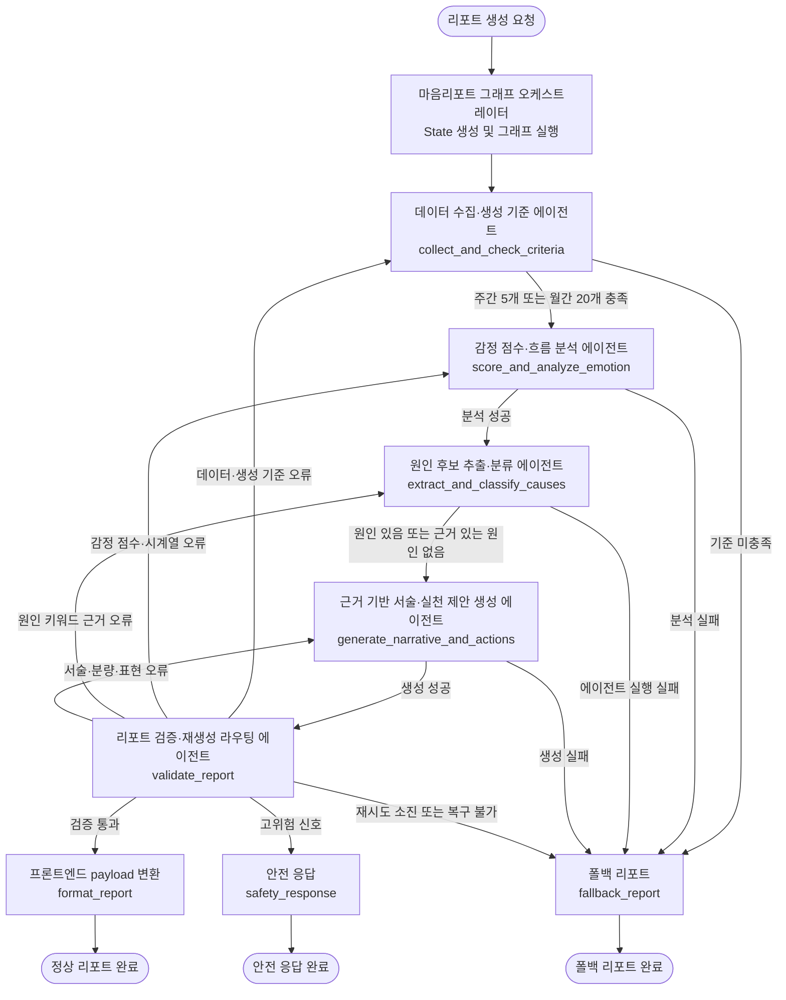
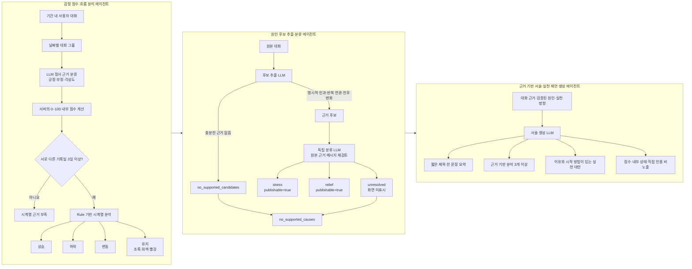
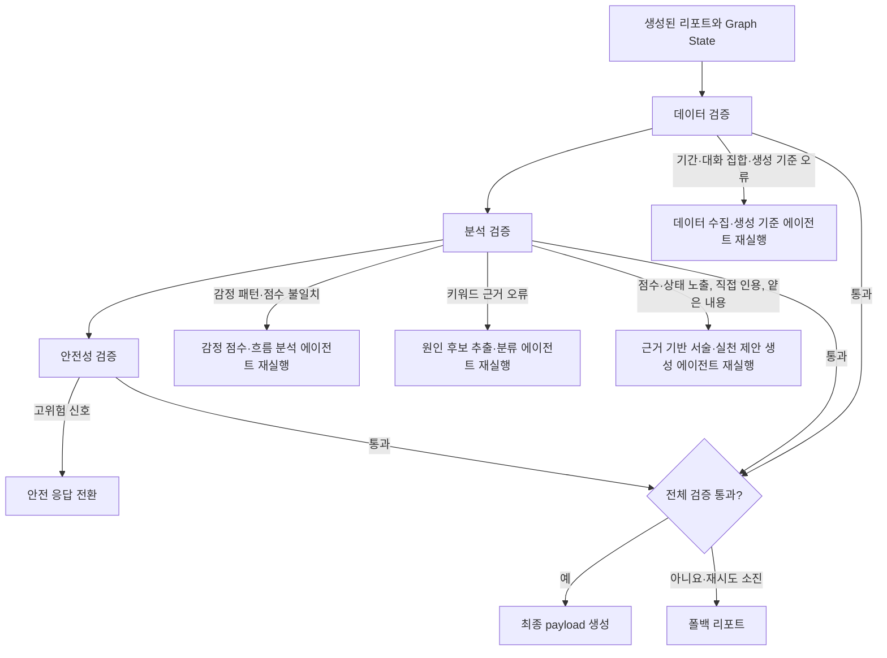

# 마음리포트 LangGraph 멀티에이전트 흐름

현재 `app/backend/mindreport/services` 구현을 기준으로 정리한 흐름이다.

## 전체 그래프

## 에이전트 내부 처리

## 검증 및 재생성

## 프론트엔드 출력

정상 리포트 payload에는 다음 데이터가 포함된다.

- 짧은 제목과 한 문장 요약
- 날짜별 감정 얼굴
- 검증을 통과한 스트레스 원인
- 검증을 통과한 스트레스 이완 원인
- 근거를 간접적으로 풀어 쓴 분석 문단
- 구체적인 실천 대안
- 원인 근거가 없으면 빈 배열과 안내 문구
