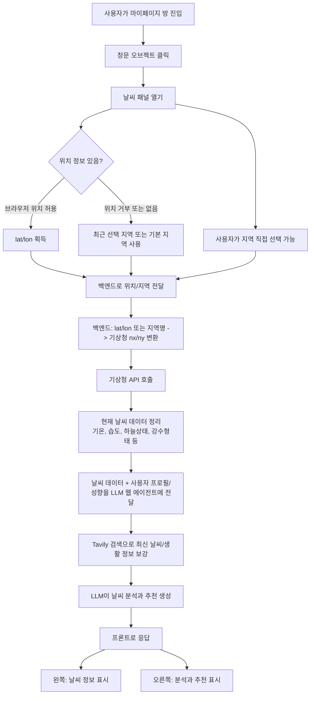

# 날씨 기능 프로세스 플로우

## 개요

마이페이지 방 화면의 창문 오브젝트를 통해 현재 지역 날씨를 확인하고, 날씨 기반 분석과 추천을 제공한다.

권장 방식은 **자동 위치 우선 + 수동 지역 선택 보완**이다.

- 위치 허용 시: 자동으로 현재 지역 날씨 제공
- 위치 거부 시: 기본 지역 또는 마지막 선택 지역 사용
- 사용자는 언제든 패널에서 지역 변경 가능
- 선택 지역은 `localStorage` 또는 프로필 설정에 저장

## 프로세스 플로우

## 백엔드 흐름

1. 프론트에서 `lat/lon` 또는 선택 지역명을 전달한다.
2. 백엔드는 좌표 또는 지역명을 기상청 격자 좌표 `nx/ny`로 변환한다.
3. 기상청 API에서 현재 날씨 데이터를 조회한다.
4. 기온, 습도, 하늘상태, 강수형태 등 화면에 필요한 값만 정리한다.
5. 정리된 날씨 정보와 사용자 프로필/성향 정보를 LLM 웹 에이전트에 전달한다.
6. Tavily 검색으로 최신 생활/날씨 맥락을 보강한다.
7. LLM은 날씨 분석과 추천을 JSON 형태로 생성한다.

## 프론트엔드 흐름

1. 마이페이지 방 화면에서 창문을 클릭한다.
2. 날씨 패널을 연다.
3. 왼쪽 영역에는 현재 날씨 정보를 표시한다.
4. 오른쪽 영역에는 AI 분석과 추천을 표시한다.
5. 지역 변경 UI를 제공한다.

## 위치 처리 정책

자동 위치만 사용하는 방식은 권장하지 않는다. 브라우저 위치 권한을 거부하는 사용자가 있고, IP 기반 위치는 정확도가 낮으며 개인정보 부담이 크다.

수동 지역 선택만 사용하는 방식도 권장하지 않는다. 날씨 기능은 즉시성이 중요하므로 매번 지역을 선택하게 하면 사용성이 떨어진다.

따라서 다음 흐름을 권장한다.

1. 최초 진입 시 브라우저 위치 권한 요청
2. 허용하면 현재 좌표 기반 날씨 조회
3. 거부하면 마지막 선택 지역 또는 기본 지역 사용
4. 사용자가 패널에서 지역 직접 변경 가능
5. 변경한 지역을 저장해 재방문 시 기본값으로 사용

