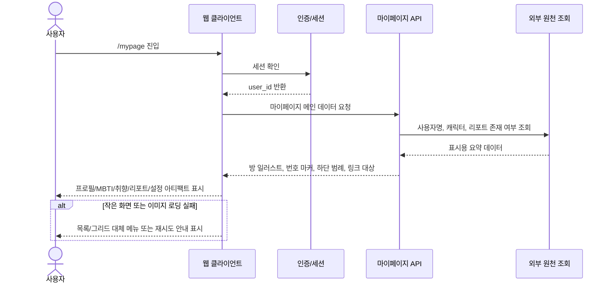
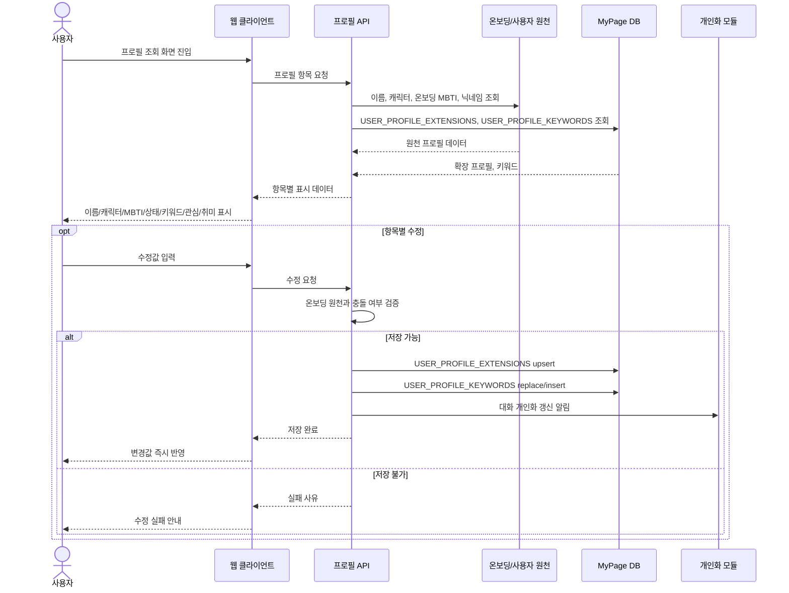
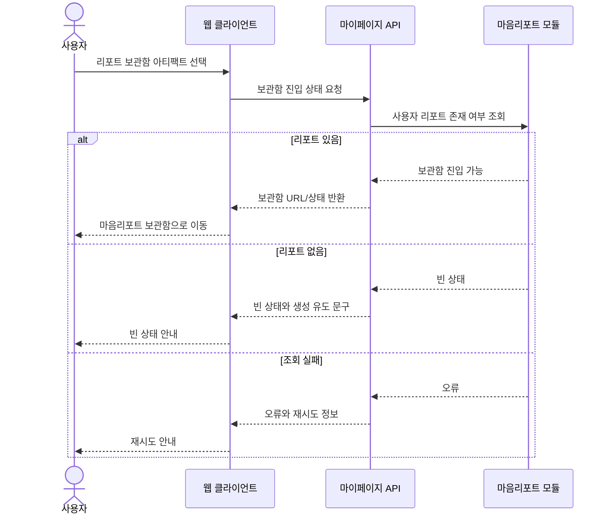
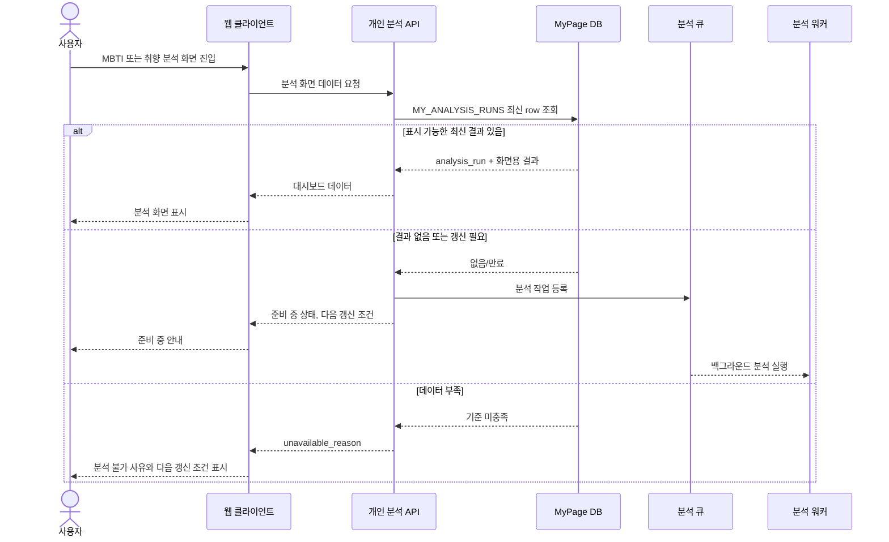
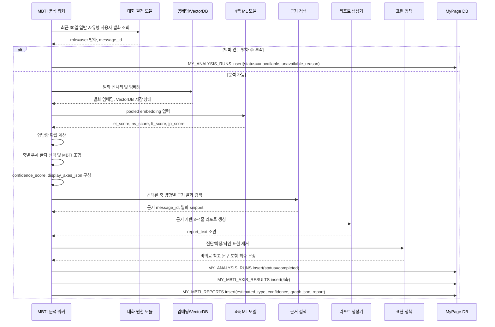
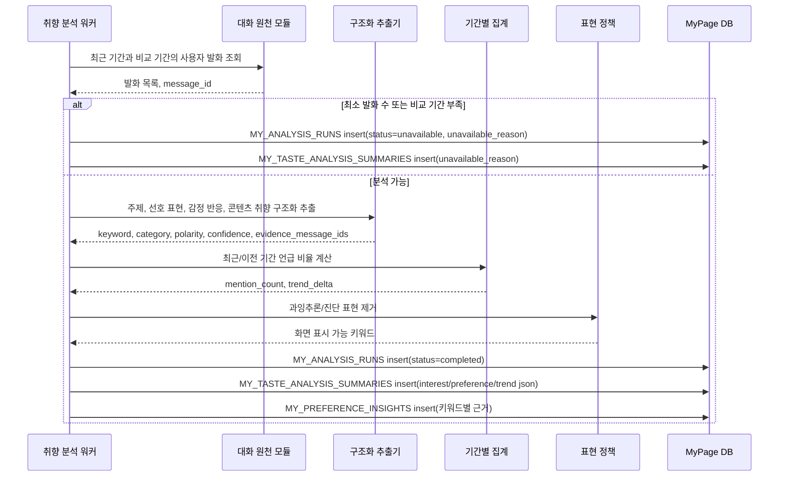
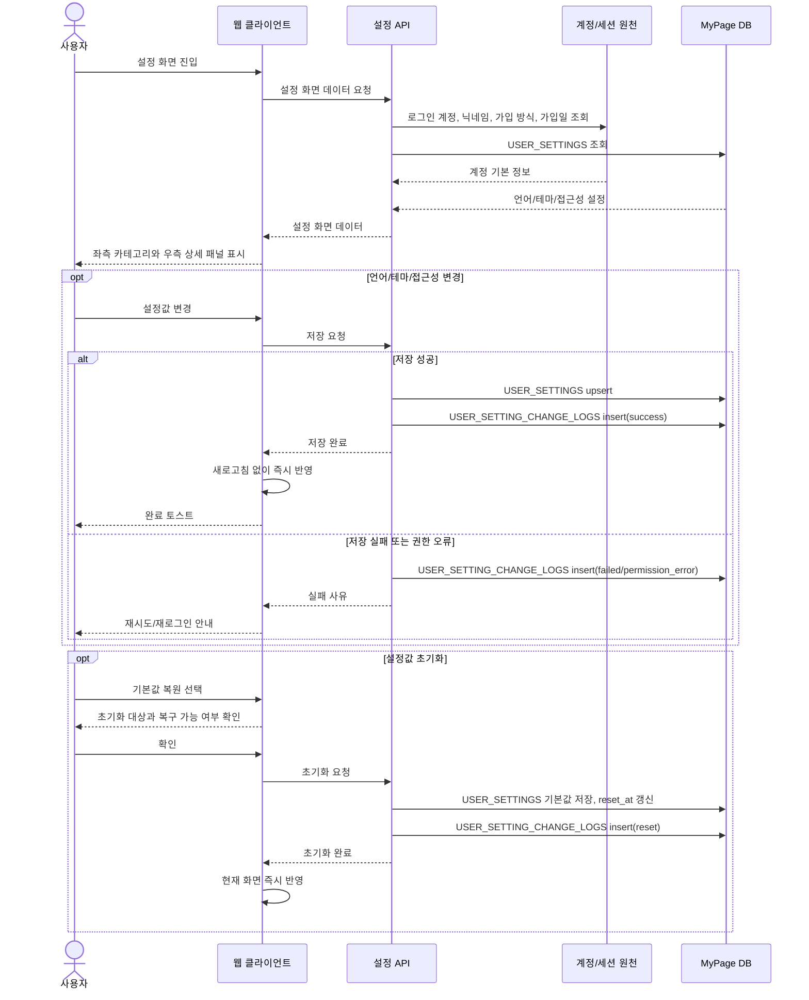
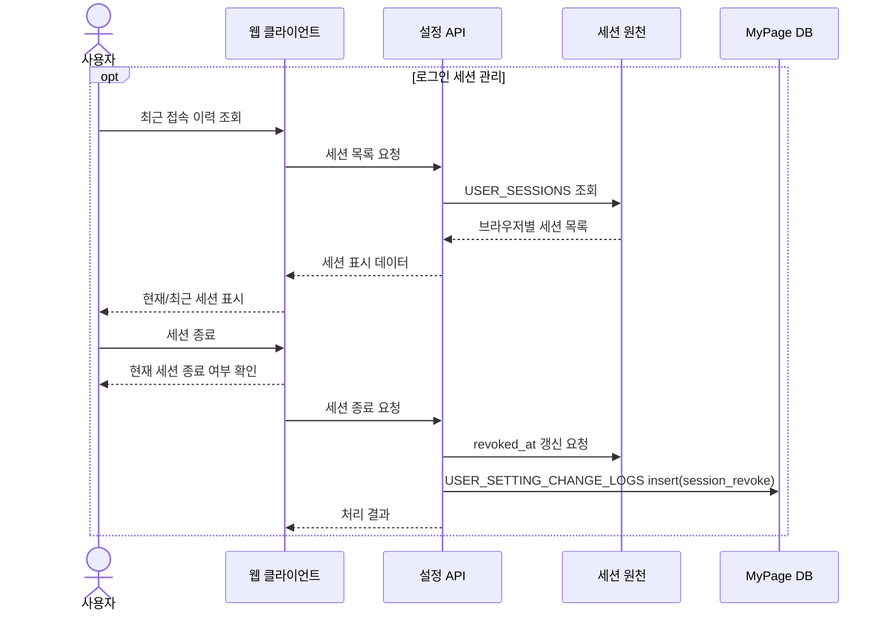
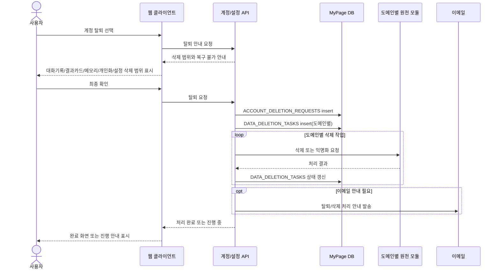

# 마이페이지/설정 시퀀스 다이어그램 v1.0

## 정리 기준

본 문서는 화면설계서, 요구사항정의서 v8, ERD 문서, `MBTI_성향추정_프로세스_흐름_보고서.md`를 기준으로 다시 정리한 시퀀스다.

핵심 기준은 다음과 같다.

- 다른 담당자가 소유한 `USERS`, `CONVERSATIONS`, `CHAT_MESSAGE`, `MIND_REPORT`, `RESULT_CARD`, `SAFETY_EVENT` 등은 직접 생성하지 않고 조회 또는 외부 모듈 호출로만 사용한다.
- 이 문서의 insert/update 대상은 ERD에 정의된 마이페이지/설정 테이블이다.
- 화면 흐름은 화면설계서의 `F-MY-001~005`, `F-SET-001~006` 구조를 따른다.
- 개인 분석은 사용자가 점수를 직접 계산하는 기능이 아니라, 화면 진입 시 저장 결과를 보여주고 필요 시 백그라운드에서 갱신하는 구조다.

## 1. 마이페이지 메인 진입

`F-MY-001`은 정적 방 일러스트와 기능 진입 동선이다. 별도 insert 대상은 없다.

## 2. 프로필 조회 및 항목 수정

프로필은 온보딩 원천 값을 기준으로 보여주되, 마이페이지에서 추가/수정해야 하는 확장 정보만 `USER_PROFILE_EXTENSIONS`, `USER_PROFILE_KEYWORDS`에 저장한다.

## 3. 리포트 보관함 연결

`F-MY-003`은 마음리포트 모듈로 들어가는 연결 동선이다. 보관함 테이블은 새로 만들지 않는다.

## 4. 개인 분석 화면 공통 진입

`F-MY-004`, `F-MY-005`는 같은 진입 패턴을 쓴다. 화면은 최신 저장 결과를 먼저 조회하고, 결과가 없거나 만료되면 분석 작업을 등록한다.

## 5. MBTI 분석 워커

MBTI 분석은 `4축 확률 산출 -> 4글자 조합 -> 방사형 그래프 데이터 -> 근거 리포트` 순서로 저장된다.

## 6. 취향 및 선호 분석 워커

취향 분석은 장문 리포트보다 화면설계서의 `최근 관심사`, `선호 경향`, `변화 추이`, `데이터 안내`를 만들기 위한 구조화 흐름이다.

## 7. 설정 조회 및 변경

설정 화면은 계정 기본 정보 조회와 UI 설정 변경을 분리한다. 계정 원천값은 조회만 하고, 언어/테마/접근성은 `USER_SETTINGS`에 저장한다.

## 8. 세션 관리

세션 원천은 다른 담당자 테이블을 조회/갱신하고, 변경 이력만 본 ERD의 `USER_SETTING_CHANGE_LOGS`에 저장한다.

## 9. 계정 탈퇴 및 데이터 삭제

탈퇴는 삭제 요청과 도메인별 삭제 작업을 분리해 저장한다. 실제 원천 데이터 삭제는 각 도메인 모듈에 위임한다.

## 요구사항 연결 요약

| 범위 | 핵심 시퀀스 | insert/update 테이블 |
| --- | --- | --- |
| `F-MY-001` | 마이페이지 메인 진입 | 없음 |
| `F-MY-002` | 프로필 조회/수정 | `USER_PROFILE_EXTENSIONS`, `USER_PROFILE_KEYWORDS` |
| `F-MY-003` | 리포트 보관함 연결 | 없음 |
| `F-MY-004` | MBTI 화면 진입, MBTI 워커 | `MY_ANALYSIS_RUNS`, `MY_MBTI_AXIS_RESULTS`, `MY_MBTI_REPORTS` |
| `F-MY-005` | 취향 화면 진입, 취향 워커 | `MY_ANALYSIS_RUNS`, `MY_TASTE_ANALYSIS_SUMMARIES`, `MY_PREFERENCE_INSIGHTS` |
| `F-SET-001~005`, `NF-SET-001` | 설정 조회/변경/초기화 | `USER_SETTINGS`, `USER_SETTING_CHANGE_LOGS` |
| `F-SET-006` | 탈퇴/데이터 삭제 | `ACCOUNT_DELETION_REQUESTS`, `DATA_DELETION_TASKS` |
