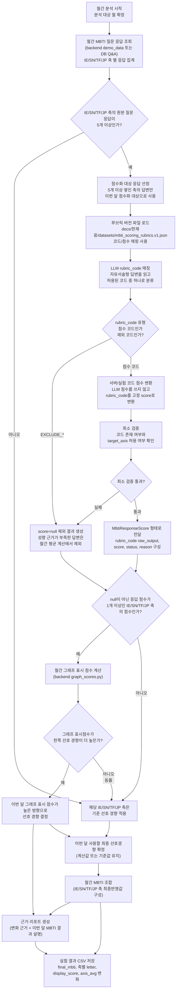

# 루브릭코드 방식 프로세스 플로우

이 실험은 단순 응답 채점기가 아니라, 실제 backend 월간 MBTI 파이프라인에 루브릭코드 기반 scoring client를 끼워 넣어 최종 MBTI와 축별 점수 변화를 확인하는 용도다.

## 목적

기존 페르소나 직접 채점 방식은 LLM이 응답별 `score`를 직접 산정한다. 루브릭코드 방식은 이 부분만 바꾼다.

```text
기존:
답변 → LLM이 score 직접 산정 → 월간 파이프라인

루브릭코드 방식:
답변 → LLM이 rubric_code만 선택 → 서버/실험 코드가 score 변환 → 월간 파이프라인
```

따라서 LLM의 역할은 점수 계산자가 아니라 **자유서술형 답변을 정해진 루브릭 코드 중 하나로 분류하는 해석기**가 된다.

## 사용하는 실제 backend 흐름

이 실험은 아래 backend 파일의 흐름을 기준으로 한다.

| 단계 | 실제 파일 | 역할 |
| --- | --- | --- |
| 데모 월간 Q&A 구성 | `test/jaewung/mbti_scoring_experiments/demo_data.py` | 같은 월간 질문/답변 데이터를 만든다. |
| baseline 구성 | `test/jaewung/mbti_scoring_experiments/monthly_demo_payload.py` | 이전 MBTI와 이전 축별 점수 기준값을 만든다. |
| 월간 파이프라인 실행 | `app/backend/mbti/services/monthly_pipeline.py` | 1차 개시, 점수화, 2차 개시, 그래프 점수, 최종 MBTI 조합, 리포트 생성을 수행한다. |
| 그래프 점수 계산 | `app/backend/mbti/services/graph_scores.py` | 응답별 점수 평균을 화면 표시 점수와 `selected_letter`로 변환한다. |
| 최종 MBTI 조합 | `app/backend/mbti/services/monthly_results.py` | IE/SN/TF/JP 축별 최종 글자를 조합한다. |

루브릭코드 실험은 이 중 **점수화 단계의 scoring client만 교체**한다. 이를 위해 필요한 최소 모듈인 `response_scoring.py`만 이 폴더의 `pipeline/` 아래로 복사해 루브릭코드 방식으로 개조하고, 나머지 backend 흐름은 원본 모듈을 import해서 연결한다.

## 전체 플로우

```text
02_rubric_code/run.py
→ 공통 실행기 run_experiment.py 호출
→ test/jaewung/mbti_scoring_experiments/demo_data.py에서 데모 월간 Q&A 로드
→ test/jaewung/mbti_scoring_experiments/monthly_demo_payload.py에서 baseline snapshot 로드
→ app/backend/mbti/services/monthly_pipeline.py의 run_monthly_mbti_pipeline 실행
→ scoring_client 자리에 02_rubric_code/pipeline/response_scoring.py의 RubricCodeScoringClient 주입
→ 각 응답마다 rubric_code 방식으로 score 산출
→ backend 파이프라인이 2차 개시, 그래프 점수, selected_letter, 최종 MBTI 계산
→ results/mbti_score_changes.csv에 실행별 MBTI 및 점수 변화 저장
```

## Mermaid 흐름도

아래 흐름도는 보고서의 두 번째 흐름도인 **점수 산정 안정성 보강 흐름도**를 루브릭코드 실험 폴더 기준으로 가져온 것이다. 핵심은 기존 월간 MBTI 파이프라인 전체를 바꾸는 것이 아니라, `통과한 IE/SN/TF/JP 축 응답의 점수화` 구간만 루브릭코드 방식으로 교체하는 것이다.



## 점수화 내부 플로우

```text
응답 1개
→ target_axis 확인
→ docs/한재웅/datasets/mbti_scoring_rubrics.v1.json 로드
→ target_axis에 해당하는 allowed_rubrics만 추출
→ LLM에 question, answer, allowed_rubrics 전달
→ LLM은 rubric_code, evidence_span, reason만 반환
→ 실험 코드가 rubric_code가 allowed_rubrics 안에 있는지 검증
→ 루브릭 파일의 고정 score/status로 변환
→ backend 월간 파이프라인의 MbtiResponseScore 형태로 전달
```

## LLM 출력 제약

LLM은 점수를 직접 반환하지 않는다.

허용 출력:

```json
{
  "rubric_code": "IE_I_WEAK",
  "evidence_span": "완전히 낯선 자리에서는 조용히 분위기를 봅니다.",
  "reason": "낯선 모임에서 먼저 참여하기보다 관찰하는 경향이 나타남"
}
```

금지 출력:

```text
score
status
letter
direction
axis_avg
selected_letter
estimated_mbti_type
```

이 값들은 LLM이 아니라 실험 코드와 backend 파이프라인이 계산한다.

## 루브릭 코드 검증 규칙

| 상황 | 처리 |
| --- | --- |
| `rubric_code`가 해당 축 allowed list 안에 있음 | 루브릭 파일의 `score`, `status`로 변환 |
| `rubric_code`가 비어 있음 | `failed`, `score=null` |
| 다른 축의 `rubric_code`를 반환 | `failed`, `score=null` |
| JSON 파싱 실패 | `failed`, `score=null` |
| `EXCLUDE_CONTEXTUAL` 또는 `EXCLUDE_INSUFFICIENT` | `insufficient_context`, `score=null` |

## 실행 방식

placeholder 실행:

```powershell
python test\jaewung\mbti_scoring_experiments\02_rubric_code\run.py
```

placeholder 실행도 별도 루브릭 코드표를 하드코딩하지 않는다. 실제 루브릭 JSON의 `signals_ko`와 `decision_rule_ko`를 기반으로 dry-run용 `rubric_code`를 고르고, 해당 코드의 `score/status`를 그대로 사용한다.

실제 루브릭코드 LLM 실행:

```powershell
python test\jaewung\mbti_scoring_experiments\02_rubric_code\run.py --use-llm
```

`--use-llm`은 외부 LLM API를 호출할 수 있다. API 키, 모델 설정, 비용을 확인한 뒤 수동으로 실행한다.

## 결과 CSV

결과는 아래 파일에 실행별로 누적된다.

```text
test/jaewung/mbti_scoring_experiments/02_rubric_code/results/mbti_score_changes.csv
```

주요 컬럼:

| 컬럼 | 의미 |
| --- | --- |
| `previous_mbti` | 이전 기준 MBTI |
| `final_mbti` | 이번 실행에서 산출된 최종 MBTI |
| `changed_preferences` | 바뀐 축과 글자 변화 |
| `{AXIS}_previous_letter` | 이전 기준 축 글자 |
| `{AXIS}_letter` | 이번 실행의 최종 축 글자 |
| `{AXIS}_previous_display_score` | 이전 표시 점수 |
| `{AXIS}_display_score` | 이번 표시 점수 |
| `{AXIS}_display_score_delta` | 표시 점수 변화 |
| `{AXIS}_previous_axis_avg` | 이전 축 평균 원점수 |
| `{AXIS}_axis_avg` | 이번 축 평균 원점수 |
| `{AXIS}_axis_avg_delta` | 축 평균 원점수 변화 |
| `{AXIS}_data_status` | 이번 축이 계산값인지 기준값 유지인지 |
| `{AXIS}_scored_count` | 월간 계산에 사용된 숫자 점수 응답 수 |

이 CSV만 보면 같은 데이터에서 루브릭코드 방식이 최종 MBTI와 축별 점수를 어떻게 바꾸는지 확인할 수 있다.
